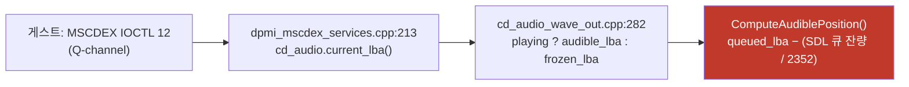

# Task 421 설계 — CD 오디오 재생 위치 보고

**증상(사용자 보고, 2026-08-05):** gameplay가 시작되면 **노트와 BGA가 음악과 동기화되지
않고 점프**합니다. 음악 재생 위치가 정상적으로 제공되지 않는 것으로 보입니다.

## 1. 게임이 위치를 얻는 경로 — 특정됨

사용자 로그가 이 경로를 확인해 줍니다 — `IOCTL last subfunction = 0x0C`(12),
MSCDEX 요청 6,912건. **게임은 Q-channel 위치를 폴링해 노트를 맞춥니다.**

## 2. 지금 값이 만들어지는 방식과, 그것이 왜 흔들릴 수 있는가

`audible_lba = queued_lba − (SDL_GetAudioStreamQueued / 2352)` 이며, worker 루프의
**맨 위에서만** 갱신됩니다. 버퍼는 섹터 2,352바이트 · 버퍼당 8섹터 · 최대 4버퍼이므로
스트림에 최대 **32섹터 ≈ 427 ms**가 실립니다.

| # | 후보 | 예상 증상 | 구분 방법 |
|---|---|---|---|
| A | **장치 버퍼가 계산에서 빠짐** — `SDL_GetAudioStreamQueued`는 스트림 잔량만 세고, 장치가 이미 가져가 아직 울리지 않은 분량은 세지 않습니다 | 위치가 **일정하게 앞섬**(수십 ms) | 오프셋이 **일정**한가 |
| B | **worker 스레드 기아** — 갱신이 루프 맨 위에서만 일어나므로 그 스레드가 밀리면 위치가 **얼었다가 튑니다**. Task 419 스핀이 게스트·호스트 두 스레드에서 CPU를 태우는 것이 이 후보를 키웁니다(설계 §6에 위험으로 등록해 둔 항목) | **정지 후 도약**, 오디오 underrun 동반 | `REPIU_GLIDE_RENDEZVOUS_SPIN_US=0`에서 사라지는가 |
| C | 섹터 양자화(13.3 ms) | 미세 지터 | 크기가 너무 작아 단독 설명 불가 |
| D | **generation 경쟁** — `SDL_PutAudioStreamData` 성공 뒤 generation이 바뀌면 `queued_lba`를 전진시키지 않는데 바이트는 스트림에 남습니다(`cd_audio_wave_out.cpp:173`) | Play/Seek 직후 위치가 **8섹터(107 ms) 낮게 고정** | Play 직후 오프셋이 커지는가 |
| E | 논리 LBA 대 파일 프레임 | **일정한 오프셋** 또는 트랙 경계 오류 | 트랙 시작 대비 상대 위치 |

**단독으로 "점프"를 설명하는 것은 B와 D입니다.** A·C·E는 오프셋이지 도약이 아닙니다.

## 3. 지금은 가릴 수 없습니다 — 계측 공백

현재 CD 오디오 계측은 종료 시 한 줄(`available/audio/tracks/requests/current LBA`)
뿐입니다. **시계열이 없어 단조성도, 진행률도, 정지 구간도 볼 수 없습니다.**

사용자 로그가 그 한계를 그대로 보여 줍니다: 189초 실행의 종료 시점에 `current LBA`가
재생 시작(166,852)에서 **349프레임(4.65초)** 지점입니다. 이것이 "직전에 다시 시작한
것"인지 "위치가 거의 전진하지 않은 것"인지 **한 장의 스냅샷으로는 구분되지 않습니다.**

## 4. 계측 설계 — 시계열 하나로 A~E를 가릅니다

`REPIU_CD_AUDIO_POSITION_CENSUS=1`이면 고정 wall 간격(기본 100 ms)으로 다음을 표본해
링 버퍼에 담고 종료 시 덤프합니다. **동작은 바꾸지 않습니다.**

| 필드 | 왜 필요한가 |
|---|---|
| `wall_ms` | 기준 시간축 |
| `current_lba` | 게임이 보는 값 그 자체 |
| `queued_lba` · `stream_bytes` | A·D를 계산으로 분리 |
| `playing` / `paused` / `generation` | 상태 전이와 도약의 정렬 |
| `worker_iterations` | **B의 직접 증거** — 표본 사이 worker가 몇 번 돌았는가 |
| `underruns` | 스트림이 빈 채 장치가 당겨간 횟수 |

**판정 규칙(측정 전 고정):**

| 관측 | 결론 |
|---|---|
| `current_lba`가 **감소**하는 표본이 있음 | D 확정 |
| 표본 간 진행이 0인 구간이 100 ms 이상이고 그때 `worker_iterations`도 0 | **B 확정** |
| 진행률이 평균 **75 LBA/s**에서 5% 넘게 벗어남 | 재생 속도 자체 문제(별개 축) |
| 위 셋이 없고 오프셋만 일정 | A 또는 E — 크기로 구분(A는 장치 버퍼 크기, E는 pregap 크기) |

## 5. B는 계측 전에도 한 번에 확인됩니다

Task 419의 스핀은 **기본 ON**이고 게스트·호스트 두 지점에서 CPU를 태웁니다. 오디오
worker는 **세 번째 스레드**입니다. 코어가 모자라면 worker가 밀리고, 그것이 정확히 B의
그림입니다. `REPIU_GLIDE_RENDEZVOUS_SPIN_US=0`으로 증상이 사라지면 **스핀의 기본값을
되돌려야 합니다** — Task 419의 프레임 이득(+27.7%)보다 음악 동기가 우선입니다.

**이것을 먼저 묻는 이유:** 사용자가 gameplay에 도달할 수 있고(자동 실행은 attract
데모에서 멈춤 — frontier 항목 1′), 환경 변수 하나로 끝나며, 제 최근 변경이 원인일
가능성을 가장 빨리 배제하거나 확정합니다.

## 6. 이 작업에서 하지 않을 것

**증상을 보기 전에 고치지 않습니다.** A(장치 버퍼 보정)와 D(generation 경쟁)는 코드만
읽어도 결함이지만, 지금 고치면 "무엇이 증상을 없앴는가"를 잃습니다. Task 415가 옳은
변경이었는데도 증상을 못 없애 하루를 쓴 선례가 있습니다. **계측 → 판정 → 수정** 순서를
지킵니다. 다만 D는 정확성 결함이므로 판정 후 결과와 무관하게 고칩니다.

---

# Task 421 Design — CD audio position reporting

**Symptom (user, 2026-08-05):** once gameplay starts, **notes and the BGA lose sync with the
music and jump**, as if the music position were not being reported correctly.

## 1. The path the game reads — identified

The guest polls **MSCDEX IOCTL 12 (Q-channel)**, which returns `cd_audio.current_lba()`
(`dpmi_mscdex_services.cpp:213`), which returns `audible_lba` while playing
(`cd_audio_wave_out.cpp:282`), which is computed as `queued_lba` minus the SDL stream's queued
bytes divided by the sector size. The user's log confirms the path: the last IOCTL subfunction
is `0x0C` across 6,912 MSCDEX requests.

## 2. How that value is produced, and why it can wobble

It refreshes **only at the top of the worker loop**, and with 2,352-byte sectors, eight per
buffer and up to four buffers, as much as **32 sectors (~427 ms)** sits in the stream.

Five candidates: **(A)** the device buffer is excluded, since `SDL_GetAudioStreamQueued` counts
only what is still in the stream, so the position **leads** by tens of milliseconds; **(B)**
**worker starvation** — the refresh happens only at the loop top, so if that thread is delayed
the position **freezes and then leaps**, and Task 419's spin burning CPU on two other threads
makes this the prime suspect, exactly the risk that design registered; **(C)** sector
quantisation at 13.3 ms, too small to explain a visible jump; **(D)** a **generation race**,
where data accepted by `SDL_PutAudioStreamData` is not reflected in `queued_lba` if the
generation changed (`cd_audio_wave_out.cpp:173`), leaving the position 107 ms low; and **(E)**
logical LBA against file frames, which offsets rather than jumps. **Only B and D produce jumps
on their own.**

## 3. They cannot be separated today

CD audio telemetry is one exit line. There is **no time series**, so monotonicity, rate and
freeze intervals are all invisible. The user's log shows the cost of that: after 189 seconds
the position sits **349 frames (4.65 s)** past the play start, and a single snapshot cannot say
whether playback restarted just before exit or barely advanced at all.

## 4. Instrumentation — one time series separates A through E

Under `REPIU_CD_AUDIO_POSITION_CENSUS=1`, sample every 100 ms of wall clock into a ring buffer
and dump at exit, changing no behaviour: wall time, `current_lba`, `queued_lba`, the stream's
queued bytes, playing/paused/generation, **worker iterations since the last sample** (the
direct evidence for B), and underruns. **Pre-registered readings:** any decreasing
`current_lba` confirms D; a gap of 100 ms or more with zero progress *and* zero worker
iterations confirms **B**; a rate more than 5% off **75 LBA/s** is a playback-rate problem on
its own axis; and if none of those appear, a constant offset is A or E, told apart by its size
— the device buffer against the pregap.

## 5. B can be tested before any of that

Task 419's spin is **on by default** and burns CPU at two sites while the audio worker is a
third thread. If `REPIU_GLIDE_RENDEZVOUS_SPIN_US=0` removes the symptom, **the spin default
must be reverted** — music sync outweighs its 27.7% frame gain. This is asked first because
the user can reach gameplay (automated runs stall in the attract demo, frontier item 1'), it
costs one environment variable, and it is the fastest way to confirm or clear my own recent
change.

## 6. What this task will not do

**No fixing before the symptom is observed.** A and D are defects on reading alone, but fixing
them now would destroy the ability to say which one produced the symptom — Task 415 was a
correct change that did not remove the stall and cost a day. The order is **instrument,
decide, fix**, with D repaired afterwards regardless of the verdict because it is a
correctness defect.
