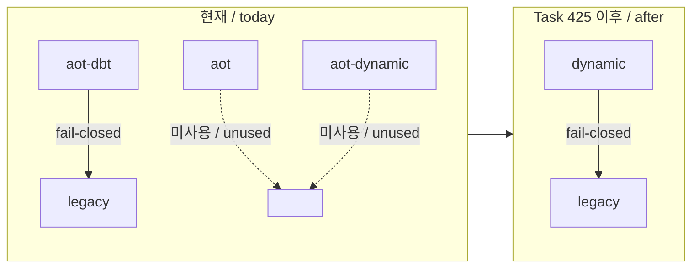

# Task 424 설계 — 실행 backend를 legacy / dynamic 둘로 정리

**한 줄:** 실행 backend 4종 중 `aot`와 `aot-dynamic`은 100여 개 task 동안 아무도 쓰지
않았고, 남은 `aot-dbt`를 `dynamic`으로 개명해 `legacy` / `dynamic` 두 축만 남깁니다.
단, 축소 전에 `aot-dynamic`이 유일하게 제공하던 A/B 수단 3개를 env toggle로 옮깁니다.

관련 작업 지시: [Task 424](../work-orders/20260805-424-dbt-build-option-toggles.md) ·
[Task 425](../work-orders/20260805-425-execution-backend-consolidation.md)

## 1. 현재 상태와 근거

`runtime::ExecutionBackend`는 `kLegacy`, `kAot`, `kAotDynamic`, `kAotDbt` 4종을 정의하고
`REPIU_EXECUTION_BACKEND`로 선택합니다. 실측한 사용 현황은 다음과 같습니다.

| backend | 저장소 내 실사용 | 마지막 실행 기록 |
|---|---|---|
| `legacy` | 미지정 기본값 · 모든 fail-closed fallback의 종착점 | 상시 |
| `aot` | 스크립트 0곳 · 가이드 0곳 | Task 181-B 도입 기록뿐 |
| `aot-dynamic` | 스크립트 1곳(`benchmark_aot_inline_cache.ps1`) | Task 308 (2026-07-26) |
| `aot-dbt` | 스크립트 8곳 · 가이드 11곳 | 상시 |

**확인됨 — 중간 backend는 fallback 사슬의 일부가 아닙니다.** `aot-dbt`의 cache miss,
검증 실패, generation 실패는 모두 legacy single-step으로 직접 fail-closed하며
(`aot_runtime_dispatch.cpp`의 retired/generation-failure 경로), `aot-dynamic`이나
`aot`로 강등되는 경로는 없습니다. 따라서 두 backend를 지워도 실행 경로의 안전망은
줄지 않습니다.



## 2. 축소를 막고 있던 단 하나의 제약

`main.cpp`에서 다음 세 build option은 **env toggle 없이** backend 값만으로 결정됩니다.

```
aot_build_options.enable_dbt_return_miss_dispatch = (backend == kAotDbt);
aot_build_options.enable_dbt_direct_edge_dispatch = (backend == kAotDbt);
aot_build_options.enable_timer_safe_points        = (backend == kAotDbt);
```

나머지 DBT·guarded 기능은 전부 개별 env 변수(`REPIU_AOT_DBT_PORT_IO_DISPATCH`,
`REPIU_AOT_GUARDED_SEGMENT_READ/LOAD/POP`, `REPIU_AOT_DBT_SUPERBLOCK`,
`REPIU_AOT_DBT_SEGMENT_OVERRIDE_DISPATCH`, `REPIU_AOT_DBT_INDIRECT`,
`REPIU_AOT_DBT_GLIDE_GATE_DISPATCH`)로 끌 수 있습니다.

즉 **"AOT cache는 쓰되 이 세 기능만 끈 상태"** 를 만드는 수단이 지금은
`aot-dynamic` 실행뿐입니다. 회귀 bisect에서 "cache emitter 문제인가, DBT dispatch
문제인가"를 가르는 축이 여기 걸려 있으므로, 이 셋에 toggle을 먼저 주지 않고
축소하면 진단 능력이 실제로 줄어듭니다.

**결론:** toggle 도입(Task 424)이 축소(Task 425)의 선결 조건입니다. toggle을 주고 나면
backend 축보다 granularity가 좋아지므로 손실이 0입니다.

### 2.1 정정 — 그 축은 pumpit3에 존재한 적이 없습니다 (Task 424 실측)

위 §2의 전제는 **부분적으로 틀렸습니다.** Task 424 구현 후 세 backend를 직접 돌려
확인한 사실입니다.

| backend | pumpit3 | pumpit1 |
|---|---|---|
| `aot-dbt` | exit 0 | exit 0 |
| `aot-dynamic` | **exit 1** | exit 0 |
| `aot` | **exit 1** | 미측정 |

```
Failed to build requested AOT execution image:
AOT translation plan is ready / direct control-flow target is outside the cache
```

pumpit3 `PIU.EXE`에는 cache 밖을 가리키는 direct edge가 10개 있고, 두 backend는
`enable_dbt_direct_edge_dispatch`가 거짓이므로 이미지를 생성하지 못합니다. 같은 이유로
`REPIU_AOT_DBT_DIRECT_EDGE_DISPATCH=0`도 pumpit3에서 같은 메시지로 실패합니다. 그런
edge가 0개인 pumpit1은 어느 쪽이든 정상입니다.

**따라서 §2가 말한 A/B 축은 pumpit1에서만 성립했고, 현재 작업이 전부 대상으로 삼는
pumpit3에서는 존재한 적이 없습니다.** Task 424는 잃어버린 축을 복원한 것이 아니라
**없던 축을 만든** 작업입니다.

이 정정은 §2의 결론을 뒤집지 않고 오히려 강화합니다.

* toggle 도입은 여전히 선결 조건입니다 — 다만 이유가 "축을 보존하려고"가 아니라
  "pumpit3에 처음으로 축을 만들려고"입니다.
* Task 425의 근거도 강해집니다. `aot`와 `aot-dynamic`은 미사용일 뿐 아니라 **주 대상에서
  깨져 있는** 설정이며, 제거는 죽은 코드가 아니라 오해를 부르는 구성을 없애는 일입니다.

측정 근거는 [Task 424 작업 로그](../work-logs/20260805-424-dbt-build-option-toggles.md)
§4~§5에 있습니다.

## 3. Task 424 — 세 build option에 toggle 부여

| 환경 변수 | build option | 기본값 |
|---|---|---|
| `REPIU_AOT_DBT_RETURN_MISS_DISPATCH` | `enable_dbt_return_miss_dispatch` | ON |
| `REPIU_AOT_DBT_DIRECT_EDGE_DISPATCH` | `enable_dbt_direct_edge_dispatch` | ON |
| `REPIU_AOT_DBT_TIMER_SAFE_POINTS` | `enable_timer_safe_points` | ON |

이름은 기존 8개와 같은 `REPIU_AOT_DBT_*` 접두사를 씁니다. 셋 다 DBT 정책 기능이며,
`REPIU_AOT_GUARDED_*` 계열과 구분되는 기존 관례를 그대로 따릅니다.

**해석 규칙은 Task 384 / 386 / 390이 확립한 "승격된 기본값" 관례를 그대로 재사용합니다.**
미지정과 빈 값은 ON, `1|on|true`는 ON, `0|off|false`와 **알 수 없는 값은 fail-closed
opt-out(OFF)** 입니다. 오타가 조용히 ON으로 통과하지 않게 하려는 기존 의도를 유지합니다.

### 3.1 중복 파싱 코드 추출

이 관례는 현재 `main.cpp`에 6번 인라인으로 복제돼 있고, 이번에 3개가 더 붙으면 9번이
됩니다. `AGENTS.md`의 "독립적으로 이름 붙일 수 있는 하위 시스템은 전용 파일로 추출한다"에
따라 플랫폼 공용 helper로 뽑습니다.

```
include/repiu/runtime/env_toggle.h
src/runtime/env_toggle.cpp

bool ResolvePromotedToggle(const char* value);  // 미지정 = ON, 알 수 없는 값 = OFF
bool ResolveOptInToggle(const char* value);     // 미지정 = OFF, 알 수 없는 값 = OFF
```

`ResolveOptInToggle`은 `REPIU_AOT_DBT_SUPERBLOCK`,
`REPIU_AOT_DBT_SEGMENT_OVERRIDE_DISPATCH` 같은 opt-in 계열이 쓰는 형태입니다.
기존 호출 지점 전환은 동작 보존 리팩터링이며, 새 probe가 두 함수의 진리표를
직접 검증합니다.

`REPIU_AOT_DBT_INDIRECT`(`1|both|call|calls|jump|jumps`)와
`REPIU_AOT_INDIRECT_CACHE_SLOTS`(`1|4`)는 진리값이 아니므로 이 helper 대상이 아닙니다.

## 4. Task 425 — 축소와 개명

### 4.1 enum과 파서

```
enum class ExecutionBackend { kLegacy, kDynamic };
```

`legacy`와 `dynamic`만 파싱하고, `aot` / `aot-dynamic` / `aot-dbt`는 **전부 파싱 실패로
거부**합니다. `main.cpp`는 기존대로 exit 1로 종료하므로, 옛 절차가 조용히 다른 backend로
실행되는 일이 없습니다. 저장소 안의 스크립트 8개와 가이드 11곳은 같은 작업에서
`dynamic`으로 갱신합니다.

### 4.2 세 술어를 하나로

`ExecutionBackendUsesAot`, `ExecutionBackendUsesDynamicTranslation`,
`ExecutionBackendUsesImmediateHleReentry`는 backend가 둘만 남으면 전부
`backend == kDynamic`으로 동일해집니다. 서로 다른 이름이 서로 다른 정책을 뜻한다는
인상만 남기므로 하나로 합칩니다.

```
bool ExecutionBackendUsesDynamicTranslation(ExecutionBackend backend);
```

**세 이름이 담고 있던 "왜 여기서 분기하는가"는 각 호출 지점 주석으로 옮깁니다.**
세 술어를 유지하는 대안도 검토했으나, 구현이 같은 세 함수는 향후 세 번째 backend가
생겼을 때 어차피 재정의가 필요하고 그때 실제 정책 차이를 근거와 함께 다시 도입하는
편이 정확합니다.

### 4.3 죽는 분기

`aot_runtime_dispatch.cpp`의 동적 번역 요청 조건

```
(!dynamic_translation && !retired_target) || !RequestAotDynamicTranslation(...)
```

에서 첫 항은 `aot`(정적 전용) backend 전용이었습니다. `dynamic_translation`이 항상 참이
되므로 제거하되, **AOT dispatcher가 legacy에서 도달 불가능함을 코드로 확인한 뒤**
지웁니다(§6 확인 항목 1).

### 4.4 개명하지 않는 것

이번 개명은 **backend 식별자에 한정**합니다.

| 유지 | 이유 |
|---|---|
| `REPIU_AOT_DBT_*` env 변수 8개 | 저장소 밖 개인 절차와 문서 49개가 참조 |
| `src/platform/win32/aot/aot_dbt_*.cpp` 파일 24개 | DBT는 dynamic binary translation의 정확한 기술 용어 |
| `enable_dbt_*` build option 필드 | 위와 같음 |
| `ExecutionTimeBucket::kAotDynamicTranslate` | backend 이름이 아니라 동작 이름이며 로그 필드로 인용됨 |

### 4.4.1 `AOT` 접두사를 남기는 근거

`AOT`는 죽은 이름이 아닙니다. `dynamic` backend에서도 게스트 실행 **전에**
`BuildAotTranslationPlan` → `BuildAotCodeCacheImage` → `PlaceWin32AotCodeCache`가
그대로 수행되어 `Win32 AOT cache base/bytes/entry`를 남깁니다. 이미지 전체를 미리
계획해 code cache를 만들어 두고, 실행 중에 부족한 부분만 덧붙이는 구조가 유지됩니다.

환경 변수 약 90개 중 `REPIU_AOT_*`가 21개로, `REPIU_GLIDE_*`(20),
`REPIU_EXECUTION_*`(7)과 나란히 서는 실제 namespace이기도 합니다. 접두사를 떼면
`REPIU_GUARDED_SEGMENT_READ`처럼 소속 하위 시스템이 사라집니다.

**다만 접두사의 역할은 바뀝니다.** 축소 후 legacy에는 튜너블이 없으므로 `AOT`는
"어느 backend에 적용되는가"가 아니라 "어느 하위 시스템인가"만 뜻하게 됩니다.
`REPIU_NATIVE_LINEAR_SPAN*` 5개가 AOT cache 위에서만 동작하면서 `NATIVE_` 접두사를
쓰는 기존 불일치도 그대로 남습니다 — 개명해도 절반만 정리되므로 근거가 되지 못합니다.

### 4.4.2 세 층위 명명 규칙

backend를 `dynamic`으로 부르면서 노브를 `REPIU_AOT_*`로 두면 처음 보는 사람에게
한 번은 걸립니다. 이는 개명이 아니라 **문서로 해소합니다.** `ARCHITECTURE.md`에
다음 규칙을 명시합니다.

| 층위 | 이름 | 가리키는 것 |
|---|---|---|
| 실행 정책 | `legacy` / `dynamic` | 사용자가 `REPIU_EXECUTION_BACKEND`로 고르는 노브 |
| 하위 시스템 | `AOT` | 실행 전에 code cache를 계획·생성·배치하는 단계 |
| 번역 계층 | `DBT` | 그 cache 위에서 런타임에 동작하는 번역·dispatch |

세 이름은 같은 것을 세 번 부르는 것이 아니라 서로 다른 층을 부릅니다.
backend 이름 `dynamic`은 사용자가 고르는 노브이고, `dbt`는 그 노브가 켜는 내부 기법의
이름입니다. 두 층위를 구분해 두면 내부 문서의 정보량이 유지됩니다.

### 4.5 backend 인자를 남기는 함수

`ResolveNativeLinearSpanEnabled` 등 span 정책 함수는 backend 인자를 유지합니다.
`execution_trampoline.cpp`의 호출 지점은 legacy 실행에서도 지나가므로, 인자가
상수가 되지 않습니다. probe에서 "dbt가 아닌 backend" 반례 역할만 `kAotDynamic`에서
`kLegacy`로 옮깁니다.

## 5. 문서 갱신 정책

* `ARCHITECTURE.md`의 backend 절과 "AOT-DBT 실행 정책 기반" 절은 새 이름으로 갱신합니다.
* `docs/guides/`의 절차 11곳은 `dynamic`으로 갱신합니다 — 반복 수행 대상이므로 정확해야 합니다.
* `docs/analysis/`의 누적 문서는 **과거 측정 기록을 다시 쓰지 않습니다.** 문서 상단에
  옛 이름 → 새 이름 대응 주석을 달고, 앞으로 수행할 절차 문구만 갱신합니다.
* `docs/work-logs/`는 시간순 증거이므로 손대지 않습니다.

## 6. 판정

| # | 확인 | 통과 조건 |
|---:|---|---|
| 1 | AOT dispatcher의 legacy 도달 가능성 | legacy에서 도달 불가임을 코드로 확인 (§4.3 선결) |
| 2 | `aot_probe` 전체 | 전 항목 통과 |
| 3 | `REPIU_EXECUTION_BACKEND=dynamic` 1초 smoke | 변경 전 `aot-dbt` 1초 smoke와 로그·카운터 동일 |
| 4 | 세 toggle 각각 OFF | 대응 site 수가 0으로 떨어지고 실행이 계속됨 |
| 5 | `aot-dbt` / `aot` / `aot-dynamic` 지정 | exit 1 + 새 에러 문구 |
| 6 | 미지정 실행 | legacy 경로 회귀 없음 |

## 7. 해소됨 — 세 toggle의 OFF 동작 (Task 424 실측)

이 절은 원래 미확정 항목이었습니다. Task 424에서 측정으로 해소했습니다.

| toggle OFF | pumpit3 | 판정 |
|---|---|---|
| `RETURN_MISS_DISPATCH=0` | 실행 계속 | 사용 가능한 A/B 축 |
| `TIMER_SAFE_POINTS=0` | 실행 계속 (generation publishes 4) | 사용 가능한 A/B 축 |
| `DIRECT_EDGE_DISPATCH=0` | **이미지 생성 실패, exit 1** | 이미지 의존 필수 기능 |

예상대로 하나가 **새로 발견된 의존성**이었습니다(§2.1과 같은 원인). 회귀가 아니며
축소를 막지도 않습니다. direct-edge toggle은 남깁니다 — 이미지 의존적이고, 실패가
실행 전에 exit 1로 드러나며, 메시지가 원인을 정확히 지목하고, pumpit1에서는 실제로
A/B가 성립합니다.

남은 미확정은 없습니다.

---

# Task 424 Design — consolidating execution backends to legacy / dynamic

**One line:** two of the four execution backends have gone unused for roughly a hundred
tasks; this renames the surviving `aot-dbt` to `dynamic` and leaves only `legacy` and
`dynamic` — after first moving the one A/B capability that `aot-dynamic` uniquely provided
into environment toggles.

Work orders: [Task 424](../work-orders/20260805-424-dbt-build-option-toggles.md) and
[Task 425](../work-orders/20260805-425-execution-backend-consolidation.md).

## 1. Current state and evidence

`runtime::ExecutionBackend` defines `kLegacy`, `kAot`, `kAotDynamic`, and `kAotDbt`, selected
through `REPIU_EXECUTION_BACKEND`. Measured usage: `legacy` is the unset default and the
terminus of every fail-closed fallback; `aot` appears in no script or guide and has no run
record past its Task 181-B introduction; `aot-dynamic` survives in a single benchmark script
and was last run for Task 308 on 2026-07-26; `aot-dbt` is used by eight scripts and eleven
guide procedures.

**Confirmed — the middle backends are not part of the fallback chain.** Cache misses,
validation failures, and generation failures under `aot-dbt` fail closed directly to legacy
single-step; nothing ever downgrades to `aot-dynamic` or `aot`. Deleting them therefore
removes no safety net.

## 2. The one constraint blocking consolidation

Three build options in `main.cpp` — `enable_dbt_return_miss_dispatch`,
`enable_dbt_direct_edge_dispatch`, and `enable_timer_safe_points` — are decided by the backend
value alone, with no environment toggle. Every other DBT and guarded feature has its own
variable. So the only way to obtain "AOT cache on, these three off" today is to run
`aot-dynamic`, and that is precisely the axis a regression bisect uses to separate a cache
emitter fault from a DBT dispatch fault. Introducing the toggles (Task 424) is therefore a
prerequisite for consolidation (Task 425); once they exist the granularity is finer than the
backend axis and nothing is lost.

## 3. Task 424 — toggles for the three build options

`REPIU_AOT_DBT_RETURN_MISS_DISPATCH`, `REPIU_AOT_DBT_DIRECT_EDGE_DISPATCH`, and
`REPIU_AOT_DBT_TIMER_SAFE_POINTS` gate the three options, all defaulting ON. The names keep
the existing `REPIU_AOT_DBT_*` prefix used by the other DBT policy features, distinct from the
`REPIU_AOT_GUARDED_*` family.

Parsing reuses the promoted-default convention established by Tasks 384, 386, and 390: unset
and empty mean ON, `1|on|true` mean ON, and `0|off|false` **together with any unrecognized
value** are fail-closed opt-outs, so a typo never silently passes as ON.

That convention is currently inlined six times in `main.cpp` and would become nine. Following
the `AGENTS.md` rule about extracting independently named subsystems, it moves to
`runtime::ResolvePromotedToggle` and `runtime::ResolveOptInToggle` in a new `env_toggle`
module, with a probe asserting both truth tables. `REPIU_AOT_DBT_INDIRECT` and
`REPIU_AOT_INDIRECT_CACHE_SLOTS` are not boolean and stay as they are.

## 4. Task 425 — consolidation and rename

The enum becomes `{ kLegacy, kDynamic }`. Only `legacy` and `dynamic` parse; `aot`,
`aot-dynamic`, and `aot-dbt` are all rejected, and `main.cpp` still exits 1, so no stale
procedure silently runs a different backend. The eight scripts and eleven guide procedures in
the repository are updated in the same task.

The three predicates collapse into a single `ExecutionBackendUsesDynamicTranslation`, since
all three become `backend == kDynamic`; the reason each call site branches moves into a
comment there. Keeping three identically implemented functions was considered, but a future
third backend will need them redefined anyway, and reintroducing a real policy difference with
its evidence at that point is more accurate than preserving the shape now.

In `aot_runtime_dispatch.cpp` the `(!dynamic_translation && !retired_target)` disjunct existed
only for the static-only `aot` backend and is removed — but only after confirming in code that
the AOT dispatcher is unreachable under legacy.

The rename is **limited to the backend identifier**. The eight `REPIU_AOT_DBT_*` variables,
the twenty-four `aot_dbt_*` source files, the `enable_dbt_*` option fields, and
`ExecutionTimeBucket::kAotDynamicTranslate` all keep their names: DBT is the precise term for
dynamic binary translation, and forty-nine documents plus procedures outside the repository
reference those variables.

The `AOT` prefix stays for a factual reason rather than a churn-avoidance one: the
ahead-of-time stage still runs on every `dynamic` execution — `BuildAotTranslationPlan`,
`BuildAotCodeCacheImage`, and `PlaceWin32AotCodeCache` all complete before the guest starts and
log `Win32 AOT cache base/bytes/entry`. `REPIU_AOT_*` is also a real namespace, 21 of roughly 90
variables, alongside `REPIU_GLIDE_*` (20) and `REPIU_EXECUTION_*` (7). Its role does narrow:
after consolidation legacy has no tunables, so the prefix means "which subsystem" rather than
"which backend", and the pre-existing inconsistency of the five `REPIU_NATIVE_LINEAR_SPAN*`
variables — AOT-cache features under a `NATIVE_` prefix — remains either way, so renaming would
tidy only half of it.

That leaves a genuine seam: a `dynamic` backend tuned by `REPIU_AOT_*` knobs. It is resolved in
documentation, not by renaming. `ARCHITECTURE.md` states the three naming layers explicitly —
`legacy`/`dynamic` name the **execution policy** the user selects, `AOT` names the **subsystem**
that plans, builds, and places the code cache before execution, and `DBT` names the
**translation layer** that operates on that cache at runtime. The three are not three names for
one thing; they name three layers.

The native-linear-span policy functions keep their backend parameter, because
`execution_trampoline.cpp` reaches them under legacy execution too; only the probe's
"not-dbt" counterexample moves from `kAotDynamic` to `kLegacy`.

## 5. Documentation policy

`ARCHITECTURE.md` and the eleven guide procedures are updated to the new name. The cumulative
`docs/analysis/` topics keep their historical measurements unrewritten, gaining an old-to-new
name note at the top with only forward-looking procedure text updated. `docs/work-logs/` is
chronological evidence and is left alone.

## 6. Verdict

Done when the AOT dispatcher's unreachability under legacy is confirmed in code, the full
`aot_probe` passes, a one-second `dynamic` smoke matches the pre-change `aot-dbt` smoke in logs
and counters, each new toggle set to OFF drops its site count to zero while execution
continues, `aot-dbt` / `aot` / `aot-dynamic` all exit 1 with the new message, and an unset run
shows no legacy regression.

## 7. Resolved — behaviour with the three toggles OFF (measured in Task 424)

This was an open item; Task 424 settled it by measurement. Return-miss dispatch and timer safe
points can both be turned off with execution continuing, giving two usable A/B axes.
Direct-edge dispatch cannot: on pumpit3 it exits 1 during image construction with
`direct control-flow target is outside the cache`, the same cause as §2.1. That is the
anticipated newly discovered dependency rather than a regression, and it does not block
consolidation. The toggle stays — it is image-dependent (pumpit1 runs fine with it off), the
failure surfaces as exit 1 before execution, and the message names the cause.

## 2.1 Correction — that axis never existed on pumpit3 (measured in Task 424)

The premise in §2 was **partly wrong**. Running all three backends after implementing Task 424:
`aot-dbt` exits 0 on both targets, while `aot-dynamic` and `aot` exit 1 on pumpit3 with
`Failed to build requested AOT execution image: … direct control-flow target is outside the
cache`. That image has ten direct edges whose targets lie outside the cache, and both backends
leave `enable_dbt_direct_edge_dispatch` false, so they cannot build it. pumpit1, which has none,
runs under `aot-dynamic` normally.

So the A/B axis §2 describes held only for pumpit1 and never existed on pumpit3, the target all
current work uses. Task 424 did not restore a lost axis; it **created one that was never there**.
The correction reinforces §2's conclusion rather than overturning it: the toggles remain a
prerequisite — now in order to create the axis rather than preserve it — and Task 425's case
grows stronger, since `aot` and `aot-dynamic` are not merely unused but broken on the primary
target, making their removal a deletion of misleading configuration. Evidence is in the
[Task 424 work log](../work-logs/20260805-424-dbt-build-option-toggles.md) §4-§5.
