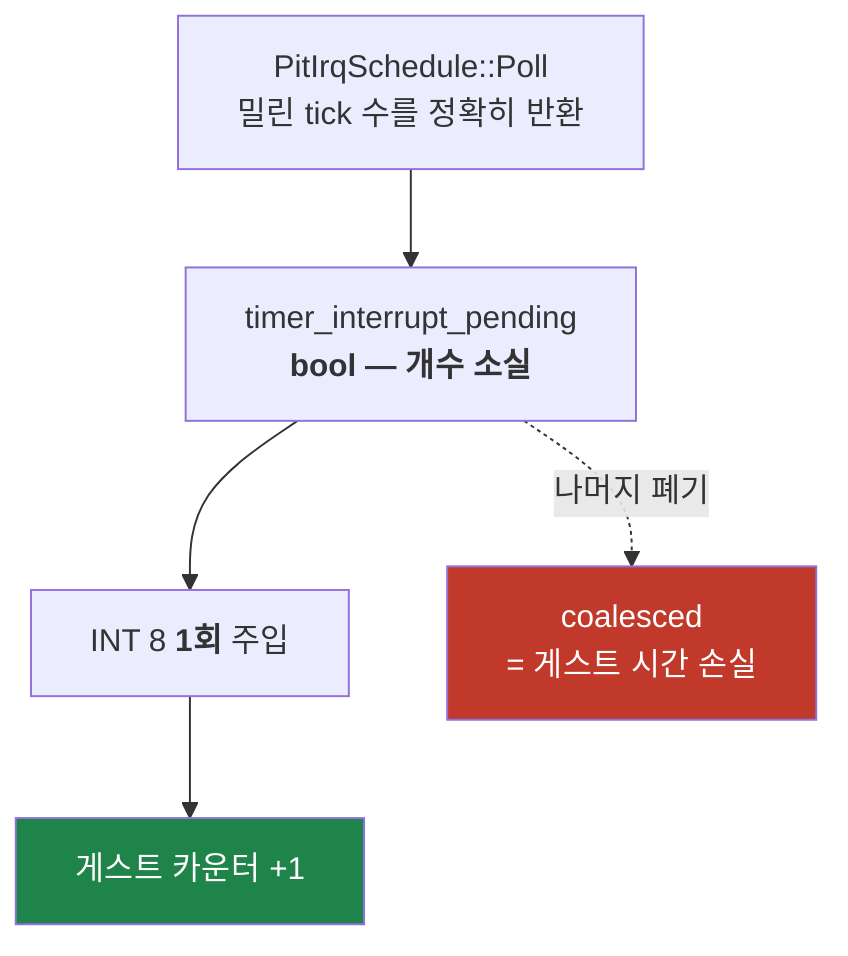

# Task 430 설계 — 타이머 틱 손실의 시간축 귀속

선행: [421 CD 오디오 위치 보고](20260805-421-cd-audio-position-reporting.md) ·
[366 timer tick 전달과 프레임 pacing](20260730-366-timer-tick-delivery-and-frame-pacing.md) ·
결과: [Tasks 421~423 작업 로그](../work-logs/20260805-421-423-cd-audio-and-stall-root-cause.md)

## 1. 어디까지 왔는가

사용자가 보고한 증상은 **gameplay에서 노트·BGA가 음악과 어긋나며 점프**하는 것입니다.
Tasks 421~423이 음악 위치를 무혐의로 확정했고, frontier 항목 1‴이 **타이머 틱
coalescing**을 직접 후보로 지목했습니다. 이 설계는 그 후보를 확정하거나 기각합니다.

## 2. 이번 세션에서 기존 산출물을 다시 재어 확인한 것

Task 421 census(295초)와 Task 422 trace를 **재실행 없이** 재집계했습니다.

| 관측 | 값 | 뜻 |
|---|---:|---|
| 같은 generation 연속 표본 | 1,734 | — |
| 평균 `delta_lba` | **8.206** (기대 8.21) | 음악은 실시간 정확 |
| `delta_lba` 분포 | 7·8·9 뿐 | 이상치 0 |
| 역행 / 정지 | **0 / 0** | 후보 D·B 기각 |
| worker 반복(본곡 구간) | 31~44회/표본 | 기아 아님 |
| underrun | 9회 = generation 전환 9회 | 재생 중 0 |

**새 관측 — 게스트 메인 루프는 실시간 60 Hz입니다.** trace의 IOCTL 12 폴링 간격을
초 단위로 집계하면 gameplay 137초 중 이상치가 **양끝 잘린 버킷 2건뿐**이고, 나머지는
전부 59~61 polls/s · LBA 72~75/s입니다. 40~160초 구간 정밀값은

```
7,200 polls / 119.968 s = 60.0160 Hz   (오차 0.03%)
```

## 3. 그래서 후보 1‴이 데이터와 충돌합니다

손실 기전 자체는 코드로 확정됩니다. `timer_interrupt_pending`이 `std::atomic<bool>`
이므로 due가 N이어도 주입은 1회이고 나머지는 폐기되며
(`timer_tick_delivery.cpp:57~59`), 게스트 INT 8 ISR은 주입 1회당 카운터를 **한 번만**
올립니다(`0x0303F1A9: inc [0x0328FA18]`). **coalesced는 곧 게스트 시간 손실입니다.**



그런데 루프가 4틱(240 Hz ÷ 4 = 60 Hz) 대기라면 4% 손실 시 **57.6 Hz**여야 합니다.
실측은 **60.016 Hz**입니다. 즉 gameplay 구간에서는 셋 중 하나입니다.

| # | 해석 | gameplay 구간 `injected/due` |
|---|---|---|
| ㄱ | 루프가 틱이 아니라 **실시간(swap/vsync)에 gated** — 틱 손실은 루프와 무관 | 임의 |
| ㄴ | 루프는 틱 gated이고 gameplay 구간 **틱 전달은 사실상 무손실** | ≈ 100% |
| ㄷ | 틱이 gameplay에서도 손실되는데 루프가 그걸 흡수 | ≤ 96% |

## 4. 왜 지금 값으로는 못 가르는가 — Task 421 §3과 같은 공백

가진 것은 **누적 합계 한 줄**입니다.

```
timer tick delivery due/injected/coalesced/dropped: 41531/39830/1677/24   (174초)
```

`coalesced 1,677 / due 41,531 = 4.04%`는 **174초 전체의 평균**이고, **언제 발생했는지
말하지 않습니다.** 부팅·attract에 몰려 있고 gameplay는 깨끗할 수 있습니다 — Task 366이
11.9% 손실을 잰 것도 attract 구간이었습니다. **시계열이 없어 스냅샷으로 구분되지
않는다**는 Task 421 설계 §3의 그 공백이 그대로 반복됩니다.

## 5. 계측 설계 — 이미 있는 표본에 두 칸

poll 스레드는 같은 함수 안에서 틱 카운터(`live_telemetry_snapshot.cpp:386`)와 census
표본기(`:583`)를 **둘 다 들고 있습니다.** 그래서 추가 비용은 원자 읽기 두 번입니다.

| 필드 | 종류 | 왜 필요한가 |
|---|---|---|
| `timer_ticks_due` | 표본 간 델타 | 프로그램된 시간 기준 |
| `timer_ticks_injected` | 표본 간 델타 | 게스트가 실제로 받은 것 |
| `tick_lag_ms` | **덤프 시 파생** | 그 순간까지 누적된 게스트 시계 지연(ms) |

`worker_iterations`와 같은 방식(직전 표본 이후 델타)이라 읽는 규칙이 하나로 유지됩니다.

**`tick_lag_ms`는 틱 주파수를 가정하지 않습니다.** 누적 due와 경과 wall로 틱당 ms를
그 자리에서 구합니다.

```
tick_lag_ms = (Σdue − Σinjected) × wall_ms / Σdue
```

240 Hz를 상수로 박으면 게스트가 divisor를 바꾸는 순간 틀리므로 쓰지 않습니다.

**동작은 바꾸지 않습니다.** 이미 유지되는 카운터를 읽기만 하며, 주입 정책·safe point·
backlog 어느 것도 건드리지 않습니다.

## 6. 판정 규칙 — 측정 전에 고정

`playing=1`이고 generation이 같은 **gameplay 구간만** 봅니다. 부팅·attract 표본은
평균에 넣지 않습니다(그것이 4번의 함정 그 자체입니다).

| 관측 (gameplay 구간) | 결론 |
|---|---|
| `injected/due` ≥ **99.5%** 이고 `tick_lag_ms` 증가가 곡 전체에서 **< 50 ms** | **후보 1‴ 기각.** 틱은 gameplay에서 손실되지 않음 → 노트 점프의 원인은 다른 축 |
| `injected/due` ≤ **96%** 이고 `tick_lag_ms`가 단조 증가해 곡 끝에 **> 1,000 ms** | **후보 1‴ 확정.** 지연 크기를 사용자가 본 점프 크기와 대조 |
| 그 사이(96~99.5%) | 확정도 기각도 아님. `tick_lag_ms` 절대량으로 판단하고 결론을 그렇게 적음 |
| `tick_lag_ms`가 특정 구간에서만 급증 | 그 구간의 다른 열(`worker_iterations`·`stream_bytes`)과 정렬해 원인 축을 특정 |

**교차 검산:** 루프가 60.016 Hz인데 gameplay `injected/due`가 96% 이하로 나오면
해석 ㄷ이고, 루프가 틱에 gated가 아니라는 뜻이므로 **무엇이 루프를 60 Hz로 잡는지**가
새 질문이 됩니다. 이 검산을 빼면 Task 408처럼 결론이 과해집니다.

## 7. 이 작업에서 하지 않을 것

* **고치지 않습니다.** Task 421 설계 §6과 같은 이유이고, Task 366이 이미 backlog를
  켜서 프레임을 16.4% 잃은 선례가 있습니다. 원인 구간을 모른 채 고치면 무엇이 증상을
  없앴는지 잃습니다.
* **`REPIU_TIMER_TICK_BACKLOG=1`을 기본값으로 바꾸지 않습니다.** Task 366이 그 대가를
  측정해 두었고, 그 수정은 "safe point를 상시 armed로 두지 않는 drain"이 선행 조건입니다.
* **게스트 카운터 `0x0328FA18`을 직접 읽지 않습니다.** arena base가 실행마다 달라질 수
  있어(frontier 경고) 주소 고정이 깨집니다. `injected`는 그 카운터의 증가 횟수와 같은
  값이면서 base에 독립입니다.

---

# Task 430 Design — attributing timer tick loss to the timeline

## 1. Where this stands

The reported symptom is **notes and the BGA jumping out of sync with the music during
gameplay**. Tasks 421-423 cleared the music position, and frontier item 1‴ named **timer
tick coalescing** as the direct candidate. This design confirms or rejects it.

## 2. Re-measured from existing artefacts, with no new runs

Re-aggregating Task 421's 295-second census gives 1,734 consecutive same-generation samples
at a mean `delta_lba` of **8.206** against an expected 8.21, distributed over 7, 8 and 9 only,
with **zero regressions and zero freezes**, worker iterations of 31-44 per sample through the
main track, and nine underruns matching the nine generation changes exactly. The music is
exact and the worker is healthy.

**New observation — the guest's main loop runs at real-time 60 Hz.** Bucketing Task 422's
IOCTL 12 polls by second across 137 seconds of gameplay leaves **only two outliers, both
truncated edge buckets**; every other second holds 59-61 polls and 72-75 LBA. Measured
precisely over the steady window, 7,200 polls in 119.968 s is **60.0160 Hz — 0.03% error**.

## 3. That collides with candidate 1‴

The loss mechanism is confirmed by reading: `timer_interrupt_pending` is a
`std::atomic<bool>`, so N owed ticks produce one injection and the rest are discarded
(`timer_tick_delivery.cpp:57-59`), and the guest's INT 8 ISR increments its counter **once**
per injection (`0x0303F1A9`). **Coalesced ticks are lost guest time.**

But a loop waiting four ticks (240 Hz ÷ 4 = 60 Hz) would run at **57.6 Hz** under 4% loss,
and the measurement is **60.016 Hz**. So during gameplay one of three holds: the loop is
gated on real time rather than ticks and tick loss is irrelevant to it; the loop is tick-gated
and delivery is effectively lossless there; or ticks are lost and the loop absorbs it.

## 4. Today's number cannot separate them — the same gap as Task 421 §3

All we have is one cumulative line, `due/injected/coalesced/dropped: 41531/39830/1677/24` over
174 seconds. The 4.04% is an **average over the whole run and says nothing about when**. It
may sit entirely in boot and attract — which is where Task 366 measured its 11.9% — leaving
gameplay clean. This is exactly the "no time series, so a snapshot cannot tell" gap that Task
421's design named.

## 5. Instrumentation — two fields on a sample that already exists

The poll thread holds both the tick counters (`live_telemetry_snapshot.cpp:386`) and the
census sampler (`:583`) in the same function, so the cost is two atomic reads:
`timer_ticks_due` and `timer_ticks_injected` as **deltas since the previous sample**, exactly
like `worker_iterations`, plus `tick_lag_ms` **derived at dump time** as the guest clock's
accumulated lag. The lag assumes no tick frequency — it recovers milliseconds per tick from
the data itself as `(Σdue − Σinjected) × wall_ms / Σdue` — because hard-coding 240 Hz breaks
the moment the guest reprograms the divisor. **Behaviour is unchanged**: counters that are
already maintained are only read, and injection policy, safe points and the backlog are all
untouched.

## 6. Pre-registered readings

Only samples with `playing=1` and an unchanged generation count; boot and attract samples stay
out of the average, since mixing them is the trap of section 4. **Rejected** if gameplay
`injected/due` is at or above 99.5% with `tick_lag_ms` growing under 50 ms across the song, in
which case the note jumping lies on another axis entirely. **Confirmed** if `injected/due` is
at or below 96% with `tick_lag_ms` rising monotonically past 1,000 ms by the end, whose
magnitude is then compared against the jump the user sees. Between those, the verdict is
neither, and the conclusion says so. A lag confined to one interval is aligned against
`worker_iterations` and `stream_bytes` to name the axis. **Cross-check:** a gameplay
`injected/due` at or below 96% alongside a 60.016 Hz loop means the loop is not tick-gated,
which makes "what holds it at 60 Hz" the new question — skipping this check is how Task 408
overstated its conclusion.

## 7. Out of scope

**No fix here**, for Task 421 §6's reason and because Task 366 already paid 16.4% of frames
for enabling the backlog blind. **The backlog default is not changed** — that repair needs a
drain that does not hold the safe point armed. And **the guest counter at `0x0328FA18` is not
read directly**, because the arena base can move between runs; `injected` counts the same
increments while staying base-independent.
