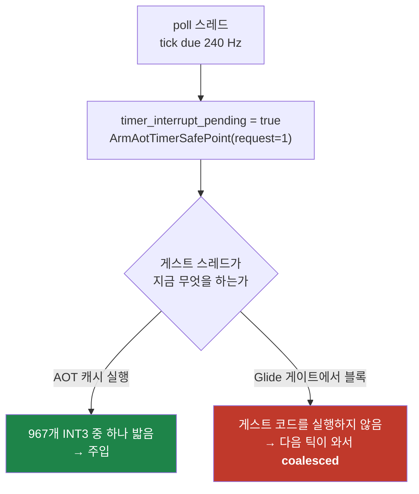

# Task 431 설계 — 틱 주입 기회는 어디서 사라지는가

선행: [430 틱 시계열](20260805-430-timer-tick-time-series.md) ·
판정: [Task 430 작업 로그 §9](../work-logs/20260805-430-timer-tick-time-series.md) ·
배경: [366 timer tick 전달](20260730-366-timer-tick-delivery-and-frame-pacing.md)

## 1. 확정된 것에서 출발합니다

Task 430이 사용자가 **점프 증상을 확인한 실행**에서 원인을 확정했습니다. 본곡 구간
28.3초 동안 음악은 74.97 LBA/s로 정확한데 게스트 시계는 **실시간의 51%** 로 흘러
**13.9초** 뒤처졌습니다.

그리고 남은 갈래가 하나로 좁혀져 있습니다.

```
timer tick delivery due/injected/coalesced/dropped/deferred: 10942/5661/5256/25/0
AOT timer safe-point   trap/injected/deferred:                5627/5606/21
```

| 관측 | 뜻 |
|---|---|
| `deferred = 0` | 주입이 IF=0·비게스트 EIP로 **거부된 적이 없음** |
| 안전점 injected 5,606 / 전체 injected 5,661 | 주입의 **99.0%가 AOT 타이머 안전점** |
| 안전점 trap 5,627회 / 47초 = **초당 약 120회** | due는 240 Hz → **기회가 정확히 절반** |

**따라서 문제는 정책이 아니라 빈도입니다.** 밀린 틱이 평균 8.3 ms 기다리는 동안 다음
틱이 due(4.17 ms)가 되어 `bool` 하나에 합쳐지고 사라집니다.

## 2. 기전 — 안전점은 게스트가 캐시 코드를 실행할 때만 밟힙니다



안전점은 AOT 캐시 안 967개 지점의 INT3입니다(`timer_interrupt_boundary.cpp:56~125`).
게스트 스레드가 **게스트 코드를 실행하고 있지 않으면 어느 것도 밟히지 않습니다.**

`InvokeOnHostThread`에서 게스트 스레드는 `host_command_cv_.wait()`로 **블록됩니다**
(`glide_opengl_backend.cpp:408`). 그 구간 내내 안전점은 도달 불가입니다.

## 3. 후보와, 왜 H1이 유력한가

| # | 후보 | 근거 / 반대 근거 |
|---|---|---|
| **H1** | **Glide 게이트 블록 중 틱 손실** | Task 418에서 gate가 guest-run의 **54~55%**. 관측 전달률 **51%** 와 `1 − 0.55 ≈ 0.45`가 근접. **부하 의존성도 맞습니다** — 프리뷰(가벼운 렌더)는 전달률 약 100%, 본곡(게임플레이 렌더)만 51% |
| H2 | arena·HLE 체류 중 손실 | arena에는 안전점이 없음. 다만 Task 418에서 port I/O는 guest-run의 0.5%로 축소됨 |
| H3 | 안전점 967개가 gameplay 핫패스에 없음 | 가능하나, 그렇다면 프리뷰에서도 낮아야 하는데 프리뷰는 100% |

**H1이 숫자·부하 의존성 양쪽에서 맞습니다.** 다만 **미측정**이며, Task 430이 "그럴듯한
산술"(60.016 Hz)로 틀린 예상을 냈던 직후이므로 이번에도 **측정으로만** 판정합니다.

## 4. 계측 — coalesce 시점에 게스트가 어디 있었는지 직접 묻습니다

집계가 아니라 **귀속**입니다. 틱이 버려지는 바로 그 순간의 게스트 위치를 기록합니다.

| 항목 | 어디 | 비용 |
|---|---|---|
| `guest_in_glide_gate` 플래그 | `InvokeOnHostThread`의 게스트 스레드 경로 진입/이탈 | relaxed store **2회**(마이크로초급 대기 앞뒤이므로 무시 가능) |
| `due_in_gate` · `coalesced_in_gate` | poll 스레드가 tick을 due로 볼 때 그 플래그를 읽어 분류 | atomic load 1회 / 240 Hz |
| census `safe_point_traps` 델타 | 기존 `timer_safe_point_trap_count` 차분 | 무료 |
| census `coalesced`·`coalesced_in_gate` 델타 | 위 카운터 차분 | 무료 |

**분모를 반드시 함께 실어야 합니다.** 구간별로 `due − injected`는 coalesced와 **같지
않습니다** — 이번 구간의 주입이 직전 구간에 armed된 틱을 소비할 수 있기 때문입니다.
그 뺄셈을 분모로 쓰면 비율이 100%를 넘습니다(스모크 404행 중 47행). 그래서
`ticks_coalesced`를 별도 열로 싣습니다.

**게이트 안에서는 주입이 원천적으로 불가능합니다** — 게스트가 게스트 코드를 실행 중이
아니므로 INT 8 프레임을 밀어 넣을 곳이 없습니다. 그래서 이 계측이 묻는 것은 "주입이
실패했는가"가 아니라 **"버려진 틱이 게이트 탓인가"** 입니다.

## 5. 판정 규칙 — 측정 전에 고정

`playing=1`이고 generation이 같은 **본곡 구간만** 봅니다.

| 관측 | 결론 |
|---|---|
| `coalesced_in_gate / coalesced` ≥ **80%** | **H1 확정.** 수정 축은 게이트 경계에서의 밀린 틱 배출 |
| ≤ **20%** | **H1 기각.** H2·H3로 이동하고, 안전점 미도달 구간을 따로 재야 함 |
| 20~80% | 어느 쪽도 아님. 비율을 그대로 적고 두 축을 병기 |
| `safe_point_traps` ≈ `injected` | 기회 = 안전점이라는 §1 관측 재확인(검산) |
| 본곡 구간 `safe_point_traps`/초 ≈ 240 인데 전달률이 낮음 | **모순** — 기회가 충분하다는 뜻이므로 §1 해석 자체를 재검토 |

**검산을 반드시 함께 봅니다.** Task 408이 검산을 빼고 결론을 과하게 낸 선례가 있고,
Task 430에서 제가 서로 다른 실행의 수치를 묶어 예상을 틀린 것도 같은 부류입니다.

## 6. 이 작업에서 하지 않을 것

* **고치지 않습니다.** 귀속이 끝나기 전에 게이트 경계에 배출을 붙이면 무엇이 효과를
  냈는지 잃습니다(Task 421 §6과 같은 이유).
* **`REPIU_TIMER_TICK_BACKLOG` 기본값을 바꾸지 않습니다.** Task 430 §9.2가 이미
  기각했습니다 — 기회가 초당 120회면 backlog는 상한에 붙고 초과분이 `dropped`가 됩니다.
* **안전점을 늘리지 않습니다.** Task 366이 상시 armed의 대가를 프레임 16.4%로
  측정했습니다. 기회를 늘리는 방향은 귀속 이후에 결정합니다.

---

# Task 431 Design — where the tick injection opportunities go

## 1. Starting from what is settled

Task 430 confirmed the cause in a run where the user **saw the jumping**: over 28.3 seconds of
the main track the music held 74.97 LBA/s while the guest clock ran at **51% of real time**,
falling **13.9 seconds** behind. It also narrowed what remains to one branch. With
`deferred = 0`, no injection was ever refused for IF=0 or a non-guest instruction pointer;
**5,606 of 5,661 injections (99.0%) came from the AOT timer safe point**; and safe-point traps
number 5,627 over 47 seconds, or **about 120 per second against 240 Hz owed**. **The problem is
opportunity frequency, not delivery policy** — an owed tick waits ~8.3 ms while the next comes
due at 4.17 ms and merges into the same boolean.

## 2. Mechanism — safe points are only reachable while the guest runs cache code

The safe points are INT3 bytes at 967 sites inside the AOT cache
(`timer_interrupt_boundary.cpp:56-125`), so **none of them is reachable while the guest thread
is not executing guest code**. In `InvokeOnHostThread` the guest thread **blocks** on
`host_command_cv_.wait()` (`glide_opengl_backend.cpp:408`), and for that whole interval no
safe point can be hit.

## 3. Candidates

**H1 — ticks are lost while blocked in the Glide gate.** Task 418 measured the gate at
**54-55% of guest-run**, and `1 − 0.55 ≈ 0.45` sits next to the observed 51% delivery. The
**load dependence matches too**: preview tracks, with light rendering, delivered about 100%,
while only the gameplay track fell to 51%. **H2** is arena and HLE residency, which has no safe
points but whose largest component, port I/O, Task 418 reduced to 0.5% of guest-run. **H3** is
that the 967 sites miss the gameplay hot path, which would also have depressed the previews.
H1 fits both the arithmetic and the load dependence, but it is **unmeasured**, and coming
straight after Task 430's plausible-arithmetic expectation proved wrong, only measurement
decides.

## 4. Instrumentation — ask where the guest was at the moment a tick was dropped

This is attribution rather than counting. A `guest_in_glide_gate` flag is set and cleared on
the guest-thread path of `InvokeOnHostThread` (two relaxed stores around a wait already costing
microseconds); the poll thread reads it when it finds ticks owed and classifies them into
`due_in_gate` and `coalesced_in_gate` (one atomic load at 240 Hz); and the census carries
per-interval deltas of `safe_point_traps` and `coalesced_in_gate`, both free. **Injection
inside the gate is impossible by construction** — there is no guest code to push an INT 8 frame
onto — so the question this answers is not "did injection fail" but **"is the gate what dropped
the tick"**.

## 5. Pre-registered readings

Over main-track samples only: `coalesced_in_gate / coalesced` at or above **80%** confirms
**H1**, and the fix axis becomes draining owed ticks at the gate boundary; at or below **20%**
rejects it in favour of H2 and H3; in between the ratio is reported as-is with both axes kept
open. Two cross-checks run alongside: `safe_point_traps` should track `injected`, re-confirming
that the opportunity *is* the safe point; and if main-track `safe_point_traps` per second is
near 240 while delivery stays low, that is a **contradiction** requiring section 1's reading to
be revisited. Skipping the cross-check is how Task 408 overstated its conclusion, and it is the
same family of error as binding two runs' figures together in Task 430.

## 6. Out of scope

**No fix**, for Task 421 §6's reason — attaching a drain to the gate boundary before
attribution is complete would destroy the ability to say what worked. **The
`REPIU_TIMER_TICK_BACKLOG` default stays**, already rejected by Task 430 §9.2 because a
120/s opportunity rate pins the backlog at its cap and turns the excess into `dropped`. And
**no new safe points**, since Task 366 measured the cost of keeping them armed at 16.4% of
frames; whether to raise the opportunity rate is decided after attribution, not before.
