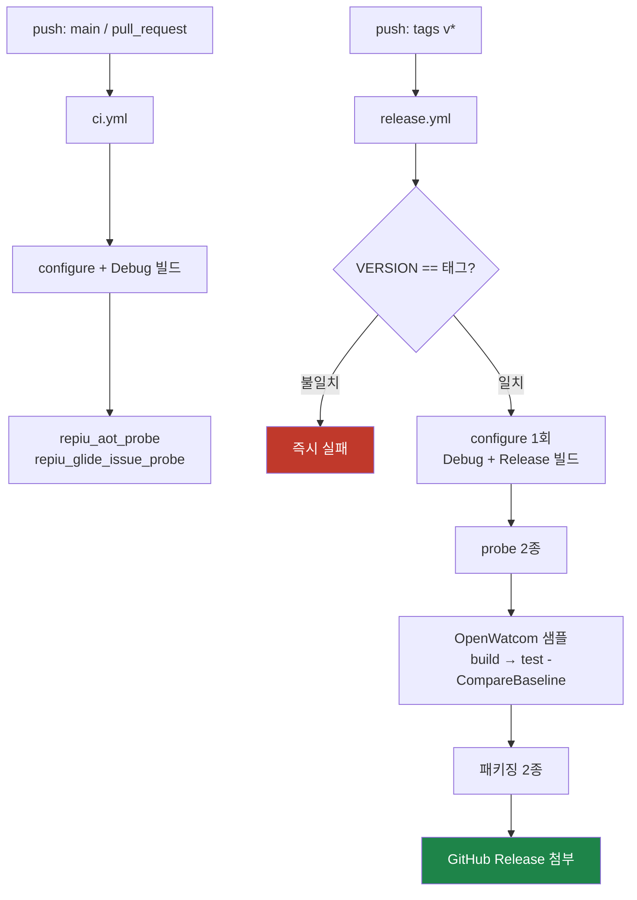
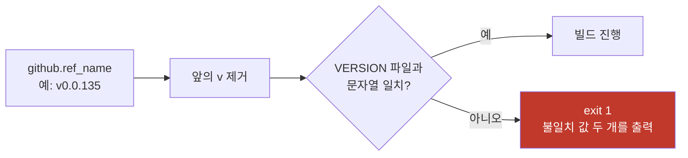

# Task 434 설계 — 태그 push에 대한 GitHub Actions 빌드 검증과 아티팩트 생성

작업 지시: [20260806-434](../work-orders/20260806-434-github-actions-release-ci.md)

## 1. 요구사항

`git push --tags`로 태그가 원격에 올라갔을 때 **빌드를 검증하고 배포 아티팩트를
생성**합니다. OpenWatcom 샘플 테스트 결과도 아티팩트로 함께 남깁니다.

**사용자 결정:** 자체 호스팅 러너는 고려하지 않습니다. GitHub 호스티드 러너만
사용합니다.

## 2. 제약 — 이 저장소에서 CI가 할 수 있는 일의 경계

| 제약 | 근거 | 결과 |
|---|---|---|
| 게임 자산이 CI에 없음 | `roms/`, `MASTER/`가 `.gitignore`에 있고 저작물임 | pumpit1·pumpit3 실행 검증 **불가** |
| 전체 빌드가 김 | 로컬 전체 재빌드 40분 이상([Task 414](../work-logs/20260804-414-port-io-delay-loop-batching.md)) | 캐시 필수, 태그 워크플로와 push 워크플로 분리 |
| 성능 수치를 인용할 수 없음 | 공유 러너의 타이밍은 재현성이 없음. AGENTS.md는 Release 실측만 근거로 인정 | CI는 **성능 수치를 수집하지 않음** |
| Win32(32비트) 빌드 | `scripts/build_win32_x86.ps1`이 `-A Win32`로 configure | Windows 러너 필수 |
| GPU 없음 | 호스티드 러너는 WGL이 GDI generic(OpenGL 1.1)로 폴백 | `repiu_glide_render_probe`는 CI에서 제외 |

## 3. 확인됨 — OpenWatcom 샘플 스위트는 호스티드에서 실행 가능합니다

이것이 이 설계의 핵심 판단입니다. 샘플은 게임 자산이 아닙니다.

* [`scripts/build_openwatcom_samples.ps1:163`](../../scripts/build_openwatcom_samples.ps1) —
  샘플 원본은 `tools/openwatcom/samples/clibexam`과 `samples/cplbexam`입니다. **OpenWatcom
  배포판에 포함된 파일**입니다.
* [`scripts/install_openwatcom.ps1`](../../scripts/install_openwatcom.ps1) — OpenWatcom을
  GitHub 릴리스에서 받아 **SHA256 고정 검증** 후 `tools/openwatcom`에 풉니다. 네트워크만
  있으면 CI에서 그대로 재현됩니다.

따라서 CI는 **빌드 검증에 그치지 않고 819개 샘플의 기능 회귀까지** 볼 수 있습니다.

## 4. 검증 범위

**정정(구현 전 로컬 실측).** 최초 설계는 `repiu_aot_probe` 전체를 저작물 없이 돌릴 수
있다고 적었으나 **틀렸습니다.** 이 probe는 `argv[1]`로 DOS4GW 실행 파일을 받고, 인자가
없으면 usage를 출력하며 exit 2입니다
([`aot_probe/main.cpp:612`](../../src/tools/aot_probe/main.cpp)). 실측 결과:

| 입력 | exit | 비고 |
|---|---:|---|
| `--timer-safe-point` (인자 없음) | **0** | `timer_safe_point_probe=true` |
| `samples/dos4gw_hello/build/hello.exe` | **1** | `cache_message=direct control-flow target is outside the cache` |
| OpenWatcom 샘플 실행 파일 3종 | **1** | 위와 동일하게 캐시 방출 단계에서 중단 |

전체 단정 묶음(arena view, coherence, plan build benchmark, timer tick delivery 단정
10개)은 `PIU.EXE`를 전제로 하며, 캐시 방출이 성립하는 이미지가 필요합니다. **CI에서는
`--timer-safe-point` 모드만 유효합니다.**

`repiu_glide_issue_probe`는 인자 없이 exit 0 · `glide_issue_probe=pass`로 확인됐습니다.

| 층 | 수단 | 저작물 필요 | 워크플로 |
|---|---|---|---|
| 빌드 | Debug + Release × Win32 | 없음 | 양쪽 |
| 단정(제한) | `repiu_aot_probe --timer-safe-point`, `repiu_glide_issue_probe` | 없음 | 양쪽 |
| 기능 회귀 | OpenWatcom 819샘플 + `-CompareBaseline` | 없음 | 태그만 |
| **단정(전체)** | `repiu_aot_probe <PIU.EXE>` | **필요** | **불가 — 로컬 전용** |
| 실행 검증 | pumpit1 스모크 | **필요** | **불가 — 로컬 전용** |
| 성능 | 프레임·cycle 측정 | 필요 | **불가 — 로컬 전용** |

**따라서 CI의 회귀 감시 가치는 사실상 전적으로 819샘플 스위트에 있습니다.** probe 두
개는 링크·초기화가 깨지지 않았음을 보는 얕은 확인입니다.

## 5. 구조 — 워크플로 두 개



**태그에만 붙이지 않는 이유:** 태그는 머지가 끝난 뒤에 붙으므로, 거기서 처음 빌드가
깨지면 되돌리기가 번거롭습니다. `ci.yml`이 Debug 빌드와 probe까지만 빠르게 돌려 그 앞에서
잡습니다.

### 5.1 샘플 스위트도 Release로 돌립니다 (사용자 지시로 변경)

최초 설계는 Debug와 Release를 **둘 다** 빌드하려 했습니다.
[`scripts/test_openwatcom_samples.ps1`](../../scripts/test_openwatcom_samples.ps1)의
`$Loader`가 Debug 경로로 **하드코딩**되어 있었기 때문입니다.

사용자 지시에 따라 하네스에 `-Configuration` 파라미터를 추가해 **Release 하나만
빌드합니다.** 이쪽이 더 낫습니다 — **실제로 배포하는 바이너리를 검증**하게 되고, 빌드가
한 번으로 줄어 CI 시간이 절반 가까이 내려갑니다.

| | 변경 전 | 변경 후 |
|---|---|---|
| release.yml 빌드 | Debug + Release | **Release만** |
| 샘플이 쓰는 로더 | Debug | **Release (배포물과 동일)** |
| 기본값(로컬) | — | Debug 유지 — 기존 절차와 기준선을 바꾸지 않음 |

**대가로 우려한 것: 기존 기준선과 비교 가능성이 끊깁니다.** 통과 판정은 timeout을
실패로 세는데([Task 429](../work-logs/20260805-429-sample-pass-criterion.md)), Debug는
plan build에서 Release 대비 11.34배 느립니다(Task 330). 즉 **구성이 다르면 timeout
경계에 걸린 샘플의 판정이 달라질 수 있습니다.**

> **[실측 결과] 이 우려는 이 스위트에서 관측되지 않았습니다.** 같은 새 기준으로 819샘플을
> 두 번 돌린 결과 **Debug 528 / Release 528**로 같고 회귀 목록도 동일합니다
> ([작업 로그 §7](../work-logs/20260806-434-github-actions-release-ci.md)). 가드는 근거가
> 사라진 것이 아니라 **미래의 변화를 잡기 위해 유지**합니다.

그래서 Task 429가 `RunCriterion`에 쓴 것과 **같은 가드 패턴**을 구성에도 적용합니다.
summary와 baseline에 `Configuration`을 기록하고, `-CompareBaseline`이 다르면 경고합니다.

**함께 고친 결함:** Task 429는 baseline에 `RunCriterion`을 기록하려 했으나 실제로는
`Summary` 안에만 들어가고 최상위에는 없었습니다. 비교 코드는 최상위만 읽으므로 **새
기준으로 재기록해도 "기준을 모르는 baseline"으로 계속 경고**했습니다. 두 위치를 모두
읽도록 고치고, 기록도 두 위치에 남깁니다.

## 5.2 샘플별 timeout — 하네스에 시간 상한이 없었습니다

**구현 중 실측으로 발견한 결함입니다.** 하네스의 `Invoke-Capture`는
`& $FilePath @Arguments`로 로더를 부르며 **시간 상한이 없고 콘솔 stdin을 상속**했습니다.

`cplbexam\iostream\istream\get.cpp`는 `istream::get`으로 표준 입력을 읽습니다. 이
샘플에서 로더가 **39.4분 동안 CPU 1.0초**로 블록된 것을 관측했습니다(단일 스레드,
`Wait` 상태, 창 없음). 스핀이 아니라 대기입니다.

**로더 자신의 timeout으로는 못 막습니다.** 로더의 1,000 ms 예산은 *게스트 실행*에
대한 것이고, 호스트 쪽에서 블록되면 그 경로에 도달하지 못합니다.

**CI에서는 job 시간 한도(240분)를 통째로 소진하고 아무 결과도 남기지 않습니다.**
아티팩트도 리포트도 없이 실패합니다.

수정은 둘입니다.

| 축 | 조치 |
|---|---|
| 시간 상한 | `-SampleTimeoutSeconds`(**기본 10초**). 초과 시 프로세스를 kill하고 **실패로 집계** |
| 입력 | stdin을 빈 임시 파일로 redirect — 읽는 샘플이 블록 대신 EOF를 받음 |

**timeout 종료는 통과가 아닙니다.** `RunPassed`의 항으로 `-not $run.TimedOut`을 추가하고,
상태 문자열을 `fail (harness timeout)`으로 구분합니다. 죽인 프로세스의 exit code는
의미가 없으므로 exit code 항과 **분리해서** 판정합니다.

판정 기준이 바뀌었으므로 Task 429의 규칙대로 `RunCriterionId`를 올렸습니다.

```text
exit0+no-exception+returned+no-timeout  →  exit0+no-exception+returned+no-timeout+no-harness-timeout
```

**부수 발견:** `Start-Process -PassThru`는 `Handle`을 먼저 읽어 두지 않으면 종료 후
`ExitCode`가 `$null`입니다. 그대로 두면 **모든 샘플이 실패**합니다. 실측에서 잡아
`[void]$process.Handle`로 고쳤습니다. 그리고 로더 출력은 **전부 stderr**로 나오므로
두 스트림을 모두 파일로 받아 합칩니다.

## 6. 아티팩트

| 이름 | 내용 | 목적 |
|---|---|---|
| `rePIU-v<version>-win32.zip` | `repiu_loader_win32.exe`, `repiu_supervisor_win32.exe`, `repiu_exe_analyzer.exe`, `repiu_chd_cd_probe.exe`, `repiu_aot_probe.exe`, `repiu_glide_issue_probe.exe`, `VERSION`, `README.md`, `THIRD_PARTY_NOTICES.md` | 배포 |
| `openwatcom-samples-v<version>.zip` | `index.html`, `summary.json`, `regressions.json`, 실행 로그 | **테스트 결과 보존** |

SDL3를 정적 링크(`SDL_SHARED OFF` / `SDL_STATIC ON`)하므로 DLL 동봉이 필요 없습니다.

**샘플 리포트는 회귀 발생 시에도 업로드합니다.** `-CompareBaseline`이 회귀에서 예외를
던져 job이 실패하는데, 그때야말로 리포트가 필요하기 때문입니다. 업로드 스텝에
`if: always()`를 붙입니다.

**baseline은 CI에서 갱신하지 않습니다.** `-UpdateBaseline`은 사람이 회귀 0건을 확인하고
내리는 판단이며([Task 428](../work-logs/20260805-428-openwatcom-baseline-refresh.md) §3),
CI가 자동으로 기준선을 옮기면 회귀 감시 자체가 무력화됩니다.

## 7. 버전 게이트

AGENTS.md는 `VERSION`과 태그를 같은 값으로 유지하도록 규정합니다(`0.0.135` ↔ `v0.0.135`).
이 규칙은 지금 수작업으로 지켜지고 있으므로 **워크플로의 첫 스텝에서 기계가 검사**합니다.



샘플 하네스도 같은 `VERSION`을 읽어 summary에 기록하므로
([`test_openwatcom_samples.ps1:95`](../../scripts/test_openwatcom_samples.ps1)), 게이트를
통과하면 아티팩트 이름·리포트 내용·태그가 모두 같은 값을 가리킵니다.

## 8. 캐시

캐시 없이는 매 실행이 무의미하게 깁니다.

| 대상 | 키 | 이유 |
|---|---|---|
| `build/win32_x86_debug/_deps` | `CMakeLists.txt` 해시 | `FetchContent`가 SDL3·spdlog를 매번 clone |
| `tools/downloads` | `install_openwatcom.ps1` 해시 | OpenWatcom 아카이브 재다운로드 방지. SHA256이 스크립트에 있으므로 키로 적합 |

**sccache는 이번 범위에서 도입하지 않습니다.** 먼저 캐시 두 개만으로 실제 시간을 재고,
필요하면 별도 Task로 검토합니다. 측정 없이 최적화를 먼저 넣지 않는다는 프로젝트 원칙을
CI에도 적용합니다.

## 9. 러너 이미지 고정

`windows-latest`가 아니라 **`windows-2022`로 고정**합니다.
[`build_win32_x86.ps1`의 `Resolve-VisualStudioGenerator`](../../scripts/build_win32_x86.ps1)가
설치된 Visual Studio의 major 버전으로 생성기를 고르므로, 이미지가 바뀌면 배포 아티팩트를
만든 툴체인이 조용히 달라집니다. 릴리스 산출물은 재현 가능해야 하므로 고정합니다.

## 10. 선행 조건 — baseline을 새 기준으로 재기록해야 합니다

**이것을 먼저 처리하지 않으면 첫 CI 실행이 실패합니다.**

[Task 429](../work-logs/20260805-429-sample-pass-criterion.md) §4가 통과 판정에 완주
요구를 추가했으나 스위트를 재실행하지 않았으므로, 현재 baseline의 `RunPassed` 535는
**옛 기준으로 측정된 값**입니다. 강화된 기준의 첫 실행은 timeout으로만 통과하던 샘플을
회귀로 보고하며, 이는 코드 회귀가 아니라 측정 정정입니다.

따라서 워크플로를 켜기 전에 **로컬에서 `-UpdateBaseline`을 한 번 수행**해 새 기준의
기준선을 기록하고 커밋해야 합니다. 그 수행 자체는 이 Task의 범위 밖이며, 작업 지시의
단계 0으로 명시합니다.

## 11. 미확정과 위험

| 항목 | 상태 | 대응 |
|---|---|---|
| CI 총 실행 시간 | **미측정.** 로컬 40분 기준으로 30~60분 + 샘플 15~25분 추정 | 첫 실행 결과를 작업 로그에 기록하고, 6시간 job 한도에 여유가 없으면 job 분할 |
| ~~`repiu_aot_probe`의 헤드리스 동작~~ | **해소(§4).** 헤드리스는 문제가 아니었고, 이미지 인자가 문제였습니다 | `--timer-safe-point`만 CI에 넣음 |
| 캐시가 비었을 때의 OpenWatcom 다운로드 시간 | 미측정 | 첫 실행에서 기록 |
| OpenWatcom `Current-build` 태그 | 릴리스가 갱신되면 SHA256이 어긋나 설치가 실패 | 스크립트가 명시적으로 실패하므로 조용한 오염은 없음. 발생 시 해시 갱신 |
| private 저장소 과금 | Windows 러너는 분당 2배 | `ci.yml`은 Debug 단일 구성으로 제한, 샘플 스위트는 태그에서만 |

## 12. 검토한 대안

| 대안 | 기각 사유 |
|---|---|
| 자체 호스팅 러너 | **사용자 결정으로 제외.** 자산 검증과 증분 빌드 이점이 있으나 고려 대상이 아님 |
| 로컬 릴리스 스크립트 + `gh release create` | 검증 독립성이 없어 "내 PC에서만 되는 빌드"를 못 거름 |
| AppVeyor / Azure Pipelines | 저장소가 이미 GitHub이고 Release 첨부가 `GITHUB_TOKEN`으로 끝나는 이점을 상쇄하지 못함 |
| 태그 워크플로 하나만 | 빌드 파손을 태그 시점에 처음 발견하게 됨 |

---

# Task 434 Design — build verification and artifacts on tag push via GitHub Actions

Work order: [20260806-434](../work-orders/20260806-434-github-actions-release-ci.md)

## 1. Requirement

When a tag reaches the remote through `git push --tags`, **verify the build and produce
release artifacts**, with the OpenWatcom sample test results kept as an artifact too.

**User decision:** self-hosted runners are out of scope. GitHub-hosted runners only.

## 2. Constraints — the boundary of what CI can do in this repository

Game assets are absent, since `roms/` and `MASTER/` are gitignored and copyrighted, so
**pumpit1 and pumpit3 execution verification is impossible**. A full rebuild takes over 40
minutes locally ([Task 414](../work-logs/20260804-414-port-io-delay-loop-batching.md)), so
caching is mandatory and the tag workflow must be separate from the push workflow. Shared
runner timings are not reproducible and AGENTS.md admits only Release measurements as
evidence, so **CI collects no performance figures**. The build is Win32, configured with
`-A Win32`, so a Windows runner is required. And hosted runners have no GPU — WGL falls back
to GDI generic OpenGL 1.1 — so `repiu_glide_render_probe` is excluded from CI.

## 3. Confirmed — the OpenWatcom sample suite does run on hosted runners

This is the design's central finding: the samples are not game assets.
[`scripts/build_openwatcom_samples.ps1:163`](../../scripts/build_openwatcom_samples.ps1) takes
them from `tools/openwatcom/samples/clibexam` and `samples/cplbexam`, which **ship inside the
OpenWatcom distribution**, and
[`scripts/install_openwatcom.ps1`](../../scripts/install_openwatcom.ps1) downloads that
distribution from a GitHub release and verifies it against **a pinned SHA256** before
extracting. Given network access it reproduces exactly in CI. CI therefore reaches **functional
regression over 819 samples**, not merely a build check.

## 4. Verification scope

**Correction, from local measurement before implementation.** The first draft claimed the whole
of `repiu_aot_probe` runs without copyrighted assets, and that was **wrong**: it takes a DOS4GW
executable as `argv[1]` and exits 2 with usage when given none
([`aot_probe/main.cpp:612`](../../src/tools/aot_probe/main.cpp)). Measured: `--timer-safe-point`
exits **0** with `timer_safe_point_probe=true`; `samples/dos4gw_hello/build/hello.exe` exits
**1** at `cache_message=direct control-flow target is outside the cache`; and three OpenWatcom
sample executables fail the same way. The full assertion set — arena view, coherence, plan build
benchmark, and the ten timer-tick assertions — presumes `PIU.EXE`, so **only
`--timer-safe-point` is usable in CI.** `repiu_glide_issue_probe` needs no argument and was
confirmed at exit 0 with `glide_issue_probe=pass`.

| Layer | Means | Assets needed | Workflow |
|---|---|---|---|
| Build | Debug + Release × Win32 | none | both |
| Assertions (limited) | `repiu_aot_probe --timer-safe-point`, `repiu_glide_issue_probe` | none | both |
| Functional regression | 819 OpenWatcom samples with `-CompareBaseline` | none | tag only |
| **Assertions (full)** | `repiu_aot_probe <PIU.EXE>` | **yes** | **impossible — local only** |
| Execution | pumpit1 smoke | **yes** | **impossible — local only** |
| Performance | frame and cycle measurement | yes | **impossible — local only** |

**CI's regression value therefore rests almost entirely on the 819-sample suite**; the two
probes are a shallow check that linking and initialisation are intact.

## 5. Structure — two workflows

See the Mermaid flowchart in the Korean section. `ci.yml` runs on pushes to `main` and on pull
requests with a Debug build and the two probes; `release.yml` runs on `v*` tags with the
version gate, both configurations, the probes, the sample suite, packaging, and the release
upload.

**Not putting everything on the tag** matters because a tag is applied after the merge, so a
build breaking there is awkward to undo. `ci.yml` catches it earlier.

### 5.1 The sample suite runs on Release too (changed on user instruction)

The first draft built **both** configurations, because `$Loader` in
[`scripts/test_openwatcom_samples.ps1`](../../scripts/test_openwatcom_samples.ps1) was
**hard-coded** to the Debug path. On the user's instruction a `-Configuration` parameter was
added to the harness so **only Release is built**. This is the better arrangement: it verifies
**the binary that actually ships**, and it removes an entire build from the run.

The default stays `Debug` locally, so existing procedures and the recorded baseline keep their
meaning.

**The cost is comparability with the existing baseline.** The pass criterion counts a timeout as
a failure ([Task 429](../work-logs/20260805-429-sample-pass-criterion.md)), and Debug is 11.34x
slower than Release at plan building (Task 330), so **samples near the timeout boundary can be
judged differently between configurations.**

The **same guard pattern** Task 429 used for `RunCriterion` is therefore applied to the
configuration: `Configuration` is recorded in the summary and the baseline, and
`-CompareBaseline` warns when they differ.

**A related defect was fixed on the way.** Task 429 intended to record `RunCriterion` in the
baseline, but it only ever landed inside `Summary` while the comparison reads the top level — so
a baseline re-recorded under the new rule still warned that it predated the rule. Both positions
are now read, and both are written.

## 5.2 A per-sample timeout — the harness had no time bound

**Found by measurement during implementation.** `Invoke-Capture` called the loader as
`& $FilePath @Arguments`, with **no time bound and the console's stdin inherited**.

`cplbexam\iostream\istream\get.cpp` reads standard input through `istream::get`. On that
sample the loader was observed blocked for **39.4 minutes on 1.0 second of CPU** — single
threaded, in `Wait`, with no window. That is a block, not a spin.

**The loader's own timeout cannot catch it**: its 1,000 ms budget governs *guest* execution,
and a host-side block never reaches that path. Under CI this consumes the entire 240-minute job
limit and produces nothing — no artifact and no report.

Two fixes: `-SampleTimeoutSeconds`, **defaulting to 10**, which kills the process and **scores
the sample as a failure**; and stdin redirected from an empty temporary file, so a reading
sample gets EOF instead of a blocking console.

**A timeout is not a pass.** `-not $run.TimedOut` is its own term in `RunPassed`, kept separate
from the exit-code test because a killed process's exit code is meaningless, and the status
string reads `fail (harness timeout)`. Since the criterion changed, `RunCriterionId` was bumped
per Task 429's rule to `exit0+no-exception+returned+no-timeout+no-harness-timeout`.

**Incidental findings:** `Start-Process -PassThru` leaves `ExitCode` at `$null` unless `Handle`
is read first, which would have failed **every** sample; and the loader writes all of its output
to **stderr**, so both streams are captured to files and concatenated.

## 6. Artifacts

`rePIU-v<version>-win32.zip` carries the loader, supervisor, analyzer and probes together with
`VERSION`, `README.md` and `THIRD_PARTY_NOTICES.md`; SDL3 is linked statically, so no DLLs
travel with it. `openwatcom-samples-v<version>.zip` carries `index.html`, `summary.json`,
`regressions.json` and the run log.

**The sample report uploads even when the comparison fails** — `-CompareBaseline` throws on
regressions, and that is exactly when the report is wanted, so the upload step carries
`if: always()`.

**CI never updates the baseline.** `-UpdateBaseline` is a human judgement made after confirming
zero regressions ([Task 428](../work-logs/20260805-428-openwatcom-baseline-refresh.md) §3);
letting CI move the bar automatically would defeat regression surveillance entirely.

## 7. Version gate

AGENTS.md requires `VERSION` and the tag to agree (`0.0.135` ↔ `v0.0.135`), a rule currently
kept by hand, so **the workflow's first step has a machine check it**: strip the leading `v`
from `github.ref_name`, compare against the `VERSION` file, and exit 1 printing both values on
mismatch. The sample harness reads the same `VERSION` into its summary, so passing the gate
means the artifact names, the report contents and the tag all name one value.

## 8. Caching

Two caches: `build/win32_x86_debug/_deps` keyed on the hash of `CMakeLists.txt`, because
`FetchContent` clones SDL3 and spdlog on every run; and `tools/downloads` keyed on the hash of
`install_openwatcom.ps1`, which is apt because the pinned SHA256 lives in that script.

**sccache is deliberately not introduced here.** Measure the real time with these two caches
first, and consider it as a separate task if warranted — the project's rule against optimising
before measuring applies to CI as well.

## 9. Pinned runner image

Pin **`windows-2022`** rather than `windows-latest`, because
`Resolve-VisualStudioGenerator` in
[`build_win32_x86.ps1`](../../scripts/build_win32_x86.ps1) selects the generator from the
installed Visual Studio major version — an image change would silently alter the toolchain that
built a release artifact.

## 10. Prerequisite — the baseline must be re-recorded under the new criterion

**Without this, the first CI run fails.** [Task 429](../work-logs/20260805-429-sample-pass-criterion.md)
§4 added a completion requirement to the pass criterion without re-running the suite, so the
current baseline's `RunPassed` of 535 was **measured under the old rule**. The first run under
the tightened rule reports the samples that passed only by timing out as regressions, which are
measurement corrections rather than code regressions. A local `-UpdateBaseline` must therefore
be performed and committed before the workflow is enabled; it is outside this task's scope and
appears as step 0 of the work order.

## 11. Open items and risks

Total CI time is **unmeasured** — an estimate of 30-60 minutes plus 15-25 for the samples, to be
recorded from the first run and split across jobs if the six-hour limit gets close. The earlier
open item about `repiu_aot_probe` running headless is **closed by §4**: headlessness was never
the problem, the image argument was. The OpenWatcom `Current-build` release can be refreshed, in which case the
pinned SHA256 stops matching and installation fails loudly, so there is no silent corruption —
only a hash to update. And on a private repository Windows runners bill at double rate, which
is why `ci.yml` stays a single Debug configuration and the sample suite runs on tags only.

## 12. Alternatives considered

Self-hosted runners are **excluded by user decision** despite their advantages for asset-backed
verification and incremental builds. A local release script with `gh release create` was
rejected for having no verification independence — it cannot catch a build that only works on
one machine. AppVeyor and Azure Pipelines do not offset the advantage of the repository already
being on GitHub, where release upload needs nothing beyond `GITHUB_TOKEN`. And a single
tag-only workflow was rejected because it would surface build breakage for the first time at
tagging.
