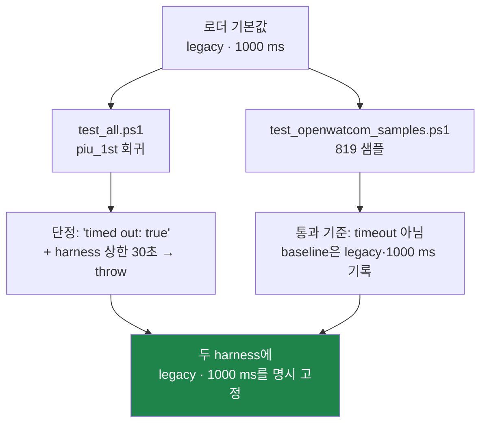

# Task 435 설계 — 실행 기본 정책: backend `dynamic`, guest timeout `0 ms`

선행: [425 backend 통합](20260805-424-execution-backend-consolidation.md) ·
[432 timer tick backlog 기본값](20260806-432-timer-tick-backlog-default.md) ·
[434 릴리스 CI](20260806-434-github-actions-release-ci.md)

## 1. 요구

| 항목 | 환경 변수 | 현재 기본 | 변경 후 기본 |
|---|---|---|---|
| 실행 backend | `REPIU_EXECUTION_BACKEND` | `legacy` | **`dynamic`** |
| guest 실행 예산 | `REPIU_EXECUTION_TIMEOUT_MS` | `1000` ms | **`0` ms = 무제한** |

두 값 모두 **해석 규칙은 그대로 두고 미지정일 때의 값만 바꿉니다.** `0`이 "제한 없음"
이라는 뜻은 이미 있던 규칙이고(README, supervisor), 이번에 그 값이 기본이 됩니다.

## 2. 근거 — 기본값이 실사용 절차와 정반대입니다

* **실사용 절차가 예외 없이 기본값을 덮어씁니다.** `docs/guides/`의 실행 절차 6개와
  `scripts/`의 측정·A/B 스크립트 12개 전부가 `REPIU_EXECUTION_BACKEND=dynamic`을
  적고, timeout은 `0`이거나 그 실행에 맞춘 명시 예산입니다. 기본값이 실제로 쓰이는
  곳은 아래 §3의 회귀 harness 두 개뿐입니다.
* **1000 ms는 "게스트가 실행되기는 하는가"만 보던 시기의 진단 예산입니다.** 지금 로더는
  렌더 루프·timer tick·CD 오디오까지 연결돼 있고, 1초 컷으로는 어떤 실사용 경로도
  완주하지 못합니다. [gameplay 캡처 가이드](../guides/gameplay-scene-capture.md)는
  이미 60초 이상을 권고하며 `0`을 요구합니다.
* **backend 승격이 전부 `dynamic` 경로 위에 쌓였습니다.** Tasks 384·386·390의 승격된
  세그먼트/포트 dispatch, 419의 rendezvous, 432의 tick backlog, 433의 vertex depth는
  `dynamic`에서 측정·확인된 것입니다. 기본이 `legacy`면 아무 설정 없이 로더를 켠
  사용자는 그 결과를 받지 못합니다.
* **`legacy`는 회귀 대조군으로 남깁니다.** Task 432가 opt-out 경로를 남겨 둔 덕분에
  이번 세대의 판정이 가능했던 것과 같은 이유이며, `REPIU_EXECUTION_BACKEND=legacy`는
  계속 유효합니다.

## 3. 위험 — 기본값에 의존하던 회귀 harness 두 개

기본값을 바꾸면 **조용히 깨지는 곳이 두 군데** 있습니다. 둘 다 로더의 기본 예산을
자기 상한으로 쓰고 있습니다.

| harness | 기본값 의존 | 무제한·dynamic이 되면 |
|---|---|---|
| `scripts/test_all.ps1` | `piu_1st`가 1000 ms 예산으로 끝나는 것을 통과 조건 하나로 단정(`minimal execution attempt timed out`), 자체 상한은 30초 후 **예외** | 게스트가 끝나지 않아 30초 kill → **회귀 테스트가 실패**. 단정에 쓰인 backend별 로그 값도 `legacy` 기준 |
| `scripts/test_openwatcom_samples.ps1` | 로더 예산이 샘플별 실질 상한이고, Task 429 통과 기준이 **"timeout 아님 + 완주"** | 멈춘 샘플이 로더 timeout(≈1초) 대신 harness kill(10초)로 끝나 **판정 근거와 스위트 시간이 함께 변함**. baseline은 `legacy`에서 기록된 것 |

**결론: 제품 기본값과 회귀 기준선을 분리합니다.** 두 harness는 baseline이 기록된 값
(`legacy`, `1000` ms)을 스크립트에서 **명시적으로 고정**하고, 매개변수로 바꿀 수 있게
둡니다. 그러면 이번 변경으로 `tests/baselines/openwatcom_samples.json`의 의미가
바뀌지 않습니다.

## 4. 변경

### 4.1 기본값 결정을 runtime으로 옮깁니다

두 기본값은 지금 `src/host/win32/main.cpp`의 익명 namespace 안에 있어 probe가 닿지
않습니다. `env_toggle`이 이미 같은 성격의 정책 해석을 runtime에 두고 probe로 고정하고
있으므로 같은 자리로 옮깁니다.

| 위치 | 추가 |
|---|---|
| `include/repiu/runtime/execution_backend.h` | `kDefaultExecutionBackend`, `ResolveExecutionBackend(const char*, ExecutionBackend*)` |
| `include/repiu/runtime/execution_timeout.h` (신규) | `kUnlimitedExecutionTimeoutMilliseconds = 0`, `kDefaultExecutionTimeoutMilliseconds = 0`, `ResolveExecutionTimeoutMilliseconds(const char*)` |
| `src/host/win32/main.cpp` | 두 resolver 호출로 축약. `0` → Win32 `INFINITE` 매핑만 host에 남김 |

`INFINITE`는 Win32 대기 API의 표현이므로 host에 남기고, "0은 무제한"이라는 정책은
runtime에 둡니다.

### 4.2 값 해석표

| `REPIU_EXECUTION_BACKEND` | 이전 | 이후 |
|---|---|---|
| 미설정·빈 값 | `legacy` | **`dynamic`** |
| `legacy` / `dynamic` | 그대로 | 그대로 |
| 그 외(옛 `aot`, `aot-dbt` 포함) | 오류 로그 후 종료 | 그대로 종료(fail-loud 유지) |

| `REPIU_EXECUTION_TIMEOUT_MS` | 이전 | 이후 |
|---|---|---|
| 미설정·빈 값 | 1000 ms | **무제한** |
| `0` | 무제한 | 무제한 |
| `N` (N>0) | N ms | N ms |
| 파싱 실패 | 1000 ms | **무제한**(기본값으로 되돌림) |

파싱 실패가 fail-open이 되는 점은 backend와 다릅니다. 다만 로더가 시작 시
`Win32 guest execution timeout: disabled`를 남기므로 오타는 로그 한 줄로 드러나고,
값이 하나뿐인 상한을 오타 때문에 종료로 처리하면 측정 스크립트가 더 취약해집니다.

### 4.3 그 밖의 변경

| 대상 | 변경 |
|---|---|
| `src/tools/aot_probe/execution_backend_probe.cpp` | 미설정·빈 값이 `dynamic`으로 해석되는지 단정 추가 |
| `src/tools/aot_probe/execution_timeout_probe.cpp` (신규) | 기본·`0`·양수·파싱 실패 네 갈래 단정 |
| `scripts/test_all.ps1` | `legacy` + `1000` ms 명시 고정 |
| `scripts/test_openwatcom_samples.ps1` | `-Backend legacy`, `-GuestTimeoutMilliseconds 1000` 매개변수로 고정 |
| `README.md` | `REPIU_EXECUTION_BACKEND` 항목 추가, 두 변수의 기본값 명시 |
| `ARCHITECTURE.md` | "`legacy`가 기본" 서술 갱신 |
| `docs/guides/gameplay-scene-capture.md` | "미설정 시 1000 ms" 서술 갱신 |

## 5. 한계

| 항목 | 판단 |
|---|---|
| 기본이 무제한 = 스스로 끝나지 않음 | 의도한 결과입니다. 창을 닫으면(`SDL_EVENT_QUIT`) timeout과 같은 teardown을 타고 종료 요약이 남습니다. supervisor는 이미 `0`을 명시하므로 영향 없음 |
| **1초 quiet timeout도 같이 꺼집니다** | `PollThreadUntilExit`는 wall-clock 예산과 quiet 판정을 같은 `INFINITE` 스위치로 껐다 켭니다(`live_telemetry_snapshot.cpp`). 즉 기본 실행에서는 게스트가 멈춰도 로더가 스스로 끝내지 않습니다. gameplay·supervisor 경로는 이미 `0`을 쓰고 있었으므로 새 동작이 아니라 **기본값이 그 경로와 같아진 것**입니다. 정지 감지가 필요한 진단은 예산을 명시하십시오 |
| 자동화가 로더를 그냥 실행하면 무한 대기 | 새 자동화는 자기 상한을 스스로 둬야 합니다. 이번에 고치는 harness 두 개가 그 예시가 됩니다 |
| `dynamic` 기본이 pumpit1 외 타이틀에서 미검증 | 이번 변경은 기본값만 바꾸고 실행 경로는 그대로입니다. `legacy`가 opt-out으로 남아 이분(二分)이 가능합니다 |
| OpenWatcom 샘플 통과율은 `legacy` 기준으로 고정됨 | 제품 기본값과 다릅니다. `dynamic` 기준선을 원하면 별도 재기록이 필요하며, 후속 작업으로 남깁니다 |

## 6. 검증

1. Win32 Debug 빌드가 통과합니다.
2. `repiu_aot_probe.exe`의 기본 실행이 통과하고, backend·timeout 정책 단정이 포함됩니다.
3. 환경 변수를 지우고 로더를 짧게 띄워
   `Win32 requested execution backend: dynamic`과
   `Win32 guest execution timeout: disabled`를 확인합니다.
4. `REPIU_EXECUTION_TIMEOUT_MS=1000`을 명시한 실행이 이전과 같이 1초에 끝납니다.

---

# Task 435 Design — execution defaults: `dynamic` backend, `0 ms` guest timeout

## 1. The requirement

`REPIU_EXECUTION_BACKEND` defaults to **`dynamic`** instead of `legacy`, and
`REPIU_EXECUTION_TIMEOUT_MS` defaults to **`0` ms, meaning no limit**, instead of 1000 ms.
**Only the unset value changes**; the parsing rules, including the existing meaning of `0` as
"unlimited", stay exactly as they are.

## 2. Rationale — the defaults are the opposite of every real procedure

Six run procedures under `docs/guides/` and twelve measurement and A/B scripts under
`scripts/` — eighteen places in total — set `REPIU_EXECUTION_BACKEND=dynamic` on their first
line, with the timeout either `0` or an explicit budget for that run. The default is therefore
used by nothing except the two regression harnesses in §3.

The 1000 ms budget dates from when the question was only "does the guest execute at all". The
loader now drives a render loop, timer ticks and CD audio, and no real path completes inside one
second; the [gameplay capture guide](../guides/gameplay-scene-capture.md) already demands `0`
and at least sixty seconds. Meanwhile every promotion of this generation — the segment and
port-I/O dispatch of Tasks 384, 386 and 390, the rendezvous of 419, the tick backlog of 432, the
vertex depth of 433 — was measured and confirmed on `dynamic`. With `legacy` as the default, a
user who launches the loader with no environment set receives none of it.

`legacy` remains as the regression control, for the same reason Task 432 kept its opt-out: it is
the surviving alternative that makes a verdict possible.

## 3. The risk — two harnesses depend on the current defaults

`scripts/test_all.ps1` asserts that `piu_1st` ends on the loader's 1000 ms budget (it accepts
`minimal execution attempt timed out` as one of two valid outcomes) and kills the process after
thirty seconds with an exception. An unlimited default turns that regression test into a
thirty-second kill and a failure. `scripts/test_openwatcom_samples.ps1` uses the loader budget
as each sample's effective bound, and its Task 429 pass criterion is precisely "completed, and
did not time out"; unlimited would move stalled samples from a ~1 second loader timeout to a
10 second harness kill, changing both the verdict basis and the suite's running time, and its
baseline was recorded on `legacy`.

**So the product default and the regression baseline are separated.** Both harnesses pin the
values their baselines were recorded under — `legacy` and `1000` ms — as explicit, overridable
parameters, which leaves `tests/baselines/openwatcom_samples.json` meaning what it meant before.

## 4. The change

The two defaults currently live in an anonymous namespace inside `src/host/win32/main.cpp`,
where no probe can reach them. They move to the runtime layer next to `env_toggle`, which
already holds policy resolution of exactly this kind under probe coverage:
`kDefaultExecutionBackend` and `ResolveExecutionBackend` join
`include/repiu/runtime/execution_backend.h`, and a new
`include/repiu/runtime/execution_timeout.h` carries
`kUnlimitedExecutionTimeoutMilliseconds`, `kDefaultExecutionTimeoutMilliseconds` and
`ResolveExecutionTimeoutMilliseconds`. The host keeps only the mapping from `0` to Win32
`INFINITE`, because that constant belongs to the wait API rather than to the policy.

Unset or empty resolves to `dynamic` and to unlimited. `legacy` and `dynamic` still parse, and
every other backend value — including the retired `aot` names — still exits loudly. An
unparsable timeout falls back to the default, which now means unlimited rather than 1000 ms;
that is fail-open where the backend is fail-loud, and the justification is that the loader logs
`Win32 guest execution timeout: disabled` at startup, so a typo is visible in one line, whereas
exiting on a malformed bound would make the measurement scripts more brittle.

Alongside this, the backend probe gains an assertion for the unset default, a new timeout probe
covers the four branches, the two harnesses pin their values, and `README.md`,
`ARCHITECTURE.md` and the gameplay capture guide are corrected. The README also gains the
`REPIU_EXECUTION_BACKEND` entry it never had.

## 5. Limits

An unlimited default means the loader no longer stops on its own; that is the intent, and
closing the window takes the same `SDL_EVENT_QUIT` teardown as a timeout, so the exit summary is
still written. **The one-second quiet timeout goes with it** — `PollThreadUntilExit` gates both
the wall-clock budget and the quiet-stall verdict on the same `INFINITE` switch — so a default
run no longer ends itself when the guest stalls. That is not new behaviour but the default
joining the path gameplay and the supervisor already took; diagnosis that needs stall detection
states a budget. The supervisor already sets `0` explicitly and is unaffected. New automation must
now impose its own bound — the two harnesses fixed here are the worked example. The OpenWatcom
sample pass rate stays pinned to `legacy`, which is no longer the product default; re-recording
it on `dynamic` is left as a follow-up.

## 6. Verification

The Win32 Debug build passes; `repiu_aot_probe.exe` passes with the new backend and timeout
assertions; a short run with the environment cleared logs
`Win32 requested execution backend: dynamic` and `Win32 guest execution timeout: disabled`; and
an explicit `REPIU_EXECUTION_TIMEOUT_MS=1000` run still ends after one second.
