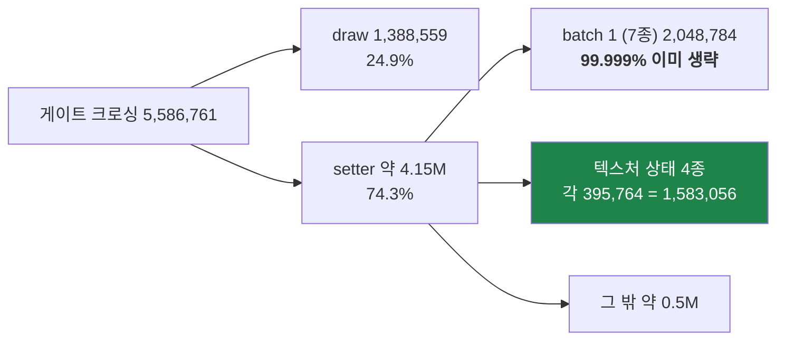
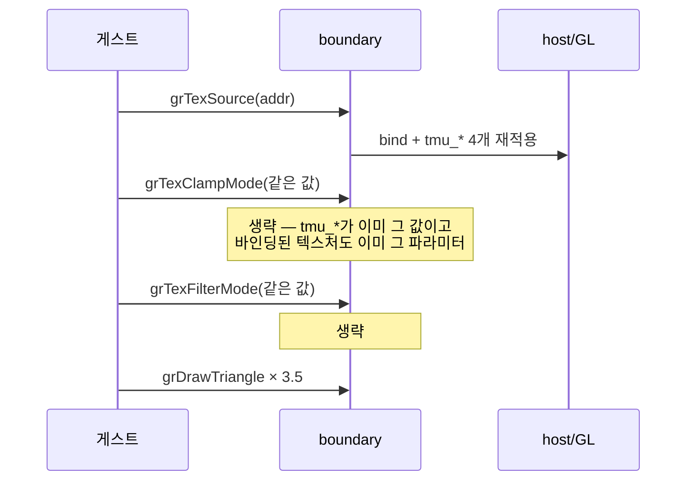

# Task 437 설계 — 텍스처 상태 setter 생략 (Task 365 batch 2)

선행: [364 setter census](20260730-364-glide-setter-state-census.md) ·
[365 setter 생략](20260730-365-glide-setter-state-elision.md) ·
[388 게이트 direct dispatch 기본값](20260801-388-glide-gate-direct-dispatch-default.md) ·
[419 rendezvous 스핀](20260805-419-glide-rendezvous-spin-wait.md)

## 1. 근거 — 사용자 371.3초 gameplay 로그(v0.0.136, pumpit1, 20,212프레임)

| 항목 | 값 | 프레임당 |
|---|---:|---:|
| 게이트 크로싱 | 5,586,761 | 276.4 |
| `grDrawTriangle` | 1,388,559 | 68.7 |
| **batch 1 생략 실적** | **elided 2,048,762 / applied 22** | — |
| `grTexSource` · `grTexClampMode` · `grTexFilterMode` · `grTexMipMapMode` | **각 395,764** | 각 19.6 |
| 텍스처 다운로드 | 176 | 0.009 |

네 개의 텍스처 setter 호출 수가 **정확히 같습니다.** 게임은 bind마다 4개를 한 블록으로
부르고, bind당 삼각형은 3.5개입니다. 그리고 **batch 1의 실적이 99.999%** 라는 것은,
같은 호출 구조를 가진 이 블록도 거의 전부 같은 값의 반복일 가능성이 크다는 뜻입니다.

**게이트 예외는 이미 사라졌습니다.** direct dispatch가 5,586,761건 전부를 성공
처리(target-miss 0)하므로, 크로싱마다 남은 비용은 **host rendezvous**이고 그것이
생략이 없애는 대상입니다.

## 2. 이번 batch의 대상과 제외

| gate | 호출 | 백엔드 rendezvous | 판정 |
|---|---:|---|---|
| `grTexClampMode` | 395,764 | **있음**(`SetTextureClampMode`) | **포함** |
| `grTexFilterMode` | 395,764 | **있음**(`SetTextureFilterMode`) | **포함** |
| `grTexMipMapMode` | 395,764 | 없음 — ABI 전용 no-op | 포함하되 **절감 주장 없음** |
| `grTexSource` | 395,764 | 있음 | **제외** — 아래 |
| `grDepthMask` 326,884 · `grConstantColorValue` 72,710 · combine 2종 · `grDitherMode` | — | — | 이번 범위 밖 |

**실제 절감 대상은 791,528 rendezvous, 프레임당 39.2회입니다.**

`grTexSource`를 빼는 이유는 batch 1이 적어 둔 "반복률 32.24%"가 아니라 **인자 형태**
입니다. 네 번째 인자가 `GrTexInfo*` **포인터**이고, 같은 포인터 뒤의 구조체 내용이
바뀌어도 키는 같아집니다. `texture_generation`은 **다운로드만** 잡으므로 이 경로를
막지 못합니다. 포인터가 가리키는 내용을 키에 넣기 전에는 생략할 수 없습니다.

## 3. 정확성 — OpenGL의 per-texture 파라미터 문제는 이미 해결돼 있습니다

Glide의 clamp/filter는 **TMU 상태**인데 OpenGL의 대응물은 **텍스처 객체별
파라미터**입니다. 순진하게 옮기면 "다른 텍스처를 bind하면 파라미터가 낡는다"는
위험이 생기고, 그 경우 생략은 틀립니다.

**우리 backend는 이미 bind 시점에 복원합니다.** `SetTextureSource`가 텍스처를
bind한 직후 `tmu_min_filter_`·`tmu_mag_filter_`·`tmu_s_clamp_`·`tmu_t_clamp_`에서
네 파라미터를 다시 적용합니다(`glide_opengl_backend.cpp:1405-1416`).

따라서 값이 같은 clamp/filter 호출은 **같은 필드에 같은 값을 쓰고 이미 올바른
텍스처에 같은 `glTexParameteri`를 재발행하는 순수 무동작**이며, 생략과 실행이
동치입니다. 이것이 batch 1이 미룬 유일한 이유("텍스처 세대 의미를 다른 것과 같은
배치에서 검증하지 않으려고")를 해소합니다. 세대 배선 자체는 batch 1 시점에 이미
probe로 고정돼 있습니다(cache probe의 텍스처 세대 단정 — "later batch가 그대로
물려받도록").

## 4. 스위치 — opt-in으로 넣고, 측정 뒤에 승격합니다

| 설정 | 동작 |
|---|---|
| 미설정 | batch 1만 (지금과 동일) |
| `REPIU_GLIDE_SETTER_ELIDE_TEXTURE=1` | batch 1 + 텍스처 상태 3종 |
| `REPIU_GLIDE_SETTER_ELIDE=0` | 전부 끔(기존 kill switch가 상위) |

opt-in 해석은 `runtime::ResolveOptInToggle`을 씁니다(Task 424가 정리한 관례).
**승격은 이번 작업에서 하지 않습니다** — A/B 근거가 나온 뒤 Tasks 384·386·390·432와
같은 절차로 별도 처리합니다.

## 5. 왜 측정이 선결인가

Task 365는 41,368 rendezvous를 없애고도 **프레임이 움직이지 않았습니다.** 당시의
설명은 "게이트 예외가 남아 있어서"였고, 지금은 그 예외가 0입니다(§1). 조건이 바뀌었으니
결론도 다시 세워야 하며, **측정 없이 기본값으로 올리지 않습니다.**

이 측정은 후속 후보인 **command batching**(frontier 1-a)의 선행 근거이기도 합니다.
rendezvous 1회의 단가가 나와야 "묶어서 보내면 얼마가 남는가"를 계산할 수 있습니다.

## 6. 검증

1. probe — 스위치 OFF에서 batch 1 목록 불변, ON에서 텍스처 3종 추가, `grTexSource`는
   양쪽 모두 제외, 텍스처 세대 무효화 동작 유지.
2. 빌드와 스모크에서 Glide 구현 공백 0 유지.
3. 사용자 A/B 캡처(가이드에 절차 추가) — 같은 구간 3회 이상, `census`로 `same` 비율,
   `ordinal time profile`로 단가, 프레임 수로 효과.

## 7. 한계

| 항목 | 판단 |
|---|---|
| `grTexMipMapMode`는 ABI 전용 | 생략해도 rendezvous가 줄지 않습니다. 부기만 통일 |
| `grTexSource` 잔존 | bind당 rendezvous 1회는 그대로. 포인터 내용 키가 생기기 전에는 불가 |
| 다운로드마다 세대 상승 | 176회이므로 재적용은 프레임당 0.01회 수준 |
| 효과 미측정 | 이번 작업의 산출물은 **A/B 가능 상태**까지입니다 |

---

# Task 437 Design — eliding texture-state setters (Task 365 batch two)

## 1. Evidence — the user's 371.3-second gameplay log (v0.0.136, pumpit1, 20,212 frames)

Of 5,586,761 gate crossings, draws are 1,388,559 (24.9%) and setters about 4.15M (74.3%).
Batch one's seven gates account for 2,048,784 of those and are **already elided 2,048,762 times
against 22 applications — 99.999%**. The largest remaining group is the texture-state block:
`grTexSource`, `grTexClampMode`, `grTexFilterMode` and `grTexMipMapMode` at **exactly 395,764
calls each**, one four-call block per bind with 3.5 triangles drawn per bind. Texture downloads
number 176 in the whole run.

**The per-call gate exception is already gone** — direct dispatch handled all 5,586,761 crossings
with zero target misses — so what remains per crossing is the **host rendezvous**, which is
precisely what elision skips.

## 2. What this batch includes

`grTexClampMode` and `grTexFilterMode` both reach the backend and therefore cost a rendezvous:
**791,528 of them, 39.2 per frame**, which is the real prize. `grTexMipMapMode` is included for
uniform bookkeeping but is an **ABI-only no-op** today, so no saving is claimed for it.

`grTexSource` is **excluded**, and for a better reason than batch one's "repeats only 32.24% of
the time": its fourth argument is a `GrTexInfo*` **pointer**, and the struct behind an unchanged
pointer can change without a download, which `texture_generation` does not catch. Until the
pointed-to contents enter the key, that gate cannot be elided. `grDepthMask`,
`grConstantColorValue`, the combine setters and `grDitherMode` stay out of scope, each needing
its own evidence.

## 3. Correctness — the per-texture parameter hazard is already handled

Glide's clamp and filter are **TMU state** while OpenGL's counterparts are **per-texture-object
parameters**, so a naive mapping would leave parameters stale after a different texture is bound
— and elision would then be wrong. Our backend already re-applies all four parameters from
`tmu_*_` immediately after binding in `SetTextureSource` (`glide_opengl_backend.cpp:1405-1416`).
A same-valued clamp or filter call therefore writes the same field and re-issues the same
`glTexParameteri` on an already-correct texture: **a pure no-op, making elision equivalent to
execution.** This retires the one reason batch one gave for deferring these gates, and the
texture-generation wiring they need was already pinned by the cache probe at that time.

## 4. The switch

Unset keeps batch one alone; `REPIU_GLIDE_SETTER_ELIDE_TEXTURE=1` adds the three texture gates;
and the existing `REPIU_GLIDE_SETTER_ELIDE=0` kill switch still disables everything. The opt-in
reading uses `runtime::ResolveOptInToggle`, the convention Task 424 settled. **Promotion is not
part of this task** and follows the Tasks 384/386/390/432 procedure once the A/B evidence exists.

## 5. Why measurement comes first

Task 365 removed 41,368 rendezvous and **frames did not move**, which it explained by the gate
exception that still remained. That exception is now zero, so the conclusion has to be
re-established rather than assumed — and the same measurement yields the per-rendezvous unit cost
that the next candidate, command batching (frontier 1-a), needs in order to be worth costing.

## 6. Verification

The probe must show batch one unchanged with the switch off, the three texture gates added with
it on, `grTexSource` excluded either way, and texture-generation invalidation still working; the
build and a smoke must keep the Glide implementation-gap counters at zero; and the user's paired
A/B capture supplies the `same` ratio, the per-ordinal unit cost, and the frame effect.

## 7. Limits

`grTexMipMapMode` saves no rendezvous because it never took one. `grTexSource` keeps one
rendezvous per bind. Each of the 176 downloads bumps the generation and forces one re-application,
about 0.01 per frame. **The deliverable of this task is a state in which the A/B can be run**, not
a measured speedup.
