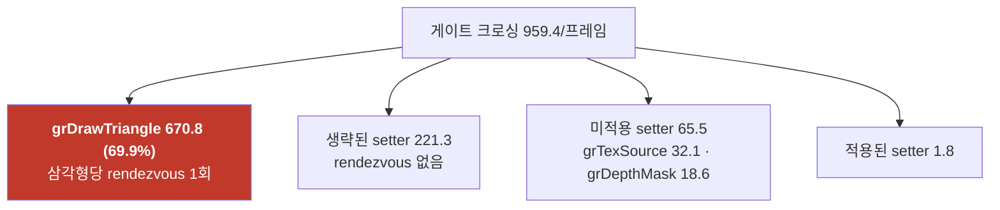
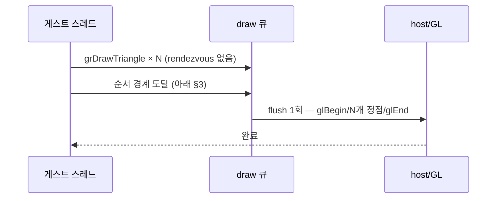

# Task 438 설계 — Glide draw batching

선행: [419 rendezvous 스핀](20260805-419-glide-rendezvous-spin-wait.md) ·
[437 텍스처 setter 생략](20260807-437-glide-texture-setter-elision.md) ·
frontier 항목 1

## 1. 근거 — 지배항은 draw입니다

Task 437 A/B 4회(pumpit1, 실부하 구간)에서 확정된 프레임당 구성입니다.

`DrawTriangle`은 `IsHostThread()`가 거짓이면 **삼각형 하나마다
`InvokeOnHostThread`** 를 겁니다(`glide_opengl_backend.cpp:1152-1159`). 게스트 스레드는
그동안 멈춥니다.

**Task 437이 없앤 96회는 이 670회의 7분의 1입니다.** setter 축은 이미 걷혔고
(생략 221.3, 적용 1.8), 남은 것은 draw 자체입니다.

## 2. 무엇을 바꾸는가

삼각형을 **게스트 스레드 쪽 큐에 모았다가**, 순서를 지켜야 하는 지점에서 한 번의
rendezvous로 넘깁니다.

정점은 게이트에서 **이미 디코드된 값**(`hle::GlideDrawVertex`)이므로 큐에는 값 복사만
들어갑니다. **게스트 포인터를 붙들지 않습니다** — 이것이 이 설계가 안전한 이유의 절반
입니다.

## 3. 순서 계약 — 언제 비우는가

**보수적 v1 규칙: draw가 아닌 게이트를 처리하기 전에 무조건 비웁니다.** 상태 변경·질의·
프레임 경계·LFB를 개별 판정하지 않고 한 줄로 묶으므로, 빠뜨린 경계 때문에 순서가
어긋날 수 없습니다.

| 비우는 시점 | 이유 |
|---|---|
| draw가 아닌 모든 게이트 진입 전 | 상태 변경·질의·swap·clear·LFB·다운로드를 한 규칙으로 덮음 |
| 큐 용량 도달 | 고정 크기 버퍼. 상한은 프레임당 draw 상한보다 크게 |
| teardown·창 닫기 | 남은 삼각형을 잃지 않기 위해 |
| primitive 종류가 바뀔 때 | 삼각형·선·점·폴리곤이 섞이지 않도록 |

**생략된 setter는 게이트를 넘지 않으므로 flush를 유발하지 않습니다.** 여기서
Task 365/437의 생략이 batching의 **전제 조건**이 됩니다 — 생략이 없으면 프레임당
290회의 setter가 전부 flush 지점이 되어 배치 길이가 2~3으로 무너집니다.

실측 기준 flush 지점은 **프레임당 약 100회**(미적용 setter 65.5 + 적용 1.8 + swap·clear·
query 약 3 + `grTexSource` 32.1은 미적용 setter에 포함)이고, 배치 평균 길이는
670.8 / 100 ≈ **6.7 삼각형**입니다. rendezvous는 **670 → 약 100, 6.7배 감소**입니다.

> **주의:** 6.7배는 rendezvous **횟수**의 비이지 프레임의 비가 아닙니다. 단가가 낮으면
> 프레임은 그만큼 움직이지 않습니다. 그래서 이번에도 opt-in으로 넣고 측정합니다.

## 4. 부수 효과 — GL 호출도 함께 줍니다

지금은 삼각형마다 `glBegin(GL_TRIANGLES)`/`glEnd()`가 한 쌍씩 나갑니다. 배치는 한 쌍
안에 N개를 넣으므로 즉시 모드 호출도 같은 비율로 줄어듭니다. **정점 데이터의 양과
셰이더 상태는 그대로**이므로 렌더 결과는 동일해야 합니다.

## 5. 위험

| 항목 | 대응 |
|---|---|
| 상태 변경 뒤 그려야 할 삼각형이 앞서 그려짐 | v1의 "draw 아닌 게이트 전에 무조건 flush"가 원천 차단 |
| 프레임 경계에 삼각형이 남음 | `grBufferSwap`도 draw가 아니므로 그 전에 비워짐 |
| LFB 읽기가 미완 삼각형을 못 봄 | 같은 규칙으로 비워짐 |
| 진단(`REPIU_GLIDE_DRAW_DIAG`, tri census)의 시점 이동 | 큐에 넣는 시점에 기록해 호출 순서 기준을 유지 |
| ordinal 시간 귀속이 flush로 몰림 | draw ordinal의 work/call 해석이 바뀝니다. 작업 로그에 명시하고, 배치 길이를 함께 보고 |
| 예외·teardown 중 큐 유실 | teardown 경로에서 비우고, 실패 시 버림(그림 손실 < 잘못된 순서) |

## 6. 대안과 기각 사유

| 대안 | 판단 |
|---|---|
| GL을 게스트 스레드로 옮겨 rendezvous 자체를 제거 | 근본적이지만 SDL 창·이벤트 소유권과 teardown 전체를 다시 설계해야 합니다. batching이 같은 비용의 대부분을 훨씬 적은 위험으로 걷어내므로 나중 |
| host가 폴링하는 lock-free 링 | flush 지점이 어차피 동기점이라 이득이 작고, 동시성 표면만 늘어납니다 |
| `grDrawTriangle`만 특별 취급하지 않고 모든 게이트를 큐잉 | 반환값이 있는 게이트가 있어 불가 |

## 7. 스위치와 승격

`REPIU_GLIDE_DRAW_BATCH` opt-in, 기본 OFF. A/B는
[생략 검증 가이드](../guides/glide-setter-elision-testing.md)와 같은 절차를 쓰되
**`REPIU_GLIDE_SWAP_INTERVAL=0`·`REPIU_EXECUTION_TIME_PROFILE=1`·
`REPIU_GLIDE_ORDINAL_TIME_PROFILE=1`을 반드시 켭니다** — Task 437 A/B가 vsync 때문에
프레임 판정을 못 한 것이 그 교훈입니다.

승격 판정은 **Task 437과 함께** 합니다. 두 스위치는 같은 축(rendezvous 횟수)이고, batching이
켜지면 생략의 값어치가 더 커집니다(§3).

## 8. 검증

1. probe — flush 규칙 분류(draw 게이트만 큐잉, 그 밖 전부 flush), 용량 상한, primitive
   전환, 빈 큐 flush의 무해성.
2. 스모크 — 구현 공백 0 유지, 배치 통계(총 삼각형 = 배치 합) 일치.
3. 사용자 A/B — 프레임, gate 비중, 배치 평균 길이, 시각 회귀 여부.

---

# Task 438 Design — Glide draw batching

## 1. Evidence: draws are the dominant term

The Task 437 A/B fixed the per-frame composition of a real load section: 959.4 gate crossings, of
which **`grDrawTriangle` is 670.8 — 69.9%** — against 221.3 elided setters that cost nothing,
65.5 uncovered setters and 1.8 applied ones. `DrawTriangle` takes **one `InvokeOnHostThread` per
triangle** when called off the host thread, parking the guest thread each time. What Task 437
removed is one seventh of that traffic; the setter axis is already swept, and what remains is the
draws themselves.

## 2. The change

Triangles accumulate in a queue on the guest side and are handed over in **one rendezvous at each
ordering boundary**. The vertices are already decoded at the gate into `hle::GlideDrawVertex`, so
the queue stores copies and **never retains a guest pointer** — half of why this is safe.

## 3. The ordering contract

**Conservative v1: flush before handling any non-draw gate.** State changes, queries, frame
boundaries, LFB locks and downloads are covered by one rule rather than an enumeration that could
miss a case. The queue also flushes on capacity, on a primitive-kind change, and at teardown.

**Elided setters never reach the gate handler, so they never force a flush** — which makes Tasks
365 and 437 a *precondition* for batching: without elision, 290 setter calls per frame would each
be a flush point and batches would collapse to two or three triangles. With them, flush points
are about **100 per frame**, giving an average batch of **6.7 triangles and a 6.7x reduction in
rendezvous, 670 to about 100**. That ratio is a count, not a frame ratio: if the unit cost is low
the frames will not follow, which is why this also lands as an opt-in to be measured.

## 4. A second effect

Today each triangle emits its own `glBegin`/`glEnd` pair; a batch puts N triangles inside one
pair, cutting immediate-mode calls in the same proportion. The vertex data and shader state are
unchanged, so the rendered result must be identical.

## 5. Risks

The ordering hazards — a triangle drawn before the state change it belongs after, triangles left
across a frame boundary, an LFB read that cannot see pending work — are all closed by the single
v1 rule, since swap, clear and LFB gates are not draws. Diagnostics record at enqueue time to keep
call-order semantics, per-ordinal timing attribution moves to the flush (which the work log must
state, reported alongside the average batch length), and teardown flushes or discards, since
losing a picture beats reordering one.

## 6. Alternatives rejected

Moving GL onto the guest thread would remove the rendezvous entirely but requires redesigning SDL
window and event ownership and the whole teardown path; batching takes most of the same cost at a
fraction of the risk, so that stays for later. A host-polled lock-free ring adds concurrency
surface for little gain when the flush points are synchronisation points anyway. Queueing every
gate is impossible because some return values.

## 7. Switch and promotion

`REPIU_GLIDE_DRAW_BATCH`, opt-in and off by default. The A/B follows the elision guide's
procedure but **must** set `REPIU_GLIDE_SWAP_INTERVAL=0`, `REPIU_EXECUTION_TIME_PROFILE=1` and
`REPIU_GLIDE_ORDINAL_TIME_PROFILE=1` — the lesson of Task 437's A/B, whose frame verdict was void
because vsync was on. Promotion is decided **together with Task 437**, since both act on the same
axis and batching increases what elision is worth.

## 8. Verification

A probe pins the flush classification (only draw gates queue; everything else flushes), the
capacity bound, primitive-kind switching and the harmlessness of flushing an empty queue; a smoke
keeps the implementation-gap counters at zero and shows total triangles equal to the sum of the
batches; and the user's A/B supplies frames, gate share, average batch length and any visual
regression.
