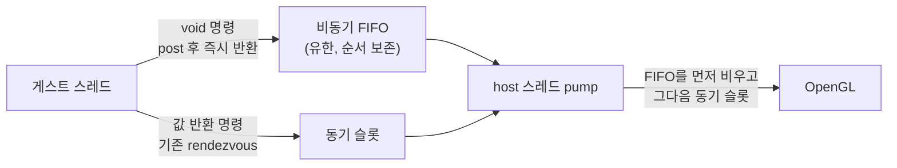

# Task 440 설계 — Glide 비동기 present (void 명령 큐)

> ## [2026-08-07 정정] 이 설계는 **잘못된 측정 조건**으로 축을 골랐습니다
>
> 아래 §1은 vsync **ON**에서 잰 32.8%를 근거로 이 축을 1순위로 지목합니다. 그러나
> **vsync ON은 게임의 조건이지 측정 조건이 아닙니다.** 이 프로젝트는 Task 371 이래
> 성능 판정을 **vsync OFF**로 하며, 그 기준에서 `grBufferSwap`은 guest-run의 **2.9%**,
> present 1회가 **0.07 ms**입니다 — 걷어낼 것이 거의 없습니다.
>
> vsync ON의 32.8%는 CPU 작업이 아니라 **디스플레이를 기다리는 유휴 시간**입니다.
> 실측도 같은 결론이었습니다: 비동기화로 `grBufferSwap`을 35.11% → 0.017%로 없앴지만
> **프레임은 785 → 782로 움직이지 않았고**, 대기는 `grDepthMask`(33.57%)로 옮겨갔을
> 뿐입니다.
>
> **결론: 이 축은 성능 근거가 없습니다.** 구현은 `grBufferNumPending`의 하드웨어 계약을
> 복원한다는 **정확성 근거**로만 opt-in 유지하며, 기본값으로 승격하지 않습니다.
> 자세한 것은 [작업 로그](../work-logs/20260807-440-glide-async-present.md) §7.

선행: [354 swap 시간 분해](20260729-354-glide-buffer-swap-time-decomposition.md) ·
[438 draw batching](20260807-438-glide-draw-batching.md) · frontier 항목 1(b)

## 1. 측정 — vsync가 켜지면 게스트가 실행 시간의 32.8%를 대기합니다

Release, attract, 20초, `REPIU_GLIDE_SWAP_TIME_PROFILE=1`.

| 지표 | **vsync ON(플레이 기본값)** | interval 0 |
|---|---:|---:|
| swap / fps | 752 / 37.6 | 8,130 / 406 |
| **swap이 guest-run에서 차지하는 비중** | **32.8%** | 2.9% |
| glide-gate 전체 | 45.7% | 19.6% |
| **present 1회당** | **32.36M cycle ≈ 10.8 ms** | 214K ≈ 0.07 ms |
| present ÷ swap host work | **99.95%** | 98.8% |

프레임당 게스트 작업은 약 17.9 ms인데 그 위에 **10.8 ms의 순수 대기**가 얹혀 프레임이
26.6 ms가 됩니다. Task 354가 vsync ON에서 같은 형태를 이미 봤고(“host work의 99.589%가
`SDL_GL_SwapWindow`”), 그때는 이 대기를 **성능 이유로 없애지 않겠다**고 결론지었습니다.
이번에 달라진 것은 없애자는 게 아니라 **게스트를 그 대기에 묶어 두지 않겠다**는 것입니다.

## 2. 근거 — 하드웨어는 여기서 게스트를 세우지 않습니다

게임은 `grBufferSwap` 뒤에 `grBufferNumPending`을 **1:1로** 호출합니다(7,276:7,276).
Glide에서 swap은 **비동기**이고 게임은 pending 개수로 스스로 스로틀링합니다.

| | 하드웨어 | 현재 우리 |
|---|---|---|
| `grBufferSwap` | flip을 큐에 넣고 **즉시 반환** | present 완료까지 **게스트 정지** |
| `grBufferNumPending` | 밀린 swap 개수 | **항상 0**(스로틀 입력이 상수) |

**정확성 우선 원칙에 부합합니다**(AGENTS). 지금 동작이 원본보다 더 동기적입니다.

## 3. 구조 — 단일 슬롯 동기 채널에 비동기 FIFO를 더합니다

**순서 계약:** host pump는 **FIFO를 전부 비운 뒤에** 동기 슬롯을 실행합니다. 두 경로가
같은 스레드에서 제출 순서대로 실행되므로 GL 명령 순서는 지금과 동일합니다.

**비동기로 보낼 것(이번 범위):**

| 명령 | 이유 |
|---|---|
| `grBufferSwap` | 대기의 본체. Glide 규약상 원래 비동기 |
| `grBufferClear` | swap 직후에 오므로 동기로 두면 대기가 여기로 옮겨갈 뿐 |
| draw batch flush | **필수**. 이것이 동기면 다음 프레임 첫 `grTexSource`에서 다시 막힙니다 |

flush를 비동기로 보내려면 정점을 **명령에 복사**해야 합니다(게스트가 곧바로 큐를
다시 채우므로). 배치 평균 16 프리미티브 = 48 정점 × 52바이트 ≈ 2.5 KB, 초당 약 2,200회
→ 약 5 MB/s의 memcpy이고, 10.8 ms 정지에 비하면 무시할 수 있습니다.

**상한과 역압:** 미완료 swap은 **최대 1개**(double buffer)이고 FIFO 용량도 유한합니다.
가득 차면 post가 대기합니다. 게스트가 프레임 하나 이상 앞서 나갈 수 없으므로 지연이
누적되지 않고, 이 상한이 곧 `grBufferNumPending`이 보고하는 값입니다.

## 4. 바뀌는 의미 하나 — 비동기 명령은 게이트를 거부할 수 없습니다

지금은 backend 실패가 `decline_gate`로 이어집니다. 비동기로 보내면 게이트는 이미
반환한 뒤이므로 실패를 **원자 카운터로 집계해 요약에 싣습니다.**

**하드웨어도 같습니다** — 큐에 넣은 flip은 동기적으로 실패를 알려줄 수 없습니다. 다만
이것은 관측 가능한 변화이므로 요약에 `async failures`를 별도 항목으로 둡니다.

## 5. 위험

| 항목 | 대응 |
|---|---|
| GL 명령 순서 역전 | 한 FIFO + "동기 전에 FIFO 비우기". 두 경로가 같은 host 스레드 |
| 게스트가 정점 버퍼를 재사용 | 명령이 정점을 **복사 소유** |
| 무한 앞서 나감 | 미완료 swap 1개 + FIFO 용량 상한, 초과 시 post가 대기 |
| teardown 중 유실·교착 | 종료 요청 시 FIFO를 비우고, host가 멈춘 뒤에는 post가 대기하지 않도록 상태를 확인 |
| 타이머 틱 손실 계상(Task 431) | 게스트가 **덜** 멈추므로 안전 방향. 게이트 점유 플래그는 동기 경로에만 유지 |
| LFB·질의 경로 | 값 반환이므로 동기 그대로. FIFO 선행 비우기가 일관성 보장 |

## 6. 스위치와 판정

`REPIU_GLIDE_ASYNC_PRESENT` opt-in, 기본 OFF. **vsync ON에서 재는 것이 이 축의 조건**
입니다 — interval 0에서는 present가 0.07 ms라 잴 것이 없습니다. 438의 교훈대로 프레임이
아니라 **cycle 비중**으로 봅니다.

| 읽을 값 | 기대 |
|---|---|
| ordinal 85의 `gate/call` | 32.36M → **크게 감소**(대기가 게스트 밖으로 나감) |
| `glide-gate ÷ guest-run` | 45.7% → 크게 감소 |
| 프레임 | vsync 상한(60) 쪽으로 이동 |
| `async failures` | **0** |
| 시각 | 차이 없음(순서가 보존되면) |

## 7. 검증

1. probe — FIFO 순서 보존, 동기 명령 전 선행 비우기, 용량 역압, swap pending 회계,
   실패 집계.
2. 스모크 — vsync ON에서 `=0`/`=1` 비교, 구현 공백 0 유지, 프레임·pending 회계 일치.
3. 사용자 gameplay A/B — 시각 회귀 확인 포함.

---

# Task 440 Design — asynchronous Glide present through a void-command queue

## 1. The measurement: with vsync on, the guest waits 32.8% of its run

Twenty seconds of attract on Release with the swap profile enabled: with **vsync on — the play
default — `grBufferSwap` is 32.8% of guest-run**, at **32.36M cycles (about 10.8 ms) per present**,
of which the `SDL_GL_SwapWindow` call is **99.95%**. At interval 0 the same present costs 214K
cycles and the whole ordinal is 2.9%. The guest does roughly 17.9 ms of work per frame and then
**waits 10.8 ms on top**, making the frame 26.6 ms. Task 354 saw the same shape and decided not to
remove the wait for performance reasons; this task does not remove it either — **it stops binding
the guest thread to it**.

## 2. Rationale: the hardware does not stall the guest here

The game calls `grBufferNumPending` exactly once per `grBufferSwap` — 7,276 to 7,276 — which is
Glide's **asynchronous** swap protocol: the hardware queues the flip and returns, and the game
throttles itself on the pending count. Our `grBufferSwap` blocks the guest until the present
returns, and our `grBufferNumPending` **always answers zero**, so the game's throttle input is a
constant. Being more synchronous than the original is an accuracy gap as much as a cost.

## 3. Structure: a bounded FIFO beside the existing single synchronous slot

Void commands are posted and the guest continues; value-returning commands keep today's
rendezvous. **The host pump drains the FIFO before running the synchronous slot**, and both paths
execute on the same host thread in submission order, so GL ordering is exactly what it is today.

This batch posts `grBufferSwap`, `grBufferClear` and **the draw-batch flush**. The flush must be
included: left synchronous, the guest would simply block at the next frame's first `grTexSource`
instead, and the wait would move rather than disappear — the lesson of Task 438. Posting the flush
means the command **owns a copy of its vertices**, about 2.5 KB per flush at the measured average
of 16 primitives, roughly 5 MB/s of memcpy against a 10.8 ms stall.

**Back pressure:** at most **one** outstanding swap (double buffering) and a bounded FIFO; a full
queue makes the post wait. The guest can therefore never run more than a frame ahead, and that
same count is what `grBufferNumPending` reports.

## 4. One semantic change: an async command cannot decline its gate

Backend failures today reach `decline_gate`; a posted command has already returned, so failures
are **counted atomically and surfaced in the summary** as `async failures`. The hardware behaves
the same way — a queued flip cannot report failure synchronously — but the change is observable,
so it gets its own field rather than being folded into the existing counters.

## 5. Risks

Ordering is protected by a single FIFO plus the drain-before-sync rule on one host thread. The
vertex payload is copied into the command, so the guest may reuse its batch immediately. Run-ahead
is bounded by the single outstanding swap and the queue capacity, with posts waiting when full.
Teardown drains the queue and must not let a post wait on a host that has stopped pumping. Timer
tick accounting (Task 431) moves in the safe direction, since the guest stalls less; the gate
occupancy flag stays on the synchronous path. LFB and query paths return values and stay
synchronous, with the drain rule keeping them consistent.

## 6. Switch and verdict

`REPIU_GLIDE_ASYNC_PRESENT`, opt-in and off by default. **This axis must be measured with vsync
on**: at interval 0 the present costs 0.07 ms and there is nothing to recover. Judge in cycles
rather than frames, per Task 438 — ordinal 85's per-call gate cost and the `glide-gate` share
should both fall sharply, `async failures` must be zero, and the picture must not change.

## 7. Verification

A probe pins FIFO ordering, the drain-before-sync rule, capacity back pressure, the pending-swap
accounting and failure counting; a vsync-on smoke compares `=0` against `=1` with the
implementation-gap counters at zero; and the user's gameplay A/B confirms the visual result.
