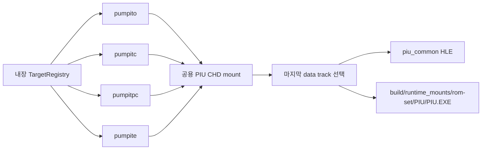

# 20260808-449 PIU CHD 타깃 프로파일 확장 설계 / PIU CHD Target Profile Expansion Design

## 한국어

### 목표와 근거

내장 타깃 레지스트리에 다음 MAME ROM-set 프로파일을 사용자가 지정한 순서로 추가합니다.

1. `pumpito` — Pump It Up The O.B.G.: The Season Evolution Dance Floor
2. `pumpitc` — Pump It Up: The Collection
3. `pumpitpc` — Pump It Up: The Perfect Collection
4. `pumpite` — Pump It Up Extra

MAME의 [`xtom3d.cpp`](https://github.com/mamedev/mame/blob/master/src/mame/misc/xtom3d.cpp)는 네 세트가
공통 `PUMPITUP_BIOS`/PIU10 하드웨어 정의를 사용하고 각각 별도 CD image를 갖는다고 정의합니다.
따라서 게임 로직이나 HLE 서비스를 새로 구현하지 않고 기존 `piu_common` HLE 프로파일과
범용 `PreparePiuChdMount` 경로를 재사용합니다.

로컬 `pumpite` CHD는 두 개의 `MODE2_RAW` data track으로 구성되며 두 세션 모두 상대
LBA 16에 ISO9660 PVD를 갖습니다. 기존 reader는 마지막 data track을 기록한 뒤 data track이
둘 이상이면 거부했습니다. 멀티세션 디스크의 최신 파일 시스템을 읽도록 이 제한을 제거하고
**마지막 data track**을 선택합니다. 선택된 track의 PVD와 extent 범위 검증은 기존대로
fail-closed를 유지합니다.

### 프로파일 구조

각 프로파일은 `id`와 `rom_set_id`에 같은 MAME short name을 사용합니다. 실행 파일,
작업 디렉터리, asset root는 각각 `build/runtime_mounts/<id>/PIU/PIU.EXE`,
`build/runtime_mounts/<id>/PIU`, `build/runtime_mounts/<id>`로 구성합니다. 실행 형식과
runtime reservation은 기존 MK3 프로파일과 동일하게 `kDos4gwLe`, base `0x00010000`,
size `0x005D7000`을 사용합니다.

### 범위와 검증

이번 작업은 정적 프로파일 등록과 공용 CHD reader의 멀티 data-track 선택 정책만 추가합니다.
ROM/CHD 원본, 타이틀별 패치, 새 HLE 분기, 게임 로직 재구현은 포함하지 않습니다.
전체 Win32 x86 Debug 빌드와 각 ID의 레지스트리
선택을 검증합니다. 로컬 CHD가 있는 타깃은 mount/analyzer 진입도 확인하고, 자산이 없는
타깃은 프로파일을 찾은 뒤 해당 ROM-set의 CHD 누락 오류를 내는 것으로 선택 성공을 판정합니다.

## English

### Goal and Basis

Add these MAME ROM-set profiles to the built-in target registry in the user-specified order:

1. `pumpito` — Pump It Up The O.B.G.: The Season Evolution Dance Floor
2. `pumpitc` — Pump It Up: The Collection
3. `pumpitpc` — Pump It Up: The Perfect Collection
4. `pumpite` — Pump It Up Extra

MAME's [`xtom3d.cpp`](https://github.com/mamedev/mame/blob/master/src/mame/misc/xtom3d.cpp)
defines all four sets on the shared `PUMPITUP_BIOS`/PIU10 hardware with separate CD images.
The profiles therefore reuse the existing `piu_common` HLE profile and generic
`PreparePiuChdMount` path without reimplementing game logic or HLE services.

The local `pumpite` CHD has two `MODE2_RAW` data tracks, and both sessions contain an ISO9660
PVD at relative LBA 16. The existing reader retained the last data track but rejected the image
when more than one existed. Remove that restriction and select the **last data track** so the
newest multisession filesystem is mounted. Existing PVD and extent-bound validation remains
fail-closed for the selected track.

### Profile Structure

Each profile uses the same MAME short name for `id` and `rom_set_id`. Its executable,
working directory, and asset root are `build/runtime_mounts/<id>/PIU/PIU.EXE`,
`build/runtime_mounts/<id>/PIU`, and `build/runtime_mounts/<id>`. The executable format and
runtime reservation match the existing MK3 profiles: `kDos4gwLe`, base `0x00010000`, and
size `0x005D7000`.

### Scope and Verification

This task adds static profile registrations and the shared CHD reader's multi-data-track
selection policy. It does not add original ROM/CHD assets, title-specific patches, new HLE
branches, or rewritten game logic. Verify the full Win32 x86
Debug build and registry selection for every ID. For locally available CHDs, also verify mount
and analyzer entry; for missing assets, reaching the ROM-set-specific missing-CHD diagnostic
after profile lookup proves selection succeeded.
