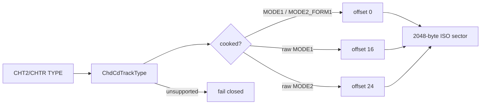

# 20260809-450 CHD cooked Mode 1 ISO9660 지원 설계 / CHD Cooked Mode 1 ISO9660 Support Design

## 한국어

### 문제와 확인 사실

`pumpito`의 `OBGSE.chd`는 CHT2 metadata가 `TYPE:MODE1`인 단일 data track입니다.
CHD unit은 2,448 bytes이지만 cooked Mode 1의 2,048-byte user data는 unit offset 0에
놓입니다. 원본 `OBGSE.iso`와 CHD 복원 unit 모두 상대 LBA 16 offset 0에서
`01 CD001 01` ISO9660 PVD를 갖습니다.

현재 `IsoTrackReader`는 track 형식을 보존하지 않고 sector byte 15만 검사하여 Mode 2이면
offset 24, 아니면 offset 16을 사용합니다. 이 휴리스틱은 `MODE1_RAW`과 `MODE2_RAW`에는
맞지만 cooked `MODE1`에서는 PVD보다 16 bytes 뒤를 읽어 mount를 거부합니다.

### 설계

`ChdCdTrack`에 CHT2/CHTR `TYPE`을 구조화한 `ChdCdTrackType`을 추가합니다. metadata 문자열은
진단용으로 계속 보존하고, ISO reader는 선택한 data track의 enum을 다음처럼 해석합니다.

| CHD track type | ISO user-data offset | 정책 |
|---|---:|---|
| `MODE1` | 0 | 지원 |
| `MODE1_RAW` | 16 | 지원 |
| `MODE2_FORM1` | 0 | 지원 |
| `MODE2_RAW` | 24 | 지원 |
| 그 밖의 data 형식 | 해당 없음 | 명시적 오류로 fail-closed |

byte 15 휴리스틱은 제거합니다. 형식 결정은 CHD metadata라는 권위 있는 container 정보에서
한 번만 수행하며, `ChdCdImage`의 기존 logical-to-physical LBA와 track padding 처리는
변경하지 않습니다. 게임 ID 분기나 실행 파일 패치는 추가하지 않습니다.

### 검증

1. Win32 x86 Debug 전체 빌드와 probe를 통과합니다.
2. `pumpito` analyzer가 cooked `MODE1` CHD를 mount하고 `PIU/PIU.EXE` 분석을 완료해야 합니다.
3. 기존 `MODE2_RAW` 자산인 `pumpit1`, `pumpit2`, `pumpit3`, `pumpite` analyzer가 모두
   성공해야 합니다.
4. 확인된 `pumpito` track, extent bias, 실행 파일 identity를 분석 문서에 기록합니다.

## English

### Problem and Confirmed Facts

`pumpito`'s `OBGSE.chd` has one data track whose CHT2 metadata says `TYPE:MODE1`. Each CHD unit
is 2,448 bytes, but the 2,048-byte cooked Mode 1 user data begins at unit offset 0. Both the source
`OBGSE.iso` and the restored CHD unit contain the `01 CD001 01` ISO9660 PVD at relative LBA 16,
offset 0.

The current `IsoTrackReader` discards the track type and inspects byte 15, using offset 24 for
Mode 2 and offset 16 otherwise. That heuristic works for `MODE1_RAW` and `MODE2_RAW`, but reads
16 bytes past the PVD for cooked `MODE1` and rejects the mount.

### Design

Add a structured `ChdCdTrackType` parsed from the CHT2/CHTR `TYPE` to `ChdCdTrack`, while retaining
the raw metadata string for diagnostics. The ISO reader maps `MODE1` and `MODE2_FORM1` to offset 0,
`MODE1_RAW` to offset 16, and `MODE2_RAW` to offset 24. Other data formats fail closed with an
explicit unsupported-format error.

Remove the byte-15 heuristic. Resolve layout once from authoritative CHD container metadata and
leave the existing logical-to-physical LBA and track-padding handling unchanged. Add no game-ID
branch and patch no original executable.

### Verification

1. Pass the complete Win32 x86 Debug build and probes.
2. Make the `pumpito` analyzer mount the cooked `MODE1` CHD and complete `PIU/PIU.EXE` analysis.
3. Keep analyzers passing for existing `MODE2_RAW` assets `pumpit1`, `pumpit2`, `pumpit3`, and
   `pumpite`.
4. Record the confirmed `pumpito` track, extent bias, and executable identity in analysis docs.
