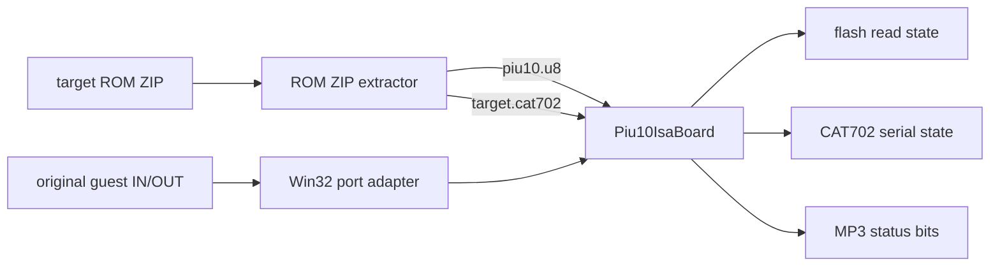

# 20260809-451 PIU10 ISA 보드 HLE 설계 / PIU10 ISA Board HLE Design

## 한국어

### 문제와 확인된 계약

`pumpito`는 CHD mount, DOS VFS, `PIU/PIU.EXE` 적재를 완료한 뒤 guest EIP
`0x0402106D`의 `IN AX,DX`에서 중단됩니다. 이때 DX는 `0x02DA`이며 기존 HLE는
PIU I/O·YMZ280B 보드의 `0x02A0..0x02AF`만 처리합니다.

원본 실행 파일과 MAME의 BSD-3-Clause `isa16_piu10` 구현을 대조하여 다음 계약을
확인했습니다.

- `0x02D0..0x02D6`은 20-bit 주소와 12-bit 목적지를 구성합니다.
- `0x02DA`는 목적지에 따라 flash, CAT702/DAC 직렬선, MP3 decoder 상태를 전달합니다.
- `0x02DC` bit 3은 flash 주소 자동 증가를 허용합니다.
- 목적지 `0x008` 읽기는 CAT702 응답 bit 5, MPEG frame sync bit 2, 송신 준비 bit 1,
  decoder demand bit 0을 반환합니다.
- 목적지 `0x010` 쓰기는 CAT702 data/clock/select를 각각 bit 5/4/3으로 전달합니다.
- `pumpito.zip`은 `piu10.u8`과 타깃별 `pumpito.cat702` 8-byte transform을 포함합니다.

### 구조

플랫폼과 독립적인 `Piu10IsaBoard`를 `src/hle/`에 둡니다. 장치는 ZIP 파일을 직접
알지 않으며 flash image와 CAT702 transform byte 배열만 입력받습니다. Win32 실행
준비 계층이 기존 ROM ZIP extractor로 자산을 읽고 장치를 초기화합니다. Win32 port
adapter는 `0x02D0..0x02DF`의 16-bit 접근만 전달하고 EAX 갱신, EIP 진행, 진단 기록만
담당합니다.

CAT702은 PIU 변형의 select·rising-clock 상태 전이와 8-byte linear transform을 그대로
모델링합니다. MP3 decoder 자체는 이번 범위에서 재구현하지 않으며, 장치 reset 상태인
frame-sync=1, send-ready=1, demand=1을 반환합니다. 이 값은 데이터 송신 루프가 진행될
수 있는 최소 하드웨어 상태이고 보안 bit는 실제 CAT702 모델에서 생성됩니다.

Flash는 `piu10.u8`을 little-endian 16-bit word 배열로 읽습니다. 주소 범위를 벗어난
읽기는 `0xFFFF`를 반환합니다. Flash program/erase command는 게임 부팅에 필요하다는
증거가 없으므로 ROM 보존 원칙에 따라 쓰기를 변경 없이 수용하되 image를 수정하지
않습니다.

자산이 없거나 크기가 틀리면 PIU10 보드는 unavailable 상태로 남습니다. 기존 YMZ sound
경로처럼 게임 실행 자체를 setup 단계에서 강제 실패시키지는 않지만, 해당 port 접근은
명시적인 unsupported 진단으로 중단하여 잘못된 보안 응답으로 진행하지 않습니다.

### 검증

1. CAT702 known transform으로 select/clock/data 시퀀스와 응답 bit를 단위 probe에서 검증합니다.
2. PIU10 주소·목적지 조립, MP3 상태, flash 자동 증가를 단위 probe에서 검증합니다.
3. Win32 x86 Debug 전체 빌드와 probe를 통과시킵니다.
4. `pumpito`를 실행하여 기존 `0x0402106D` blocker가 사라지고 다음 실행 상태를 로그로 확인합니다.

### Task 452 범위 보정

Task 452에서 이 초기화와 port 가로채기를 기본값이 false인
`TargetProfile::enable_piu10_isa_board` capability 뒤로 제한했습니다. 이 capability는
`pumpito`, `pumpitc`, `pumpitpc`, `pumpite`에만 활성화되며 `pumpit1`, `pumpit2`,
`pumpit3`은 기존 port 경로를 유지합니다. YMZ280B sample ROM 초기화는 이 capability와
독립적으로 유지됩니다.

## English

### Problem and Confirmed Contract

`pumpito` completes the CHD mount, DOS VFS setup, and `PIU/PIU.EXE` load, then stops at guest
EIP `0x0402106D`, an `IN AX,DX` with DX `0x02DA`. The existing HLE only handles the PIU
I/O/YMZ280B board at `0x02A0..0x02AF`.

Comparison of the original executable with MAME's BSD-3-Clause `isa16_piu10` implementation
confirms this contract:

- `0x02D0..0x02D6` assemble a 20-bit address and 12-bit destination.
- `0x02DA` carries flash, CAT702/DAC serial lines, or MP3 decoder status by destination.
- Bit 3 of `0x02DC` enables flash address auto-increment.
- Destination `0x008` reads CAT702 response bit 5, MPEG frame-sync bit 2, send-ready bit 1,
  and decoder-demand bit 0.
- Destination `0x010` writes CAT702 data/clock/select on bits 5/4/3.
- `pumpito.zip` contains both `piu10.u8` and the target-specific eight-byte
  `pumpito.cat702` transform.

### Structure

Add a platform-neutral `Piu10IsaBoard` under `src/hle/`. The device does not know about ZIP
files; it receives flash-image and CAT702-transform byte arrays. Win32 execution setup loads
those assets with the existing ROM ZIP extractor. The Win32 port adapter forwards only
16-bit accesses in `0x02D0..0x02DF` and remains responsible for EAX updates, EIP advancement,
and diagnostics.

The CAT702 model preserves the PIU variant's select and rising-clock transitions and its
eight-byte linear transform. This task does not reimplement the MP3 decoder; it reports the
hardware reset-ready state frame-sync=1, send-ready=1, demand=1. The security bit is produced
by the real CAT702 state model.

Flash reads interpret `piu10.u8` as little-endian 16-bit words. Out-of-range reads return
`0xFFFF`. No evidence shows that boot requires flash programming or erase commands, so writes
are accepted without modifying the image, preserving the ROM.

Missing or malformed assets leave the PIU10 board unavailable. As with the existing YMZ sound
path, setup does not forcibly reject the run, but a PIU10 port access fails explicitly instead
of proceeding with a fabricated security response.

Task 452 narrows this setup and port interception behind the default-false
`TargetProfile::enable_piu10_isa_board` capability. It is enabled only for `pumpito`,
`pumpitc`, `pumpitpc`, and `pumpite`; `pumpit1`, `pumpit2`, and `pumpit3` retain their earlier
port path. YMZ280B sample-ROM setup remains independent of this capability.

### Verification

1. Verify CAT702 select/clock/data sequences and response bits with a known transform in a probe.
2. Verify PIU10 address/destination assembly, MP3 status, and flash auto-increment in a probe.
3. Pass the complete Win32 x86 Debug build and probes.
4. Run `pumpito`, confirm the old `0x0402106D` blocker is gone, and inspect the next runtime state.
