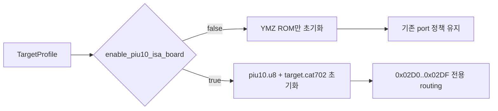

# 20260809-452 타깃 범위 PIU10 ISA 보드 설계 / Target-Scoped PIU10 ISA Board Design

## 한국어

### 문제

Task 451은 ROM ZIP 경로가 제공되면 PIU10 flash/CAT702 장치를 항상 초기화하고
`0x02D0..0x02DF`를 전용 장치 범위로 처리합니다. 그러나 `pumpit1`, `pumpit2`,
`pumpit3`에는 이 수정이 필요하지 않으며 ROM ZIP 경로는 별도 YMZ280B 음원에도
사용되므로 경로 유무만으로 PIU10 장치 사용 여부를 결정할 수 없습니다.

### 설계

`TargetProfile`에 `enable_piu10_isa_board` capability를 추가합니다. aggregate initializer의
기존 호환성을 위해 구조체 마지막에 기본값 `false`로 둡니다.

| 타깃 | PIU10 ISA `0x02D0..0x02DF` |
|---|---|
| `dos4gw_hello`, `piu_1st`, `pumpit1`, `pumpit2`, `pumpit3` | 비활성 |
| `pumpito`, `pumpitc`, `pumpitpc`, `pumpite` | 활성 |

플래그는 host orchestration에서 실행 trampoline로 전달하고 `ThreadContext`에 고정합니다.
실행 준비는 플래그가 true일 때만 `piu10.u8`과 `<target>.cat702`를 추출합니다. Port adapter도
플래그가 true일 때만 PIU10 전용 범위를 가로챕니다. YMZ280B `piu10.u9` 초기화는 기존처럼
모든 ROM-set 타깃에서 독립적으로 수행합니다.

### 검증

1. profile probe에서 앞의 세 CHD 타깃은 false, 뒤의 네 타깃은 true인지 확인합니다.
2. 전체 Win32 x86 Debug 빌드와 probe를 통과시킵니다.
3. `pumpit1` 실행에서 PIU10 ISA 자산 초기화 로그가 없고 기존 실행 경로를 유지하는지 확인합니다.
4. `pumpito` 실행에서 PIU10 ISA 초기화와 `0x02DA` 처리 성공을 유지하는지 확인합니다.

## English

### Problem

Task 451 initializes the PIU10 flash/CAT702 device whenever a ROM ZIP path is present and treats
`0x02D0..0x02DF` as its dedicated range. `pumpit1`, `pumpit2`, and `pumpit3` do not require this
change, while the same ROM ZIP path is independently needed for YMZ280B audio, so path presence
cannot identify PIU10 board usage.

### Design

Add an explicit `TargetProfile::enable_piu10_isa_board` capability. Place it last with a default
of `false` to preserve existing aggregate initializers. It is false for `dos4gw_hello`,
`piu_1st`, `pumpit1`, `pumpit2`, and `pumpit3`, and true only for `pumpito`, `pumpitc`,
`pumpitpc`, and `pumpite`.

Host orchestration passes the flag into the execution trampoline, which fixes it in
`ThreadContext`. Setup extracts `piu10.u8` and `<target>.cat702` only when enabled, and the port
adapter intercepts the PIU10 range only under the same flag. Independent YMZ280B `piu10.u9`
initialization remains available to every ROM-set target.

### Verification

1. Assert the three early CHD profiles are false and the four later profiles are true.
2. Pass the complete Win32 x86 Debug build and probes.
3. Confirm `pumpit1` does not initialize PIU10 ISA assets and keeps its existing execution path.
4. Confirm `pumpito` still initializes PIU10 ISA and handles `0x02DA`.
