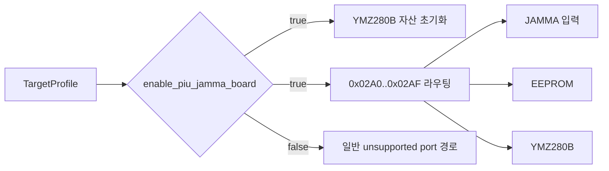

# 20260809-453 타깃 범위 JAMMA 보드 설계 / Target-Scoped JAMMA Board Design

## 한국어

### 문제

현재 Win32 port adapter는 target 구분 없이 `0x02A0..0x02AF`의 JAMMA 입력, EEPROM,
YMZ280B와 관찰 기반 write fallback을 처리합니다. 이 하드웨어 계약은 모든 DOS/4GW
실행 파일의 공통 기능이 아니며, 현재 등록된 target 중 id가 `pumpit`으로 시작하는
ROM-set profile에만 적용해야 합니다.

### 설계

`TargetProfile` 마지막에 기본값이 false인 `enable_piu_jamma_board` capability를
추가합니다. `pumpit1`, `pumpit2`, `pumpit3`, `pumpito`, `pumpitc`, `pumpitpc`,
`pumpite`에서만 true로 설정합니다. `dos4gw_hello`, `piu_1st`, direct executable은
기본 false를 유지합니다.

host는 capability를 실행 trampoline에 전달하고 `ThreadContext`에 고정합니다. YMZ280B
sample ROM 초기화와 `0x02A0..0x02AF`의 전용 read/write 처리는 capability가 true일
때만 수행합니다. PIU10 flash/CAT702 보드의 `enable_piu10_isa_board`는 별도 capability로
유지하여 후기 네 target만 활성화하는 기존 정책을 바꾸지 않습니다.

### 검증

1. profile probe에서 모든 `pumpit*` target은 JAMMA=true인지 확인합니다.
2. `dos4gw_hello`와 `piu_1st`는 JAMMA=false인지 확인합니다.
3. Win32 x86 Debug 전체 빌드와 AOT probe를 통과시킵니다.
4. 대표 target 실행 로그에서 `pumpit1`과 `pumpito`의 JAMMA capability가 true인지
   확인합니다.

## English

### Problem

The Win32 port adapter currently handles JAMMA input, EEPROM, YMZ280B, and the observed-write
fallback in `0x02A0..0x02AF` without regard to the selected target. This hardware contract is
not common to every DOS/4GW executable and currently applies only to registered ROM-set profiles
whose ids begin with `pumpit`.

### Design

Add a default-false `TargetProfile::enable_piu_jamma_board` capability at the end of the
structure. Enable it only for `pumpit1`, `pumpit2`, `pumpit3`, `pumpito`, `pumpitc`,
`pumpitpc`, and `pumpite`. `dos4gw_hello`, `piu_1st`, and direct executables retain the false
default.

The host carries the capability into the execution trampoline and fixes it in `ThreadContext`.
YMZ280B sample-ROM setup and dedicated reads and writes in `0x02A0..0x02AF` occur only when the
capability is true. The separate `enable_piu10_isa_board` capability remains unchanged, so only
the four later targets continue to enable the PIU10 flash/CAT702 board.

### Verification

1. Assert that every `pumpit*` target has JAMMA=true in the profile probe.
2. Assert that `dos4gw_hello` and `piu_1st` have JAMMA=false.
3. Pass the complete Win32 x86 Debug build and AOT probe.
4. Confirm JAMMA=true in representative `pumpit1` and `pumpito` execution logs.
