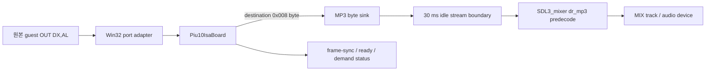

# 20260809-454 PIU10 MP3 SDL3_mixer HLE 설계 / PIU10 MP3 SDL3_mixer HLE Design

## 한국어

### 확인된 경계

`pumpito`는 `PIU/AUDIO/02.AUD`를 읽은 뒤 guest `OUT DX,AL`로 `0x02DA`에 첫 바이트를
전송합니다. 이 명령은 잘못된 폭의 접근이 아닙니다. MAME의 BSD-3-Clause
`xtom3d_piu10.cpp`에 따르면 목적지 `0x008`의 `0x02DA` write는 MAS3507D의 8-bit
PIO-DMA 입력 `sid_w`이며, 같은 목적지의 read bit 2/1/0은 MPEG frame sync, 송신 준비,
decoder demand입니다. 원본 `.AUD` 파일은 일반 MP3 헤더로 시작하지 않으므로 host 파일을
직접 재생하지 않고 원본 게임이 보드로 전송하는 변환 완료 바이트열을 받아야 합니다.

### 구조

플랫폼 공용 `hle::Piu10IsaBoard`는 8-bit `0x02DA` write를 정상 ISA 접근으로 처리하고,
목적지 `0x008`이면 설치된 MP3 byte sink에 값을 전달합니다. 주소·목적지 조립, flash,
CAT702, status bit는 계속 공용 모델이 소유합니다. Win32 port adapter는 8-bit write와
기존 16-bit access를 폭에 맞는 보드 API로 전달하며 원본 명령을 패치하지 않습니다.

Win32 전용 `Piu10Mp3AudioOut`은 SDL3_mixer 3.2.0 mixer와 track을 소유합니다. guest가
연속 전송한 바이트를 모으고 마지막 바이트 이후 30 ms 동안 새 데이터가 없으면 하나의
완성된 MP3 stream으로 확정합니다. worker가 `SDL_IOFromConstMem`과
`MIX_LoadAudio_IO(..., predecode=true, closeio=true)`로 데이터를 소유 PCM으로 decode한 뒤
track에서 재생합니다. 새 stream이 오면 기존 track input을 교체합니다. 원본 보드의 demand
상태는 현재 ready-high로 유지하여 guest가 전체 파일을 동기적으로 전송하게 하며, idle
경계는 이 전송 완료를 host에서 관찰하는 HLE 정책입니다.

SDL3_mixer는 `release-3.2.0`으로 고정하고 정적 library로 빌드합니다. MP3의 내장
`dr_mp3` backend만 켜며 LGPL `mpg123`과 다른 불필요한 codec은 끕니다. SDL3_mixer는
zlib license이고 포함된 `dr_mp3`는 public-domain 또는 MIT-0 선택을 제공하므로 프로젝트의
비전염성 license 정책을 만족합니다.

### 실패 정책과 범위

SDL3_mixer 또는 audio device 초기화가 실패해도 보드 register HLE는 계속 동작하고 MP3
바이트를 버려 guest 실행은 유지합니다. decode 실패는 stream 크기와 SDL 오류를 기록하지만
guest를 중단하지 않습니다. backend 초기화와 sink 연결은 기존
`enable_piu10_isa_board` capability 안에서만 수행하므로 `pumpito`, `pumpitc`, `pumpitpc`,
`pumpite`에만 적용되고 `pumpit1`, `pumpit2`, `pumpit3`에는 영향을 주지 않습니다.

### 검증

1. 공용 probe에서 목적지 `0x008`의 byte/word data write가 MP3 sink에 정확한 low byte를
   전달하고 다른 목적지는 전달하지 않는지 확인합니다.
2. Win32 x86 Debug 전체 빌드와 probe suite를 통과시킵니다.
3. `pumpito`를 실행하여 기존 `unsupported-piu10-width` 종료가 사라지고 MP3 stream 수신,
   decode, playback 로그가 나오는지 확인합니다.

## English

### Confirmed Boundary

After reading `PIU/AUDIO/02.AUD`, `pumpito` sends its first byte to `0x02DA` with guest
`OUT DX,AL`. This is not an invalid-width access. MAME's BSD-3-Clause
`xtom3d_piu10.cpp` maps a destination-`0x008` write at `0x02DA` to the MAS3507D eight-bit
PIO-DMA `sid_w` input; read bits 2/1/0 at the same destination report MPEG frame sync,
send-ready, and decoder demand. The source `.AUD` does not begin with a normal MP3 header, so
the host must consume the transformed byte stream emitted by the original game instead of
playing the host file directly.

### Structure

The platform-neutral `hle::Piu10IsaBoard` accepts eight-bit `0x02DA` writes as valid ISA
accesses and forwards destination-`0x008` values to an installed MP3 byte sink. It continues
to own address/destination assembly, flash, CAT702, and status bits. The Win32 port adapter
forwards eight-bit writes and existing sixteen-bit accesses to width-specific board APIs
without patching original instructions.

The Win32-only `Piu10Mp3AudioOut` owns an SDL3_mixer 3.2.0 mixer and track. It accumulates the
guest's contiguous transfer and closes one MP3 stream after 30 milliseconds without a new
byte. Its worker uses `SDL_IOFromConstMem` and
`MIX_LoadAudio_IO(..., predecode=true, closeio=true)` to decode into owned PCM before playing
the track. A new stream replaces the previous track input. The board's decoder-demand state
remains ready-high so the guest sends the complete file synchronously; the idle boundary is
the HLE policy that observes completion of that transfer.

The Mermaid flow above shows the preserved guest-to-hardware boundary and the host decoder.

SDL3_mixer is pinned to `release-3.2.0` and built statically. Only its built-in `dr_mp3`
backend is enabled; LGPL mpg123 and unrelated codecs are disabled. SDL3_mixer uses the zlib
license and bundled `dr_mp3` offers public-domain or MIT-0 terms, satisfying the project's
non-copyleft policy.

### Failure Policy and Scope

If SDL3_mixer or the audio device cannot initialize, register HLE continues and MP3 bytes are
dropped so guest execution remains available. Decode errors log stream size and SDL's error
without stopping the guest. Backend setup and sink attachment stay under the existing
`enable_piu10_isa_board` capability, so this applies only to `pumpito`, `pumpitc`, `pumpitpc`,
and `pumpite`, not `pumpit1`, `pumpit2`, or `pumpit3`.

### Verification

1. Extend the platform-neutral probe to verify that destination-`0x008` byte and word data
   writes deliver the low byte to the MP3 sink, while other destinations do not.
2. Pass the complete Win32 x86 Debug build and probe suite.
3. Run `pumpito` and confirm that `unsupported-piu10-width` is gone and MP3 stream receive,
   decode, and playback diagnostics appear.
