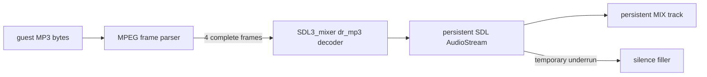

# 20260809-455 PIU10 증분 MP3 재생 설계 / PIU10 Incremental MP3 Playback Design

## 한국어

### 문제

Task 454 backend는 guest byte 전송이 30 ms 멈춘 뒤 해당 구간 전체를 predecode합니다.
원본 코드의 port I/O가 느리면 수만~수십만 byte 전송 시간이 재생 시작 지연으로 더해집니다.
실제 MAS3507D는 완성된 MPEG frame이 FIFO에 들어오는 동안 decode를 시작하므로 전체 stream
완료를 기다리는 동작은 맞지 않습니다.

SDL3_mixer 3.2.0의 `MIX_SetTrackIOStream`은 성장형 stream 해결책이 아닙니다. API contract가
전체 data에 대한 seek를 요구하고, `decoder_drmp3.c`의 audio 초기화도 frame count와 seek
table을 계산하기 위해 stream 전체를 먼저 읽습니다.

### 설계

`Piu10Mp3AudioOut` worker가 guest byte buffer에서 MPEG audio header를 검증하고 완성된 frame
길이를 계산합니다. MPEG version, layer, bitrate index, sample-rate index와 padding으로 frame
크기를 구하며 잘못된 prefix는 다음 sync까지 건너뜁니다. 최초 4개 완성 frame이 모이면 그
묶음을 `MIX_CreateAudioDecoder_IO`/`MIX_DecodeAudio`로 float PCM으로 decode합니다.

첫 decode 결과의 format으로 하나의 `SDL_AudioStream`을 만들고
`MIX_SetTrackAudioStream`으로 지속적인 track input에 연결합니다. 이후 frame 묶음의 PCM은
같은 stream 뒤에 순서대로 queue합니다. stream이 순간적으로 비면 get callback이 silence를
공급하여 track이 EOF로 정지하지 않도록 합니다. 따라서 track을 구간마다 교체하거나 곡을
처음부터 다시 decode하지 않습니다. Layer III bit reservoir 연속성을 위해 후속 decode
묶음에는 직전 2개 frame을 문맥으로 다시 넣고, 그 overlap에서 나온 PCM은 버립니다.

idle은 더 이상 재생 시작 경계가 아닙니다. 불완전한 마지막 frame은 다음 byte를 기다리고,
완성된 frame만 decoder에 전달합니다. 다른 sample rate/channel format이 중간에 나타나면
decoder 출력은 첫 stream format으로 변환하여 같은 playback queue를 유지합니다.

### 검증

1. MPEG header/frame-length parser를 알려진 MPEG-1 Layer III header로 probe합니다.
2. 전체 Win32 x86 Debug build와 기존 probe suite를 통과시킵니다.
3. pumpito runtime에서 수만 byte idle 구간보다 훨씬 작은 최초 frame batch에서 playback이
   시작되고 port I/O unhandled가 0인지 확인합니다.

## English

### Problem

The Task 454 backend predecodes a guest transfer only after it has been idle for 30 ms. When
original port I/O is slow, transfer time for tens or hundreds of thousands of bytes becomes
startup latency. Real MAS3507D hardware starts decoding complete MPEG frames as they enter its
FIFO, so waiting for the whole stream is incorrect.

SDL3_mixer 3.2.0 `MIX_SetTrackIOStream` is not a growing-stream solution. Its contract requires
seeking over the complete data, and `decoder_drmp3.c` initialization reads the whole stream to
calculate frame counts and a seek table.

### Design

The `Piu10Mp3AudioOut` worker validates MPEG audio headers in the guest byte buffer and computes
complete frame lengths from MPEG version, layer, bitrate index, sample-rate index, and padding.
Invalid prefixes are skipped until the next sync. As soon as four complete frames are available,
the batch is decoded to float PCM through `MIX_CreateAudioDecoder_IO`/`MIX_DecodeAudio`.

The first decoded format creates one `SDL_AudioStream`, attached as a persistent track input
through `MIX_SetTrackAudioStream`. PCM from later frame batches is queued in order to the same
stream. A get callback supplies silence during temporary underruns so the track does not treat an
empty queue as EOF. Tracks are therefore not replaced per segment and songs are not repeatedly
decoded from their beginning. To preserve Layer III bit-reservoir context, each later decode batch
prepends the previous two frames and discards the PCM produced by that overlap.

The Mermaid flow above shows the incremental path. Idle time is no longer a playback-start
boundary. An incomplete final frame waits for more bytes, and only complete frames reach the
decoder. If a later batch changes sample rate or channel format, decoder output is converted to
the first stream format and remains on the same playback queue.

### Verification

1. Probe MPEG header/frame-length parsing with a known MPEG-1 Layer III header.
2. Pass the complete Win32 x86 Debug build and existing probe suite.
3. In pumpito, confirm playback starts from a small initial frame batch instead of a large idle
   segment, with zero unhandled port I/O.
