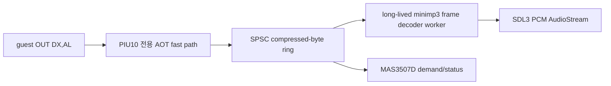

# 20260809-456 MAS3507D 지속형 MP3 HLE 설계 / Persistent MAS3507D MP3 HLE Design

> 후속 정정: 이 문서의 4 MiB ring과 ring 전체 기반 `DEMAND` 정책은
> [Task 457](20260809-457-mas3507d-fifo-backpressure.md)의 4 KiB 물리 ring,
> `0xE00` 논리 FIFO, 검증된 frame-tail block HLE로 대체되었습니다.
>
> Subsequent correction: [Task 457](20260809-457-mas3507d-fifo-backpressure.md) supersedes
> this document's 4 MiB ring and whole-ring `DEMAND` policy with a 4 KiB physical ring,
> a logical `0xE00` FIFO, and verified frame-tail block HLE.

## 한국어

### 상태와 목표

현재 `bf71997`의 SDL3_mixer 증분 batch 구현은 기계적으로 동작하지만 사용자 실기에서 음악이
심하게 끊기고 MP3 재생 중 게임 진행이 멈추어 사용 불가 판정을 받았습니다. 대체 구현은 원본
guest의 MAS3507D byte stream을 보존하면서 첫 MPEG frame부터 재생하고, 곡 전체에서 decoder
상태를 유지하며, guest 전송 loop가 실용적인 속도로 끝나게 해야 합니다. 적용 범위는 기존처럼
`pumpito`, `pumpitc`, `pumpitpc`, `pumpite`로 제한합니다.

### 선택한 구조

PIU10 MP3 경로에서 SDL3_mixer를 제거하고 upstream `minimp3`를 CC0-1.0 조건과 검증한 commit으로
고정합니다. 하나의 `mp3dec_t` instance를 재생 구간 전체에서 유지하고 decoder worker가 압축
byte SPSC ring에서 완성 MPEG frame을 꺼내 `mp3dec_decode_frame` push API로 decode합니다.
guest thread는 byte enqueue만 하며 기다리지 않습니다. S16 PCM은 SDL3 `SDL_AudioStream`으로
직접 출력합니다.

decoder 교체만으로는 충분하지 않습니다. 현재 guest는 MP3 한 byte마다 `OUT 0x02DA`를
실행하고 일반 port adapter, 계측과 동기화 비용을 냅니다. AOT port-I/O dispatch에서 PIU10이
활성화되고 destination이 `0x008`이며 명령이 `OUT DX,AL`이면 전용 fast path로 보내야 합니다.
이 경로는 일반 `CONTEXT` 해석과 매-byte `RecordPortIo`를 반복하지 않고 ring에 기록합니다.
진단은 원자적 누계와 주기적 snapshot으로 유지하며 원본 명령과 byte 순서는 바꾸지 않습니다.

현재 가장 큰 일반 `.AUD`가 약 2.6 MiB이므로 ring 초기 권장 크기는 4 MiB입니다. 여유가 있으면
`demand=1`, 가득 차면 `demand=0`으로 보고하여 원본 backpressure를 보존합니다.

### SDL3_mixer를 대체하는 이유

- `MIX_LoadAudio_IO(..., predecode=true)`는 구간 완료까지 기다립니다.
- `MIX_SetTrackIOStream`은 전체 data가 seek 가능해야 합니다.
- SDL3_mixer 3.2.0 `decoder_drmp3.c`는 초기화 중 frame count와 seek table을 위해 전체 입력을
  scan합니다.
- 4-frame batch마다 decoder를 여는 Task 455 방식은 재초기화와 PCM underrun/silence 때문에
  실기에서 끊겼습니다.

`minimp3`의 frame-push API는 완성되지 않은 성장형 stream에 seek나 전체 길이 scan을 요구하지
않습니다. 하나의 `mp3dec_t`가 계속 decode하므로 decoder 상태와 Layer III bit reservoir가
자연스럽게 유지됩니다. 최초 sync는 첫 header만 신뢰하지 않고 뒤따르는 호환 frame header를
확인한 뒤 확정합니다.

MAME의 PIU10/MAS3507D 구현은 하드웨어 계약과 처리 순서를 확인하는 참고 자료로만 사용합니다.
MAME 코드는 복사하거나 이식하지 않습니다. rePIU 구현은 upstream `minimp3` 공개 API와 MAS3507D
datasheet, 관찰된 guest I/O를 근거로 독립 작성합니다.

### 책임과 라이선스

- `hle::Piu10IsaBoard`: destination, flash, CAT702, MAS status와 byte sink 계약
- 신규 공용 SPSC ring: 압축 byte 순서와 backpressure
- Win32 `Piu10Mp3AudioOut`: persistent `minimp3` decoder worker와 SDL3 PCM output
- AOT/Win32 fast path: guest byte를 ring producer에 전달
- 일반 port adapter: 설정 register, status read와 나머지 접근

`minimp3`는 CC0-1.0이며 BSD-3-Clause 프로젝트와 호환됩니다. 원본 header 고지와 CC0 전문을
보존하고 `THIRD_PARTY_NOTICES.md`에 출처와 고정 commit을 기록합니다. SDL3_mixer는 다른 사용처가
없음을 확인한 뒤 FetchContent, link, notice에서 제거합니다. SDL3는 PCM backend로 유지합니다.
MAME의 BSD-3-Clause wrapper는 도입하지 않습니다. mpg123, FFmpeg/libavcodec, libmad는
license/의존성 정책상 제외합니다.

### 수용 기준

- 첫 재생이 guest 4 KiB 이내 또는 첫 유효 MPEG frame group에서 시작합니다.
- MP3 전송 중 화면, 입력과 게임 진행이 계속됩니다.
- 60초 청취에서 주기적인 batch 경계 끊김이 없습니다.
- port unhandled=0이고 fast-path byte count가 수신 byte와 일치합니다.
- `pumpit1`, `pumpit2`, `pumpit3`에는 backend와 fast path가 활성화되지 않습니다.
- 전체 Win32 x86 Debug build와 probe가 통과합니다.

## English

### Status and Goal

The SDL3_mixer incremental batch implementation at `bf71997` is mechanically functional, but user
hardware testing rejected it because music stutters severely and game progress stops during MP3
playback. The replacement must preserve the original MAS3507D byte stream, start from the first
MPEG frames, retain decoder state for the whole stream, and let the guest transfer loop finish at
practical speed. Scope remains limited to `pumpito`, `pumpitc`, `pumpitpc`, and `pumpite`.

### Selected Structure

Remove SDL3_mixer from the PIU10 MP3 path and pin upstream `minimp3` under CC0-1.0 at a verified
commit. Keep one `mp3dec_t` alive for the playback segment. A decoder worker consumes complete
MPEG frames from a compressed-byte SPSC ring through the `mp3dec_decode_frame` push API, while the
guest thread only enqueues bytes. Send S16 PCM directly to an SDL3 `SDL_AudioStream`.

Changing decoders is insufficient. The guest executes one `OUT 0x02DA` per compressed byte through
generic adaptation, telemetry, and synchronization. When PIU10 is active, destination is `0x008`,
and the instruction is `OUT DX,AL`, AOT port-I/O dispatch must use a dedicated ring-write fast path.
Keep diagnostics as atomic totals and periodic snapshots without changing original instruction or
byte order.

Start with a 4 MiB ring because the largest current normal `.AUD` is about 2.6 MiB. Report
`demand=1` while space remains and `demand=0` when full, preserving original backpressure.

### Why Replace SDL3_mixer

Predecode waits for segment completion; `MIX_SetTrackIOStream` requires complete seekable data;
SDL3_mixer 3.2.0 scans the whole input for frame counts and a seek table; and Task 455's repeated
four-frame decoder construction caused reinitialization, PCM underruns, and audible silence.
The `minimp3` frame-push API accepts an incomplete growing stream without seeking or a complete
length. One persistent instance naturally retains decoder and Layer III reservoir state. Confirm
the initial sync with following compatible frame headers before accepting the stream.

Use MAME's PIU10/MAS3507D implementation only to verify the hardware contract and processing order.
Do not copy or port MAME code; implement independently from upstream `minimp3` APIs, the MAS3507D
datasheet, and observed guest I/O.

Responsibilities, licensing decisions, and the acceptance criteria are identical to the Korean
section above. Keep SDL3 for PCM output, select upstream `minimp3` under CC0-1.0, preserve its notice
and license, remove SDL3_mixer after confirming no other consumer, and do not add MAME wrapper code
or copyleft/heavy alternatives.
