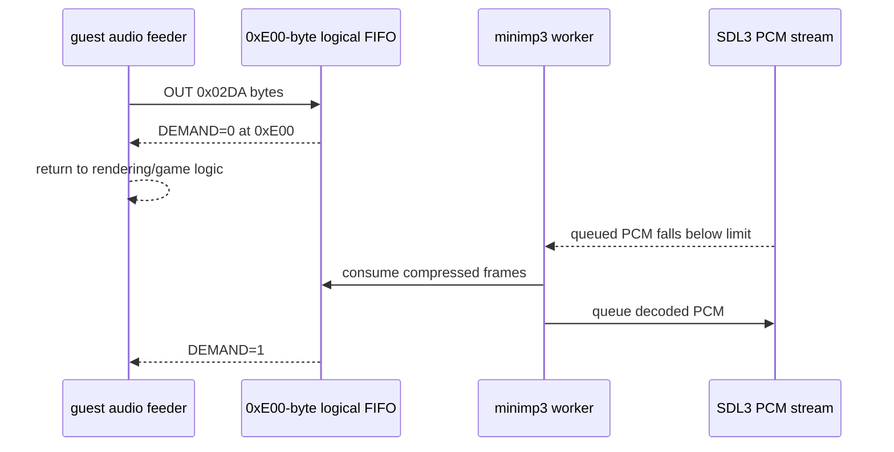

# 20260809-457 MAS3507D FIFO backpressure 설계 / MAS3507D FIFO Backpressure Design

## 한국어

### 문제

Task 456은 MP3 decode와 PCM 출력을 worker thread로 분리했지만, 압축 입력 ring을 4 MiB로
두고 ring 전체가 찰 때까지 `DEMAND=1`을 반환했습니다. `pumpito` 실행 로그에서는 재생이
1,257 guest byte에서 시작한 뒤 guest가 `0x0402084B` 주변 공급·상태 loop에 오래 머물렀습니다.
따라서 오디오는 별도 thread에서 재생되어도 원본 실행 thread가 곡 데이터를 계속 전송하여
화면과 게임 logic으로 돌아가지 못합니다.

4 MiB ring은 host의 편의용 곡 저장소처럼 동작하며 MAS3507D의 작은 입력 FIFO를 재현하지
못합니다. 다만 추가 runtime 분석에서 이전 251초 실행의 ring high-water가 108바이트에
불과하고, 2,282,730바이트 전송에 210회 starvation이 있었음이 확인되었습니다. 따라서 작은
FIFO 복원은 상태 계약 수정이지만, 현재 정지와 끊김의 직접 원인은 producer가 decoder보다
느린 매-byte privileged-instruction 예외 경로입니다.

### 수정 설계

MAME의 MAS3507D 구현에서 확인한 `0xE00` byte 압축 입력 buffer 크기는 하드웨어 계약을
확인하는 참고값으로만 사용합니다. rePIU 코드는 독립적으로 작성하며 MAME 코드를 복사하거나
이식하지 않습니다.

SPSC ring의 물리 용량은 power-of-two 제약과 producer/consumer 경합 여유를 위해 4 KiB로
줄이고, `DEMAND`는 ring에 `0xE00` byte 미만이 있을 때만 1로 반환합니다. decoder worker는
PCM을 약 250 ms 앞서 queue한 동안 압축 ring을 더 비우지 않습니다. ring이 `0xE00`에
도달하면 guest 공급 loop는 `DEMAND=0`을 보고 빠져나가며, SDL이 PCM을 소비한 뒤 worker가
다음 frame을 decode해 공간을 만들면 다음 공급 기회에서 다시 전송합니다.

`WriteByte`는 guest thread에서 decode, sleep 또는 mutex 대기를 하지 않습니다. 물리 ring의
추가 512 byte는 상태 read와 write 사이의 race를 흡수하는 headroom일 뿐이며 정상 guest는
논리 한계 전에 `DEMAND=0`을 관찰합니다. 상태 read bit 2의 frame-sync와 bit 1의 send-ready
계약은 유지합니다.

### 원본 frame 공급 loop의 block HLE

`pumpito` 원본 코드의 `OUT DX,AL` at image offset `0x212FD`를 분석한 결과, 한 MPEG frame의
각 byte마다 다음 순서를 반복합니다.

1. source cursor와 frame byte count를 증가시킵니다.
2. `OUT 0x02DA,AL`로 한 byte를 전송합니다.
3. 전송 count가 현재 MPEG frame 길이에 도달했는지 비교합니다.
4. 남았으면 status/demand loop로 돌아갑니다.

일반 arena fast path도 `OUT`마다 CPU exception 한 번을 이미 발생시킨 뒤 처리하므로 이름과
달리 byte stream에는 충분히 빠르지 않습니다. 이 정확한 loop signature가 확인된 경우에만
현재 byte 이후의 frame tail을 guest memory에서 bounded span으로 읽어 SPSC ring에 한 번에
복사합니다. source cursor, frame byte count와 `ECX`를 원본 loop가 byte별로 실행했을 결과와
동일하게 갱신하고, EIP는 현재 `OUT` 다음에 둡니다. 그러면 원본의 frame 경계·상태 처리와
호출/복귀 logic은 그대로 실행되면서 예외 횟수만 frame당 약 417회에서 1회로 줄어듭니다.

signature, relocated pointer, count 범위, guest-readable span 또는 FIFO 여유 중 하나라도
검증되지 않으면 한 byte 경로로 fail closed 합니다. 이 최적화는 `pumpito`에서 확인된 원본
loop에만 적용하며, 다른 PIU10 실행 파일은 별도 signature 검증 없이는 자동 적용하지 않습니다.

### 검증 기준

- PIU10 probe가 초기 `DEMAND=1`, `0xE00` byte에서 `DEMAND=0`, 소비 후 `DEMAND=1` 복귀를
  검증해야 합니다.
- Win32 x86 Debug의 `repiu`와 `repiu_aot_probe`가 빌드되어야 합니다.
- `pumpito` 로그에서 ring high-water가 논리 FIFO 부근에 도달하고 byte drop과 처리되지 않은
  port I/O가 없어야 합니다.
- 실제 실행에서 음악 재생 중 화면, 입력과 장면 전환이 함께 진행되어야 합니다.
- block HLE byte 합계가 0보다 크고, byte drop 없이 frame당 guest exception 수가 크게
  줄어야 합니다.

## English

### Problem

Task 456 moved MP3 decoding and PCM output to a worker, but kept a 4 MiB compressed ring and
reported `DEMAND=1` until that entire ring filled. In the `pumpito` runtime log, playback starts
after 1,257 guest bytes and the guest then remains in the feeder/status loop around `0x0402084B`.
The audio is asynchronous, but the original execution thread keeps transferring the song instead
of returning to rendering and game logic.

The 4 MiB ring behaves like a host-side song store rather than the MAS3507D's small input FIFO.
Additional runtime evidence, however, shows a ring high-water of only 108 bytes while transferring
2,282,730 bytes over 251 seconds, with 210 starvation events. Restoring the small FIFO corrects the
status contract, but the direct cause of stutter and guest-thread occupancy is the per-byte
privileged-instruction exception path running slower than the decoder.

### Corrected Design

Use the `0xE00`-byte compressed buffer observed in MAME's MAS3507D implementation only as a
hardware-contract reference. The rePIU implementation remains independent and incorporates no
MAME code.

Reduce the physical SPSC ring to 4 KiB for its power-of-two constraint and race headroom, while
reporting `DEMAND=1` only below a logical `0xE00`-byte fill level. The decoder worker stops draining
compressed data while approximately 250 ms of PCM is already queued. Once the ring reaches
`0xE00`, the guest sees `DEMAND=0` and returns from its feeder loop. After SDL consumes PCM, the
worker decodes more frames, frees FIFO space, and lets a later feeder opportunity resume transfer.

`WriteByte` must remain non-blocking and perform no decoding, sleeping, or mutex wait on the guest
thread. The extra 512 physical bytes only absorb the status-read/write race. Keep the existing
frame-sync and send-ready status-bit contracts.

### Block HLE for the Original Frame Feeder

Analysis of the original `pumpito` `OUT DX,AL` at image offset `0x212FD` confirms a byte loop that
increments the source cursor and frame count, writes one byte, compares against the current MPEG
frame length, and returns to the status/demand loop while bytes remain. The arena fast path still
handles one CPU exception per byte and is therefore insufficient for this stream.

Only when that exact loop signature is verified, copy the remaining current-frame tail from guest
memory into the SPSC ring as one bounded span. Update the source cursor, frame count, and `ECX` to
the state produced by the skipped byte iterations, while leaving EIP immediately after the current
`OUT`. Original frame-boundary processing and call/return logic then remain authoritative, but the
exception count falls from approximately 417 per frame to one. Fail closed to the byte path on any
signature, relocation, range, readability, or FIFO-space mismatch. Do not automatically enable
this pumpito-confirmed signature for another PIU10 executable.

### Verification

- Extend the PIU10 probe to check initial demand, deassertion at `0xE00` bytes, and reassertion after
  consumption.
- Build Win32 x86 Debug `repiu` and `repiu_aot_probe`.
- Confirm a `pumpito` run reaches the logical FIFO high-water region without dropped bytes or
  unhandled port I/O.
- User validation must confirm rendering, input, and scene transitions continue during music.
- Confirm a nonzero block-HLE byte total, no dropped bytes, and a large reduction in guest
  exceptions per frame.
