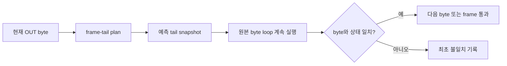

# 20260809-459 pumpito MP3 stream 감사 설계 / Pumpito MP3 Stream Audit Design

## 한국어

### 문제

Task 458의 일괄 경로 실행은 321,140 byte를 받았지만 MPEG frame을 138개만 decode했습니다.
정상 byte 경로의 약 417~418 byte/frame과 달리 약 2,327 byte/frame이므로, 일괄 전송이
활성화되어도 압축 stream 대부분이 frame parser에서 폐기됩니다. 청감상 첫 음악도 정상적으로
재생되지 않았습니다.

### 감사 설계

환경변수 `REPIU_PIU10_MP3_BATCH_AUDIT=1`일 때 일괄 enqueue와 guest 상태 commit을 하지
않습니다. 대신 일괄 계획이 제시한 현재 frame tail을 최대 2,048 byte의 고정 context buffer에
snapshot하고 원본 byte loop를 계속 실행합니다. 이후 같은 `OUT DX,AL`마다 실제 `AL`, source
cursor, frame count와 `ECX`를 snapshot에서 예측한 값과 비교합니다.

이 방식은 서로 다른 두 실행을 비교하지 않으므로 입력·timing 차이를 제거합니다. 최초
불일치에는 frame 번호, tail offset, 예상/실제 byte와 상태를 한 번 기록합니다. frame 전체가
일치하면 통과 수를 누적하고 최초 1개 및 매 100개마다 진행을 기록합니다. 감사 모드는
`pumpito`의 기존 exact signature gate 안에서만 동작하며 기본 실행에는 비용이나 상태 변경을
추가하지 않습니다.

### 후속 분기

- 원본 loop와 예측이 불일치하면 source/state 모델 또는 건너뛴 control boundary를 교정합니다.
- 예측이 100 frame 이상 일치하면 producer stream과 ring consumer stream의 bounded in-memory
  capture를 비교하여 SPSC span 순서를 검사합니다.
- 교정 후 decode 비율이 정상적인 약 417~418 byte/frame으로 돌아오는지 제한 실행으로
  검증합니다.

### 확인된 제어 경계와 교정

실제 감사에서 byte, source cursor와 frame count는 일치했지만 source cursor `0x76C` 이후
약 100 byte마다 예상 `ECX=100`과 실제 `ECX=0`이 처음 달랐습니다. 원본 loop가 이 지점에서
보조 처리를 호출하고 반환한 뒤 `ECX`를 초기화하므로, frame 끝까지 건너뛰는 기존 batch는
관측 가능한 guest 제어 흐름을 생략했습니다. 교정된 batch는 cursor와 `ECX` 양쪽 조건이
처음 동시에 성립하는 byte까지만 계획하고, 그 직후 원본 비교·분기가 경계를 처리하게 합니다.

## English

### Problem

The Task 458 batch-path run received 321,140 bytes but decoded only 138 MPEG frames. That is about
2,327 bytes per frame rather than the byte path's normal 417–418, showing that the parser discarded
most of the compressed stream even though batching was active. The first track also sounded wrong.

### Audit Design

With `REPIU_PIU10_MP3_BATCH_AUDIT=1`, do not enqueue a batch or commit guest state. Snapshot the
planned current-frame tail into a fixed 2,048-byte context buffer and continue executing the
original byte loop. At each subsequent matching `OUT DX,AL`, compare the actual `AL`, source
cursor, frame count, and `ECX` with values predicted from the snapshot.

This avoids timing and input differences between separate runs. Log the first mismatch once with
the frame number, tail offset, expected and actual byte, and state. Accumulate complete matching
frames and report the first and every 100th pass. Audit mode remains inside the exact `pumpito`
signature gate and adds no cost or state change to default execution.

### Follow-up Branches

- If prediction differs from the original loop, correct the source/state model or skipped control
  boundary.
- If at least 100 frames match, compare bounded in-memory captures before producer enqueue and
  after ring consumption to test SPSC span ordering.
- After correction, verify that bounded-runtime decode density returns to the normal 417–418 bytes
  per frame.

### Confirmed Control Boundary and Correction

The live audit matched every byte, source cursor, and frame count, but after source cursor `0x76C`
the first difference recurred roughly every 100 bytes: predicted `ECX=100` versus actual `ECX=0`.
The original loop invokes auxiliary processing and returns at that point, after which `ECX` is reset.
The old full-frame batch skipped this observable guest control flow. The corrected batch stops at the
first byte where both cursor and `ECX` conditions become true, leaving the following original compare
and branch to process the boundary.
