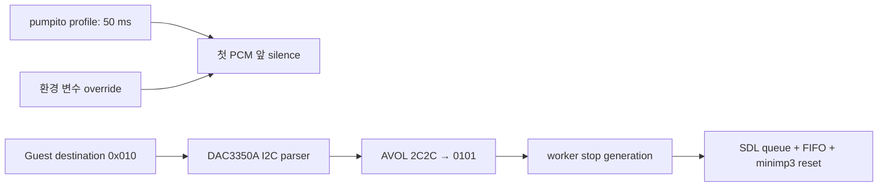

# 20260809-461 pumpito MP3 지연 보정과 stop 설계 / Pumpito MP3 Latency Compensation and Stop Design

> **정정 / Correction:** Task 462 gameplay 검증에서 AVOL 저음량 전이가 곡 종료가 아닌 출력 gain 명령으로 확인되었습니다. 이 문서의 stop 설계는 폐기되었으며 [Task 462 설계](20260809-462-pumpito-dac-output-gain.md)로 대체되었습니다. / Task 462 gameplay evidence showed that low AVOL is an output-gain command, not song end. The stop design below is superseded by the [Task 462 design](20260809-462-pumpito-dac-output-gain.md).

## 한국어

### 문제와 범위

`pumpito`에서 MP3가 노트보다 약 50 ms 먼저 들립니다. 또한 기존 MP3 backend에는 게임 실행 중 압축 입력과 출력 PCM을 함께 폐기하는 stop 경로가 없습니다. 이번 작업은 시작 지연을 가변값으로 보정하고 실제 guest DAC 제어에서 확인한 곡 종료 신호를 stop에 연결합니다. pause는 구현하지 않습니다.

### 설계

`TargetProfile`에 PIU10 MP3 시작 지연을 두고 `pumpito`의 기본값만 50 ms로 설정합니다. `REPIU_PIU10_MP3_LATENCY_MS`가 있으면 0~500 ms 범위에서 실행별로 덮어씁니다. 첫 decode PCM 전에 sample rate와 channel 수로 계산한 무음을 한 번 삽입하며 원본 압축 stream과 게임 timer는 변경하지 않습니다. stop 뒤의 다음 stream에도 같은 지연을 다시 적용합니다.

플랫폼 공용 `Dac3350aControl`은 PIU10 목적지 `0x010`의 SDA/SCL 선에서 I²C transaction을 복원합니다. 실제 `pumpito` 실행에서 초기 `AVOL=0x0101`이 반복된 뒤 재생 구간에 `0x2C2C`, 곡 종료에서 다시 `0x0101`이 관측되었습니다. 따라서 `pumpito`에서만 양쪽 channel이 1 이하로 내려가는 가청→저음량 전이를 stop으로 처리합니다. 다른 PIU10 프로파일에는 이 미검증 정책을 적용하지 않습니다.

stop은 guest thread가 generation을 발행하고 MP3 worker가 소유한 상태에서 SDL PCM queue, 압축 ring, encoded buffer, MPEG sync, minimp3 상태와 frame-sync offset을 함께 초기화합니다. 장치는 계속 열어 두며 이후 byte에서 새 MPEG stream을 다시 찾습니다.

### 검증 전략

- 합성 I²C transaction으로 DAC3350A parser와 AVOL 해석을 검사합니다.
- 44.1 kHz stereo S16에서 50 ms가 8,820 byte 무음인지 검사합니다.
- Win32 Debug build와 PIU10 probe를 실행합니다.
- 실제 `pumpito`에서 가청→저음량 전이가 한 번만 stop을 발생시키고 다음 stream이 다시 시작되는지 로그로 확인합니다.
- 최종 음악/노트 체감 sync와 잔향 부재는 사용자 환경에서 확인합니다.

참고: [MAME PIU10 board](https://github.com/mamedev/mame/blob/master/src/mame/misc/xtom3d_piu10.cpp), [MAME DAC3350A](https://github.com/mamedev/mame/blob/master/src/devices/sound/dac3350a.cpp).

## English

### Problem and scope

In `pumpito`, MP3 audio is heard roughly 50 ms ahead of the notes. The existing backend also has no in-game stop path that discards compressed input and queued PCM together. This task adds variable startup compensation and maps a confirmed guest DAC song boundary to stop. Pause is not implemented.

### Design

Add PIU10 MP3 startup latency to `TargetProfile`, with a 50 ms default only for `pumpito`. `REPIU_PIU10_MP3_LATENCY_MS` overrides it per run in the 0–500 ms range. Insert silence calculated from the decoded sample rate and channel count once before the first PCM without changing the compressed stream or game timer. Reapply it after stop.

The platform-neutral `Dac3350aControl` reconstructs I2C transactions from the SDA/SCL lines at PIU10 destination `0x010`. A live `pumpito` run showed repeated initial `AVOL=0x0101`, `0x2C2C` during playback, and `0x0101` again at song end. Therefore, only `pumpito` maps an audible-to-low-volume transition, with both channels at most 1, to stop. Other PIU10 profiles do not inherit this unverified policy.

The guest thread publishes a stop generation. The MP3 worker atomically clears its SDL PCM queue, compressed ring, encoded buffer, MPEG sync, minimp3 state, and frame-sync offsets. The device remains open and searches for a new MPEG stream in later bytes.

### Verification strategy

- Test DAC3350A AVOL parsing with a synthetic I2C transaction.
- Verify that 50 ms at 44.1 kHz stereo S16 produces 8,820 silence bytes.
- Run the Win32 Debug build and PIU10 probe.
- In a live `pumpito` run, confirm one stop at the audible-to-low-volume transition and successful acquisition of the next stream.
- Leave subjective music/note alignment and residual-audio validation to the user's environment.

References: [MAME PIU10 board](https://github.com/mamedev/mame/blob/master/src/mame/misc/xtom3d_piu10.cpp), [MAME DAC3350A](https://github.com/mamedev/mame/blob/master/src/devices/sound/dac3350a.cpp).
