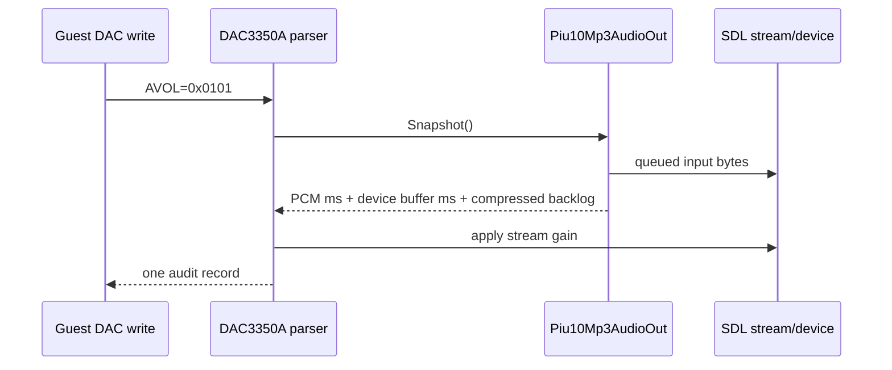

# 20260809-463 PIU10 DAC audio backlog 감사 설계 / PIU10 DAC Audio Backlog Audit Design

## 한국어

### 문제

최신 `pumpito` 실행은 음악이 끝나기 전에 DAC3350A `AVOL=0x0101`이 적용되어 출력 gain이
거의 0으로 내려간 사실을 보여 줍니다. 그러나 기존 로그는 그 순간 SDL PCM queue와
minimp3 입력에 재생할 데이터가 얼마나 남아 있었는지 기록하지 않습니다. 따라서 guest가
의도한 DAC 시각과 HLE의 실제 출력 위치가 어긋났는지, 아니면 HLE가 DAC transaction을
잘못 분류했는지 구분할 수 없습니다.

### 설계

`Piu10Mp3AudioOut`에 관측 전용 `Piu10Mp3AudioSnapshot`을 추가합니다. snapshot은 다음 값을
한 시점에 수집합니다.

- `SDL_GetAudioStreamQueued()`가 반환하는 미소비 PCM 입력 byte
- 현재 PCM 입력 sample rate와 channel 수로 환산한 대기 시간
- 현재 audio device callback buffer의 frame 수와 환산 시간
- SPSC compressed ring에 남은 byte
- worker가 ring에서 꺼냈지만 아직 decode하지 않은 `encoded` byte
- 지금까지 수신·decode한 byte/frame 계수와 frame-sync 상태

기존 `REPIU_PIU10_DAC_AUDIT=1`일 때 DAC transaction과 같은 로그 줄에 snapshot을
기록합니다. 계측은 queue를 비우거나 decoder, gain, DEMAND, frame-sync를 변경하지 않습니다.
`SDL_GetAudioStreamQueued()`는 SDL stream에 넣은 입력 byte를 반환하므로, 현재 구현의
S16 입력에 대해 `bytes * 1000 / (sample_rate * channels * 2)`로 밀리초를 계산합니다.
서로 다른 PCM 형식의 데이터가 동시에 queue에 남아 있으면 SDL이 하나의 byte 수만
제공하므로 환산값은 현재 입력 형식 기준 근사치입니다. raw byte와 형식을 함께 기록하여
이 제한을 보존합니다.

audio device buffer 시간은 장치가 hardware에 한 번에 공급하는 chunk 크기이며 현재 남은
양의 정밀 측정값은 아닙니다. 따라서 `pcm-queued-ms`와 별도로 `device-buffer-ms` 상한
정보로 해석합니다.

### 판정 기준

- `0x0101` 시점의 PCM queue가 약 0~20 ms이고 compressed backlog도 거의 없으면 정상적인
  출력 종료일 가능성이 큽니다.
- 50~100 ms 이상이면 startup/device latency와 guest DAC 시점의 차이를 검토합니다.
- 150~250 ms에 가깝거나 compressed backlog도 남아 있으면 guest DAC 시점이 HLE 출력보다
  앞선다는 강한 증거입니다.

### 검증 전략

- synthetic PIU10 probe에서 아직 열리지 않은 backend snapshot이 안전한 기본값을
  반환하는지 확인합니다.
- Win32 Debug `repiu`와 `repiu_aot_probe`를 빌드하고 PIU10 probe를 실행합니다.
- 사용자 실행에서는 `REPIU_PIU10_DAC_AUDIT=1`로 `0x0101` 줄의 backlog를 수집합니다.
- 기존 `repiu_log.txt`를 보존하기 위해 자동 gameplay 실행은 하지 않습니다.

## English

### Problem

The latest `pumpito` run shows DAC3350A `AVOL=0x0101` reducing output gain to almost zero before
the user heard the song finish. The existing log does not record how much playable data remained
in the SDL PCM queue or minimp3 input at that instant. It therefore cannot distinguish a guest-DAC
versus HLE-output timing mismatch from an incorrectly classified DAC transaction.

### Design

Add an observation-only `Piu10Mp3AudioSnapshot` to `Piu10Mp3AudioOut`. It captures unconsumed SDL
PCM input bytes and their duration in the current input format, audio-device callback-buffer frames
and duration, compressed-ring bytes, bytes already drained into the worker but not decoded, receive
and decode counters, and frame-sync state. With `REPIU_PIU10_DAC_AUDIT=1`, append the snapshot to
the same log record as each DAC transaction. The audit does not clear queues or change decoder,
gain, DEMAND, or frame-sync state.

`SDL_GetAudioStreamQueued()` reports input bytes put into the stream. For the current S16 input,
duration is `bytes * 1000 / (sample_rate * channels * 2)`. If differently formatted PCM remains
queued at once, SDL exposes only one byte count, so the duration is an approximation in the current
input format; the raw byte count and format remain in the log. Device-buffer duration describes the
hardware-feed chunk size, not the exact currently pending amount, and is logged separately as an
upper-bound timing context.

### Classification

- Roughly 0--20 ms of PCM and almost no compressed backlog at `0x0101` is consistent with a normal
  output boundary.
- 50--100 ms or more warrants checking startup/device latency against the guest DAC timing.
- Roughly 150--250 ms, especially with compressed backlog, is strong evidence that the guest DAC
  timeline leads HLE output.

### Verification strategy

- Verify in the synthetic PIU10 probe that an unopened backend snapshot returns safe defaults.
- Build Win32 Debug `repiu` and `repiu_aot_probe`, then run the PIU10 probe.
- In the user's run, enable `REPIU_PIU10_DAC_AUDIT=1` and collect backlog fields on `0x0101`.
- Do not run automated gameplay, preserving the existing `repiu_log.txt`.
