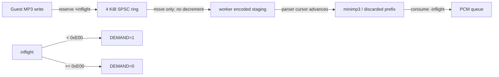

# 20260809-464 PIU10 decoder inflight backpressure 설계 / PIU10 Decoder Inflight Backpressure Design

## 한국어

### 확인된 원인

Task 463 사용자 재현에서 음악을 끊은 `AVOL=0x0101` 시점은 PCM 261.995 ms,
compressed ring 3,311 byte와 decoder pending 287,755 byte를 남겼습니다. 압축 backlog
291,066 byte는 관측된 약 128 kbps stream에서 약 18.2초입니다. 앞선 저음량 전이에서도
약 72 KiB backlog가 173 MPEG frame, 약 4.52초 동안 drain되어 같은 환산을 독립적으로
확인했습니다.

현재 `DEMAND`와 batch 공간은 SPSC ring에 남은 byte만 봅니다. worker가 512 byte를 ring에서
꺼낸 뒤 PCM queue 제한 때문에 대개 약 417-byte frame 하나만 소비하면, 차이 약 95 byte가
unbounded `encoded` staging에 누적됩니다. ring은 비어 보이므로 guest에는 다시
`DEMAND=1`이 반환되고 이 누적이 반복됩니다.

### 설계

platform-neutral `sound::DecoderInputFifo`를 추가합니다. 이 FIFO는 물리 SPSC ring과 별도로
guest가 수락된 뒤 parser/minimp3가 실제 소비하기 전까지의 모든 byte를 atomic
`inflight`로 추적합니다.

- batch write는 `inflight < 0xE00`인 논리 공간만 예약합니다.
- byte write는 stale status read와 write 사이 race를 흡수하기 위해 4,096-byte 물리 상한까지
  허용합니다. 기존 512-byte headroom 계약을 유지합니다.
- ring에서 staging으로 옮길 때는 `inflight`를 줄이지 않습니다.
- MPEG frame decode, invalid prefix skip 또는 rejected frame으로 parser cursor가 전진한
  byte만 `inflight`에서 차감합니다.
- incomplete header/frame은 cursor가 전진하지 않으므로 차감하지 않습니다.
- `DEMAND` bit 0과 frame batch 공간은 모두 `inflight`를 기준으로 계산합니다.

Producer는 byte를 ring에 publish하기 전에 CAS로 inflight 공간을 예약하고, 예상 밖의 partial
push가 발생하면 미사용 예약을 rollback합니다. Consumer는 이미 예약·publish된 byte만 pop할
수 있으므로 실제 parser cursor 전진량을 안전하게 차감할 수 있습니다.

DAC gain, PCM queue 상한, startup latency와 playback-offset 기반 frame-sync는 변경하지
않습니다. 게임에 반환되는 값 중 destination `0x008`의 `DEMAND` bit 타이밍만 실제 decoder
소비에 맞게 달라집니다.

### 검증 전략

- 공용 FIFO probe에서 batch로 `0xE00`을 채우면 DEMAND가 low인지 확인합니다.
- ring에서 staging으로 pop한 뒤에도 inflight와 DEMAND가 그대로인지 확인합니다.
- parser 소비를 모사하여 byte를 차감한 뒤에만 DEMAND가 high로 돌아오는지 확인합니다.
- byte path의 4 KiB headroom과 batch path의 `0xE00` 제한을 확인합니다.
- 기존 PIU10 target, DAC, latency, frame batch와 stream audit probe를 함께 실행합니다.
- Win32 x86 Debug `repiu`와 `repiu_aot_probe`를 빌드합니다.
- 최신 사용자 `repiu_log.txt`를 보존하며 자동 gameplay 실행은 하지 않습니다.

## English

### Confirmed cause

In the Task 463 user reproduction, the interrupting `AVOL=0x0101` left 261.995 ms of PCM,
3,311 compressed-ring bytes, and 287,755 decoder-pending bytes. The 291,066-byte compressed
backlog represents about 18.2 seconds at the observed roughly 128 kbps. An earlier low-volume
transition independently drained about 72 KiB over 173 MPEG frames, about 4.52 seconds, confirming
the conversion.

Current `DEMAND` and batch space observe only the SPSC ring. After the worker removes 512 bytes but
the PCM queue budget permits consumption of only one roughly 417-byte frame, about 95 bytes remain
in unbounded `encoded` staging. The ring appears empty, so the guest receives `DEMAND=1` again and
the surplus accumulates.

### Design

Add platform-neutral `sound::DecoderInputFifo`. In addition to its physical SPSC ring, it tracks
atomic `inflight` bytes from guest acceptance until actual parser/minimp3 consumption. Batch writes
reserve only logical space below `0xE00`; byte writes may use the 4,096-byte physical ceiling to
retain the existing 512-byte stale-status race headroom. Moving bytes from the ring into staging
does not decrement inflight. MPEG decode, invalid-prefix skip, or rejected-frame cursor advancement
does; incomplete input does not.

The producer reserves inflight space with CAS before publishing bytes and rolls back any unexpected
unused reservation. The consumer can only pop reserved and published bytes, so it safely subtracts
actual parser cursor progress. Destination-`0x008` `DEMAND` bit 0 and frame-batch space both use
inflight occupancy.

DAC gain, PCM queue ceiling, startup latency, and playback-offset-based frame-sync remain unchanged.
Only the timing of the `DEMAND` result returned to the guest changes to follow real decoder
consumption.

### Verification strategy

- Fill `0xE00` through batch input and verify low DEMAND.
- Pop into staging and verify that inflight and DEMAND remain unchanged.
- Simulate parser consumption and verify that only then does DEMAND return high.
- Verify 4 KiB byte-path headroom and the batch path's `0xE00` limit.
- Run all existing PIU10 target, DAC, latency, frame-batch, and stream-audit probes.
- Build Win32 x86 Debug `repiu` and `repiu_aot_probe`.
- Preserve the latest user `repiu_log.txt`; do not run automated gameplay.
