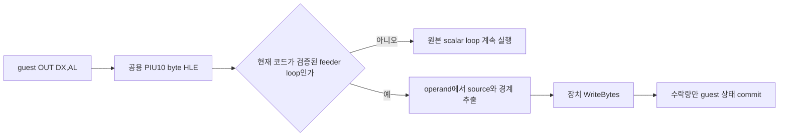

# 20260810-465 공용 PIU10 port-output batching 설계 / Generic PIU10 Port-Output Batching Design

## 한국어

### 문제

현재 PIU10 MP3 HLE와 단일 `OUT DX,AL` fast path는 PIU10 capability를 가진 모든 target에
공용이지만, frame-tail batch는 `pumpito` ROM-set 이름, 실행 파일 offset `0x212FD`, LE
object 4와 여러 고정 data offset을 사용합니다. 이는 검증 실패 시 원본 byte path로
복귀하더라도 특정 바이너리 배치에 맞춘 최적화이므로 공용 우선 원칙에 맞지 않습니다.

### 설계

batch 적용 여부를 target ID가 아니라 현재 guest 명령과 장치 상태로 결정합니다. 현재
`OUT DX,AL` 주변의 bounded byte window에서 검증된 feeder-loop shape를 확인하고, 명령에
포함된 absolute memory operand와 branch target에서 다음 값을 추출합니다.

- source cursor와 available-end 주소
- source-buffer base
- frame byte-count와 frame-target 주소
- 주기적 guest service가 실행되는 counter limit과 cursor threshold

고정 image offset, object 번호와 target 이름은 사용하지 않습니다. matcher가 확인하는 것은
주소가 아니라 원본 루프의 data-flow 계약입니다. 현재 byte는 기존 HLE가 먼저 처리하며,
matcher는 그 뒤에 연속된 source span만 제안합니다. MP3 sink가 실제 수락한 byte 수만큼만
cursor, frame count와 guest counter를 commit합니다. source range, operand alias, branch target,
loop state 또는 FIFO 여유가 하나라도 맞지 않으면 아무 상태도 바꾸지 않고 원본 byte loop를
계속 실행합니다.

초기 matcher는 이미 실기와 byte-for-byte audit로 검증된 feeder-loop 계약만 수락합니다.
이는 특정 주소를 등록하는 방식이 아니라 같은 의미와 machine-code data flow를 가진 모든
relocation과 PIU10 target에 적용되는 안전한 peephole입니다.

`pumpite` 실기 로그와 정적 명령열에서는 같은 계약을 다른 register allocation과 독립 명령
순서로 구현한 변형이 확인되었습니다. 기존 matcher는 frame count에 `EBP`, frame target에
`EDX`를 사용하는 한 가지 encoding 순서를 그대로 비교하여 이 변형을 거부했습니다. matcher는
앞으로 bounded instruction set을 좁게 decode하고 다음 dependency를 검증합니다.

- cursor load, `cursor + 1` 계산과 같은 주소로의 store
- frame-count load, 같은 register의 increment와 같은 주소로의 store
- 원래 cursor를 사용하는 source-byte load
- `ESI`에서 port register를 복원한 뒤의 `OUT DX,AL`
- `OUT` 뒤 frame-count reload, frame-target load, counter increment, compare와 backward branch

서로 독립인 cursor/count 갱신의 순서와 임시 register 번호는 고정하지 않습니다. 대신 각
load/increment/store alias와 register def-use 관계, port register clobber 전 store, branch target을
검증합니다. 따라서 `pumpite`를 target 이름이나 EIP로 예외 처리하지 않으며, 계약에 맞지 않는
명령은 계속 scalar path로 닫힙니다.

stream audit와 batch audit도 `pumpito` 이름 gate를 제거하고 PIU10 capability가 활성화된
모든 target에서 환경 변수로 사용할 수 있게 합니다. 50 ms startup latency는 성능 batch와
무관한 target calibration이므로 이번 범위에서는 변경하지 않습니다.

### 검증 전략

- 서로 다른 code/data base로 배치한 두 synthetic feeder loop가 같은 payload와 최종 상태를
  만드는지 검사합니다.
- 기존 register schedule과 `pumpite`에서 관찰된 독립 schedule을 모두 합성하여 같은 plan을
  생성하는지 검사합니다.
- operand 주소 alias, branch target 또는 state 범위를 훼손하면 fail-closed하는지 검사합니다.
- 기존 FIFO/backpressure, frame audit와 stream audit probe를 유지합니다.
- Win32 x86 Debug `repiu`와 `repiu_aot_probe`를 빌드하고 `--piu10`을 실행합니다.
- 실제 `pumpito`에서 batch가 계속 활성화되고 음악·화면 동시 진행이 유지되는지는 사용자
  환경에서 재검증합니다. 다른 PIU10 target은 matcher가 같은 loop 계약을 가질 때 자동으로
  활성화되고, 그렇지 않으면 scalar path를 유지합니다.

## English

### Problem

The PIU10 MP3 HLE and scalar `OUT DX,AL` fast path are already shared by every PIU10-capable
target, but frame-tail batching depends on the `pumpito` ROM-set name, executable offset
`0x212FD`, LE object 4, and fixed data offsets. Fail-closed validation does not make an
optimization tied to one binary layout generic.

### Design

Select batching from the current guest instruction semantics and device state, never from a
target ID. A bounded window around the current `OUT DX,AL` must match the verified feeder-loop
shape. Absolute memory operands and branch targets provide the source cursor, available end,
source-buffer base, frame count and target, plus the periodic-service counter and cursor
threshold. No fixed image offset, object number, or target name remains.

The existing byte HLE accepts the current byte first. The matcher may then propose only the
following contiguous source span, and commits the cursor, frame count, and guest counter only for
the number of bytes actually accepted by the MP3 sink. Any source-range, operand-alias, branch,
state, or FIFO-space mismatch changes no state and continues the original scalar loop.

The initial matcher accepts only the feeder contract already verified by live and byte-for-byte
audits. It is a relocation-independent peephole for the same machine-code data-flow contract, not
an address registry.

Live logging and static instruction inspection of `pumpite` confirmed the same contract with a
different register allocation and ordering of independent instructions. The former matcher
compared one encoding order that used `EBP` for the frame count and `EDX` for the frame target, so
it rejected this equivalent form. The matcher now narrowly decodes a bounded instruction set and
validates cursor load/increment/store aliases, frame-count load/increment/store def-use, the source
byte load from the original cursor, restoration of the port register from `ESI`, and the post-OUT
count/target comparison with its backward branch. Independent cursor/count updates and temporary
register numbers are not fixed, while dependency, clobber, alias, and branch checks remain
fail-closed. No `pumpite` target name or EIP exception is introduced.

Stream and batch audits also lose the `pumpito` name gate and become available to every
PIU10-capable target. The 50 ms startup latency is target calibration rather than batching and is
outside this change.

### Verification strategy

- Exercise equivalent synthetic loops at two different code and data bases.
- Exercise both the original register schedule and the independent schedule observed in
  `pumpite`, requiring identical plans.
- Confirm operand-alias, branch-target, and state-range corruption fail closed.
- Preserve FIFO/backpressure, frame-audit, and stream-audit probes.
- Build Win32 x86 Debug `repiu` and `repiu_aot_probe`, then run `--piu10`.
- Revalidate live `pumpito` batching and concurrent music/gameplay on the user's system. Other
  PIU10 targets engage automatically only when their loop satisfies the same contract.
