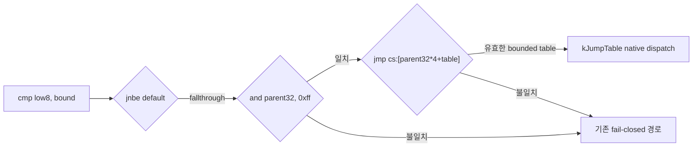

# 20260811-467 AOT byte-guard jump table 설계 / AOT Byte-Guard Jump Table Design

## 한국어

### 문제

기존 AOT bounded jump-table 인식기는 `cmp r32, imm; ja default; jmp
cs:[r32*4+table]` 형태만 처리합니다. pumpito의 내장 zlib 1.1.3 `inflate_codes()`는 상태
바이트를 `cmp cl, 9`로 검사한 뒤 `and ecx, 0xff`로 인덱스를 정규화하고 같은 jump table을
사용합니다. 범위 검사와 분기 사이의 정규화 때문에 현재 인식기는 이 분기를 HLE boundary로
남기며, 관측 로그에서는 해당 명령이 약 1,226만 회 dispatcher를 왕복했습니다.

### 설계

기존 guard를 단일 fallthrough 주소가 아니라 제한된 전달 상태로 확장합니다.

1. `cmp r8-low, imm8; jnbe default`를 만나면 하위 8-bit register, 대응하는 32-bit parent
   register와 entry count를 기록합니다. AH/CH/DH/BH처럼 parent의 비트 8..15를 비교하는
   register는 제외합니다.
2. guard fallthrough의 첫 명령이 정확히 `and parent-r32, 0xff`이면 flags를 바꾸는 이 명령을
   그대로 AOT에 복사하고, 그 다음 주소로 32-bit jump-table guard를 전달합니다.
3. 다음 명령이 `jmp dword ptr cs:[parent-r32*4+table]`이고 table entry가 모두 image 안의
   코드 주소이면 기존 `kJumpTable`로 분류하고 native pointer table을 재사용합니다.
4. 정규화 명령이 없거나 mask, destination register, table index, entry target 중 하나라도
   다르면 최적화하지 않습니다. 주소, target profile, zlib 문자열이나 함수 이름은 matcher
   조건에 사용하지 않습니다.

기존 `cmp r32` 경로는 변경하지 않습니다. guard 발견보다 대상 block 방문이 빠른 경우를 위한
기존 재분류 sweep도 정규화 후 jump 주소를 key로 사용하므로 방문 순서와 무관하게 동작해야
합니다.

### 검증 전략

- relocation-independent synthetic image로 `cmp cl,9; jnbe; and ecx,0xff; jmp
  cs:[ecx*4+table]`이 10-entry `kJumpTable`로 계획되고 cache가 생성되는지 검사합니다.
- `and ecx,0xffff`, 다른 destination register, high-byte 비교와 정규화 생략 형태가
  jump table로 오인되지 않는지 검사합니다.
- pumpito PIU.EXE probe에서 `0x010E49E4`가 `kJumpTable`이 되고 전체 plan/cache가 유효한지
  확인합니다.
- Win32 x86 Release 빌드를 수행하고, 실제 로딩 시간과 dispatcher 감소는 사용자 실행 로그로
  후속 확인합니다.

## English

### Problem

The existing AOT bounded jump-table recognizer handles only `cmp r32, imm; ja default; jmp
cs:[r32*4+table]`. pumpito's statically linked zlib 1.1.3 `inflate_codes()` compares a state byte
with `cmp cl, 9`, normalizes the index using `and ecx, 0xff`, and then uses the same kind of jump
table. The normalization between the guard and the branch prevents recognition, leaving the branch
as an HLE boundary. The observed log recorded roughly 12.26 million dispatcher round trips at this
instruction.

### Design

Extend the existing guard from a single fallthrough address into a narrowly bounded propagation
state.

1. On `cmp low-r8, imm8; jnbe default`, record the low byte register, its 32-bit parent, and the
   entry count. Exclude AH/CH/DH/BH because they compare bits 8 through 15 of the parent.
2. If the first fallthrough instruction is exactly `and parent-r32, 0xff`, copy this flag-changing
   instruction normally and propagate a 32-bit jump-table guard to the following address.
3. If the next instruction is `jmp dword ptr cs:[parent-r32*4+table]` and every table entry points
   into image code, classify it as the existing `kJumpTable` and reuse native pointer-table emission.
4. Fail closed if the normalization, mask, destination register, table index, or any entry target
   differs. Addresses, target profiles, zlib strings, and function names are not matching inputs.

The existing `cmp r32` path remains unchanged. The visit-order-independent reclassification sweep
uses the post-normalization jump address as its key and therefore applies to the new form as well.

### Verification Strategy

- Use a relocation-independent synthetic image to verify that `cmp cl,9; jnbe; and ecx,0xff; jmp
  cs:[ecx*4+table]` plans a ten-entry `kJumpTable` and builds a valid cache.
- Verify fail-closed behavior for `and ecx,0xffff`, a different destination register, a high-byte
  comparison, and a missing normalization.
- Probe pumpito PIU.EXE and verify that `0x010E49E4` is `kJumpTable` while the full plan and cache
  remain valid.
- Build Win32 x86 Release. Loading-time and dispatcher-count improvement will be confirmed from a
  subsequent user run log.
