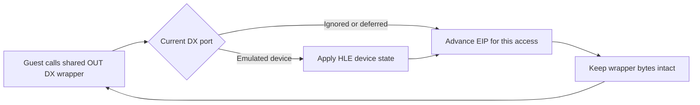

# 20260811-468 공용 동적 포트 출력 래퍼 보존 / Shared Dynamic Port Output Wrapper Preservation

## 한국어

### 문제

`pumpitpc`는 시작 과정에서 Watcom 런타임의 공용 `OUT DX,AX` 래퍼를 여러 장치에
사용합니다. 기존 포트 I/O HLE는 처리 대상이 아니거나 관찰만 하는 출력에 도달하면
해당 `OUT` 명령을 NOP로 영구 패치했습니다. 최초의 `0x2AC`, `0x2A6` 출력이 공용
래퍼를 패치한 뒤에는 같은 래퍼를 이용하는 PIU10 CAT702 포트 `0x2D4`, `0x2D6`,
`0x2DA` 출력도 실행되지 않아 게임이 `Lock Error!!!`로 진입했습니다.

CAT702 변환 데이터와 직렬 상태 모델은 실제 challenge/response 벡터와 정확히
일치합니다. 따라서 보안 알고리즘이나 특정 target을 보정하지 않고, 동적으로 DX를
받는 포트 출력 명령의 수명 정책을 수정합니다.

### 설계

- `OUT DX,*`의 무시·유예 출력은 게스트 명령을 수정하지 않고 현재 EIP만 전진시킵니다.
- 이미 에뮬레이션되는 PIU10, PIT, PIC, EEPROM, YMZ 경로의 상태 처리는 유지합니다.
- target ID, 실행 파일 주소, 특정 포트 번호에 따른 예외를 추가하지 않습니다.
- CAT702 probe에는 `pumpitpc`의 실제 transform, challenge, response를 넣고 게스트의
  비트 입력·정렬·반전 과정을 그대로 검증합니다.

### 검증

Win32 x86 Debug 빌드와 전체 AOT probe를 수행하고, PIU10 probe에서 실제 CAT702
벡터가 일치하는지 확인합니다. 기본 환경의 `pumpitpc` 실행에서는 초기 출력 뒤에도
프로세스가 Lock Error 대기 경로로 종료되지 않고 다음 게임 실행 단계로 진행해야 합니다.

## English

### Problem

During startup, `pumpitpc` uses a shared Watcom `OUT DX,AX` wrapper for multiple devices.
The previous Port I/O HLE permanently NOP-patched the `OUT` instruction when an output was
only observed or ignored. After initial writes to `0x2AC` and `0x2A6` patched the shared
wrapper, later PIU10 CAT702 writes to `0x2D4`, `0x2D6`, and `0x2DA` through that same wrapper
could no longer execute, so the game entered `Lock Error!!!`.

The CAT702 transform and serial state model exactly match the real challenge/response vector.
The design therefore changes the lifetime policy for DX-addressed output instructions without
adjusting the security algorithm or adding target-specific behavior.

### Design

- For ignored or deferred `OUT DX,*` accesses, advance the current EIP without modifying guest code.
- Preserve state handling in the existing PIU10, PIT, PIC, EEPROM, and YMZ emulation paths.
- Add no exception based on target ID, executable address, or a specific port number.
- Add the real `pumpitpc` transform, challenge, and response to the CAT702 probe, including the
  guest's input-bit, alignment, and bit-reversal processing.

### Verification

Run the Win32 x86 Debug build and complete AOT probe, and confirm that the PIU10 probe matches
the real CAT702 vector. With the default environment, `pumpitpc` must continue beyond startup
instead of terminating through the Lock Error wait path.
