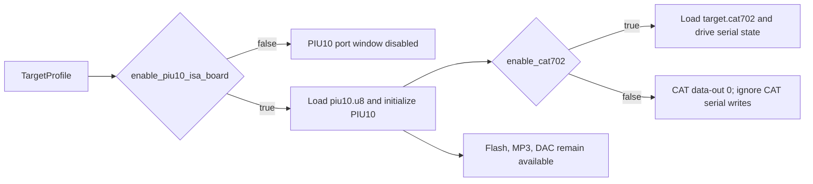

# 20260812-469 TargetProfile별 CAT702 capability / Target-Scoped CAT702 Capability

## 한국어

### 배경과 목표

현재 `TargetProfile::enable_piu10_isa_board`는 PIU10 flash, MAS3507D MP3, DAC3350A와
CAT702 보안 장치를 한 번에 활성화합니다. CAT702만 비활성화한 하드웨어 구성을 표현할 수
없으며, ROM ZIP의 `<target>.cat702`도 PIU10 보드 전체 초기화의 필수 파일입니다.

`TargetProfile`에 독립적인 `enable_cat702` capability를 추가합니다. PIU10 보드와 MP3/DAC는
계속 동작하되 이 값이 false이면 CAT702 transform을 로드하거나 직렬 상태를 구동하지
않습니다. 원본 게임의 보안 검사 자체는 수정하지 않으므로 `pumpitpc`처럼 CAT702 응답을
검증하는 실행 파일은 잘못된 응답을 받고 자연스럽게 Lock Error로 진입해야 합니다.

### 정책

- `enable_cat702`는 `enable_piu10_isa_board`와 별개의 `TargetProfile` 필드입니다.
- CAT702는 PIU10 ISA 보드가 활성화되고 두 capability가 모두 true일 때만 노출합니다.
- false이면 `<target>.cat702` ZIP 항목을 요구하거나 추출하지 않습니다.
- 비활성 CAT702의 data-out 선은 0으로 읽히며 data/clock/select 쓰기는 무시합니다.
- 같은 destination의 DAC3350A SDA/SCL 쓰기와 PIU10 flash/MP3 기능은 그대로 유지합니다.
- 기존 동작 보존을 위해 `pumpito`, `pumpitc`, `pumpitpc`, `pumpite`는 기본 true이고,
  나머지 내장 profile은 false입니다.
- target ID나 게스트 실행 주소에 따른 런타임 예외는 추가하지 않습니다.

### 인터페이스

플랫폼 공용 `Piu10IsaBoard::Initialize`는 CAT702 transform의 유무를
`std::optional<std::array<uint8_t, 8>>`로 받습니다. transform이 없으면 보드는 사용
가능하지만 `cat702_enabled()`는 false입니다. Win32 실행 준비 계층은 profile의 bool을
그 optional로 변환하는 orchestration만 담당합니다.

### 검증

- 내장 profile의 PIU10/CAT702 capability 조합을 probe로 확인합니다.
- CAT702 활성 보드는 실제 `pumpitpc` challenge/response 벡터와 계속 일치해야 합니다.
- 같은 flash로 CAT702를 비활성화한 보드는 초기화와 MP3/DAC 접근은 성공하지만 보안
  response는 실제 벡터와 일치하지 않아야 합니다.
- Win32 x86 Debug 빌드와 전체 `pumpitpc` AOT probe를 수행합니다.

## English

### Background and Goal

`TargetProfile::enable_piu10_isa_board` currently enables PIU10 flash, MAS3507D MP3,
DAC3350A, and CAT702 security as one unit. It cannot represent hardware with only CAT702
disabled, and `<target>.cat702` is required to initialize the entire PIU10 board.

Add an independent `enable_cat702` capability to `TargetProfile`. PIU10 flash, MP3, and DAC
remain operational when it is false, but no CAT702 transform is loaded and no serial state is
driven. The original security check remains untouched, so an executable such as `pumpitpc` that
validates CAT702 receives an incorrect response and naturally enters Lock Error.

### Policy

- `enable_cat702` is a separate `TargetProfile` field from `enable_piu10_isa_board`.
- CAT702 is exposed only when the PIU10 board and both capabilities are enabled.
- A disabled CAT702 does not require or extract the `<target>.cat702` ZIP member.
- Its data-out line reads zero, and data/clock/select writes are ignored.
- DAC3350A SDA/SCL writes on the same destination and PIU10 flash/MP3 remain active.
- To preserve current behavior, `pumpito`, `pumpitc`, `pumpitpc`, and `pumpite` default to true;
  all other built-in profiles default to false.
- No runtime exception based on target ID or guest address is added.

### Interface

The platform-neutral `Piu10IsaBoard::Initialize` accepts CAT702 transform presence as
`std::optional<std::array<uint8_t, 8>>`. Without a transform the board remains available while
`cat702_enabled()` is false. Win32 setup only converts the profile bool into this optional.

### Verification

- Probe the PIU10/CAT702 capability combinations of all built-in profiles.
- An enabled board must continue matching the real `pumpitpc` challenge/response vector.
- A board initialized from the same flash with CAT702 disabled must retain MP3/DAC access but
  must not match the security response vector.
- Run the Win32 x86 Debug build and complete `pumpitpc` AOT probe.
