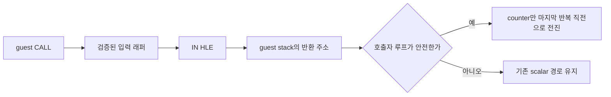

# Task 470 설계 — 호출 래퍼형 포트 I/O 지연 루프 batching

## 한국어

### 문제

`pumpitpc` 실행 로그는 약 52초 동안 포트 I/O 4,466,647회와 privileged-instruction
예외 4,057,263회를 기록했습니다. JAMMA 입력 스캔 1,984,189회에 대해 기존 지연 루프
matcher가 같은 횟수만큼 실행되었지만 모두 `shape`로 거절되었습니다.

정적 분석으로 공용 입력 함수가 다음과 같은 호출 래퍼임을 확인했습니다.

```text
push edx
mov  edx,eax
sub  eax,eax
in   ax,dx
pop  edx
ret
```

기존 matcher는 `IN` 바로 뒤에 `cmp`와 backward branch가 있어야 하므로, 비교와 분기가
호출자에 있는 래퍼형 코드를 인식할 수 없습니다. 특정 실행 파일 주소를 예외 처리하는
대신 명령 의미와 guest stack의 반환 주소를 검증해 같은 구조를 공용으로 처리합니다.

### 설계



1. 현재 `IN`을 포함한 함수가 제한된 입력 래퍼 모양인지 검사합니다.
2. 래퍼가 저장한 레지스터와 guest stack의 반환 주소를 검증합니다.
3. 반환 주소 앞의 `call rel32`가 현재 래퍼 시작점을 호출하는지 확인합니다.
4. 호출자에서 비교, backward branch, 루프 본문을 검사합니다.
5. 건너뛸 입력 결과가 다음 반복 전에 반드시 폐기되고, 메모리 접근·다른 I/O·알 수 없는
   호출이 없을 때만 counter를 마지막 반복 직전 값으로 전진시킵니다.
6. 하나라도 증명되지 않으면 guest 상태를 바꾸지 않고 기존 처리를 유지합니다.

matcher는 주소, target profile, 실행 파일 이름을 사용하지 않습니다. 최적화 대상은
side-effect가 없는 JAMMA 입력 경로로 제한하며 EEPROM, 음원, CAT702/PIU10 레지스터에는
적용하지 않습니다.

### 검증

- synthetic direct-loop와 wrapped-call loop가 같은 최종 counter를 만듭니다.
- 잘못된 call target, 읽을 수 없는 stack, 살아 있는 입력 결과, 메모리 접근이 있는 본문은
  모두 fail-closed 됩니다.
- Release 빌드와 기존 AOT probe를 통과해야 합니다.
- 실제 `pumpitpc` 재실행에서는 delay-loop `batch_count`가 0보다 커지고 포트 I/O 및
  `0xC0000096` 예외 수가 기준 로그보다 감소해야 합니다.

## English

### Problem

The `pumpitpc` log records 4,466,647 port-I/O operations and 4,057,263 privileged-instruction
exceptions in roughly 52 seconds. The existing delay-loop matcher ran for all 1,984,189 JAMMA
input scans, but every attempt was rejected as `shape`.

Static analysis confirms that the shared input function is a call wrapper:

```text
push edx
mov  edx,eax
sub  eax,eax
in   ax,dx
pop  edx
ret
```

The existing matcher requires the compare and backward branch immediately after `IN`, so it
cannot see a loop whose compare lives in the caller. The extension validates instruction
semantics and the return address on the guest stack instead of special-casing executable
addresses.

### Design

The matcher first proves a restricted input-wrapper shape, validates the saved register and
guest return address, proves that the preceding `call rel32` targets that wrapper, and then
analyzes the caller's compare, backward branch, and loop body. It advances only the counter to
one iteration before termination when the discarded input result and side-effect-free body are
proven. Any uncertainty leaves guest state untouched.

No target name, profile, or fixed executable address participates in the decision. Batching is
limited to the side-effect-free JAMMA input path; EEPROM, sound, and CAT702/PIU10 registers remain
scalar.

### Verification

Synthetic direct and wrapped loops must converge to the same final counter. Incorrect call
targets, unreadable stacks, live input results, and memory-touching bodies must fail closed. The
Release build and existing AOT probe must pass. A live `pumpitpc` run should report nonzero batches
and fewer port-I/O and `0xC0000096` exceptions than the baseline log.
