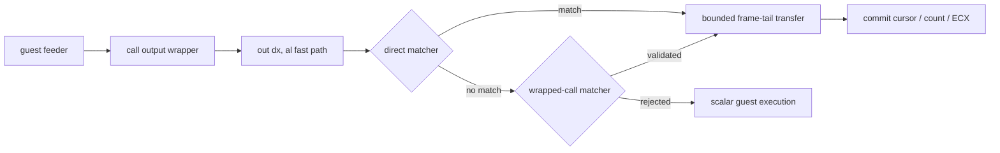

# 호출 래퍼형 PIU10 MP3 feeder 일괄 전송

## 배경

일부 원본 실행 파일은 PIU10 MP3 data port에 직접 `out dx, al`을 실행하지 않고, 레지스터를 보존하고 포트와 데이터를 재배치하는 작은 호출 래퍼를 사용합니다. 현재 frame-tail 일괄 전송기는 `out` 앞뒤에 feeder 상태 갱신 명령이 직접 배치된 형태만 인식하므로, 이 경로에서는 byte fast path만 활성화되고 나머지 프레임을 한 바이트씩 예외 처리합니다.

프로파일명, 실행 파일 주소 또는 해시를 기준으로 우회하지 않고, 실행 중 확인 가능한 명령 의미와 guest 상태만으로 같은 최적화를 적용해야 합니다.

## 설계

기존 직접 출력 matcher를 유지하고 그 다음에 제한적인 호출 래퍼 matcher를 시도합니다. 호출 래퍼 matcher는 다음 조건을 모두 검증할 때만 활성화됩니다.

1. 현재 `out dx, al`을 포함한 함수가 레지스터 보존, 포트/데이터 재배치, 복원, 반환으로 구성된 짧은 래퍼입니다.
2. guest stack의 반환 주소 바로 앞 명령이 상대 `call`이고, 그 대상이 현재 래퍼 시작 주소와 일치합니다.
3. 호출 전 feeder 코드가 source cursor 증가, source byte 읽기, frame byte count 증가, service counter 증가, PIU10 data port 설정을 수행합니다.
4. 반환 후 코드는 frame byte count와 목표 크기를 비교한 뒤 feeder loop로 되돌아갑니다.
5. feeder loop와 service 경계 검사에서 source cursor, available end, counter limit, cursor threshold가 서로 일관됩니다.

matcher가 검증에 실패하거나 코드·stack·상태 메모리가 guest arena 밖이면 기존 바이트 단위 경로로 닫힌 상태로 실패합니다. 일괄 전송은 현재 `out` 이전에 이미 반영된 cursor/count/counter를 기준으로 다음 바이트부터 처리하며, 기존 FIFO 수용량과 service 경계 제한을 그대로 사용합니다.

감사 모드는 enqueue를 하지 않으므로, 예측 구간도 현재 compressed inflight에서 `0xE00` 논리 `DEMAND` 경계까지의 여유로 제한합니다. 이렇게 해야 실제 scalar loop가 status bit 변화로 반환하는 지점을 감사 계획이 넘지 않습니다. 정상 batch enqueue는 이미 FIFO가 반환한 실제 수락량만 commit하므로 이 보정은 감사 경로에만 필요합니다.

## 검증 전략

- synthetic probe에서 직접 출력형 matcher의 기존 결과를 보존합니다.
- 주소를 옮긴 호출 래퍼형 feeder를 구성해 plan 생성, service 경계 제한, commit을 검증합니다.
- 잘못된 반환 주소 또는 호출 대상을 주입해 fail-closed 동작을 검증합니다.
- Win32 Release 빌드와 실제 실행 로그에서 frame-tail batch 활성화, batched byte 증가, MP3 decode 진행, 중단·손상 부재를 확인합니다.

---

# Wrapped-call PIU10 MP3 feeder batching

## Background

Some original executables do not issue `out dx, al` directly at the PIU10 MP3 data port. They call a small wrapper that preserves a register and rearranges the port and byte operands. The current frame-tail batcher only recognizes feeders whose state updates surround the `out` instruction directly, so this route uses the byte fast path while every remaining frame byte still incurs exception handling.

The optimization must be enabled from runtime-verifiable instruction semantics and guest state, without selecting a profile name, executable address, or hash.

## Design

Keep the existing direct-output matcher and try a restricted wrapped-call matcher afterward. The wrapped matcher activates only when all of these conditions hold:

1. The function containing the current `out dx, al` is a short wrapper that preserves a register, rearranges port/data operands, restores the register, and returns.
2. The instruction immediately before the guest-stack return address is a relative `call` whose target equals the wrapper entry.
3. The feeder before the call advances the source cursor, loads a source byte, increments the frame byte count and service counter, and selects the PIU10 data port.
4. Code after the return compares the frame byte count with its target and branches back to the feeder loop.
5. The feeder loop and service-boundary checks consistently identify the source cursor, available end, counter limit, and cursor threshold.

If any instruction, stack, code, or state-memory validation fails, execution fails closed to the existing scalar byte path. Batching starts after the cursor/count/counter updates already performed for the current `out`, and retains the existing FIFO-capacity and service-boundary limits.

Audit mode does not enqueue predicted bytes, so its predicted segment is also limited to the remaining headroom between current compressed inflight and the logical `0xE00` `DEMAND` boundary. This prevents an audit plan from crossing the point where the real scalar loop returns after a status-bit change. Normal batch enqueue already commits only the byte count actually accepted by the FIFO, so this adjustment is audit-only.

## Verification strategy

- Preserve existing direct-output matcher results in the synthetic probe.
- Construct a relocated wrapped-call feeder and verify plan creation, service-boundary limiting, and commit behavior.
- Inject an invalid return address or call target and verify fail-closed behavior.
- Build Win32 Release and use a live run log to confirm frame-tail activation, increasing batched bytes, continuing MP3 decode, and no truncation or corruption.
