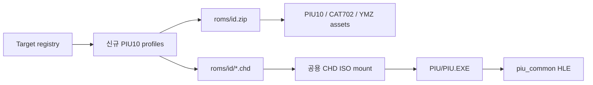

# PIU10 타깃 프로파일 추가 설계

## 목표와 근거

기존 `pumpite` 등록을 유지하고 다음 MAME short name을 그 뒤에 요청 순서대로 추가합니다.

1. `pumpitpr` — Pump It Up: The Premiere
2. `pumpitpx` — Pump It Up: The Prex
3. `pumpit8` — Pump It Up: The Rebirth
4. `pumpitp2` — Pump It Up: The Premiere 2
5. `pumpipx2` — Pump It Up: The Prex 2
6. `pumpitp3` — Pump It Up: The Premiere 3
7. `pumpipx3` — Pump It Up: The Prex 3

MAME의 공식 [`xtom3d.cpp`](https://github.com/mamedev/mame/blob/master/src/mame/misc/xtom3d.cpp)는 모두 `PUMPITUP_BIOS`를 사용하고 각 세트에 PIU10 CAT702 region과 CD image를 정의합니다. 따라서 기존 PIU10 세대와 같은 공용 `piu_common` HLE, PIU CHD mount, JAMMA/YMZ280B, PIU10 ISA 및 CAT702 capability를 사용합니다. 타이틀별 실행 코드 패치나 별도 HLE 분기는 만들지 않습니다.

## 프로파일 계약

각 신규 프로파일은 `id`와 `rom_set_id`에 같은 short name을 사용합니다. 경로는 다음 공식을 따릅니다.

- executable: `build/runtime_mounts/<id>/PIU/PIU.EXE`
- working directory: `build/runtime_mounts/<id>/PIU`
- asset root: `build/runtime_mounts/<id>`
- HLE profile: `piu_common`
- runtime reservation: base `0x00010000`, size `0x005D7000`
- `enable_piu_jamma_board`, `enable_piu10_isa_board`, `enable_cat702`: 모두 true
- MP3 latency: 0 ms

`pumpite`는 이미 같은 계약으로 등록되어 있으므로 중복 항목을 만들지 않습니다. 로컬에 ZIP만 있고 CHD 디렉터리가 없는 신규 세트는 프로파일 선택과 ZIP 검증 후 해당 short name의 CHD 누락 오류로 종료하는 것을 정상적인 제한 검증으로 봅니다.

## 검증

- registry probe가 기존 및 신규 프로파일의 경로, ROM-set id, capability, latency를 검증합니다.
- 각 신규 id로 analyzer를 호출하여 프로파일이 선택되고 자산별 진단으로 진입하는지 확인합니다.
- Win32 x86 Debug/Release 빌드와 AOT probe를 실행합니다.

---

# Expanded PIU10 target profiles

## Goal and basis

Keep the existing `pumpite` registration and append the seven MAME short names above in the requested order.

MAME's official [`xtom3d.cpp`](https://github.com/mamedev/mame/blob/master/src/mame/misc/xtom3d.cpp) places all of them under `PUMPITUP_BIOS` and defines a PIU10 CAT702 region and CD image for each set. They therefore use the shared `piu_common` HLE, PIU CHD mount, JAMMA/YMZ280B, PIU10 ISA, and CAT702 capabilities already used by the existing PIU10 generation. No title-specific executable patch or HLE branch is introduced.

## Profile contract

Each new profile uses the same short name for `id` and `rom_set_id`, the path formulas and capability values listed above, the shared runtime reservation, and zero MP3 latency.

`pumpite` is already registered under the same contract and is not duplicated. For new sets whose local ZIP exists but CHD directory does not, reaching the short-name-specific missing-CHD diagnostic after profile and ZIP validation is the expected bounded verification result.

## Verification

- Extend the registry probe to validate paths, ROM-set ids, capabilities, and latency for old and new profiles.
- Invoke the analyzer for every new id and confirm profile selection reaches asset-specific diagnostics.
- Run Win32 x86 Debug/Release builds and the AOT probe.
