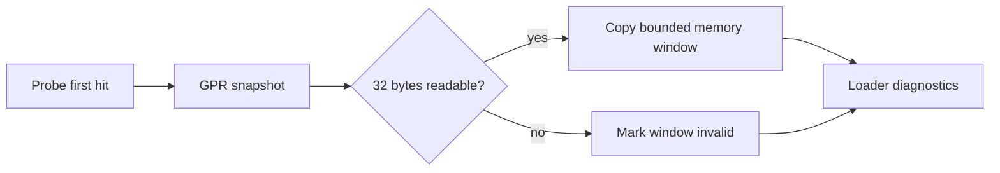

# 실행 probe 레지스터 메모리 창 설계

## 목적

`REPIU_EXECUTION_PROBE_OFFSET`가 포착한 첫 instruction 진입 상태에 일반 목적 레지스터가
가리키는 메모리의 앞 32바이트를 함께 보존합니다. 특정 게임 주소나 자료 형식을 실행기에
하드코딩하지 않고, 함수 진입과 반환 지점에서 포인터 입력·출력의 변화를 비교하기 위한
읽기 전용 진단 기능입니다.

## 설계

* `EAX`, `EBX`, `ECX`, `EDX`, `ESI`, `EDI`, `EBP` 순서로 고정된 7개 창을 둡니다.
* 각 창은 `REPIU_EXECUTION_PROBE_MEMORY_OFFSET`의 공통 양수 offset을 레지스터 값에 더한
  주소, 유효 여부, 최대 32바이트의 복사본만 보존합니다. 미설정 offset은 0입니다.
* 주소 덧셈이 32-bit 범위를 넘으면 창을 무효 처리합니다.
* 기존 guest 범위 읽기 검사를 통과한 전체 32바이트만 복사합니다. 부분 범위나 host 임의
  주소는 읽지 않습니다.
* probe가 비활성화됐거나 적중하지 않으면 추가 동작과 출력이 없습니다.
* 레지스터, 메모리, 플래그와 제어 흐름은 변경하지 않습니다.

## 검증

1. Win32 x86 Debug 전체 빌드와 probe를 통과시킵니다.
2. `pumpit8`의 `+0xE49F8`과 `+0xE5D01`을 각각 관찰하여 iCCP 입력 버퍼의 앞 32바이트를
   비교합니다.
3. 환경 변수가 없을 때 기존 실행 경로가 변하지 않는지 확인합니다.

# Execution Probe Register Memory Window Design

## Goal

Extend the first-hit snapshot selected by `REPIU_EXECUTION_PROBE_OFFSET` with the first 32 bytes
addressed by each general-purpose pointer register. This is a read-only diagnostic facility for
comparing pointer input and output at function entry and return sites without hard-coding a game
address or data format into execution.

## Design

* Keep seven fixed windows in `EAX`, `EBX`, `ECX`, `EDX`, `ESI`, `EDI`, `EBP` order.
* Each window preserves the address formed by adding the common positive
  `REPIU_EXECUTION_PROBE_MEMORY_OFFSET` to the register value, validity, and at most 32 copied
  bytes. The unset offset is zero.
* Mark a window invalid when address addition exceeds the 32-bit range.
* Copy only when the existing guest-range check accepts the complete 32-byte range. Do not read a
  partial range or an arbitrary host address.
* Add no behavior or output when the probe is disabled or not hit.
* Do not modify registers, memory, flags, or control flow.

## Verification

1. Pass the complete Win32 x86 Debug build and probes.
2. Observe `pumpit8` at `+0xE49F8` and `+0xE5D01`, then compare the first 32 bytes of the iCCP
   input buffer.
3. Confirm that execution without the environment variable retains the existing path.
