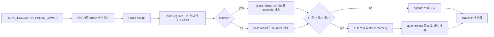

# 실행 probe 메모리 구간 dump 설계

## 목적

`REPIU_EXECUTION_PROBE_OFFSET`가 포착한 첫 instruction 진입 상태에서, 지정한 guest 메모리
구간 전체를 파일로 보존합니다. 기존 register memory window는 레지스터당 32바이트로 고정돼
있어 수 KB 규모의 buffer를 그대로 확인할 수 없습니다.

`pumpit8` iCCP 종료 분석(`docs/analysis/pumpit8-bga-iccp-crash.md`)의 다음 확인 항목은
runtime iCCP chunk 전체를 비침투적으로 추출해 독립 zlib decoder로 검증하는 것입니다.
이 기능은 그 확인을 가능하게 하는 일반 진단 도구이며, 특정 게임 주소나 자료 형식을
실행기에 하드코딩하지 않습니다.

## 설계

* 환경 변수 그룹은 다음과 같습니다. `PATH`와 `BYTES`가 모두 유효할 때만 활성화됩니다.
  * `REPIU_EXECUTION_PROBE_DUMP_BASE`: `eax`, `ebx`, `ecx`, `edx`, `esi`, `edi`, `ebp`,
    `esp` 중 하나의 레지스터 이름이거나, `0x` 접두 절대 주소입니다. 미설정 시 `eax`입니다.
  * `REPIU_EXECUTION_PROBE_DUMP_OFFSET`: base에 더할 양수 offset입니다. 미설정 시 0입니다.
  * `REPIU_EXECUTION_PROBE_DUMP_INDIRECT`: `1`이면 `base+offset`의 4바이트를 읽어 그
    값을 source 주소로 사용합니다. stack으로 전달된 포인터 인자를 따라가기 위한 항목입니다.
  * `REPIU_EXECUTION_PROBE_DUMP_BYTES`: 복사할 바이트 수입니다.
  * `REPIU_EXECUTION_PROBE_DUMP_PATH`: 출력 파일 경로입니다.
* 상한은 `kWin32ExecutionProbeDumpMaxBytes`(1 MiB)입니다. 상한을 넘는 요청은 비활성으로
  처리해, 진단이 host 메모리를 무제한으로 잡지 않게 합니다. 바이트는 snapshot을 거치지
  않으므로 이 buffer가 기능 전체의 host 비용입니다. 1 MiB는 디코딩된 자산 buffer와 그것을
  참조하는 구조체를 한 번에 담을 수 있는 크기이며, 짧은 buffer의 생성 지점을 찾으려면 그
  범위가 필요합니다.
* buffer는 실행 시작 전 설정 시점에 한 번 할당합니다. VEH 안에서는 할당하지 않고 memcpy만
  수행합니다. 예외 처리 중 heap lock을 다시 잡는 경로를 만들지 않기 위함입니다.
* 주소 덧셈이 32-bit 범위를 넘거나, 기존 guest 범위 검사가 전체 구간을 허용하지 않으면
  복사하지 않고 실패로 남깁니다. 부분 범위나 host 임의 주소는 읽지 않습니다.
* 파일 기록은 guest thread가 멈춘 뒤 `RunWin32ExecutionThread`의 종료 경로에서 한 번만
  수행합니다. VEH 안에서는 파일 I/O를 하지 않습니다.
* telemetry snapshot에는 포착 여부, 주소, 바이트 수, 기록 여부만 전달하고 바이트 내용은
  전달하지 않습니다. 폴링마다 KB 단위를 복사하지 않기 위함입니다.
* 환경 변수가 없으면 추가 동작과 출력이 없습니다. 레지스터, 메모리, 플래그, 제어 흐름은
  변경하지 않습니다.

## 검증

1. Win32 x86 Debug 빌드를 통과시킵니다.
2. `pumpit8`을 `REPIU_EXECUTION_PROBE_OFFSET=0xE49F8`로 실행해 iCCP chunk buffer 전체
   `0xA37` 바이트를 추출합니다.
3. 추출한 chunk의 prefix를 건너뛴 compressed profile을 host의 독립 zlib decoder로 검증해,
   stream이 완결되는지 확인합니다.
4. 환경 변수가 없을 때 기존 실행 경로가 변하지 않는지 확인합니다.

# Execution Probe Memory Range Dump Design

## Goal

Preserve a complete specified guest memory range to a file at the first-instruction entry state
captured by `REPIU_EXECUTION_PROBE_OFFSET`. The existing register memory window is fixed at 32
bytes per register, which cannot show a multi-kilobyte buffer.

The next check in the `pumpit8` iCCP analysis (`docs/analysis/pumpit8-bga-iccp-crash.md`) is to
extract the complete runtime iCCP chunk non-invasively and validate it with an independent zlib
decoder. This is the general diagnostic facility that makes that check possible; it hard-codes no
game address or data format into execution.

## Design

* The environment-variable group is enabled only when both `PATH` and `BYTES` are valid.
  * `REPIU_EXECUTION_PROBE_DUMP_BASE`: one of the register names `eax`, `ebx`, `ecx`, `edx`,
    `esi`, `edi`, `ebp`, `esp`, or a `0x`-prefixed absolute address. Defaults to `eax`.
  * `REPIU_EXECUTION_PROBE_DUMP_OFFSET`: positive offset added to the base. Defaults to zero.
  * `REPIU_EXECUTION_PROBE_DUMP_INDIRECT`: when `1`, read four bytes at `base+offset` and use that
    value as the source address, so a pointer argument passed on the stack can be followed.
  * `REPIU_EXECUTION_PROBE_DUMP_BYTES`: number of bytes to copy.
  * `REPIU_EXECUTION_PROBE_DUMP_PATH`: output file path.
* The bound is `kWin32ExecutionProbeDumpMaxBytes` (1 MiB). A larger request stays disabled so the
  diagnostic cannot claim unbounded host memory. The bytes never travel through the snapshot, so
  this buffer is the whole host cost. One megabyte is large enough to hold a decoded asset buffer
  next to the structure referencing it, which is what locating the producer of a short buffer
  requires.
* The buffer is allocated once at configuration time, before execution starts. The VEH path only
  memcpys, never allocates, so exception handling never re-enters the heap lock.
* Copy nothing and record a failure when the address addition exceeds the 32-bit range or the
  existing guest-range check rejects the complete range. Do not read a partial range or an
  arbitrary host address.
* Write the file once from the `RunWin32ExecutionThread` exit path after the guest thread has
  stopped. Perform no file I/O inside the VEH.
* Carry only capture status, address, byte count, and written flag through the telemetry snapshot,
  never the bytes, so polling does not copy kilobytes each iteration.
* Add no behavior or output when the environment variables are absent. Do not modify registers,
  memory, flags, or control flow.

## Verification

1. Pass the Win32 x86 Debug build.
2. Run `pumpit8` with `REPIU_EXECUTION_PROBE_OFFSET=0xE49F8` and extract the complete `0xA37`-byte
   iCCP chunk buffer.
3. Validate the compressed profile after the prefix with an independent host zlib decoder to
   determine whether the stream terminates.
4. Confirm that execution without the environment variables retains the existing path.
