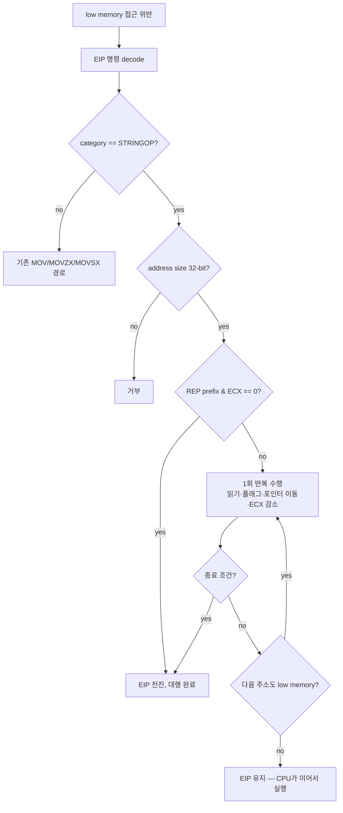

# Low memory string instruction 대행 설계

## 목적

guest가 DOS low memory(64 KiB 미만)를 읽을 때 rePIU는 이미
`HandleGuestLowMemoryReadFault`로 접근 위반을 대행합니다. 그러나 이 handler는 `MOV`,
`MOVZX`, `MOVSX`만 처리하고 나머지 mnemonic을 거부합니다. `pumpit8`은 libpng의 null 반환
뒤 linear `0x17`에서 `repne scasb`를 실행하므로 대행되지 못하고 종료됩니다
(`docs/analysis/pumpit8-bga-iccp-crash.md`).

이 작업은 특정 주소를 우회하거나 libpng 반환값을 조작하지 않습니다. **이미 존재하는 low
memory 대행 facility를 guest가 실제로 사용하는 명령 집합까지 넓히는 것**입니다.

## 범위

대상은 low memory를 **읽는** string instruction입니다.

| 명령 | 읽는 곳 | 효과 |
|---|---|---|
| `SCASB/W/D` | `ES:[EDI]` | `AL/AX/EAX`와 비교해 플래그 설정, `EDI` 이동 |
| `LODSB/W/D` | `DS:[ESI]` | `AL/AX/EAX`에 적재, `ESI` 이동 |
| `CMPSB/W/D` | `DS:[ESI]`, `ES:[EDI]` | 두 값을 비교해 플래그 설정, 둘 다 이동 |

`MOVS`는 제외합니다. 이미 `HandleRepMovsInstruction`이 전담하므로 중복 경로를 만들지
않습니다. `STOS`도 제외합니다. 이 handler는 읽기 대행이며 low memory 쓰기 의미는 별도
근거가 필요합니다.

## 설계

### 재개 가능성을 이용한 1회 반복 대행

`REP` 계열은 반복 도중 인터럽트가 가능하도록 정의되어 있어, 중단 시점의 상태가 전부
`ECX`, `ESI`, `EDI`, 플래그에 있고 `EIP`는 그 명령을 계속 가리킵니다. 따라서 handler가
루프 전체를 흉내 낼 필요가 없습니다.

* 반복이 끝났으면 `EIP`를 명령 다음으로 옮깁니다.
* 아직 남았으면 **`EIP`를 그대로 둡니다.** 다음 주소가 low memory면 다시 fault가 나서 또
  대행되고, low memory를 벗어났으면 CPU가 같은 명령을 현재 `ECX`/`EDI`/`ESI` 상태에서
  이어서 실행합니다. 두 경우 모두 올바릅니다.

이 성질 덕분에 "어디까지가 low memory인가"를 handler가 추적할 필요가 없습니다.

### 내부 반복

fault 왕복을 줄이기 위해, 접근 주소가 low memory 안에 머무는 동안은 handler 내부에서
반복합니다. 다음 중 하나라도 성립하면 내부 반복을 멈춥니다.

* `REP` 종료 조건 성립 (`ECX == 0`, `REPE`인데 `ZF == 0`, `REPNE`인데 `ZF == 1`)
* 다음 접근 주소가 low memory를 벗어남
* 내부 반복 상한 도달

종료 조건으로 멈춘 경우에만 `EIP`를 전진시킵니다. 나머지는 `EIP`를 두어 재개시킵니다.

### 플래그

`SCAS`와 `CMPS`는 `CMP`와 동일하게 `CF`, `PF`, `AF`, `ZF`, `SF`, `OF`를 설정합니다.
`repne`의 종료 판정과 이후 분기가 여기에 의존하므로 폭별로 정확히 계산해야 합니다. 기존
`SetCompareFlags8`을 폭 인자를 받는 `SetCompareFlags`로 일반화하고, 기존 함수는 이를
호출하도록 바꿔 8-bit 동작을 그대로 유지합니다. `LODS`는 플래그를 바꾸지 않습니다.

피연산자 순서는 `SCAS`가 `AL - [EDI]`, `CMPS`가 `[ESI] - [EDI]`입니다.

### 방향과 폭

이동량은 `DF`가 0이면 `+width`, 1이면 `-width`입니다. 폭은 decode된 operand size에서
얻으므로 `66h` prefix가 붙은 형태도 자연히 처리됩니다.

### 경계 조건

* address size가 32-bit가 아니면 거부합니다. `67h` prefix 형태는 관측된 바 없으며, 추정으로
  구현하지 않습니다.
* 접근 폭 전체가 low memory 범위 안에 들어와야 합니다. 경계를 걸치면 거부합니다.
* `CMPS`의 반대편이 low memory가 아니면 기존 guest 범위 검사를 통과할 때만 읽습니다.
  통과하지 못하면 거부합니다. 예외 처리 중 임의 host 주소를 읽지 않기 위함입니다.
* 거부는 기존 동작과 같습니다. 대행하지 않고 실패로 남겨 상위 진단이 그대로 보고합니다.

### 배치

`src/platform/win32/cpu_emul/low_memory_string_access.{h,cpp}`에 둡니다. low memory 읽기
primitive와 guest 범위 검사가 있는 계층과 같은 위치입니다. `HandleGuestLowMemoryReadFault`
에는 이 모듈을 먼저 시도하는 adapter 호출만 남깁니다.

### 계측

`ThreadContext`에 대행 횟수, 총 반복 수, 마지막 EIP와 주소, 마지막 mnemonic을 두고 loader
진단에 출력합니다. 수정이 실제로 이 경로를 탔는지 확인 가능해야 합니다.

## 검증

1. Win32 x86 Debug 빌드를 통과시킵니다.
2. `pumpit8`을 실행해 `+0xE5D0D`의 접근 위반이 사라지고 실행이 그 지점을 통과하는지
   확인합니다.
3. loader 진단의 string 대행 계수가 0이 아님을 확인합니다.
4. 환경 변수 없이 기존 `MOV` 경로 동작이 유지되는지 확인합니다.

# Low Memory String Instruction Servicing Design

## Goal

rePIU already services access violations for guest reads of DOS low memory (below 64 KiB) through
`HandleGuestLowMemoryReadFault`. That handler accepts only `MOV`, `MOVZX`, and `MOVSX` and rejects
every other mnemonic. `pumpit8` executes `repne scasb` at linear `0x17` after libpng returns null,
so the access is not serviced and the run terminates
(`docs/analysis/pumpit8-bga-iccp-crash.md`).

This work bypasses no address and manipulates no libpng return value. It **widens an existing
low-memory servicing facility to the instruction set the guest actually uses.**

## Scope

The targets are string instructions that **read** low memory.

| Instruction | Reads | Effect |
|---|---|---|
| `SCASB/W/D` | `ES:[EDI]` | Compares against `AL/AX/EAX`, sets flags, advances `EDI` |
| `LODSB/W/D` | `DS:[ESI]` | Loads into `AL/AX/EAX`, advances `ESI` |
| `CMPSB/W/D` | `DS:[ESI]`, `ES:[EDI]` | Compares the two, sets flags, advances both |

`MOVS` is excluded because `HandleRepMovsInstruction` already owns it and a duplicate path must not
be created. `STOS` is excluded because this handler services reads, and low-memory write semantics
need their own justification.

## Design

### One-iteration servicing via restartability

`REP` forms are defined to be interruptible between iterations, so the state at any interruption
lives entirely in `ECX`, `ESI`, `EDI`, and the flags, with `EIP` still pointing at the instruction.
The handler therefore need not reproduce the whole loop.

* When the repetition has finished, advance `EIP` past the instruction.
* When iterations remain, **leave `EIP` alone.** If the next address is still in low memory it
  faults again and is serviced again; if it has left low memory the CPU resumes the same
  instruction from the current `ECX`/`EDI`/`ESI`. Both outcomes are correct.

This property removes any need for the handler to track where low memory ends.

### Internal iteration

To reduce fault round trips, the handler iterates internally while the accessed address stays
inside low memory. It stops when any of these holds:

* a `REP` termination condition is met (`ECX == 0`, `REPE` with `ZF == 0`, `REPNE` with `ZF == 1`)
* the next address leaves low memory
* an internal iteration bound is reached

`EIP` advances only when a termination condition stopped the loop; otherwise it is left for resume.

### Flags

`SCAS` and `CMPS` set `CF`, `PF`, `AF`, `ZF`, `SF`, and `OF` exactly as `CMP` does. The `repne`
termination test and the branches that follow depend on them, so they must be computed correctly
per width. The existing `SetCompareFlags8` is generalized into a width-taking `SetCompareFlags`,
with the original delegating to it so 8-bit behavior is unchanged. `LODS` alters no flags.

Operand order is `AL - [EDI]` for `SCAS` and `[ESI] - [EDI]` for `CMPS`.

### Direction and width

The delta is `+width` when `DF` is clear and `-width` when set. Width comes from the decoded
operand size, so `66h`-prefixed forms are handled naturally.

### Boundary conditions

* Decline when the address size is not 32-bit. No `67h`-prefixed form has been observed, and it is
  not implemented on speculation.
* The full access width must lie inside low memory; decline on a straddling access.
* When the other side of a `CMPS` is not in low memory, read it only if the existing guest-range
  check accepts it, and decline otherwise, so no arbitrary host address is read during exception
  handling.
* Declining matches existing behavior: the access is left unserviced and reported by the existing
  diagnostics.

### Placement

`src/platform/win32/cpu_emul/low_memory_string_access.{h,cpp}`, alongside the low-memory read
primitives and the guest-range check. `HandleGuestLowMemoryReadFault` keeps only the adapter call
that tries this module first.

### Instrumentation

`ThreadContext` carries the service count, total iterations, last EIP and address, and last
mnemonic, printed in the loader diagnostics so it is verifiable that the fix took this path.

## Verification

1. Pass the Win32 x86 Debug build.
2. Run `pumpit8` and confirm the access violation at `+0xE5D0D` is gone and execution passes it.
3. Confirm the string-servicing counters in the loader diagnostics are non-zero.
4. Confirm the existing `MOV` path behavior is unchanged.
