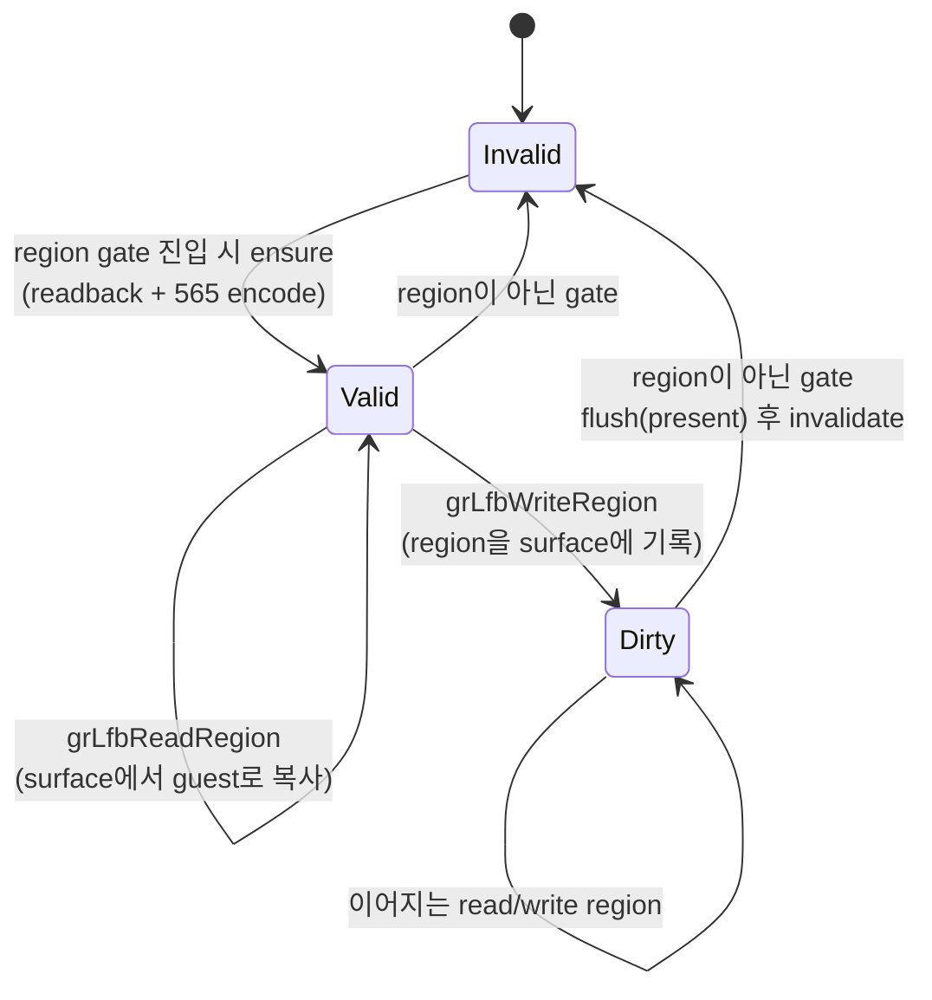
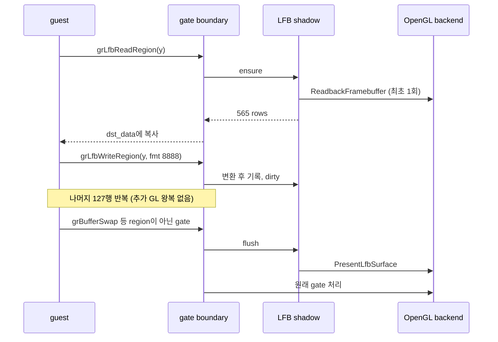

# Glide LFB region 전송 설계

## 배경

`pumpit8` 실행 로그에 두 종류의 Glide 구현 공백이 프레임마다 기록됩니다.

```
GLIDE_UNIMPLEMENTED_FUNCTION ordinal=98 name=_GRLFBREADREGION@28
  reason=lfb-read-region-noop args=0x1,0x0,0x1DF,0x280,0x1,0x0,0x051C1B28
GLIDE_UNSUPPORTED_ARGUMENT   ordinal=99 name=_GRLFBWRITEREGION@32
  reason=lfb-write-region-unsupported args=0x1,0x0,0x1DF,0x5,0x280,0x1,0x0,0x051C40F8
```

인자를 Glide 2.4 원형에 대응시키면 다음과 같습니다.

| 호출 | 인자 | 값 |
|---|---|---|
| `grLfbReadRegion` | `src_buffer, src_x, src_y, src_width, src_height, dst_stride, dst_data` | `BACK, 0, 0x1DF, 640, 1, 0, guest ptr` |
| `grLfbWriteRegion` | `dst_buffer, dst_x, dst_y, src_format, src_width, src_height, src_stride, src_data` | `BACK, 0, 0x1DF, 5, 640, 1, 0, guest ptr` |

`y`는 `0x1DF`(479)에서 1씩 내려갑니다. Glide call trace의 호출 횟수는 두 gate 모두
**1440회 = 3 x 480**이므로, 게임은 **640x480 전면 화면을 한 행씩 읽어 가공한 뒤 같은
행에 되쓰는 read-modify-write 합성**을 3회 수행합니다. 읽기가 no-op이고 쓰기가
거부되므로 이 경로는 현재 전혀 실행되지 않습니다.

> 구현 공백 기록(`repiu-fatal`)에 남는 서로 다른 인자 조합은 128개에서 잘립니다.
> 이는 `kGlideImplementationIssueRecordCapacity`이지 행 수가 아니므로, 행 수는 반드시
> Glide call trace의 `count`로 확인합니다.

같은 로그에서 `grSstWinOpen(cFormat = 1 = ABGR, origin = 1 = LOWER_LEFT)`과
`grLfbWriteColorFormat(1 = ABGR)`을 확인했습니다. 이 두 값이 아래 좌표계·색 순서
결정의 입력입니다.

## 확인된 결함

**확인됨 1 — read region 미구현.** `kGrLfbReadRegion`은 `EAX=1`만 돌려주고 픽셀을
복사하지 않습니다. guest는 자기 목적지 버퍼의 이전 내용을 프레임 버퍼 내용으로
착각하고 계산합니다.

**확인됨 2 — `GrLfbSrcFmt_t` 상수값 오류.** `include/repiu/hle/glide_lfb.h`의
`kGlideLfbSrcFmt565 = 1U`는 사양과 다릅니다. Glide 2.4 기준 값은 아래와 같고 `1`은
565가 아니라 555입니다. 따라서 현재 코드는 게임이 쓰는 `5`(8888)뿐 아니라 진짜
565(`0`)도 거부합니다.

| `GR_LFB_SRC_FMT_*` | 값 | 픽셀당 바이트 |
|---|---|---|
| `565` | `0x00` | 2 |
| `555` | `0x01` | 2 |
| `1555` | `0x02` | 2 |
| `888` | `0x04` | 4 (32비트 정렬 `0RGB`) |
| `8888` | `0x05` | 4 |
| `565_DEPTH` / `555_DEPTH` / `1555_DEPTH` | `0x0C`~`0x0E` | 4 (색 + 깊이) |
| `ZA16` | `0x0F` | 2 (깊이 전용) |
| `RLE16` | `0x80` | 가변 |

출처: 3Dfx Glide 2.4 Reference Manual, `grLfbWriteRegion` / `GrLfbSrcFmt_t`.
<https://www.bitsavers.org/components/3dfx/Glide_Reference_Manual_2.4_199707.pdf>

**확인됨 3 — stride 0 거부.** 현재 write 경로는 `src_height * |src_stride|`로 원본
크기를 구하므로 stride가 0이면 "빈 영역"으로 처리합니다. 관측된 호출은 모두
`height == 1`이라 stride가 실제로 쓰이지 않는 자리이고, 이때 유일하게 의미 있는
해석은 `width * bytes-per-pixel`입니다.

**확인됨 4 — write region이 staging surface를 seed하지 않는다.** 현재 write 경로는
region을 `glide_lfb_surface`에 기록한 뒤 **surface 전체**를 디코딩해
`PresentLfbSurface`로 올립니다. 그런데 이 surface는 직전 `grLfbLock`이 남긴 잔상
또는 0이며 프레임 버퍼로 seed되지 않습니다. 한 행만 새 값인 640x480 이미지를 화면에
덮어쓰는 셈이고, 128행을 한 행씩 처리하면 화면이 파괴됩니다. `grLfbLock` 경로는 이
문제를 이미 인지해 매 lock마다 프레임 버퍼를 읽어 seed하고 있습니다(design 257 §3.1,
`linexe_glide_boundary.cpp`의 lock seeding 주석). region 경로에는 같은 보정이
없습니다.

## 설계

### LFB region shadow

read와 write는 같은 프레임 버퍼를 공유하므로 둘을 하나의 shadow surface 수명으로
묶습니다. 기존 `glide_lfb_surface`를 그대로 재사용하고 상태 두 개를 추가합니다.

* `glide_lfb_region_shadow_valid` — surface가 현재 프레임 버퍼를 반영한다.
* `glide_lfb_region_shadow_dirty` — region write 결과가 아직 화면에 반영되지 않았다.

세 가지 연산으로 정리합니다.

* **ensure** — invalid면 `ReadbackFramebuffer` + `EncodeRgba8ToGlideLfb565`로 채우고
  valid로 만든다. read/write region 진입 시 호출한다.
* **flush** — dirty면 `DecodeGlideLfb565ToRgba8` + `PresentLfbSurface`로 back buffer에
  올리고 dirty를 내린다.
* **invalidate** — valid를 내린다. region gate가 아닌 모든 gate는 프레임 버퍼를 바꿀 수
  있으므로 flush 직후 invalidate한다.



이 규칙의 결과로 관측된 128쌍 연속 호출은 **burst당 readback 1회 + present 1회**만
발생합니다. 행마다 전체 화면을 읽고 올리면 프레임당 640x480 왕복이 128회 생기므로
정확성 이전에 실행이 불가능합니다.

flush 지점은 draw batch flush(Task 438)와 같은 gate 진입 전 훅입니다. region gate는
draw gate가 아니므로 region 진입 시 draw batch가 먼저 비워지고, 그 결과 shadow가
dirty인 동안 draw batch는 항상 비어 있습니다. 따라서 두 flush의 상대 순서는 결과를
바꾸지 않으며, "픽셀 먼저"라는 읽기 쉬운 규칙을 위해 shadow flush를 앞에 둡니다.



### 색 순서

shadow는 프레임 버퍼의 사본이므로 프레임 버퍼의 565 배치, 즉 `grSstWinOpen`의
`cFormat`(`glide_state.color_format`)을 따릅니다. PIU는 `ABGR(1)`이므로 BGR565입니다.

**source word도 색 형식을 따릅니다.** `GR_LFB_SRC_FMT_*`는 픽셀의 **크기와 비트
폭**을 지정하지, 채널 순서를 지정하지 않습니다. 채널 순서는 `grLfbWriteColorFormat`이
정하고(미호출 시 `grSstWinOpen`의 `cFormat`이 기본값), 이는 `GrColor_t`가 cFormat을
따르는 것과 같은 규칙입니다. PIU는 `grLfbWriteColorFormat(ABGR)`을 선언하므로 8888
source word는 `A<<24|B<<16|G<<8|R`, 메모리 배치는 `R,G,B,A`입니다.

따라서 변환은 "source 색 형식으로 풀고 목적지 색 형식으로 싼다"이며, 두 형식이 같은
PIU에서는 무변환 통과가 됩니다.

> **초기 설계 오류.** 처음에는 design 360의 "`GR_LFB_SRC_FMT_565` source는 명시적
> RGB565" 서술을 따라 source를 항상 RGB 순서로 읽었습니다. 실행 결과 화면의 red와
> blue가 교환되어 반증되었습니다. design 360의 그 서술은 당시 검증 불가능한
> 추정이었습니다 — `grLfbWriteRegion`은 이번 작업 전까지 한 번도 성공한 적이
> 없습니다. lock write mode에 대한 design 360의 결론은 그대로 유효합니다.

`grLfbReadRegion`은 사양상 프레임 버퍼의 native 형식을 그대로 돌려주므로 shadow의
565 바이트를 변환 없이 복사합니다.

### 좌표계 — region은 origin 상대가 아니다

`grLfbLock`은 `GrOriginLocation_t`를 명시적으로 받지만 region 전송 두 개는 받지
않습니다. 인자가 없는 이유는 region이 프레임 버퍼를 **native 배치(행 0 = 화면 위)** 로
주소지정하기 때문입니다. 따라서 `y`는 shadow 행 번호에 그대로 대응하고 뒤집지
않습니다.

`ReadbackFramebuffer`도 행 0이 화면 위인 top-down 이미지를 돌려주므로 shadow 전체가
일관되게 top-down입니다. present는 `flip_v = false`로 넘깁니다.
`PresentLfbSurface`가 이를 창 projection과 XOR하므로(`invert_v = flip_v !=
origin_lower_left_`), `false`가 두 origin 모두에서 행 0을 화면 위에 놓는 값입니다.

> **초기 설계 오류.** 처음에는 lock과 같이 origin이 `LOWER_LEFT`면 행을
> `height - 1 - y`로 뒤집었습니다. PIU의 창이 `LOWER_LEFT`이므로 실행 결과 전면
> 화면이 상하 반전되어 반증되었습니다.

### 모듈 분리

포맷 표, stride 유도, 사각형 클립, 픽셀 변환은 플랫폼 중립이므로 전용 모듈로
분리합니다.

* `include/repiu/hle/glide_lfb_region.h`, `src/hle/glide_lfb_region.cpp`
  * `GlideLfbSrcFormatBytesPerPixel`, `GlideLfbSrcFormatSupported`
  * `ResolveGlideLfbRegionStride` — stride 0이면 `width * bpp`
  * `WriteGlideLfbRegion` — 원본 포맷을 surface의 565로 변환해 기록
  * `ReadGlideLfbRegion` — surface의 565를 guest 목적지로 복사
* `linexe_glide_boundary.cpp`에는 ABI 해석, guest 메모리 범위 검사, shadow 수명
  orchestration만 남깁니다.

기존 `WriteRegionToGlideLfb565`는 `WriteGlideLfbRegion`이 상위 집합이므로 대체하고
제거합니다. 호출자는 boundary 한 곳뿐입니다.

### 범위 밖

깊이 계열(`565_DEPTH`, `555_DEPTH`, `1555_DEPTH`, `ZA16`)과 `RLE16`은 이번 범위에서
제외하고 기존과 같이 `GLIDE_UNSUPPORTED_ARGUMENT`로 기록합니다. 깊이 버퍼는 아직
LFB로 노출되지 않으며, 관측된 호출에도 나타나지 않습니다. `AUX`/`DEPTH` 버퍼 지정도
같은 이유로 제외합니다.

음수 stride(bottom-up 원본)도 제외합니다. 음수 stride는 첫 행이 가장 높은 주소에
오므로 읽을 수 있는 범위가 `src_data` **앞쪽**으로 뻗습니다. boundary가 검사하고
복사하는 범위와 어긋나므로, 관측 사례가 없는 상태에서 추측으로 처리하지 않고
거부합니다.

반환값은 두 gate 모두 `FXTRUE`를 유지합니다. work order 002가 LFB 계열에서 `FXFALSE`를
돌려주면 guest가 대기 상태로 멈추는 것을 관측했으므로, 인자를 거부할 때도 그 결정을
유지하고 공백은 `GLIDE_UNSUPPORTED_ARGUMENT` 기록으로만 드러냅니다.

## 검증

`aot_probe`에 `glide_lfb_region_probe`를 추가합니다.

1. 포맷 표: 565/555/1555는 2바이트, 888/8888은 4바이트, 깊이 계열과 `RLE16`은 미지원.
2. stride 0 유도가 `width * bpp`와 같고, 음수 stride는 그대로 유지된다.
3. 각 포맷의 알려진 픽셀 하나가 기대한 565 값으로 변환된다.
4. 색 순서: source와 목적지 형식이 같으면 무변환 통과이고, 다르면 변환된다. PIU 구성인
   ABGR→ABGR 8888이 red/blue를 교환하지 않는다.
5. surface 경계를 넘는 사각형이 클립되고 surface 밖으로 쓰지 않는다.
6. write 후 같은 사각형을 read하면 565 값이 왕복하고, 목적지 stride가 폭보다 넓을 때
   행 사이 여백을 건드리지 않는다.
7. 행 대응이 native다. `y`가 shadow 행에 그대로 대응하며 뒤집히지 않는다.

실행 검증은 `pumpit8`을 구동해 두 `repiu-fatal` 항목이 사라지는지 확인합니다.

# Glide LFB Region Transfer Design

## Background

Two Glide implementation gaps are recorded every frame in the `pumpit8` run log:
`grLfbReadRegion` (ordinal 98) is a no-op returning success, and
`grLfbWriteRegion` (ordinal 99) rejects its source format. Mapping the logged
arguments onto the Glide 2.4 prototypes shows the game reading one 640x1 row
from the back buffer and writing the same row back, walking `y` down from 479.
The Glide call trace counts **1440 calls to each — `3 x 480`**, three
full-screen read-modify-write composites over the 640x480 screen. Neither half
currently happens. (The `repiu-fatal` record truncates distinct argument sets at
`kGlideImplementationIssueRecordCapacity` = 128, which is not a row count; the
call trace `count` is.) The same log pins `grSstWinOpen` to `cFormat = 1` (ABGR)
and `origin = 1` (`GR_ORIGIN_LOWER_LEFT`), with `grLfbWriteColorFormat(1)`;
those three values drive the coordinate and color-order decisions below.

## Confirmed defects

1. **Read region unimplemented.** The gate returns `EAX=1` without copying
   pixels, so the guest computes on whatever its own destination buffer already
   held.
2. **`GrLfbSrcFmt_t` constant is wrong.** `kGlideLfbSrcFmt565 = 1U` does not
   match the specification, where `GR_LFB_SRC_FMT_565` is `0x00` and `0x01` is
   555. The current test therefore rejects the `5` (8888) the game passes and
   also rejects genuine 565. The full value table and bytes per pixel appear in
   the Korean section; the source is the 3Dfx Glide 2.4 Reference Manual.
3. **Stride 0 rejected.** The write path derives the source size from
   `height * |stride|`, so a zero stride reads as an empty region. Every
   observed call has `height == 1`, where the stride is never used and the only
   meaningful reading is `width * bytes-per-pixel`.
4. **Write region never seeds the staging surface.** It writes the region into
   `glide_lfb_surface` and then presents the *entire* surface, which was never
   filled from the frame buffer — only leftovers from a previous lock, or
   zeros. Presenting a 640x480 image in which one row is fresh, 128 times per
   frame, destroys the picture. The `grLfbLock` path already carries the
   opposite correction and reseeds from the frame buffer on every lock.

## Design

Read and write share one frame buffer, so they share one shadow lifetime built
on the existing `glide_lfb_surface` plus two flags (`shadow_valid`,
`shadow_dirty`) and three operations: **ensure** (read back the frame buffer and
encode it to 565 when invalid), **flush** (decode and present when dirty), and
**invalidate** (after flushing, at every gate that is not a region gate, since
any other gate may change the frame buffer). The state machine and the call
sequence are diagrammed in the Korean section.

The consequence is one readback and one present per burst rather than per row.
Per-row round trips would mean 128 full-screen transfers per frame, which fails
on performance before accuracy is even in question. The flush hook is the same
pre-dispatch point as the Task 438 draw-batch flush; because region gates are
non-draw gates, the draw batch is always empty while the shadow is dirty, so the
relative order of the two flushes cannot change the result.

The shadow mirrors the frame buffer and therefore uses the frame buffer's 565
byte order — `grSstWinOpen`'s `cFormat`, which is `ABGR` and hence BGR565 for
PIU. **The source word follows a color format too**: `GR_LFB_SRC_FMT_*` fixes
the pixel's size and bit widths, while `grLfbWriteColorFormat` (defaulting to
the window `cFormat`) fixes its channel order, the same rule `GrColor_t` obeys.
PIU declares ABGR, so an 8888 source word is `A<<24|B<<16|G<<8|R` with bytes
`R,G,B,A`. Conversion is therefore "unpack in the source format, pack in the
destination format", which is a pass-through when they agree, as they do here.
`grLfbReadRegion` returns the frame buffer's native format, so its 565 bytes are
copied out unconverted.

Region `y` is **not** origin-relative. `grLfbLock` takes an explicit
`GrOriginLocation_t` and the region entry points take none, because they address
the frame buffer in its native layout where row 0 is the top; `y` maps straight
onto the shadow row. `ReadbackFramebuffer` is top-down as well, so the whole
shadow is consistently top-down and the present passes `flip_v = false` —
`PresentLfbSurface` XORs that against the window projection
(`invert_v = flip_v != origin_lower_left_`), making `false` the value that puts
row 0 at the top of the screen under either origin.

Both of these corrected an initial design error caught by running the game. The
first draft followed design 360's inference that a `GR_LFB_SRC_FMT_565` source
is explicitly RGB-ordered and mirrored region rows the way a lock's origin
would; the rendered screen came out upside down with red and blue swapped.
Design 360 could not have tested that inference, because `grLfbWriteRegion`
never once succeeded before this task; its conclusions about lock write modes
still stand.

The format table, stride derivation, rectangle clipping, and pixel conversion
are platform neutral and move into a dedicated `glide_lfb_region` header and
source, leaving ABI decoding, guest-range checks, and shadow orchestration in
the boundary. `WriteRegionToGlideLfb565` is superseded by `WriteGlideLfbRegion`
and removed; the boundary is its only caller.

Depth-carrying source formats, `RLE16`, and the `AUX`/`DEPTH` buffers stay out
of scope and keep reporting `GLIDE_UNSUPPORTED_ARGUMENT`; no LFB depth surface
is exposed yet and none of the observed calls use them. Negative strides are
declined for a stronger reason: a bottom-up image places its first row at the
highest address, so the readable span runs *below* `src_data` and no longer
matches the range the boundary validated and copied. With no observed use, the
honest answer is to decline rather than guess. Both gates keep returning
`FXTRUE` even when declining, because work order 002 observed that an `FXFALSE`
from the LFB family stalls the guest; the gap stays visible through the
recorded `GLIDE_UNSUPPORTED_ARGUMENT` instead.

## Verification

A new `glide_lfb_region_probe` in `aot_probe` covers the format table, stride
derivation including 0 and negative strides, one known pixel per format, the
color-order rule (identical source and destination formats pass through, mixed
ones translate), clipping at the surface edge, a write/read round trip with a
destination stride wider than the copied width, and native row mapping. Live
verification runs `pumpit8` and checks that both `repiu-fatal` entries disappear
and that the full-screen LFB composite renders upright with correct colors.
