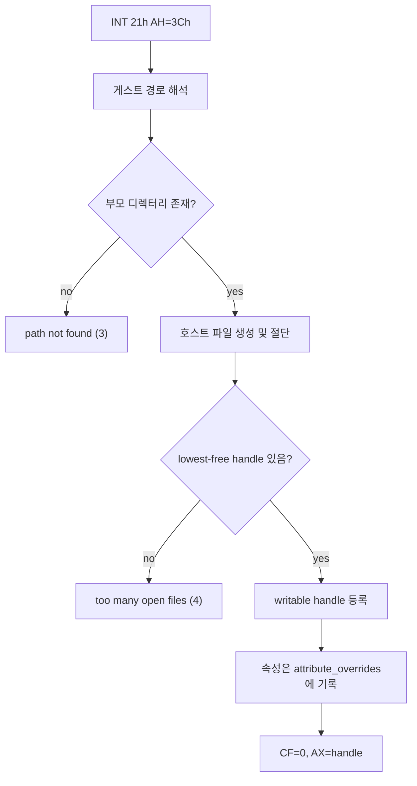

# DOS 파일 생성·쓰기 서비스 설계

## 관측

`pumpit8`이 약 25초 구동 뒤 종료했습니다. 종료 사유는 로그에 명시되어 있습니다.

```
Win32 minimal execution message: unsupported DOS INT 21h AH=0x3c
Win32 minimal execution exception EIP: 0x040F8417
Relocated exception bytes: 05 B9 01 00 00 00 81 E1 FF 00 00 00 89 F2 B4 3C [CD] 21 ...
Win32 exception register string ESI: "ERRLOG.txt....bga\00.dat.font.tg"
```

바이트를 풀면 호출 형태가 그대로 드러납니다.

```asm
B9 01 00 00 00        mov  ecx, 1          ; CX = 속성 (read-only)
81 E1 FF 00 00 00     and  ecx, 0FFh
89 F2                 mov  edx, esi        ; DS:EDX = "ERRLOG.txt"
B4 3C                 mov  ah, 3Ch
CD 21                 int  21h             ; <-- 여기서 종료
D1 D0 D1 C8           rcl/ror eax, 1       ; 반환 handle 검사 관용구
```

`INT 21h AH=3Ch`는 DOS **Create or Truncate File**입니다. 현재 INT 21h 처리 목록은
`09 19 25 2A 2C 30 35 3B 3D 3E 3F 40 42 43 44 47 4A 4C FF ED`이고 **`3C`가
없습니다**. 미지원 AH는 `hle_message`를 남기고 실행을 끝냅니다.

이 구동에서 Glide 구현 공백(`repiu-fatal`)은 **0건**입니다. Task 476의 LFB region
경로는 완결되었고, 이번 종료는 그와 무관한 다음 frontier입니다.

## 현재 구조에서 무엇이 없는가

DOS 가상 파일 시스템은 **읽기 전용**입니다.

| 기능 | 현재 상태 |
|---|---|
| `OpenDosFile` | 존재하는 파일만 연다. handle은 5부터 lowest-free 할당(Task 228) |
| `ReadDosFile` / `SeekDosFile` / `CloseDosFile` | 있음 |
| 생성 | **없음** |
| 쓰기 | **없음.** `AH=40h`는 handle을 무시하고 전량 콘솔로 보낸 뒤 성공을 보고한다 |

`DosOpenFileHandle::cached_file_size` 주석은 이미 이 시점을 예고하고 있습니다 —
"Safe to cache because this API has no write path -- add invalidation here if one is
ever introduced."

## 설계

### 생성 위치는 게스트 디렉터리

생성 파일은 mount root 아래, 즉 게스트가 지정한 경로 그대로 만듭니다. 원본 PIU가
`PIU.EXE` 옆에 `ERRLOG.txt`를 만들던 것과 같고, 게스트가 나중에 되읽어도 기존 읽기
경로가 그대로 찾습니다. 별도 overlay 루트를 두면 open 해석 순서라는 새 규칙이 생기는데,
그것을 정당화할 관측이 아직 없습니다.

대신 성질 하나를 기록해 둡니다. mount cache가 무효화되면
`piu_chd_mount.cpp`가 `remove_all(mount_root)` 후 재추출하므로 **게스트가 만든 파일은
지워집니다.** 로그성 파일에는 맞는 성질이고, 영속성이 필요한 게스트 쓰기가 관측되면
그때 overlay를 설계합니다.

### 쓰기 가능한 handle

`DosOpenFileHandle`에 `writable`과 출력 스트림 캐시를 추가합니다. 읽기 캐시
(`DosHostFileCache`, `ifstream`)와 같은 이유로 스트림을 유지합니다 — 매 쓰기마다 호스트
파일을 다시 여는 것은 Task 374가 읽기에서 측정한 것과 같은 비용입니다.

`cached_file_size`는 쓰기로 커질 수 있으므로 쓰기 시 갱신합니다. 이것이 헤더 주석이
예고한 무효화 지점입니다.



### 속성은 호스트에 적용하지 않는다

게임은 `CX = 1`, 즉 read-only 속성으로 생성합니다. DOS에서는 생성 직후의 handle로
계속 쓸 수 있지만, 호스트에 `FILE_ATTRIBUTE_READONLY`를 걸면 **바로 다음 쓰기가
막힙니다.** 따라서 속성은 호스트 파일에 적용하지 않고 이미 있는
`DosVirtualFileSystemState::attribute_overrides`에 기록합니다. `AH=43h` 조회는 그
값을 그대로 보게 되므로 게스트 관점의 의미는 보존됩니다.

### `AH=40h` 라우팅

현재 `AH=40h`는 handle을 보지 않고 전량 콘솔로 보냅니다. 이를 다음으로 바꿉니다.

* handle이 VFS의 열린 쓰기 가능 handle이면 → 호스트 파일에 쓴다.
* 그 외(표준 handle 0~4 포함, 미지의 handle) → **기존 동작 그대로** 콘솔.

VFS handle은 5부터 할당되므로 표준 출력 경로는 영향을 받지 않습니다.

쓰기는 읽기와 같은 방식으로 `dos_file_io` trace에 남깁니다. 그 결과 `ERRLOG.txt`에
기록되는 게임 자신의 오류 메시지가 우리 로그에도 바이트 prefix로 보입니다. 이것이 이
작업의 부수적이지만 큰 소득입니다 — 게임이 무엇을 오류로 판단했는지 알 수 있습니다.

### `AH=3Dh`의 쓰기 접근 모드

`AH=3Dh`의 access mode 하위 2비트가 write(1) 또는 read/write(2)면 handle을 쓰기
가능으로 표시합니다. 파일이 이미 존재해야 한다는 기존 규칙과 읽기 경로는 그대로입니다.
이것이 없으면 게스트가 로그를 다시 열어 이어 쓸 때 같은 벽에 부딪힙니다.

## 범위 밖

* `AH=5Bh`(Create New File, 존재하면 실패), `AH=41h`(Delete), `AH=56h`(Rename),
  `AH=39h`/`3Ah`(mkdir/rmdir), `AH=5Ah`(임시 파일)은 관측되지 않았으므로 제외합니다.
* 영속 overlay와 open 해석 순서는 위 근거로 제외합니다.
* SFT 공유 모드와 잠금(`AH=5Ch`)은 단일 프로세스 게스트에 의미가 없으므로 제외합니다.

## 검증

`aot_probe`에 `dos_file_create_probe`를 추가합니다.

1. 생성이 새 파일을 만들고 5번 handle을 돌려준다.
2. 같은 경로를 다시 생성하면 기존 내용이 0바이트로 절단된다.
3. 부모 디렉터리가 없으면 path-not-found로 거절한다.
4. 쓰기가 파일 오프셋을 전진시키고 `cached_file_size`를 갱신한다.
5. 생성·쓰기·닫기 후 같은 경로를 열어 읽으면 쓴 내용이 그대로 나온다.
6. read-only 속성으로 생성해도 쓰기가 성공하고, `AH=43h` 조회는 그 속성을 본다.
7. handle 20개가 소진되면 too-many-open-files로 거절한다.

실행 검증은 `pumpit8`을 구동해 `AH=0x3c` 종료가 사라지는지, 그리고 게임이 `ERRLOG.txt`에
무엇을 쓰는지 확인합니다.

# DOS File Create and Write Design

## Observation

`pumpit8` ran for about 25 seconds and then stopped with
`unsupported DOS INT 21h AH=0x3c`. The bytes at the faulting EIP decode to
`mov ecx,1` / `and ecx,0FFh` / `mov edx,esi` / `mov ah,3Ch` / `int 21h`, with
`ESI` pointing at `"ERRLOG.txt"` — DOS **Create or Truncate File** with a
read-only attribute. `3C` is absent from the handled INT 21h set
(`09 19 25 2A 2C 30 35 3B 3D 3E 3F 40 42 43 44 47 4A 4C FF ED`), and an
unhandled AH ends execution. This run recorded **zero** Glide implementation
gaps, so Task 476's LFB work is complete and this is an unrelated next frontier.

## What is missing

The DOS virtual file system is read-only: it opens existing files, reads, seeks,
and closes, with handles allocated lowest-free from 5 (Task 228). There is no
create and no write — `AH=40h` ignores the handle, sends everything to the
console, and reports success. `DosOpenFileHandle::cached_file_size` already
carries the note that it is safe to cache only while no write path exists.

## Design

Created files land in the mount root at the guest's own path, matching what the
original PIU did next to `PIU.EXE` and letting the unchanged read path find them
again. A separate writable overlay would introduce an open-resolution order that
no observation yet justifies. One property is worth recording: invalidating the
mount cache makes `piu_chd_mount.cpp` `remove_all` the root and re-extract, so
guest-created files disappear — correct for a log file, and the point at which an
overlay becomes worth designing is the first durable guest write we actually see.

`DosOpenFileHandle` gains a `writable` flag and an output stream cache for the
same reason the read path caches its `ifstream` (Task 374), and writing updates
`cached_file_size`, which is the invalidation point the header anticipated. The
guest creates with `CX = 1`, a read-only attribute; DOS keeps writing through the
handle it just returned, while stamping `FILE_ATTRIBUTE_READONLY` on the host
file would block the very next write. The attribute therefore goes into the
existing `attribute_overrides` table rather than onto the host file, so `AH=43h`
still reports what the guest set.

`AH=40h` becomes routed: an open writable VFS handle writes to the host file,
and everything else — standard handles 0-4 included — keeps today's console
behavior, which is safe because VFS handles start at 5. Writes are traced like
reads, so the game's own error text reaches our log as a byte prefix; learning
what the game considers an error is the larger prize here. `AH=3Dh` marks the
handle writable when its access mode is write or read/write, so reopening the
log to append does not hit the same wall.

Create-new (`5Bh`), delete, rename, mkdir/rmdir, temporary files, share modes,
and record locking stay out of scope; none appear in the observed run.

## Verification

A new `dos_file_create_probe` covers creation and handle numbering, truncation of
an existing file, a missing parent directory, write advancing the offset and the
cached size, a create/write/close/reopen/read round trip, a read-only attribute
that still accepts writes and is visible to `AH=43h`, and handle exhaustion.
Live verification runs `pumpit8` to confirm the `AH=0x3c` stop is gone and to
read what the game writes into `ERRLOG.txt`.
