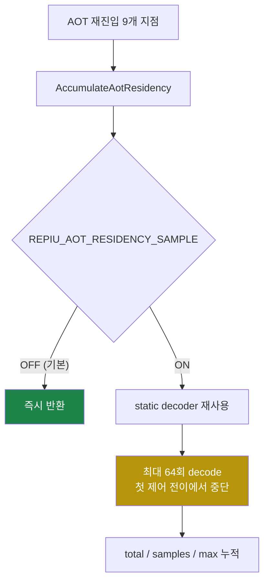

# AOT residency 표본화 게이트 설계

## 배경

`pumpit8` 실행의 cycle 프로파일(2026-08-13, wall 117초, `guest-run`
314,692,501,094 cycle, buffer swap 691회 = 약 8.1 fps)에서 `kAotResidency` 버킷이
단독으로 `guest-run`의 **13.67%** 를 차지했습니다.

```
Win32 aot transfer function cycles resolve/hle-boundary-scan/dynamic-translate/residency:
  13729791237/447696548/8931653191/43004277414
Win32 aot transfer function count  resolve/hle-boundary-scan/dynamic-translate/residency:
  2943365/4594054/263/3076235
```

| 항목 | 값 |
|---|---:|
| `kAotResidency` cycles | 43,004,277,414 |
| `guest-run` 대비 | **13.67%** |
| 호출 수 | 3,076,235 |
| **호출당** | **13,979 cycle (약 3.8 µs)** |

이 버킷의 유일한 생산자는 `AccumulateAotResidency`입니다. 이 함수는 게임 로직에
기여하지 않습니다. Task 263(b)가 도입한 **진단용 residency proxy** — 재진입 지점에서
첫 제어 전이까지의 직선 게스트 명령 수(상한 64) — 를 표본화할 뿐이고, 결과는
`Win32 AOT residency total/samples/avg/max/coverage%` 한 줄로만 소비됩니다.

즉 **게스트 wall clock의 13.67%가 로그 한 줄을 위해 쓰이고 있습니다.**

## 확인된 결함

**확인됨 1 — 게이트가 없습니다.**
`AccumulateAotResidency`는 9개 호출 지점 전부에서 조건 없이 실행됩니다.

| 파일 | 줄 |
|---|---:|
| `src/platform/win32/aot/aot_dbt_dispatch.cpp` | 264 |
| `src/platform/win32/aot/aot_dbt_hle_dispatch.cpp` | 173, 301 |
| `src/platform/win32/aot/aot_dbt_glide_gate_dispatch.cpp` | 109 |
| `src/platform/win32/aot/aot_runtime_dispatch.cpp` | 1251, 1448, 1634, 1921, 2050 |

함수 안의 `ExecutionTimeScope`는 `execution_time_profile`이 null이면 계측을
건너뛰지만, **그 아래 Zydis 루프에는 어떤 분기도 없습니다.** 따라서 이 비용은
`REPIU_EXECUTION_TIME_PROFILE`을 끈 평상시 실행에도 그대로 존재합니다. 프로파일을
켜서 처음 보인 것이지 프로파일이 만든 비용이 아닙니다.

**확인됨 2 — decoder를 호출마다 다시 초기화합니다.**
`ZydisDecoderInit`이 루프 밖이긴 하지만 **함수 안**에 있어 3,076,235회 실행됩니다.
decoder 상태는 `(LEGACY_32, STACK_WIDTH_32)` 고정이므로 실행 중 변하지 않습니다.

**확인됨 3 — 표본당 디코드가 많습니다.**
호출당 13,979 cycle은 `ZydisDecoderDecodeFull`(피연산자까지 채우는 가장 비싼 API)이
표본당 평균 약 28회 도는 값에 해당합니다. 상한 64에 자주 닿고 있다는 뜻이며, 이는
proxy가 의도한 대로 동작한 결과입니다 — 결함은 **빈도**이지 알고리즘이 아닙니다.

## 설계

### 결정 1 — opt-in 게이트, 기본 OFF

`REPIU_AOT_RESIDENCY_SAMPLE`을 `ResolveOptInToggle`로 읽습니다. 미설정과 빈 값은
OFF이고 `1|on|true`만 켭니다.

`ResolvePromotedToggle`(기본 ON)이 아니라 `ResolveOptInToggle`을 쓰는 근거는, 이
기능이 **A/B로 승격된 최적화가 아니라 진단 계측**이기 때문입니다. 프로젝트의 다른
진단 계측(`REPIU_GLIDE_SETTER_CENSUS`, `REPIU_GLIDE_ORDINAL_TIME_PROFILE`,
`REPIU_EXECUTION_TIME_PROFILE`)이 모두 같은 규약을 씁니다.

### 결정 2 — 전용 파일로 분리

`AGENTS.md`의 "독립적으로 이름 붙일 수 있는 하위 시스템은 전용 파일로 추출한다"에
따라 residency 표본기를 `src/platform/win32/telemetry/aot_residency_sample.cpp`로
옮깁니다. 위치는 같은 성격의 계측이 모여 있는 `telemetry/`입니다.

**함수 이름 `AccumulateAotResidency`는 유지합니다.** 9개 호출 지점은 include 경로만
바뀌고 호출 형태는 그대로여서, 이번 변경의 diff가 "게이트 + 이동"에만 머무릅니다.

### 결정 3 — decoder는 1회 초기화

함수 지역 `static`으로 승격합니다. 게스트 스레드가 단일이고 초기화 인자가 상수이며
`ZydisDecoder`는 디코드 중 변경되지 않으므로 재진입 위험이 없습니다.

게이트가 OFF면 decoder 초기화 자체가 일어나지 않도록 게이트 검사를 가장 앞에 둡니다.

### 결정 4 — 보고에 게이트 상태를 남깁니다

게이트가 OFF일 때 `samples=0`은 "직선 구간이 0"이 아니라 "재지 않았음"입니다. 둘을
구분하지 못하면 나중 세션이 0을 결과로 오독합니다. 따라서 요약 줄에 상태를 넣습니다.

```
Win32 AOT residency enabled/total/samples/avg/max/coverage%: false/0/0/0.00/0/0.00
```

### 흐름



## 이 변경이 하지 않는 것

* **패치 횟수와 단가는 건드리지 않습니다.** IC 패치 축(측정 46.75% 중 나머지)은
  Task 479 이후의 별도 작업입니다.
* **게스트 동작을 바꾸지 않습니다.** 표본기는 게스트 메모리를 읽기만 하고 레지스터,
  메모리, 제어 흐름 어느 것도 쓰지 않습니다. 따라서 정확성 회귀 위험이 없습니다.

## 검증

1. `aot_probe`의 기존 항목이 모두 통과합니다.
2. 게이트 OFF(기본) 실행에서 `Win32 AOT residency enabled: false`, `samples=0`.
3. 게이트 ON 실행에서 `samples`가 0이 아니고 `avg`가 이전 실행과 같은 크기입니다.
4. `pumpit8` 동일 장면 A/B에서 `kAotResidency`가 43.0e9 → 0에 가깝게 떨어지고,
   fps가 오릅니다. 프레임당 작업량(패치 수, primitive 수)이 3% 이내로 일치할 때만
   fps 비교를 인정합니다(2026-08-07 세션 방법 규칙).
5. `pumpit1` 회귀 없음.

측정은 vsync OFF에서 수행합니다(`REPIU_GLIDE_SWAP_INTERVAL=0`).

---

# AOT Residency Sampling Gate Design

## Background

A cycle profile of `pumpit8` (2026-08-13, 117 s wall, `guest-run`
314,692,501,094 cycles, 691 buffer swaps ≈ 8.1 fps) put the `kAotResidency`
bucket alone at **13.67%** of `guest-run`.

| Item | Value |
|---|---:|
| `kAotResidency` cycles | 43,004,277,414 |
| Share of `guest-run` | **13.67%** |
| Calls | 3,076,235 |
| **Per call** | **13,979 cycles (≈3.8 µs)** |

The bucket's only producer is `AccumulateAotResidency`, which contributes nothing
to game logic. It samples the **diagnostic residency proxy** introduced by Task
263(b) — the straight-line guest instruction count from a re-entry point to the
first control transfer, capped at 64 — and the result is consumed by exactly one
log line, `Win32 AOT residency total/samples/avg/max/coverage%`.

**13.67% of guest wall clock is being spent on one log line.**

## Confirmed defects

**Confirmed 1 — there is no gate.** `AccumulateAotResidency` runs unconditionally
from all nine call sites (`aot_dbt_dispatch.cpp:264`,
`aot_dbt_hle_dispatch.cpp:173,301`, `aot_dbt_glide_gate_dispatch.cpp:109`,
`aot_runtime_dispatch.cpp:1251,1448,1634,1921,2050`). The `ExecutionTimeScope`
inside skips timing when `execution_time_profile` is null, but **no branch guards
the Zydis loop below it.** The cost is therefore present in ordinary runs with
`REPIU_EXECUTION_TIME_PROFILE` off; profiling revealed it rather than caused it.

**Confirmed 2 — the decoder is re-initialized per call.** `ZydisDecoderInit` sits
outside the loop but inside the function, so it runs 3,076,235 times for a state
fixed at `(LEGACY_32, STACK_WIDTH_32)`.

**Confirmed 3 — samples decode a lot.** 13,979 cycles per call corresponds to
roughly 28 `ZydisDecoderDecodeFull` calls per sample, so the cap of 64 is
frequently approached. That is the proxy working as designed — the defect is
**frequency**, not the algorithm.

## Design

**Decision 1 — opt-in gate, default OFF.** Read
`REPIU_AOT_RESIDENCY_SAMPLE` through `ResolveOptInToggle`: unset and empty mean
OFF, and only `1|on|true` enables it. `ResolveOptInToggle` rather than
`ResolvePromotedToggle` because this is **diagnostic instrumentation, not an
A/B-promoted optimization**, matching `REPIU_GLIDE_SETTER_CENSUS`,
`REPIU_GLIDE_ORDINAL_TIME_PROFILE`, and `REPIU_EXECUTION_TIME_PROFILE`.

**Decision 2 — move to a dedicated file.** Following the `AGENTS.md` rule that an
independently nameable subsystem gets its own file, the sampler moves to
`src/platform/win32/telemetry/aot_residency_sample.cpp`, alongside the other
instrumentation. **The name `AccumulateAotResidency` is kept**, so the nine call
sites change only their include and this task's diff stays at "gate plus move".

**Decision 3 — initialize the decoder once**, as a function-local `static`. The
guest thread is single, the init arguments are constant, and `ZydisDecoder` is
not mutated while decoding. The gate check goes first so a disabled sampler never
initializes the decoder at all.

**Decision 4 — report the gate state.** With the gate off, `samples=0` means "not
measured", not "zero straight-line instructions". The summary line carries the
state so a later session cannot misread the zero:

```
Win32 AOT residency enabled/total/samples/avg/max/coverage%: false/0/0/0.00/0/0.00
```

## What this change does not do

* **It does not touch patch count or unit price.** The inline-cache axis (the rest
  of the measured 46.75%) is separate work, Task 479 onward.
* **It does not change guest behavior.** The sampler only reads guest memory and
  writes no register, memory, or control flow, so there is no accuracy risk.

## Verification

1. Existing `aot_probe` items still pass.
2. With the gate off (default): `Win32 AOT residency enabled: false`, `samples=0`.
3. With the gate on: `samples` is non-zero and `avg` matches earlier runs.
4. A same-scene `pumpit8` A/B drops `kAotResidency` from 43.0e9 to near zero and
   raises fps. The fps comparison counts only when per-frame work (patches,
   primitives) agrees within 3%, per the 2026-08-07 session method rule.
5. No `pumpit1` regression.

Measure with vsync off (`REPIU_GLIDE_SWAP_INTERVAL=0`).
