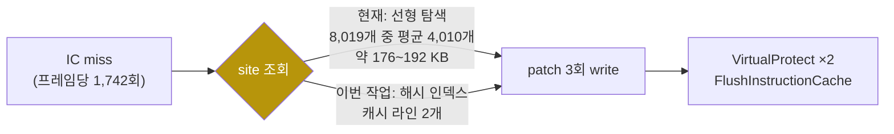
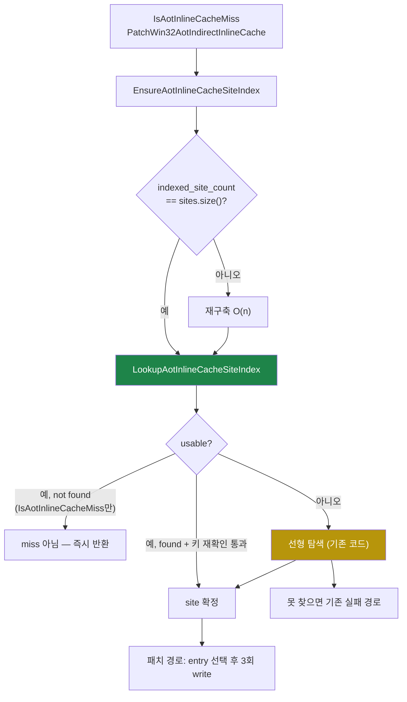

# inline-cache 패치 site 조회 인덱스 설계

## 배경

Task 478의 `pumpit8` cycle 프로파일(2026-08-13, vsync OFF, wall 117초, `guest-run`
314,692,501,094 cycle, buffer swap 691회 = 약 8.1 fps)에서 `kAotReturn` 버킷이
`guest-run`의 **46.75%**(147,128,180,784 cycle)였습니다. 그중 중첩 버킷
(`kAotResidency` 13.67%, `kAotTransferResolve` 4.36%)을 뺀 **나머지 약 28.7%
(약 90.4e9 cycle)가 inline-cache 패치 경로**입니다.

| 항목 | 값 |
|---|---:|
| 패치 호출 수 | 1,203,695 (프레임당 1,742) |
| 패치 회당 | 약 75,100 cycle (약 20 µs) |
| `guest-run` 대비 | 약 28.7% |
| site 수 | 8,019 |

Task 478은 이 중 순수 계측이던 `kAotResidency`만 게이트로 걷어냈고, **패치 자체의
단가는 그대로 남겨 두었습니다.** 이 작업이 그 단가를 다룹니다.

## 확인된 결함 — 선형 탐색

`PatchWin32AotIndirectInlineCache`는 miss 주소로 site를 찾을 때 site 배열 전체를
선형 탐색합니다.

[`aot_code_cache_win32.cpp:1689`](../../src/platform/win32/aot_code_cache_win32.cpp#L1689):

```cpp
const std::uint32_t miss_offset = cache_miss_address - placement->base_address;
runtime::AotIndirectInlineCacheSite* selected = nullptr;
for (auto& site : placement->indirect_inline_cache_sites)
{
    if (miss_offset == site.miss_cache_offset ||
        miss_offset == site.miss_cache_offset + 1U)
    {
        selected = &site;
        break;
    }
}
```

`AotIndirectInlineCacheSite`는 `std::uint32_t` 6개 + `std::vector<AotInlineCacheEntry>`
+ 커서 + `bool` 2개로 32비트 빌드에서 약 44~48바이트입니다. site가 8,019개이므로 배열은
**약 353~385 KB**이고, 첫 일치에서 멈추므로 평균 절반인 **약 176~192 KB를 패치마다
스트리밍**합니다. 캐시 라인 약 3,000개에 해당하며, 회당 75,100 cycle과 자릿수가 맞습니다.
같은 함수의 `VirtualProtect` 2회와 `FlushInstructionCache`는 이에 비하면 부차적입니다.

**이 결함은 이미 한 번 해결된 적이 있습니다.** Task 334는 `FindAotGuestAddress`의
**동일한 형태의 선형 탐색**을 "reentry 핸들러의 96.00%, 게스트 wall clock의 약 44%,
회당 551,864 tick"으로 기록하고 `LookupAotGuestAddressIndex`로 O(log n)화했습니다.
패치 경로는 그 인덱스를 받지 못한 채 남아 있었습니다.

### 같은 탐색이 한 곳 더 있습니다 — 그쪽이 더 나쁩니다

설계 중 확인한 사실입니다. `IsAotInlineCacheMiss`
([`aot_runtime_dispatch.cpp:853`](../../src/platform/win32/aot/aot_runtime_dispatch.cpp#L853))는
**키도 배열도 같은 선형 탐색**이며, indirect dispatch(`:1310`)와 return
dispatch(`:1529`) 양쪽에서 **패치를 시도하기 직전에** 호출됩니다.

| | 패치 경로 | `IsAotInlineCacheMiss` |
|---|---|---|
| 호출 조건 | miss로 판정된 경우만 | **모든 indirect·return dispatch** |
| 일치 시 | 첫 일치에서 중단(평균 절반) | 첫 일치에서 중단 |
| **불일치 시** | — | **8,019개 전부 순회(약 353 KB)** |

즉 패치 1회에는 이 탐색이 **최소 2회**(miss 판정 + 패치) 들어가고, 패치로 이어지지
않는 dispatch마다 **최악의 경우**가 한 번씩 더 실행됩니다. Task 478이 "나머지 약
28.7%, 대부분 IC 패치"라고 적은 버킷에는 이 호출도 함께 들어 있습니다. 따라서 이번
작업은 **두 지점 모두**를 인덱스로 바꿉니다. 한쪽만 고치면 같은 배열을 도는 비용이
그대로 남습니다.



## 설계

### 결정 1 — `miss_cache_offset` 해시 인덱스, 전용 모듈

`AGENTS.md`의 "독립적으로 이름 붙일 수 있는 하위 시스템은 전용 파일로 추출한다"에 따라
`include/repiu/platform/win32/aot_inline_cache_site_index.h`와
`src/platform/win32/aot_inline_cache_site_index.cpp`를 추가합니다. 구조는 Task 324의
`aot_cache_address_index`와 같은 모양입니다.

| 구성 | 내용 |
|---|---|
| `buckets` | 2의 거듭제곱 크기, 각 원소는 chain head site index 또는 `kInvalidIndex` |
| `next_in_bucket` | site 배열과 평행, 같은 bucket의 다음 site index |
| `indexed_site_count` | `indirect_inline_cache_sites.size()`와 같을 때만 유효 |

해시는 기존 인덱스와 같은 Knuth 승산 해시입니다. 8,019개 site면 bucket 16,384개
(64 KB) + `next_in_bucket` 32 KB로 약 96 KB이고, 조회는 캐시 라인 2개를 만집니다.

**이진 탐색이 아니라 해시인 이유:** Task 334가 이진 탐색을 쓴 것은 조회 키가 **구간**
(`[cache_offset, cache_offset + emitted_length)`)이었기 때문입니다. 여기 키는 **정확히
두 값**(`miss_cache_offset`, `miss_cache_offset + 1`)뿐이므로 구간 탐색이 필요 없고,
정렬 가정도 세우지 않아도 됩니다.

### 결정 2 — 조회 의미를 선형 탐색과 정확히 같게

선형 탐색은 두 조건 중 하나를 만족하는 **배열 순서상 첫 site**를 고릅니다. 인덱스는
`miss_offset`과 `miss_offset - 1` 두 키의 chain을 모두 훑어 **가장 작은 site index**를
돌려줍니다. 두 site의 miss offset이 1 차이로 인접하는 병리적 배치에서도 같은 답이 나옵니다.

### 결정 3 — 인덱스는 캐시이지 전제가 아닙니다

Task 324/334가 세운 규약을 그대로 지킵니다.

* `indexed_site_count != sites.size()`이면 인덱스는 **사용 불가**로 보고하고 호출자는
  기존 선형 탐색을 그대로 실행합니다.
* 인덱스가 돌려준 site가 실제로 키와 일치하는지 **다시 확인**합니다. 개수가 그대로인 채
  offset만 바뀌는 변경이 나중에 생겨도 잘못된 site를 패치하지 않고 탐색으로 내려갑니다.
* 패치 경로에서는 인덱스가 "없음"이라고 답해도 **선형 탐색으로 한 번 더 확인한
  뒤에만** 실패로 보고합니다. 그 실패 경로는 로그를 남기는 희귀 경로이므로 이 확인은
  비용이 되지 않고, 관측 가능한 동작이 변경 전과 완전히 동일해집니다.

즉 이 변경의 실패 모드는 **느려지는 것**이지 틀리는 것이 아닙니다.

**`IsAotInlineCacheMiss`에서는 "없음"을 그대로 신뢰합니다.** 여기서는 "없음"이 흔한
답이므로 탐색으로 확인하면 없애려는 비용이 그대로 돌아옵니다. 인덱스가 usable일 때
답은 정확하며, site의 `miss_cache_offset`은 append 시 보정된 뒤로 변경되지 않습니다
([`aot_code_cache_win32.cpp:1328`](../../src/platform/win32/aot_code_cache_win32.cpp#L1328)).
두 경로 모두 usable하지 않으면 탐색으로 내려가는 것은 같고, 차이는 **어느 실패를
추가로 방어하느냐**뿐입니다.

### 결정 4 — 갱신은 개수 불일치 시 재구축

site 배열은 두 곳에서만 바뀝니다.

| 경로 | 동작 |
|---|---|
| `PlaceWin32AotCodeCache` | 이미지의 site 배열을 통째로 대입 |
| `AppendWin32DynamicAotTranslation` | 새 이미지의 site를 offset 보정해 append |

어느 쪽도 site를 지우지 않으므로 개수 비교만으로 무효화를 판정할 수 있습니다. Task 324가
쓴 증분 append 링크는 도입하지 않습니다. 같은 프로파일에서 dynamic translate는 **263회**,
패치는 **1,203,695회**이므로 append 배치마다 O(n) 재구축 한 번은 무시할 수 있고, 훅을
줄이면 append 경로의 실수 여지도 줄어듭니다.

재구축 시점은 `PatchWin32AotIndirectInlineCache` 진입부의 `EnsureAotInlineCacheSiteIndex`
한 곳입니다. placement를 직접 만드는 probe들도 이 경로로 자동 처리됩니다.

### 결정 5 — 스레드

패치는 게스트 스레드(Task 445 기본) 또는 worker 스레드(대조군)에서 실행되지만, worker는
게스트가 `WaitForSingleObject(INFINITE)`로 멈춰 있는 동안에만 돕니다. 즉 캐시를 만지는
스레드는 항상 하나입니다. 인덱스는 placement 안에 있으므로 같은 상호 배제 아래 놓이고,
추가 동기화가 필요 없습니다.

### 결정 6 — 인덱스가 실제로 쓰였는지 보고

live 실행에서 인덱스가 조용히 무효화되어 계속 선형 탐색으로 도는 상황을 구분할 수 있어야
합니다. 인덱스에 조회/폴백/재구축 카운터를 두고 요약 한 줄로 남깁니다.

```
Win32 AOT inline-cache site index sites/indexed/scans/rebuilds: 8019/1203695/0/1
```

`scans`가 0이 아니면 인덱스가 답하지 못한 횟수입니다.

### 흐름



## 이 변경이 하지 않는 것

* **패치 횟수는 그대로입니다.** 프레임당 1,742회라는 **빈도** 축은 IC 슬롯/return 정책
  재설계(frontier 항목 3)이며 별도 설계가 필요합니다. 이 작업은 **단가**만 다룹니다.
* **게스트 동작을 바꾸지 않습니다.** 선택되는 site와 entry, 기록되는 바이트가 모두
  동일하며, 달라지는 것은 site를 찾는 방법뿐입니다.
* **`kInlineCacheEntryCount = 4U`를 건드리지 않습니다.**

## 검증

1. 새 probe `aot_inline_cache_site_index_probe`가 인덱스와 선형 탐색의 답을 대조합니다.
   - 모든 site의 `miss_cache_offset`과 `miss_cache_offset + 1`
   - 어느 site와도 맞지 않는 offset, 경계값(0, base 미만, 캐시 끝 너머)
   - miss offset이 1 차이로 인접한 인위적 site 쌍(첫 site 우선 규칙)
   - 해시 충돌 쌍(chain 순회가 키를 다시 비교하는지)
   - 개수가 바뀐 뒤(append 모사) 인덱스가 재구축되는지, 무효화 상태에서 폴백하는지
2. 기존 `aot_probe` 전 항목 통과. 특히 `inline_cache_*` 항목이 그대로 통과해야 합니다.
3. `pumpit8` 동일 장면 3회 재현으로 Task 478 + 479를 함께 판정합니다. 프레임당 패치
   수와 primitive 수가 3% 이내로 일치하고 cycle당 swap과 cycle당 primitive가 같은
   방향일 때만 fps 비교를 인정합니다(2026-08-13 세션 지시).
4. `pumpit1` 회귀 없음.

측정은 vsync OFF(`REPIU_GLIDE_SWAP_INTERVAL=0`)에서 수행합니다.

---

# Inline-cache patch site index design

## Background

Task 478's `pumpit8` cycle profile (2026-08-13, vsync off, 117 s wall, `guest-run`
314,692,501,094 cycles, 691 buffer swaps ≈ 8.1 fps) put the `kAotReturn` bucket at
**46.75%** of `guest-run` (147,128,180,784 cycles). Subtracting the nested buckets
(`kAotResidency` 13.67%, `kAotTransferResolve` 4.36%) leaves **about 28.7%
(≈90.4e9 cycles) in the inline-cache patch path**.

| Item | Value |
|---|---:|
| Patch calls | 1,203,695 (1,742 per frame) |
| Per patch | ≈75,100 cycles (≈20 µs) |
| Share of `guest-run` | ≈28.7% |
| Sites | 8,019 |

Task 478 removed only the pure instrumentation inside that bucket
(`kAotResidency`) and **left the patch's own unit price untouched**. This task
addresses that price.

## Confirmed defect — the linear scan

`PatchWin32AotIndirectInlineCache` finds the site for a miss address by scanning
the whole site array
([`aot_code_cache_win32.cpp:1689`](../../src/platform/win32/aot_code_cache_win32.cpp#L1689)).

`AotIndirectInlineCacheSite` is six `std::uint32_t`s plus a
`std::vector<AotInlineCacheEntry>`, a cursor, and two `bool`s — about 44-48 bytes
in a 32-bit build. With 8,019 sites the array is **≈353-385 KB**, and because the
scan stops at the first match each patch streams **≈176-192 KB** on average,
touching roughly 3,000 cache lines. That is the right order of magnitude for
75,100 cycles per call; the two `VirtualProtect` calls and the
`FlushInstructionCache` in the same function are secondary to it.

**This defect has been fixed once already.** Task 334 recorded the *same shape* of
linear scan in `FindAotGuestAddress` at "96.00% of the reentry handler, roughly
44% of guest wall clock, 551,864 ticks per call" and made it O(log n) with
`LookupAotGuestAddressIndex`. The patch path never received that index.

### The same scan exists in a second place, and that one is worse

Found while designing this: `IsAotInlineCacheMiss`
([`aot_runtime_dispatch.cpp:853`](../../src/platform/win32/aot/aot_runtime_dispatch.cpp#L853))
is the **same scan over the same array with the same key**, called immediately
before every patch attempt from both indirect dispatch (`:1310`) and return
dispatch (`:1529`).

| | Patch path | `IsAotInlineCacheMiss` |
|---|---|---|
| Called | only once a miss is established | **on every indirect and return dispatch** |
| On a hit | stops at the first match (half on average) | stops at the first match |
| **On a miss** | — | **walks all 8,019 sites (≈353 KB)** |

So one patch carries **at least two** of these scans, and every dispatch that does
*not* lead to a patch pays the **worst case** of one. The bucket Task 478 recorded
as "the remainder, ≈28.7%, mostly the patch" contains this call as well, so this
task indexes **both sites**. Fixing only one leaves the same array walk in place.

## Design

**Decision 1 — a hash index on `miss_cache_offset`, in its own module.**
Following the `AGENTS.md` rule that an independently nameable subsystem gets its
own file, this adds
`include/repiu/platform/win32/aot_inline_cache_site_index.h` and
`src/platform/win32/aot_inline_cache_site_index.cpp`, shaped like Task 324's
`aot_cache_address_index`: power-of-two `buckets` holding chain heads,
`next_in_bucket` parallel to the site array, and `indexed_site_count` valid only
while equal to `indirect_inline_cache_sites.size()`. The hash is the same Knuth
multiply the existing index uses. For 8,019 sites that is 16,384 buckets (64 KB)
plus 32 KB of chain links — about 96 KB, and a lookup touches two cache lines.

*Hash rather than binary search* because Task 334's key was an **interval**
(`[cache_offset, cache_offset + emitted_length)`) while this key is **exactly two
values** (`miss_cache_offset` and `miss_cache_offset + 1`). No interval walk is
needed, and no sortedness has to be assumed.

**Decision 2 — lookup semantics identical to the scan.** The scan takes the
**first site in array order** satisfying either condition. The index walks the
chains for both `miss_offset` and `miss_offset - 1` and returns the **lowest site
index** found, which is the same answer even if two sites' miss offsets are
adjacent.

**Decision 3 — the index is a cache, never a precondition.** Same contract as
Tasks 324 and 334: when `indexed_site_count` does not equal the site count the
lookup reports itself unusable and the caller runs the original scan; the site the
index returns is **re-checked against the key** so a future size-preserving
mutation cannot cause a wrong patch; and in the patch path a "not found" answer is
**confirmed by the scan** before the failure path is taken — that path is rare and
already logs, so the confirmation costs nothing and makes observable behavior
identical. The failure mode of this change is *slow*, not *wrong*.

`IsAotInlineCacheMiss` **trusts a "not found"** instead, because there "no" is the
common answer and confirming it would restore exactly the cost being removed. The
index is exact whenever it is usable, and a site's `miss_cache_offset` is fixed
once the append path has adjusted it
([`aot_code_cache_win32.cpp:1328`](../../src/platform/win32/aot_code_cache_win32.cpp#L1328)).
Both paths still fall through to the scan when the index is unusable; they differ
only in which additional failure they guard against.

**Decision 4 — refresh by count mismatch.** The site array changes in only two
places: `PlaceWin32AotCodeCache` assigns it wholesale, and
`AppendWin32DynamicAotTranslation` appends offset-adjusted sites. Neither removes
sites, so a count comparison is a sufficient staleness test. Task 324's
incremental append linking is deliberately *not* reproduced: in the same profile
dynamic translation ran **263** times against **1,203,695** patches, so one O(n)
rebuild per append batch is negligible, and fewer hooks means fewer places for the
append path to get it wrong. The single refresh point is
`EnsureAotInlineCacheSiteIndex` at the top of
`PatchWin32AotIndirectInlineCache`, which also covers probes that build a
placement directly.

**Decision 5 — threading.** The patch runs on the guest thread (Task 445 default)
or on the worker (the control arm), but the worker only ever runs while the guest
is parked in `WaitForSingleObject(INFINITE)`, so exactly one thread ever touches
the cache. The index lives inside the placement and inherits that mutual
exclusion; no extra synchronization is needed.

**Decision 6 — report whether the index was used.** So that a live run cannot
silently fall back to scanning, the index carries lookup, fallback, and rebuild
counters, summarized as one line:

```
Win32 AOT inline-cache site index sites/indexed/scans/rebuilds: 8019/1203695/0/1
```

A non-zero `scans` is the number of times the index did not answer.

## What this change does not do

* **The patch count is unchanged.** The 1,742-per-frame *frequency* axis is the
  inline-cache slot/return policy redesign (frontier item 3) and needs its own
  design. This task moves only the *unit price*.
* **Guest behavior is unchanged.** The selected site, the selected entry, and the
  bytes written are all identical; only the way the site is found differs.
* **`kInlineCacheEntryCount = 4U` is untouched.**

## Verification

1. A new probe, `aot_inline_cache_site_index_probe`, compares the index against
   the linear scan: every site's `miss_cache_offset` and `miss_cache_offset + 1`;
   offsets matching no site, plus boundaries (zero, below base, past the cache
   end); a synthetic pair of sites whose miss offsets are one apart (first-site
   rule); a hash-collision pair (chain traversal must re-compare the key); and
   staleness — a count change must rebuild, an invalidated index must fall back.
2. The existing `aot_probe` suite passes, `inline_cache_*` items included.
3. Judge Tasks 478 and 479 together by reproducing one `pumpit8` section three
   times. The fps comparison counts only when per-frame patches and primitives
   agree within 3% and swaps per cycle and primitives per cycle move in the same
   direction (2026-08-13 session instruction).
4. No `pumpit1` regression.

Measure with vsync off (`REPIU_GLIDE_SWAP_INTERVAL=0`).
