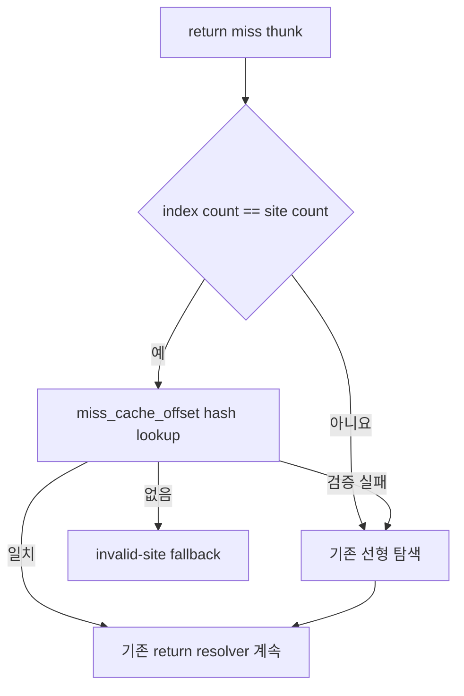

# return dispatch site 조회 인덱스 설계

## 배경

Task 478·479 적용 후 `pumpit8` 동일 구간 3회에서 `kAotReturn`은 여전히
`guest-run`의 **44.96~45.33%**였습니다. return dispatch는 실행당 약 208만~210만
회였고, return handler는 호출당 약 20,270~20,415 cycle을 사용했습니다.

Task 479는 `indirect_inline_cache_sites`의 두 선형 탐색을 인덱스화했지만,
`ResolveAotDbtReturnMissFrame`이 호출하는 `FindDispatchSite`는 별도 배열인
`dbt_return_dispatch_sites`를 처음부터 순회합니다. 초기 pumpit8 plan에는 return이
1,036개 있으며 동적 번역이 site를 추가할 수 있습니다. 따라서 모든 return miss가
별도의 O(n) 탐색을 수행합니다.

## 결정

1. `miss_cache_offset` exact hash index를 Win32 placement에 둡니다. power-of-two bucket과
   site 배열에 평행한 chain을 사용하며, 중복 키에서는 기존 탐색과 같은 가장 작은
   site index를 반환합니다.
2. 인덱스는 실행 전제조건이 아니라 cache입니다. `indexed_site_count`가 실제 배열
   크기와 다르면 lookup은 unusable을 반환하고 호출자는 기존 선형 탐색을 수행합니다.
3. 초기 placement와 dynamic append 모두 개수 불일치 시 전체 rebuild합니다. 같은
   측정에서 append는 266회, return lookup은 약 210만 회이므로 단순한 rebuild 정책이
   충분합니다.
4. 조회 결과의 site가 실제 키와 일치하는지 호출자에서 다시 검사합니다. 인덱스가
   usable하지만 찾지 못한 경우에는 exact index 결과를 신뢰합니다. unusable하거나
   결과 검증이 실패한 경우에만 기존 scan을 실행합니다.
5. `sites/lookups/scans/rebuilds`를 로그에 남겨 인덱스가 조용히 무효화되는 경우를
   확인할 수 있게 합니다.

## 범위 밖

이번 작업은 4-entry return inline-cache의 교체 정책과 patch 횟수를 바꾸지 않습니다.
megamorphic return 정책은 guest 전송 경로와 generated code layout을 바꾸므로, 이번
동작 불변 인덱스의 효과를 측정한 뒤 별도 작업에서 설계합니다.

## 검증

* probe에서 정상 키, 중복 키, hash collision, append 후 stale/rebuild, invalidate,
  빈 배열을 기존 선형 탐색 oracle과 비교합니다.
* 기존 `inline_cache_*`, `dbt_return_*`, Task 479 index probe를 모두 통과시킵니다.
* Win32 x86 Debug `repiu`와 `repiu_aot_probe`를 빌드합니다.
* 사용자 실행에서 `scans=0`에 가깝고 return fallback이 계속 0인지 확인합니다.

---

# Return Dispatch Site Lookup Index Design

## Background

After Tasks 478 and 479, three matching `pumpit8` runs still put `kAotReturn` at
**44.96-45.33%** of `guest-run`. Each run made about 2.08-2.10 million return
dispatches, at roughly 20,270-20,415 cycles per handler call.

Task 479 indexed two scans over `indirect_inline_cache_sites`, but
`FindDispatchSite`, called by `ResolveAotDbtReturnMissFrame`, linearly scans the
separate `dbt_return_dispatch_sites` array. The initial pumpit8 plan contains
1,036 returns, and dynamic translation may append more sites. Every return miss
therefore performs another O(n) lookup.

## Decisions

1. Store an exact `miss_cache_offset` hash index in the Win32 placement, using
   power-of-two buckets and chains parallel to the site array. Duplicate keys
   return the lowest site index, preserving the original first-match behavior.
2. The index is a cache, not an execution prerequisite. A site-count mismatch
   makes lookup unusable and the caller runs the original scan.
3. Rebuild the complete index on a count mismatch after initial placement or a
   dynamic append. The measured run had 266 appends against roughly 2.1 million
   return lookups, so the simpler rebuild policy is sufficient.
4. Re-check the returned site's key in the caller. Trust exact "not found" when
   the index is usable; scan only when unusable or when validation fails.
5. Log `sites/lookups/scans/rebuilds` so silent invalidation is observable.

## Out of scope

This task does not change the four-entry return inline-cache replacement policy
or patch frequency. A megamorphic-return policy changes guest transfer handling
and generated-code layout, so it follows after measuring this behavior-neutral
index.

## Verification

Compare normal keys, duplicates, hash collisions, stale/rebuilt append state,
invalidation, and empty arrays against the old scan oracle; retain all existing
inline-cache and DBT-return probes; build Win32 x86 Debug `repiu` and
`repiu_aot_probe`; and confirm live `scans` stays near zero with no return
fallback.
