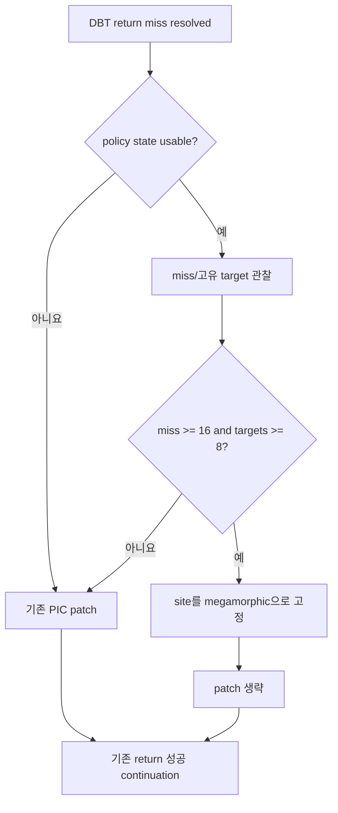

# Megamorphic return patch 우회 설계

## 배경

Task 480의 세 실행은 return dispatch site index가 모든 return을 처리하면서
`scans=0`, fallback 0을 유지했고, return handler 단가를 평균 20,358 cycle에서
19,652 cycle로 3.46% 낮췄습니다. 그러나 실행당 253만~337만 번의 return miss와 거의
같은 수의 inline-cache patch가 계속 발생했습니다.

기존 분석에서 가장 심한 site는 259개 정적 호출처가 공유하는 Watcom stack-check
helper의 `ret 4`입니다. 4-entry PIC는 이 target 집합을 담을 수 없어 round-robin
교체 후에도 다음 호출이 다시 miss가 됩니다. 이 상태에서는 patch가 hit를 늘리지 못하고
RX/RW 보호 전환, 14-byte 기록과 instruction-cache flush만 반복합니다.

## 결정

1. Win32 placement가 return dispatch site와 나란한 site별 patch 정책 상태를 소유합니다.
   초기 placement와 dynamic append가 site 수를 동기화하며, 실행 hot path에서는 메모리를
   할당하지 않습니다.
2. DBT host-stack return miss만 정책에 관찰합니다. 기존 VEH return과 indirect
   call/jump patch 정책은 변경하지 않습니다.
3. 한 site에서 최소 16회 miss와 8개 서로 다른 guest target을 모두 관찰하면 해당 site를
   megamorphic으로 고정 판정합니다. 8개는 현재 PIC 용량 4의 두 배이며, 16회는 일시적인
   초기 학습을 구조적 churn으로 오인하지 않기 위한 최소 반복 증거입니다.
4. 판정 전에는 기존 patch를 그대로 수행합니다. 판정된 호출부터 patch만 건너뛰고 target
   resolution, guest stack pop, cache target 이동, return telemetry와 fallback 계약은 기존
   resolver를 그대로 사용합니다. 이미 학습된 PIC entry도 수정하지 않으므로 그 target의
   hit는 계속 C++ resolver를 우회할 수 있습니다.
5. 정책 상태가 없거나 site index가 유효하지 않으면 기존 patch를 수행합니다. 정책은
   정확성 전제조건이 아니라 성능 계층입니다.
6. `observations/megamorphic sites/bypasses`를 종료 로그에 기록합니다. Task 481의 직접
   성공 조건은 return 성공/fallback 불변, megamorphic site 1개 이상, bypass 증가,
   patch/return 비율 감소입니다.

## 정확성 경계

이 변경은 원본 guest 코드, generated cache layout, PIC guard byte, target resolution과
guest-visible register/stack 결과를 바꾸지 않습니다. patch 우회는 miss 경로가 이미 계산한
cache target으로 이동하는 기존 성공 continuation을 사용합니다. 따라서 오분류의 최악 결과는
해당 site가 resolver를 더 자주 호출하는 성능 저하이며 잘못된 guest target 실행이 아닙니다.

## 검증

* 합성 probe로 단일 target, 4-way target, 임계값 직전, 8-target megamorphic 판정,
  판정 후 지속 우회, site 독립성과 dynamic append 상태 보존을 검증합니다.
* 기존 inline-cache, return dispatch와 두 site-index probe를 모두 유지합니다.
* Win32 x86 Debug `repiu_aot_probe`와 `repiu`를 빌드합니다.
* 동일 사용자 장면 3회에서 Task 480과 return/swap 및 primitive/swap 동등성을 확인한 뒤
  patch/return 비율, bypass 수, return당 cycle을 비교합니다.

---

# Megamorphic Return Patch Bypass Design

## Background

Task 480 handled every return through its exact site index with zero scans and
zero fallback, reducing mean return-handler cost from 20,358 to 19,652 cycles,
or 3.46%. Each run nevertheless retained 2.53-3.37 million return misses and
almost the same number of inline-cache patches.

The previously identified worst site is the `ret 4` of a Watcom stack-check
helper shared by 259 static callers. A four-entry PIC cannot retain that target
set, so round-robin replacement merely makes the next caller miss again. The
patch then repeats the RX/RW transition, fourteen-byte write, and instruction
cache flush without creating sustained hits.

## Decisions

1. The Win32 placement owns per-return-site patch-policy state parallel to the
   return dispatch sites. Initial placement and dynamic append synchronize its
   size, keeping allocation out of the execution hot path.
2. Observe only DBT host-stack return misses. Existing VEH returns and indirect
   call/jump patch policy remain unchanged.
3. Permanently classify a site as megamorphic after at least sixteen misses and
   eight distinct guest targets. Eight is twice the current PIC capacity of
   four; sixteen adds repeated evidence before treating startup learning as
   structural churn.
4. Preserve patching before classification. Starting with the classifying
   call, skip only the patch while retaining target resolution, guest stack
   adjustment, cache-target transfer, telemetry, and fallback behavior. Existing
   learned entries remain intact and can still bypass the resolver on hits.
5. Missing policy state or an invalid site index fails open to the original
   patch path. The policy is an optimization, not a correctness prerequisite.
6. Report `observations/megamorphic sites/bypasses`. Direct success means
   unchanged return success/fallback, at least one classified site, increasing
   bypasses, and a lower patch-to-return ratio.

## Correctness boundary

The change modifies no guest code, generated-cache layout, PIC guard byte,
target resolution, or guest-visible register/stack result. A bypassed miss uses
the same already-resolved cache target and success continuation. A false
classification can therefore cost performance by retaining resolver traffic,
but cannot select a wrong guest target.

## Verification

Probe single-target and four-way sites, the pre-threshold state, eight-target
classification, continued bypass, site isolation, and state preservation across
dynamic append. Retain all existing inline-cache/return/index probes; build the
Win32 x86 Debug probe and application; then compare three matched user runs
against Task 480 using return/swap and primitive/swap scene gates, patch/return
ratio, bypasses, and cycles per return.
