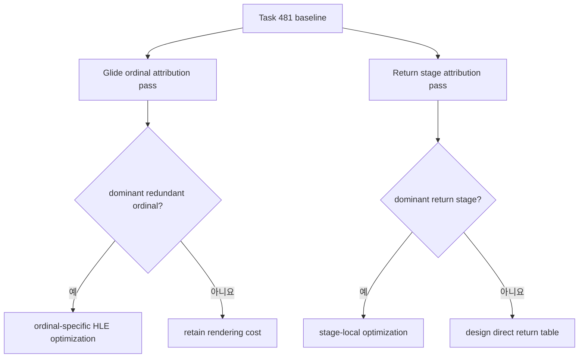

# Return 최적화 이후 병목 귀속 설계

## 배경

Task 481은 return patch의 97.61%를 우회하고 return당 handler cycle을 93.51% 줄였습니다.
그 결과 return handler는 `guest-run`의 평균 17.13%로 내려갔고, 현재 측정된 큰 bucket은
Glide gate 22~24%, return 16.5~17.5%, VEH 9~11% 순입니다.

Glide gate bucket은 HLE 전환 비용과 실제 렌더링 작업을 함께 포함하지만 기존 세 실행에서
ordinal timing은 꺼져 있습니다. return handler도 target read, bookkeeping, target
resolution, policy와 continuation이 한 bucket에 합쳐져 있습니다. 따라서 다음 구현을
선택하기 전에 두 bucket을 각각 분해해야 합니다.

## 결정

1. Task 482는 동작 최적화가 아니라 opt-in 귀속 계측만 수행합니다. guest 코드, cache
   layout, target, stack/register 결과와 patch 정책은 변경하지 않습니다.
2. 기존 `REPIU_GLIDE_ORDINAL_TIMING=1` 실행을 별도 attribution pass로 사용해 ordinal별
   calls, total/max cycle과 coverage를 수집합니다. 계측 실행의 FPS는 성능 근거로 쓰지
   않습니다.
3. return handler에는 서로 겹치지 않는 stage timing을 추가합니다.
   * entry/site 및 instruction 검증
   * guest stack target read와 call/return bookkeeping
   * target classification과 `ResolveAotTransferTarget`
   * megamorphic policy 및 필요 시 patch
   * guest continuation과 telemetry 마무리
   outer return cycle에서 stage 합을 뺀 residual도 기록합니다.
4. 기존 return patch policy state에서 site index, guest source, miss offset, observations,
   distinct-target 수, bypass 수를 읽어 종료 시 상위 16개 site를 출력합니다. hot path에
   map, allocation, lock 또는 형식화 로그를 추가하지 않습니다.
5. Glide ordinal pass와 return stage pass는 분리 실행합니다. 계측 overhead가 서로를
   오염시키지 않게 하고 각 pass에서 outer bucket 대비 coverage를 확인합니다.
6. 다음 구현은 측정 결과로 선택합니다.
   * 특정 Glide ordinal이 지배하고 중복 host 작업이 확인되면 해당 HLE 경로를 최적화합니다.
   * return target resolution 또는 bookkeeping이 지배하면 그 stage를 축소합니다.
   * 여러 return stage가 고르게 남으면 generated megamorphic direct-return table의 비용과
     generation/retirement 정확성 경계를 별도 설계합니다.

## 검증

* 계측 off에서 기존 log와 hot-path 상태 변경이 없어야 합니다.
* 합성 probe로 stage count와 cycle accounting, residual, clamp, 빈 census와 top-N 정렬을
  검증합니다.
* Win32 x86 Debug/Release `repiu_aot_probe`와 `repiu`를 빌드합니다.
* pumpit8 attribution pass에서 return success 100%, fallback 0, index scan 0과 Task 481
  policy 회계를 유지합니다.
* 각 계측의 stage 또는 ordinal cycle coverage를 outer bucket과 함께 보고합니다.

---

# Post-Return-Optimization Bottleneck Attribution Design

## Background

Task 481 bypassed 97.61% of return patches and reduced handler cycles per return
by 93.51%. Return handling now averages 17.13% of `guest-run`; the largest visible
buckets are Glide gate at 22-24%, return at 16.5-17.5%, and VEH at 9-11%.

The Glide bucket combines transition overhead with real rendering work, while
ordinal timing was disabled in all three runs. The return bucket likewise combines
target reads, bookkeeping, target resolution, policy, and continuation. Both need
attribution before selecting another implementation.

## Decisions

1. Task 482 adds opt-in attribution only. It changes no guest code, cache layout,
   target, stack/register result, or patch policy.
2. Use a separate `REPIU_GLIDE_ORDINAL_TIMING=1` attribution pass to collect
   per-ordinal calls, total/max cycles, and coverage. Instrumented FPS is not
   performance evidence.
3. Add mutually exclusive return stages for entry/site/instruction validation;
   stack-target read and call/return bookkeeping; target classification and
   `ResolveAotTransferTarget`; megamorphic policy and optional patching; and
   continuation plus telemetry. Report residual against the outer return bucket.
4. At shutdown, report the top sixteen policy sites by observations/bypasses,
   including site index, guest source, miss offset, distinct targets, and bypasses.
   Add no hot-path map, allocation, lock, or formatted logging.
5. Run Glide-ordinal and return-stage attribution separately to avoid cross-
   instrumentation bias, and report coverage against each outer bucket.
6. Let the result choose the next implementation: optimize a proven redundant
   Glide ordinal, reduce a dominant return stage, or—if costs are distributed—
   separately design a generated megamorphic direct-return table with generation
   and retirement correctness boundaries.

## Verification

With instrumentation off, preserve current logs and hot-path state. Probe stage
accounting, residual, clamp behavior, empty census, and top-N ordering; build the
Win32 x86 Debug/Release probe and application; retain 100% return success, zero
fallback and index scans, and Task 481 policy accounting in pumpit8 attribution
passes; and report stage/ordinal coverage beside the outer bucket.
