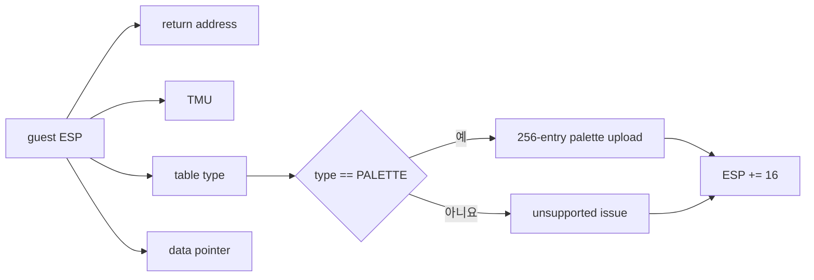

# Glide texture-table guest stack ABI 정정 설계

## 배경

`pumpipx3` 실행 로그에서 `_GRTEXDOWNLOADTABLE@12` 호출이
`GLIDE_UNSUPPORTED_ARGUMENT`로 기록되었습니다. 기록된 세 인수는
`tmu=0`, `type=2 (GR_TEXTABLE_PALETTE)`, `data=0x04ACA200`이므로 지원되는
팔레트 업로드입니다.

현재 경계 구현은 `ESP`가 가리키는 반환 주소를 인수 배열에 포함하면서 3 dword만
읽습니다. 그 결과 첫 번째 인수를 `type`으로, 두 번째 인수를 `data`로 오인하고,
복귀 시에도 반환 주소와 세 인수의 합인 16바이트가 아니라 12바이트만 정리합니다.

## 결정

1. `_GRTEXDOWNLOADTABLE@12` frame은 `return address`, `TMU`, `type`, `data`의
   네 dword로 해석합니다.
2. frame 해석은 Win32 Glide boundary 내부의 작은 무상태 함수로 분리해 실제 handler와
   probe가 같은 인덱스 및 cleanup 값을 사용하게 합니다.
3. 지원 범위는 바꾸지 않습니다. `type == 2`인 palette table만 256-entry ARGB에서
   RGBA로 변환하며 NCC table은 계속 명시적으로 거부합니다. 표준 palette의 상위
   8비트는 Glide 규격대로 무시하고 alpha를 255로 저장합니다. P_8은 이 불투명 RGB를,
   AP_88은 texel 자체의 상위 8비트 alpha를 사용합니다.
4. 성공·지원하지 않는 type·읽을 수 없는 data 모두 기존 issue 정책을 유지하되,
   처리된 gate는 항상 stdcall 계약대로 `ESP += 16`으로 복귀합니다.
5. guest 게임 로직, Glide export catalog, backend와 texture decode 정책은 변경하지 않습니다.
6. P_8/AP_88 원본 texel은 backend texture entry에 보존합니다. palette가 바뀌면 보존된
   indexed texture만 새 palette로 다시 디코드·업로드합니다. 일반 RGB/ARGB texture는
   대상이 아니며 guest texture upload census에도 새 upload로 중복 기록하지 않습니다.

## 보류한 성능 최적화

사용자 실기 확인에서 색상은 복구됐지만 성능이 크게 떨어졌습니다. 현재 정확성 우선 구현은
palette download마다 보존된 모든 P_8/AP_88 texture를 CPU에서 RGBA로 다시 디코드하고
각각 `glTexImage2D`로 재업로드합니다. palette 변경 빈도와 보존 texture 수에 비례해 CPU 변환,
메모리 할당 및 GPU 전송이 반복되는 구조입니다.

이번 작업에서는 정확한 Glide 의미를 유지하고 최적화는 구현하지 않습니다. 후속 작업은 먼저
palette download 횟수, 실제 entry 변경 여부, refresh texture 수·바이트·시간을 계측한 뒤,
동일 palette 생략, 사용 중 texture 지연 갱신, indexed sampling을 보존하는 shader/backend
경로를 비교해야 합니다. 최적화는 palette 변경이 기존 texture에 즉시 반영되는 계약을 깨면
안 됩니다.

## 검증

- 합성 frame `return, 0, 2, data`가 정확한 TMU/type/data와 16바이트 cleanup으로
  해석되는지 검사합니다.
- 짧은 frame과 null 출력이 거부되는지 검사합니다.
- Win32 x86 Debug/Release에서 `repiu_aot_probe`와 `repiu`를 빌드합니다.
- 실제 `pumpipx3` 재실행에서는 같은 호출이 unsupported issue 없이 처리되고 이후
  stack ABI reject가 0인지 확인합니다.

---

# Glide Texture-Table Guest Stack ABI Correction Design

## Background

A `pumpipx3` run reported `_GRTEXDOWNLOADTABLE@12` as
`GLIDE_UNSUPPORTED_ARGUMENT`. Its three recorded arguments are `tmu=0`,
`type=2 (GR_TEXTABLE_PALETTE)`, and `data=0x04ACA200`, which describe a supported
palette upload.

The boundary currently includes the return address in the array read from `ESP`
but reads only three dwords. It consequently treats the first argument as the
type, the second as the data pointer, and advances `ESP` by 12 bytes instead of
the 16 bytes occupied by the return address plus three arguments.

## Decisions

1. Decode the `_GRTEXDOWNLOADTABLE@12` frame as four dwords: return address,
   TMU, type, and data.
2. Put the frame decoding in a small stateless Win32 Glide-boundary helper so the
   handler and probe share the exact indices and cleanup value.
3. Do not widen support: only type 2 palette tables are converted from 256-entry
   ARGB to RGBA; NCC tables remain explicitly rejected. Ignore the standard
   palette's high byte and store alpha 255 as Glide specifies. P_8 uses this
   opaque RGB, while AP_88 takes alpha from the texel's high byte.
4. Preserve existing issue policy for supported, unsupported, and unreadable
   data paths, while every handled gate returns with the stdcall `ESP += 16`.
5. Change no guest logic, export catalog, backend, or texture decoding policy.
6. Retain original P_8/AP_88 texels in backend texture entries. When the palette
   changes, re-decode and upload only retained indexed textures. Ordinary
   RGB/ARGB textures are untouched and the refresh is not double-counted as a
   new guest texture upload.

## Deferred performance optimization

The user's runtime confirmation restored correct colours but showed a severe
performance loss. The accuracy-first implementation currently decodes every
retained P_8/AP_88 texture to RGBA on the CPU and uploads each one through
`glTexImage2D` after every palette download. CPU conversion, allocation, and GPU
transfer therefore scale with palette update frequency and retained texture count.

This task preserves correctness and defers optimization. A follow-up must first
measure palette downloads, actual table changes, and refreshed texture count,
bytes, and time, then compare unchanged-palette suppression, lazy refresh of used
textures, and a shader/backend path that preserves indexed sampling. No optimization
may break the contract that a palette change affects existing indexed textures.

## Verification

Probe a synthetic `return, 0, 2, data` frame for exact TMU/type/data decoding and
16-byte cleanup, reject short frames and null output, build the Win32 x86
Debug/Release probe and application, then confirm a `pumpipx3` rerun handles the
same call without an unsupported issue or stack ABI rejection.
