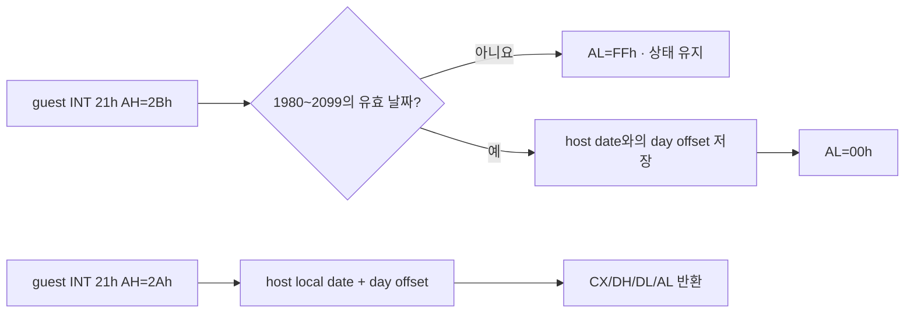

# DOS system date 설정 HLE 설계

## 배경

`pumpitpr` 실행은 `0x040ECB3D`의 `INT 21h`에서
`unsupported DOS INT 21h AH=0x2b`로 종료됐습니다. 직전 명령은 구조체에서
`CX=2026`, `DH=8`, `DL=15`를 읽습니다. Microsoft MS-DOS Programmer's Reference의
[Function 2Bh 계약](https://www.bitsavers.org/pdf/microsoft/msdos_2.0/8411-200-00_MS-DOS_2.0_Programmers_Reference_1983.pdf)과
일치하는 유효한 system date 설정 요청입니다.

호스트 운영체제의 실제 날짜를 변경하는 것은 HLE 경계를 벗어나며 안전하지 않습니다.
반대로 성공만 반환하고 후속 Function 2Ah 조회에 반영하지 않으면 DOS 날짜 상태 계약을
깨뜨립니다.

## 결정

1. 플랫폼 공용 `DosDate`와 Gregorian 날짜 검증·날짜 차이·날짜 이동 함수를 HLE 계층에
   둡니다. 지원 범위는 DOS 계약인 1980~2099년입니다.
2. Function 2Bh는 `CX` 전체를 연도, `DH`를 월, `DL`을 일로 읽습니다. 유효하면
   `AL=00h`, 유효하지 않으면 `AL=FFh`를 반환합니다.
3. 유효한 요청은 현재 호스트 local date와 요청 날짜의 일수 차이를 실행 context에
   저장합니다. 호스트 system date는 변경하지 않습니다.
4. Function 2Ah는 host local date에 저장된 일수 차이를 적용해 가상 DOS 날짜와 요일을
   반환합니다. 시간 Function 2Ch는 기존처럼 실제로 흐르는 host local time을 사용합니다.
5. 일반 DOS HLE와 traced/AOT 경로 모두 Function 2Bh를 같은 handler로 보냅니다.
6. probe는 윤년, 잘못된 날짜, 날짜 차이, 월·연도 경계와 요일을 검사합니다.

## 검증

- 공용 날짜 probe가 정상일, 윤일, 범위 밖 연도와 잘못된 월·일을 구분해야 합니다.
- 2024-02-28에서 +1일은 2024-02-29, +2일은 2024-03-01이어야 합니다.
- Win32 x86 Debug/Release에서 `repiu_aot_probe`와 `repiu`를 빌드하고 전체 probe를 실행합니다.
- 후속 `pumpitpr` 실행에서 AH=2Bh가 handled hotspot에 기록되고 현재 blocker가 사라져야 합니다.

---

# DOS Set-System-Date HLE Design

## Background

The `pumpitpr` run stopped at `INT 21h` at `0x040ECB3D` with
`unsupported DOS INT 21h AH=0x2b`. The preceding instructions load `CX=2026`,
`DH=8`, and `DL=15` from a structure, a valid set-system-date request matching
Function 2Bh in the Microsoft MS-DOS Programmer's Reference.
See page 1-92 of the
[Microsoft MS-DOS 2.0 Programmer's Reference](https://www.bitsavers.org/pdf/microsoft/msdos_2.0/8411-200-00_MS-DOS_2.0_Programmers_Reference_1983.pdf).

Changing the host operating system's real date is unsafe and outside the HLE
boundary. Merely returning success without affecting a later Function 2Ah query
would also violate DOS date-state semantics.

## Decisions

1. Add platform-neutral `DosDate` validation, date-difference, and date-shift
   helpers to the HLE layer for the DOS range 1980 through 2099.
2. Function 2Bh reads the full `CX` as year, `DH` as month, and `DL` as day. It
   returns `AL=00h` for a valid date and `AL=FFh` for an invalid date.
3. A valid request stores the day difference between the current host local date
   and the requested date in the execution context. It never changes host time.
4. Function 2Ah applies that difference to host local date and returns the virtual
   DOS date and weekday. Function 2Ch continues to expose advancing host local time.
5. Both the ordinary DOS HLE and traced/AOT paths route Function 2Bh to one handler.
6. Probe leap years, invalid dates, date differences, month/year boundaries, and
   weekdays.

## Verification

The shared date probe must distinguish valid, leap, out-of-range, and invalid
dates; shifting 2024-02-28 by one and two days must produce February 29 and March
1; Win32 x86 Debug and Release builds and full probes must pass; and a later
`pumpitpr` run must record AH=2Bh as handled and clear this blocker.
