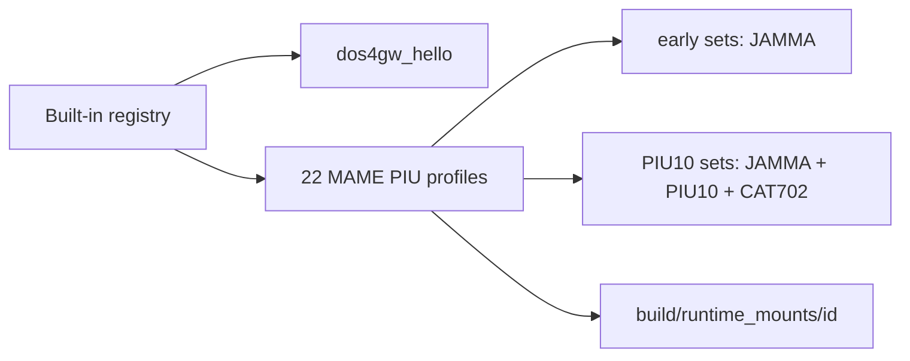

# MAME PIU target profile 카탈로그 정비 설계

## 배경

현재 내장 registry에는 MAME `xtom3d.cpp`의 Pump It Up 세트 22개 중 14개만 있으며,
clone/날짜 변형 8개가 빠져 있습니다. 기존 항목 순서와 축약 display name도 MAME의
`GAME` 카탈로그 순서·설명을 충분히 반영하지 않습니다.

근거는 MAME 공식
[`src/mame/misc/xtom3d.cpp`](https://github.com/mamedev/mame/blob/master/src/mame/misc/xtom3d.cpp)의
`GAME` 선언입니다. `piu_1st`는 제거하고, 비 MAME 검증 sample인 `dos4gw_hello` 다음에
MAME profile을 아래 순서로 정리합니다. 실행기와 analyzer의 무인자 기본 target은
첫 실제 게임 profile인 `pumpit1`로 변경합니다.

## 카탈로그 계약

| 순서 | ID | Display name |
| ---: | --- | --- |
| 1 | `pumpit1` | Pump It Up: The 1st Dance Floor (ver 0.53.1999.9.31) |
| 2 | `pumpit2` | Pump It Up: The 2nd Dance Floor (Feb 28 2000) |
| 3 | `pumpit2a` | Pump It Up: The 2nd Dance Floor (Dec 27 1999) |
| 4 | `pumpit3` | Pump It Up The O.B.G: The 3rd Dance Floor (v3.04 - Jun 02 2000) |
| 5 | `pumpit3a` | Pump It Up The O.B.G: The 3rd Dance Floor (v3.03 - May 07 2000) |
| 6 | `pumpito` | Pump It Up The O.B.G: The Season Evolution Dance Floor (R4/v3.25 - Aug 27 2000) |
| 7 | `pumpitc` | Pump It Up: The Collection (R5/v3.43 - Nov 14 2000) |
| 8 | `pumpitpc` | Pump It Up: The Perfect Collection (R5/v3.52 - Dec 18 2000) |
| 9 | `pumpitpr` | Pump It Up The Premiere: The International Dance Floor (R6/v4.01 - Feb 22 2001) |
| 10 | `pumpitpru` | Pump It Up The Premiere: The International Dance Floor (R6/v4.01 - Feb 22 2001 USA) |
| 11 | `pumpite` | Pump It Up Extra (Mar 21 2001) |
| 12 | `pumpitea` | Pump It Up Extra (Mar 08 2001) |
| 13 | `pumpitpx` | Pump It Up The PREX: The International Dance Floor (2001 - REV2 / 101) |
| 14 | `pumpit8` | Pump It Up The Rebirth: The 8th Dance Floor (Rebirth/2002) |
| 15 | `pumpitp2` | Pump It Up The Premiere 2: The International 2nd Dance Floor (Premiere 2/2002) |
| 16 | `pumpipx2` | Pump It Up The PREX 2 (Premiere 2/2003) |
| 17 | `pumpipx2p` | Pump It Up EXTRA + Plus (Premiere 2/2003) |
| 18 | `pumpitp3` | Pump It Up The Premiere 3: The International 3rd Dance Floor (Premiere 3/2003 - 28th Mar 2003) |
| 19 | `pumpitp3a` | Pump It Up The Premiere 3: The International 3rd Dance Floor (Premiere 3/2003 - 17th Mar 2003) |
| 20 | `pumpipx3` | Pump It Up The PREX 3: The International 4th Dance Floor (2003 - X3.2MK3) |
| 21 | `pumpipx3a` | Pump It Up The PREX 3: The International 4th Dance Floor (2003 - INT X3.1MK3) |
| 22 | `pumpipx3b` | Pump It Up The PREX 3: The International 4th Dance Floor (2003 - Korea X3.1MK3) |

모든 display name의 브랜드 표기는 `Pump It Up`으로 통일합니다. MAME 설명에 이미
연도나 날짜가 있으면 이를 보존합니다. `pumpitpx`와 PREX 3 세
항목처럼 설명에 4자리 연도가 없으면 `GAME` 선언 연도를 괄호의 세부 정보에 추가합니다.

각 profile은 `id`와 같은 `rom_set_id`, `build/runtime_mounts/<id>` 기반 경로,
`piu_common` HLE와 기존 runtime reservation을 사용합니다. clone도 독립 short name으로
mount하되 hardware capability는 세대가 같은 기존 parent profile을 따릅니다.

## 구현 및 검증

- 반복되는 PIU ROM-set profile 경로·capability 구성을 작은 factory로 통일합니다.
- registry probe가 22개 ID의 정확한 연속 순서, display name, 단일 등록과 공통 경로
  계약을 검사합니다.
- clone은 parent와 같은 hardware capability를 갖는지 검사합니다.
- Win32 x86 Debug/Release 빌드와 전체 AOT probe를 실행합니다.

---

# MAME PIU Target Profile Catalog Design

## Background

The built-in registry currently contains only 14 of the 22 Pump It Up sets in
MAME's `xtom3d.cpp`. Eight clone/date variants are absent, and the current order
and abbreviated display names do not preserve the MAME `GAME` catalog.

The authoritative catalog is MAME's
[`src/mame/misc/xtom3d.cpp`](https://github.com/mamedev/mame/blob/master/src/mame/misc/xtom3d.cpp).
Remove `piu_1st`, keep the non-MAME `dos4gw_hello` validation sample first, then
place all MAME profiles in the 22-entry order shown in the Korean table. Change
the no-argument defaults of the runner and analyzer to `pumpit1`.

## Catalog contract

Normalize the brand spelling in every display name to `Pump It Up`. Preserve
each MAME description when it already contains a year or date. Add the
`GAME` declaration year to the details for `pumpitpx` and the three PREX 3 entries,
whose descriptions otherwise have no four-digit year.

| Order | ID | Display name |
| ---: | --- | --- |
| 1 | `pumpit1` | Pump It Up: The 1st Dance Floor (ver 0.53.1999.9.31) |
| 2 | `pumpit2` | Pump It Up: The 2nd Dance Floor (Feb 28 2000) |
| 3 | `pumpit2a` | Pump It Up: The 2nd Dance Floor (Dec 27 1999) |
| 4 | `pumpit3` | Pump It Up The O.B.G: The 3rd Dance Floor (v3.04 - Jun 02 2000) |
| 5 | `pumpit3a` | Pump It Up The O.B.G: The 3rd Dance Floor (v3.03 - May 07 2000) |
| 6 | `pumpito` | Pump It Up The O.B.G: The Season Evolution Dance Floor (R4/v3.25 - Aug 27 2000) |
| 7 | `pumpitc` | Pump It Up: The Collection (R5/v3.43 - Nov 14 2000) |
| 8 | `pumpitpc` | Pump It Up: The Perfect Collection (R5/v3.52 - Dec 18 2000) |
| 9 | `pumpitpr` | Pump It Up The Premiere: The International Dance Floor (R6/v4.01 - Feb 22 2001) |
| 10 | `pumpitpru` | Pump It Up The Premiere: The International Dance Floor (R6/v4.01 - Feb 22 2001 USA) |
| 11 | `pumpite` | Pump It Up Extra (Mar 21 2001) |
| 12 | `pumpitea` | Pump It Up Extra (Mar 08 2001) |
| 13 | `pumpitpx` | Pump It Up The PREX: The International Dance Floor (2001 - REV2 / 101) |
| 14 | `pumpit8` | Pump It Up The Rebirth: The 8th Dance Floor (Rebirth/2002) |
| 15 | `pumpitp2` | Pump It Up The Premiere 2: The International 2nd Dance Floor (Premiere 2/2002) |
| 16 | `pumpipx2` | Pump It Up The PREX 2 (Premiere 2/2003) |
| 17 | `pumpipx2p` | Pump It Up EXTRA + Plus (Premiere 2/2003) |
| 18 | `pumpitp3` | Pump It Up The Premiere 3: The International 3rd Dance Floor (Premiere 3/2003 - 28th Mar 2003) |
| 19 | `pumpitp3a` | Pump It Up The Premiere 3: The International 3rd Dance Floor (Premiere 3/2003 - 17th Mar 2003) |
| 20 | `pumpipx3` | Pump It Up The PREX 3: The International 4th Dance Floor (2003 - X3.2MK3) |
| 21 | `pumpipx3a` | Pump It Up The PREX 3: The International 4th Dance Floor (2003 - INT X3.1MK3) |
| 22 | `pumpipx3b` | Pump It Up The PREX 3: The International 4th Dance Floor (2003 - Korea X3.1MK3) |

Every profile uses its short name for both `id` and `rom_set_id`, paths rooted at
`build/runtime_mounts/<id>`, the shared `piu_common` HLE, and the existing runtime
reservation. Clones mount under their own short names but inherit the hardware
capabilities of the existing profile from the same generation.

## Implementation and verification

- Consolidate repeated PIU ROM-set profile paths and capabilities in a small factory.
- Make the registry probe verify the exact contiguous order, display names,
  uniqueness, and common path contract for all 22 IDs.
- Verify clone hardware capabilities match their parent generation.
- Run Win32 x86 Debug and Release builds and the complete AOT probe.
