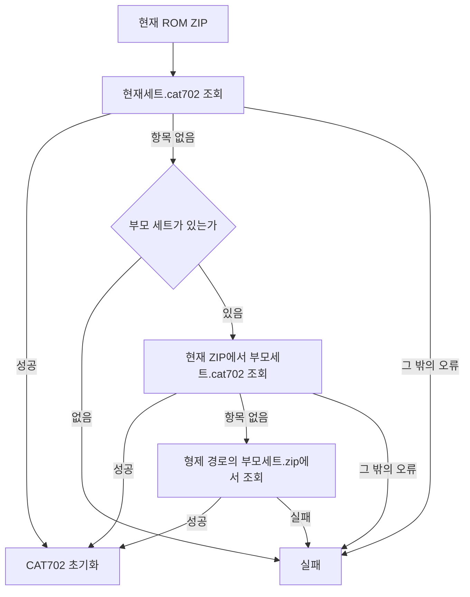

# 부모 ROM 세트 fallback 설계 / Parent ROM-Set Fallback Design

## 한국어

### 배경과 목표

`pumpitpru`는 MAME clone이며 CAT702 데이터 이름으로 부모 세트의
`pumpitpr.cat702`를 사용합니다. 현재 실행 준비 코드는 선택한 ZIP의 파일명만으로
`pumpitpru.cat702`를 생성하므로, 유효한 clone ROM ZIP에서도 PIU10 초기화가
중단됩니다.

`TargetProfile`에 MAME ROM 관계를 나타내는 `parent_rom_set_id`를 추가합니다.
CAT702 로더는 현재 세트의 항목이 실제로 없을 때만 부모 세트로 fallback합니다.
손상, CRC 불일치 또는 읽기 오류는 부모 데이터로 숨기지 않고 기존처럼 실패합니다.

### 조회 순서

현재 ZIP에서 부모 이름을 먼저 확인하면 non-merged ROM 세트를 지원하고, 형제
`<parent>.zip` 조회는 split ROM 세트를 지원합니다. 현재 세트의 ZIP/CHD mount와
실행 파일은 변경하지 않습니다.

### 프로필 관계

모든 PIU 프로필은 제공된 MAME `GAME` 선언의 parent 값을 저장합니다. 직접 clone인
`pumpit2a`, `pumpit3a`, `pumpitpru`, `pumpitea`, `pumpipx2p`, `pumpitp3a`,
`pumpipx3a`, `pumpipx3b`는 각각 등록된 부모 세트를 가리킵니다. 그 밖의 PIU 세트는
BIOS root인 `pumpitup`을 가리킵니다.

### 검증

- registry probe에서 22개 PIU 프로필의 정확한 parent ID를 검사합니다.
- ZIP 추출 결과가 `항목 없음`과 다른 오류를 구분하는지 검사합니다.
- `pumpitpru`의 실제 ROM ZIP으로 부모 이름의 CAT702 데이터가 선택되는지 확인합니다.
- Win32 x86 Debug/Release 빌드와 전체 probe를 실행합니다.

## English

### Background and Goal

`pumpitpru` is a MAME clone and uses its parent's CAT702 member name,
`pumpitpr.cat702`. Setup currently derives only `pumpitpru.cat702` from the selected
ZIP filename, so PIU10 initialization stops even with a valid clone ROM archive.

Add `parent_rom_set_id` to `TargetProfile` to represent the MAME ROM relationship.
The CAT702 loader falls back to the parent set only when the current-set member is
actually absent. Corruption, CRC mismatch, and read failures remain fatal instead
of being hidden by parent data.

### Lookup Order

The flow above checks `<current>.cat702` in the current archive, then
`<parent>.cat702` in that archive for non-merged sets, and finally the parent
member in the sibling `<parent>.zip` for split sets. The current set's ZIP/CHD
mount and executable remain unchanged.

### Profile Relationships

Every PIU profile stores the parent from the supplied MAME `GAME` declaration.
The direct clones `pumpit2a`, `pumpit3a`, `pumpitpru`, `pumpitea`, `pumpipx2p`,
`pumpitp3a`, `pumpipx3a`, and `pumpipx3b` reference their registered parent set.
All other PIU sets reference the `pumpitup` BIOS root.

### Verification

- Verify exact parent IDs for all 22 PIU profiles in the registry probe.
- Verify ZIP extraction distinguishes a missing member from other failures.
- Confirm the real `pumpitpru` archive selects the parent-named CAT702 data.
- Run Win32 x86 Debug and Release builds and the complete probe.
