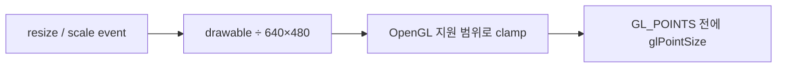

# Viewport 비례 Glide point 크기 설계

## 관측과 원인

원본 Glide 논리 화면은 640×480이고 현재 기본 drawable은 1280×960입니다. 직교 투영과
viewport가 정점 위치를 2배로 벌리지만 `GL_POINTS`의 raster 크기는 viewport 변환 대상이
아니므로 기본 1 physical pixel에 남습니다. 최신 `pumpit8` 로그의
`_GRDRAWPOINT@4` 호출은 16,668,750회이며, 서비스 화면 글자는 이 점들로 구성됩니다.
따라서 좌표 간격만 확대되고 dot 크기는 유지되어 글자가 점선처럼 보입니다.

## 설계

drawable pixel 크기와 guest 논리 크기의 비율을 각각 구하고 작은 값을 정사각형 point의
배율로 사용합니다. 축소 또는 잘못된 크기에서는 최소 1.0을 유지합니다.

```text
point_size = max(1, min(drawable_width / logical_width,
                        drawable_height / logical_height))
```

OpenGL이 보고하는 `GL_ALIASED_POINT_SIZE_RANGE` 안으로 결과를 제한합니다. 계산값은
`ApplyDrawableViewport()`가 window resize와 Alt+1~4 scale 변경 때 갱신하고,
`PrepareDrawState(GL_POINTS)`가 `glPointSize()`로 적용합니다. 직접 point draw와 batch
point draw 모두 이 상태 경로를 공유합니다.



비균등 viewport에서는 작은 축을 사용하여 point를 정사각형으로 유지합니다. line width,
triangle, texture와 guest 좌표는 변경하지 않습니다. 모든 primitive를 완전한 pixel-art
방식으로 확대하는 offscreen 640×480 surface는 더 큰 presentation 구조 변경이므로 이번
범위에서 제외합니다.

## 검증

`glide_render_probe`에서 640×480→640×480은 1, 1280×960은 2, 1920×1440은 3,
비균등 1280×720은 1.5, 축소와 0 크기는 1인지 확인합니다. Win32 Release backend와
probe를 빌드하고 probe를 실행합니다.

# Viewport-Scaled Glide Point Size Design

## Observation and cause

The original Glide logical surface is 640×480 and the current default drawable
is 1280×960. Projection and viewport scaling spread vertex positions by 2×,
but the raster size of `GL_POINTS` is not transformed by the viewport and stays
at its default one physical pixel. The latest `pumpit8` log records 16,668,750
`_GRDRAWPOINT@4` calls; those points form the service-screen text. Positions
therefore spread apart while each dot remains one pixel.

## Design

Compute both drawable-to-logical axis ratios and use the smaller as the square
point scale, with a floor of 1.0 for downscaling or invalid dimensions. Clamp
the result to `GL_ALIASED_POINT_SIZE_RANGE`. `ApplyDrawableViewport()` refreshes
the value on resize and Alt+1–4 scaling, while `PrepareDrawState(GL_POINTS)`
applies it with `glPointSize()`. Direct and batched point draws share that path.

Use the smaller ratio for a non-uniform viewport so points remain square. Do not
change line widths, triangles, textures, or guest coordinates. Rendering every
primitive to a fixed 640×480 offscreen surface and scaling the whole image is a
larger presentation change and remains out of scope.

## Verification

Extend `glide_render_probe` to require 1 for 640×480→640×480, 2 for 1280×960,
3 for 1920×1440, 1.5 for non-uniform 1280×720, and 1 for downscaled or invalid
dimensions. Build the Win32 Release backend and probe, then run the probe.
