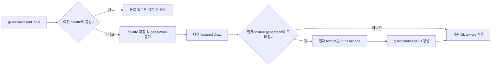

# Paletted texture 지연 갱신 설계

## 배경

Task 483은 `grTexDownloadTable` 뒤에 이미 업로드된 P_8/AP_88 texture의 색이 바뀌는
Glide 수명 계약을 복구했습니다. 현재 Win32 OpenGL backend는 palette download마다
보존된 모든 indexed texture를 CPU에서 RGBA로 다시 디코드하고 `glTexImage2D`로 전량
재업로드합니다. 사용자는 `pumpitp3` 타이틀 화면에서 이 변경 뒤 큰 성능 저하를
확인했습니다. `docs/TODO.md`에는 palette 호출 수, 실제 변경 수, 갱신 texture 수·바이트,
CPU decode 및 GPU upload 시간을 계측하고 동일 palette 생략과 dirty-generation 방식을
검증하는 후속 작업이 남아 있습니다.

## 설계

backend는 마지막 256-entry RGBA palette와 monotonic generation을 소유합니다.
`RefreshPalettizedTextures`는 이름과 달리 즉시 texture를 다시 만들지 않고 palette
download를 등록합니다. 이전 palette와 byte-identical하면 동일 업로드로 계측하고
generation을 유지합니다. 실제 변경이면 palette를 복사하고 generation만 증가시킵니다.

각 P_8/AP_88 `TextureEntry`는 마지막으로 적용된 palette generation을 기록합니다.
texture sampling이 활성화된 draw의 공용 `PrepareDrawState`에서 현재 texture가 오래된
generation이면 보존 source를 현재 palette로 디코드하고, 크기를 다시 할당하지 않는
`glTexSubImage2D`로 기존 OpenGL texture 내용을 갱신합니다. 같은 generation의 후속 draw는
추가 작업 없이 기존 object를 사용합니다. 아직 palette가 없는 indexed texture는 첫
palette 이후 처음 사용될 때 갱신됩니다.

기존 texture census에 palette download 수, 동일/변경 수, 지연 갱신 수, 실패 수,
source/RGBA byte 수, decode/upload nanosecond 누계를 추가합니다. 종료 로그로 원인 비중과
최적화 효과를 실제 `pumpitp3` 장면에서 확인할 수 있습니다. CPU와 GPU 구간은 host
함수 호출 경계를 측정하므로 GPU 작업의 비동기 완료 시간 전체가 아니라 backend가
직접 소비한 wall time을 뜻합니다.

## 정확성 및 실패 정책

- P_8은 palette RGB와 alpha 255, AP_88은 palette RGB와 texel alpha를 계속 사용합니다.
- palette가 바뀐 뒤 해당 texture를 사용하는 첫 draw 전에 갱신하므로 화면에 보이는
  의미는 즉시 전량 갱신과 같습니다.
- decode 또는 OpenGL 갱신이 실패하면 해당 draw를 실패시키고 기존 backend failure
  경로가 이를 드러내도록 합니다. 실패한 generation은 적용된 것으로 표시하지 않습니다.
- shader가 index를 직접 보간하는 방식은 linear filtering 의미가 달라질 수 있으므로
  이번 범위에 포함하지 않습니다.

## 검증

texture census probe에서 palette download 분류와 refresh 누계를 검증합니다. Win32 x86
Debug/Release의 `repiu_aot_probe`와 `repiu`를 빌드하고 전체 probe를 실행합니다. 실제
`pumpitp3` 타이틀 화면은 종료 로그의 palette census와 사용자 육안/FPS로 최종 확인합니다.

---

# Lazy Paletted-Texture Refresh Design

## Background

Task 483 restored the Glide lifetime rule that a `grTexDownloadTable` call changes
the colours of already uploaded P_8/AP_88 textures. The Win32 OpenGL backend now
CPU-decodes every retained indexed texture to RGBA and re-uploads all of them with
`glTexImage2D` on every palette download. The user observed a severe performance
loss on the `pumpitp3` title screen. The deferred TODO calls for measuring palette
downloads, real changes, refreshed textures and bytes, CPU decode and GPU upload
time, then validating identical-palette suppression and dirty generations.

## Design

The backend owns the last 256-entry RGBA palette and a monotonic generation.
`RefreshPalettizedTextures` registers a palette download instead of rebuilding
textures immediately. A byte-identical palette is counted and leaves the
generation unchanged. A real change copies the palette and advances the generation.

Each P_8/AP_88 `TextureEntry` records its applied palette generation. Shared
`PrepareDrawState` refreshes the current texture only when textured sampling is
enabled and its generation is stale. It decodes the retained source with the current
palette and updates the existing allocation through `glTexSubImage2D`. Later draws
in the same generation reuse it. An indexed texture uploaded before any palette is
refreshed on its first use after the first palette arrives.

The existing texture census gains palette download, identical/change, lazy refresh,
failure, source/RGBA byte, and decode/upload nanosecond totals. These are host-call
wall times, not a forced measurement of asynchronous GPU completion.

## Correctness and failure policy

- P_8 continues to use palette RGB with alpha 255; AP_88 uses palette RGB and
  texel alpha.
- The first draw using a texture after a palette change refreshes it before
  sampling, preserving the visible semantics of eager refresh.
- Decode or OpenGL update failure fails the draw and does not mark the generation
  applied.
- Direct shader-side indexed sampling is outside this task because naïve index
  interpolation can change linear-filtering semantics.

## Verification

Extend the texture census probe for palette classification and refresh totals. Build
and run the complete Win32 x86 Debug/Release `repiu_aot_probe` and `repiu` targets.
Use the ending palette census plus user-visible FPS/appearance on the real
`pumpitp3` title screen for final runtime confirmation.
