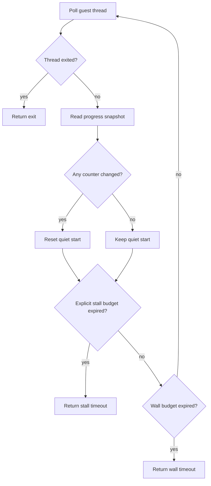

# Task 490 실행 제한과 정지 감시 분리 설계

## 배경

`PollThreadUntilExit`는 `REPIU_EXECUTION_TIMEOUT_MS`가 유한할 때 전체 실행시간 제한과
1초 무진행 감시를 동시에 활성화합니다. 두 정책은 서로 다른 질문에 답하지만 하나의
설정과 `WAIT_TIMEOUT` 결과를 공유합니다. Task 445의 pumpit2 40초 실행은 Glide 렌더링이
계속되는 중에도 direct-dispatch 활동을 진행으로 보지 못해 6.27초에 종료되었습니다.

성공한 AOT-DBT Glide direct dispatch는 현재 `aot_reentry_count`를 증가시키지만, 진입 후
fallback 경로는 그렇지 않으며 기존 캡처에서는 AOT 진행 카운터가 정지한 채 Glide 활동만
증가했습니다. 따라서 기존 AOT 카운터를 direct-dispatch 생존 신호로 간접 사용하지
않습니다.

## 설계

1. `REPIU_EXECUTION_TIMEOUT_MS`는 시작 이후 경과한 wall-clock 실행시간만 제한합니다.
2. 새 `REPIU_STALL_TIMEOUT_MS`는 모든 관측 진행 카운터가 변하지 않은 연속 시간을
   제한합니다. 기본값과 명시적 `0`은 비활성입니다.
3. `ThreadContext`에 실행별 `aot_dbt_glide_dispatch_entry_count`를 추가하고, 유효한
   context/frame으로 direct-dispatch resolver에 진입할 때 증가시킵니다. 성공과
   fallback 모두 실제 guest-to-HLE 활동이므로 진입 자체를 생존 신호로 사용합니다.
4. watchdog 진행 snapshot은 diagnostic, single-step, AOT boundary/reentry, Glide direct
   entry의 네 축을 비교합니다. 32-bit wrap은 값의 대소가 아닌 불일치로 판정합니다.
5. `PollThreadUntilExit`는 wall timeout과 stall timeout을 독립적으로 검사합니다.
   stall timeout은 명시적으로 활성화되고 progress context가 있을 때만 동작합니다.
6. `Win32MinimalExecutionAttempt`는 기존 `timed_out`과 함께 `stall_timed_out`을 기록합니다.
   `timed_out && !stall_timed_out`은 wall timeout이고, 둘 다 참이면 stall timeout입니다.
7. timeout snapshot과 정상적인 thread 중단/정리 경로는 기존 구현을 공유합니다.

## 검증 전략

- 공용 timeout policy probe에서 stall 기본 비활성, 명시 값, malformed fallback을
  검증합니다.
- progress snapshot probe에서 각 축 단독 변화와 32-bit wrap을 검증합니다.
- Win32 x86 Debug/Release `repiu_aot_probe`와 `repiu`를 빌드합니다.
- pumpit2를 wall 40초/stall 비활성으로 실행해 6.27초 조기 종료가 사라지는지 확인합니다.
- 가능하면 짧은 명시적 stall budget 실행으로 Glide direct entry가 증가하는 동안
  stall 종료가 발생하지 않는지 확인합니다.

---

# Task 490 Execution-Budget and Stall-Watchdog Separation Design

## Background

`PollThreadUntilExit` currently enables both a total execution-time limit and a
one-second no-progress watchdog whenever `REPIU_EXECUTION_TIMEOUT_MS` is finite.
Those policies answer different questions but share one setting and the same
`WAIT_TIMEOUT` result. In the Task 445 pumpit2 capture, a requested forty-second run
ended at 6.27 seconds while Glide rendering was still active because direct-dispatch
activity was absent from the progress definition.

A successful AOT-DBT Glide direct dispatch currently increments `aot_reentry_count`,
but a post-entry fallback does not, and the captured failure had frozen AOT progress
while Glide activity advanced. The design therefore does not use an existing AOT
counter as an indirect direct-dispatch liveness signal.

## Design

1. `REPIU_EXECUTION_TIMEOUT_MS` limits only wall-clock time since execution began.
2. New `REPIU_STALL_TIMEOUT_MS` limits the continuous interval during which every
   observed progress counter is unchanged. Its default and explicit `0` disable it.
3. Add per-run `aot_dbt_glide_dispatch_entry_count` to `ThreadContext` and increment it
   on entry to the direct-dispatch resolver with a valid context and frame. Entry is
   the liveness signal because both success and fallback represent real guest-to-HLE
   activity.
4. The watchdog snapshot compares diagnostic, single-step, AOT boundary/reentry, and
   Glide direct-entry counters. Inequality rather than ordering handles 32-bit wrap.
5. `PollThreadUntilExit` checks wall and stall budgets independently. Stall detection
   runs only when explicitly enabled and a progress context is available.
6. `Win32MinimalExecutionAttempt` records `stall_timed_out` beside existing
   `timed_out`. `timed_out && !stall_timed_out` means wall timeout; both true means
   stall timeout.
7. Timeout snapshots and orderly thread interruption continue to share the existing
   cleanup path.

## Verification Strategy

- Extend the common timeout-policy probe for the disabled default, explicit stall
  values, malformed fallback, every single progress axis, and 32-bit wrap.
- Build Win32 x86 Debug/Release `repiu_aot_probe` and `repiu`.
- Run pumpit2 with a forty-second wall budget and disabled stall watchdog, confirming
  that the 6.27-second premature timeout is gone.
- When practical, run with an explicit short stall budget and confirm that advancing
  Glide direct entries prevent a stall timeout.
