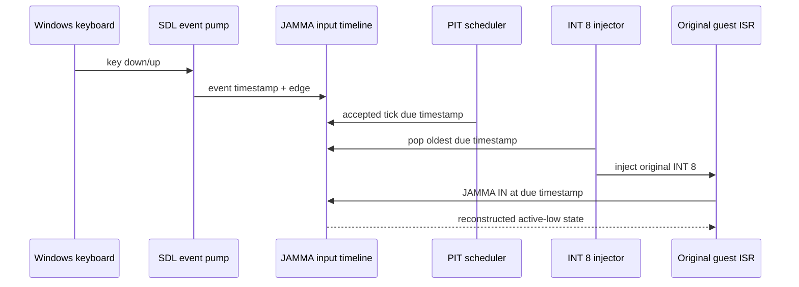

# Task 492 설계 — 타임스탬프 기반 JAMMA 입력 재생

## 한국어

### 문제

Win32 JAMMA HLE는 게스트가 포트를 읽는 순간 `GetAsyncKeyState`의 현재 level만
조회합니다. 정상적인 240 Hz INT 8 경로에서도 입력은 다음 틱까지 양자화되며, Glide
gate나 IF=0 구간에서 틱이 밀리면 overdue ISR들이 모두 전달 시점의 같은 입력 상태를
관측합니다. press와 release가 그 구간 안에서 끝나면 둘 다 사라지고, 한 edge만 걸치면
게스트의 hold 시간이 실제 wall-clock과 달라집니다.

Task 403의 500 us 스냅샷은 정상 폴링 비용을 줄이지만 edge 시각을 보존하지 않으며,
backlog를 빠르게 소진할 때 여러 ISR이 같은 wall-clock 스냅샷을 공유하게 합니다.

### 목표와 비목표

- 원본 INT 8 ISR과 JAMMA 포트 읽기를 주 실행 경로로 유지합니다.
- 호스트 key down/up의 SDL event timestamp를 보존합니다.
- 보류된 각 PIT tick의 원래 due timestamp를 보존합니다.
- timer ISR 안의 JAMMA 읽기는 해당 due 시각의 입력 level을 봅니다.
- timer ISR 밖의 읽기는 기존 `GetAsyncKeyState`와 500 us 스냅샷 정책을 유지합니다.
- 게임 판정 로직, 원본 실행 파일, timer cadence는 변경하지 않습니다.

### 구조

`Win32JammaInputTimeline`은 고정 용량 두 큐를 소유합니다.

1. 입력 이력은 edge 뒤의 전체 pressed mask와 SDL nanosecond timestamp를 보관합니다.
2. tick 큐는 delivery accounting이 실제로 수락한 최대 64개의 due timestamp를
   보관합니다.

두 큐는 host producer와 guest consumer가 공유하므로 고정 배열과 짧은 spin guard를 사용합니다.
입력 edge는 드물고 JAMMA 조회는 tick당 한 번 수준이므로 allocation 없는 짧은 임계
구역이 적절합니다. repeat keydown은 무시하고 focus loss는 전체 release edge로
기록합니다.

### PIT due 시각

`PitIrqSchedule::Poll`은 기존 due count와 함께 이번 반환 구간의 epoch, 첫 tick ordinal,
divisor를 선택적으로 제공합니다. tick `N`의 due 시각은 PIT input clock 계약으로 계산한
최초 만료 nanosecond이며, host 실행 시작의 SDL clock 값에 더해 absolute SDL timestamp로
변환합니다.

delivery counter와 timestamp queue의 수락/소비가 어긋나지 않도록 두 연산은
`ThreadContext`의 timer-delivery guard 아래에서 함께 수행합니다. backlog cap 초과로
drop된 tick에는 timestamp를 만들지 않습니다.

### ISR 범위 판별

INT 8 주입 시 원래 due timestamp와 주입 뒤 interrupt-frame ESP를 기록합니다. ISR은
stack을 아래로 사용하므로 IF=0이고 `current ESP <= frame ESP`인 JAMMA 읽기만 replay 대상으로
봅니다. IRETD가 IF 또는 ESP를 복구하면 override를 즉시 폐기합니다. IF gate 때문에
같은 IRQ0의 중첩 주입은 없습니다.

replay 읽기는 Task 403의 wall-clock 캐시를 우회하고 하나의 due timestamp에서 복원한
pressed mask를 직접 사용합니다. 따라서 빠르게 소진되는 서로 다른 overdue tick이
500 us 캐시 하나로 합쳐지지 않습니다.

### 실패와 경계

- SDL event timestamp는 `SDL_GetTicksNS()`와 같은 clock domain입니다.
- timeline 초기 상태는 bind 시점의 `GetAsyncKeyState` level로 잡아 시작 전 held key를
  보존합니다.
- 입력 이력 overflow 시 가장 오래된 항목을 버리되 각 항목이 전체 state를 가지므로
  보존 구간 안의 질의는 독립적으로 복원됩니다. 256 edge는 최대 267 ms timer backlog에
  비해 충분히 큽니다.
- due timestamp가 없으면 기존 live level 조회로 fail-safe하며 mismatch counter를
  남깁니다.
- 창 focus 밖의 전역 키 입력 의미는 확대하지 않습니다. 이번 작업은 SDL window가 받은
  key event와 기존 live fallback의 결합입니다.

### 검증

1. PIT probe에서 240 Hz tick ordinal의 due nanosecond가 단조 증가하고 기존 cadence
   결과가 유지되는지 확인합니다.
2. timeline probe에서 press/release 사이의 tick만 pressed로 복원되는지 확인합니다.
3. 여러 overdue tick을 빠르게 pop해도 서로 다른 과거 state를 반환하는지 확인합니다.
4. ISR frame을 벗어난 ESP에서는 replay가 끝나고 live fallback으로 돌아가는지
   확인합니다.
5. timer delivery probe의 legacy/backlog/cap 회계가 유지되는지 확인합니다.
6. Win32 Debug `repiu`와 `repiu_aot_probe`를 빌드하고
   `--jamma-input-timeline` probe 묶음을 실행합니다. 저작물 DOS4GW fixture가 있을 때는
   전체 probe도 실행합니다.

---

## English

### Problem

The Win32 JAMMA HLE currently samples only the current `GetAsyncKeyState` level when the guest
reads a port. Even on the normal 240 Hz INT 8 path, input is quantized to the next tick. When
ticks become overdue inside a Glide gate or an IF=0 section, every recovered ISR observes the
same input level at delivery time. A press/release pair wholly inside that interval disappears;
an edge crossing it changes the guest-visible hold duration.

Task 403's 500 us snapshot reduces normal polling cost but preserves no edge timestamp and makes
rapidly drained backlog ISRs share one wall-clock snapshot.

### Goals and non-goals

- Keep the original INT 8 ISR and JAMMA port reads as the primary execution path.
- Preserve SDL event timestamps for host key down/up edges.
- Preserve the original due timestamp of every retained PIT tick.
- Make JAMMA reads inside a timer ISR observe the input level at that due time.
- Keep the existing `GetAsyncKeyState` and 500 us snapshot policy outside timer ISRs.
- Do not change game judgement logic, the original executable, or timer cadence.

### Structure

`Win32JammaInputTimeline` owns two fixed-capacity queues: input history stores the complete pressed
mask after each timestamped edge, while the tick queue stores due timestamps accepted by the
delivery accounting, up to its existing capacity of 64. A short spin-guarded fixed-array
spin-guarded critical section coordinates the host producer and guest consumer without hot-path
allocation. Post-stop diagnostics take no guard, so forced timeout teardown cannot wait on a guard
formerly owned by the terminated guest thread.
Repeated keydown events are ignored and focus loss records a full release.

`PitIrqSchedule::Poll` optionally exposes the epoch, first tick ordinal, and divisor for the due
range it returns. Each ordinal is converted to its earliest expiry nanosecond from the PIT input
clock contract and then to the absolute SDL clock domain. Delivery accounting and timestamp-queue
mutation occur under one `ThreadContext` timer-delivery guard.

At injection, the oldest due timestamp and the post-push interrupt-frame ESP become the active
override. An ISR uses IF=0 and the stack below that frame, so only reads with IF clear and
`current ESP <= frame ESP` replay historical state; the first read after IRETD retires the
override. Replay bypasses the
Task 403 wall-clock cache so distinct overdue ticks cannot collapse into one 500 us snapshot.

The timeline starts from the live `GetAsyncKeyState` level at host binding. History entries contain
full state, so dropping the oldest of 256 edges retains independent reconstruction within the
remaining interval. A missing due timestamp fails safely to live-level input and increments a
mismatch counter. This task does not broaden global input semantics beyond SDL events received by
the window plus the existing live fallback.

### Verification

Probes cover PIT due-time monotonicity without changing cadence, reconstruction of press/release
across multiple overdue ticks, replay retirement after the interrupt stack frame, and unchanged
legacy/backlog/cap delivery accounting. Build Win32 Debug `repiu` and `repiu_aot_probe`, then run
the `--jamma-input-timeline` probe bundle. Run the full suite when the copyrighted DOS4GW fixture
is available.
