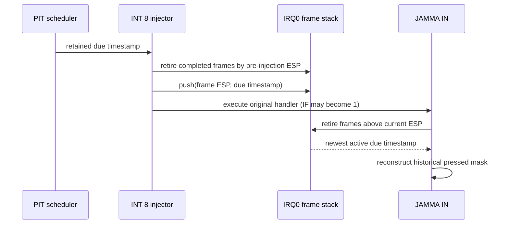

# Task 493: JAMMA IRQ0 프레임 수명 추적

## 배경

Task 492는 INT 8 주입 시 due timestamp를 활성화했지만, JAMMA 읽기가 `IF=0`이고
주입 프레임보다 낮은 ESP에서 실행될 때만 이를 사용했습니다. 실제 플레이 로그는
`replays=31498`, `replay-reads=0`을 기록했습니다. IRQ0 handler가 입력을 읽기 전에
`STI` 등으로 IF를 다시 켜므로 IF는 ISR 수명의 신뢰할 수 있는 표지가 아닙니다.

## 설계

원본 ISR과 포트 I/O 경로는 그대로 유지하고 host는 주입한 IRQ0 프레임의 수명만
추적합니다. 각 활성 프레임은 interrupt-frame ESP와 해당 PIT due timestamp를 가집니다.

- IF는 replay 판정에 사용하지 않습니다.
- `current ESP > frame ESP`이면 IRETD로 해당 프레임을 벗어난 것으로 간주합니다.
- 중첩 IRQ0를 보존하기 위해 최대 64개의 활성 프레임을 고정 배열 stack으로 관리합니다.
- 새 IRQ0 주입 직전의 ESP와 JAMMA 읽기 시점의 ESP에서 완료된 frame을 정리합니다.
- 가장 안쪽 활성 frame의 due timestamp가 JAMMA 전체 byte read에 사용됩니다.
- 활성 frame이 없으면 기존 live level 및 500 us cache 경로를 그대로 사용합니다.
- frame stack overflow는 가장 오래된 frame을 제거하고 별도 계수합니다. 정상 실행에서는
  반드시 0이어야 합니다.

## 검증

정적 probe는 IF가 켜진 ISR read, 중첩 frame, nested return, outer return을 검증합니다.
실제 플레이 종료 로그는 `replay-reads > 0`, `frame-overflow = 0`, 기존 세 유실 계수 0을
만족해야 합니다.

---

# Task 493: Tracking JAMMA IRQ0 Frame Lifetime

## Background

Task 492 activated a due timestamp on each INT 8 injection, but used it only when a JAMMA read
ran with `IF=0` below the injected frame. The live-play log reported `replays=31498` and
`replay-reads=0`. The IRQ0 handler can enable IF before reading input, so IF is not a reliable ISR
lifetime marker.

## Design

The original ISR and port-I/O path remain unchanged. The host tracks only the lifetime of IRQ0
frames it injected. Each active frame stores its interrupt-frame ESP and PIT due timestamp.

- IF does not participate in replay eligibility.
- `current ESP > frame ESP` means IRETD has left that frame.
- A fixed stack of up to 64 active frames preserves nested IRQ0 delivery.
- Completed frames are retired both before a new injection and at each JAMMA read.
- The innermost active frame supplies the due timestamp for all JAMMA byte reads.
- With no active frame, reads retain the live-level and 500 us cache path.
- Frame-stack overflow drops the oldest frame and increments a diagnostic that must remain zero in
  normal execution.

## Verification

The static probe covers an IF-enabled ISR read, nesting, nested return, and outer return. A live
play log must report `replay-reads > 0`, `frame-overflow = 0`, and zero for the three existing loss
counters.
