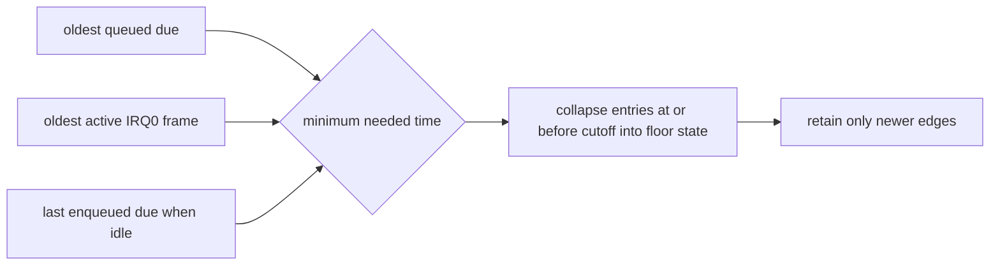

# Task 495: JAMMA history 안전 정리

## 배경

Task 494 사용자 로그는 968개 SDL edge와 `history-overflow=712`를 기록했습니다. 기존
256-entry history는 session 전체 edge를 보존하려고 하며, 가득 차면 가장 오래된 항목을
무조건 제거하고 overflow를 올립니다. 그러나 replay에 필요한 범위는 pending due queue와
활성 IRQ0 frame 중 가장 오래된 due timestamp 이후뿐입니다.

같은 로그에서 live fallback의 `GetAsyncKeyState` query는 19회로, 초기 전체 scan 한 번에
해당합니다. 따라서 반복적인 live/replay 교차 동작은 확인되지 않았으며 이번 작업에서
입력 노출 정책은 변경하지 않습니다.

## 설계

history는 다음 최소 필요 시각을 기준으로 안전하게 compact합니다.

- due queue나 활성 frame이 있으면 그중 가장 오래된 timestamp가 cutoff입니다.
- 둘 다 없으면 미래 PIT due가 단조 증가한다는 조건에서 마지막 enqueue due가 cutoff입니다.
- cutoff 이하의 마지막 상태를 `history_floor_pressed_mask`로 접어 같은 시각의 조회 결과를
  보존합니다.
- 안전 prune 뒤에도 256개가 가득 찬 경우에만 `history-overflow`를 올립니다.
- 조회 timestamp가 floor보다 오래되면 `history-coverage-miss`를 올려 실제 손실을 별도로
  표시합니다.
- `history-pruned`, `history-peak`를 종료 로그에 추가합니다.

## 검증

300개 edge를 순차 due에 전달하는 probe에서 capacity를 넘겨도 overflow와 coverage miss가
0이고 state가 일치해야 합니다. 기존 nested IRQ0 probe, Win32 Debug 빌드, pumpit1 전체
AOT probe와 bounded guest smoke를 수행합니다.

---

# Task 495: Safe JAMMA History Pruning

## Background

The Task 494 user log recorded 968 SDL edges and `history-overflow=712`. The old 256-entry history
tried to retain the entire session and unconditionally evicted its oldest entry when full. Replay
only needs edges at or after the oldest timestamp still referenced by the pending due queue or an
active IRQ0 frame.

The same log had only 19 live-fallback key queries, exactly one initial full scan. Repeated
live/replay crossing was therefore not confirmed, and this task does not broaden input-exposure
behavior.

## Design

Compact history against the oldest queued due or active IRQ0 frame. When neither exists, use the
last enqueued due because future PIT timestamps are monotonic. Fold the final entry at or before the
cutoff into the floor state, retaining identical lookup results. Count overflow only if the buffer
is still full after safe pruning, and count a separate coverage miss when a lookup predates the
floor. Report pruned entries and peak retained size.

## Verification

A 300-edge sequential-delivery probe must exceed nominal capacity with zero overflow and coverage
miss while preserving every sampled state. Run the existing nested IRQ0 probe, Win32 Debug builds,
the complete pumpit1 AOT probe, and a bounded guest smoke run.
