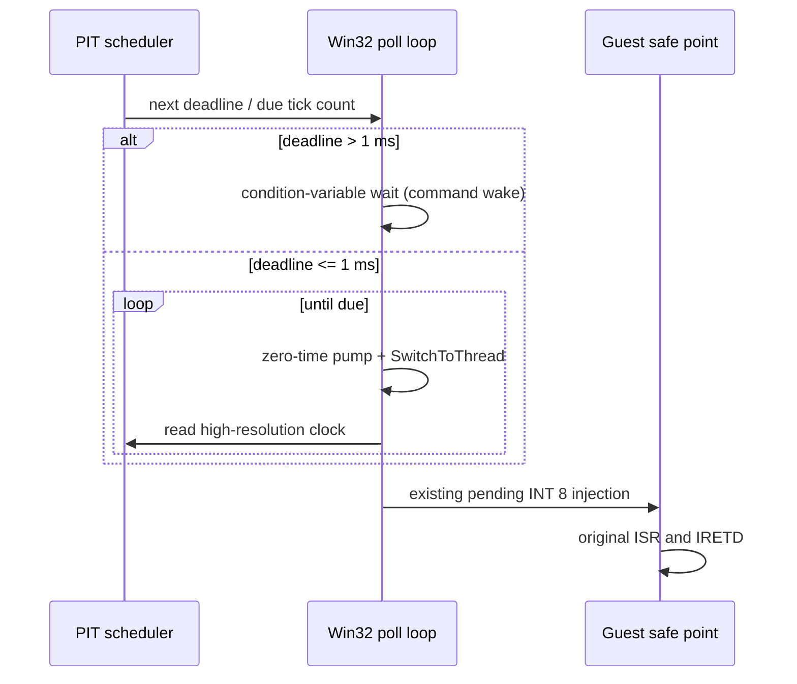

# 20260820-494 240Hz 타이머 인터럽트 정밀도 설계 / 240Hz timer interrupt precision design

## 한국어

### 1. 문제

PIT 채널 0은 원본 게임이 기록한 divisor `4972`를 사용하며 nominal frequency는
`1,193,280 / 4,972 = 240.0965...Hz`입니다. 현재 PIT schedule은 누적 host 경과
나노초를 기준으로 만료 tick 수를 올바르게 계산하지만, Win32 poll loop가 매회
최대 1ms 대기하므로 IRQ0가 실제 guest safe point에 도착하는 시각에는 약 1ms의
양자화 지터가 생깁니다. 또한 경과 나노초를 매 poll마다 PIT clock으로 변환할 때
중간 정수 절삭이 발생합니다.

### 2. 목표와 비목표

- 원본 PIT divisor와 원본 INT 8 ISR/IRETD 실행 경로를 유지합니다.
- tick cadence를 누적 PIT input-clock 단위로 계산하여 장시간 phase drift를 없앱니다.
- 다음 만료 시각이 임박한 구간에서는 host wait를 양보 대신 짧은 spin으로 전환하여
  240Hz IRQ 전달 지터를 줄입니다.
- 일반 Glide command wake-up과 기존 pending/backlog 정책은 보존합니다.
- 실시간 운영체제 수준의 hard real-time 보장이나 CPU 전체 에뮬레이션은 범위 밖입니다.

### 3. 설계

기존 `PitIrqSchedule`의 절대 elapsed 기반 PIT clock 계산은 유지합니다. 이 계산은
매 poll의 누적 경과 시각에서 tick 수를 구하므로 poll 주기 자체가 phase를 누적시키지
않습니다. 대신 다음 tick까지 남은 시간을 반환하는 조회 API를 추가하여 Win32 loop가
다음 deadline을 알 수 있게 합니다. epoch와 tick offset을 합칠 때는 64-bit overflow를
포화 처리합니다.

Win32 telemetry loop는 매 poll 후 다음 tick까지의 시간을 확인합니다. deadline이
`1ms`보다 멀면 기존 command condition-variable wait를 사용하고, `1ms` 이내면
zero-timeout pump와 `SwitchToThread`를 반복하여 deadline 직전까지 host clock을
확인합니다. tick 만료 후에는 기존 safe-point/IF gate/backlog 경로로 전달하므로
ISR 중첩이나 원본 코드 변경은 발생하지 않습니다.

### 4. 검증

- PIT probe에서 divisor `4972`, frequency, 경계 tick을 회귀 검증합니다.
- 새 schedule probe에서 장시간 경과 계산의 monotonicity와 다음 deadline을 검증합니다.
- Win32 x86 Debug 빌드와 전체 AOT probe를 실행합니다.
- 실제 실행 로그에서 `due/injected/dropped/deferred`와 tick lag를 확인하고, 변경 전
  대비 240Hz 전달 지터가 감소하는지 기록합니다.

## English

### 1. Problem

PIT channel 0 uses the original game's divisor `4972`, giving a nominal frequency of
`1,193,280 / 4,972 = 240.0965...Hz`. The current PIT schedule computes the cumulative
number of expired ticks correctly, but the Win32 poll loop waits up to 1ms on every
iteration. That quantizes the time at which IRQ0 reaches a guest safe point by roughly
1ms. The elapsed-nanosecond to PIT-clock conversion also truncates an intermediate
integer on every poll.

### 2. Goals and non-goals

- Preserve the original PIT divisor and original INT 8 ISR/IRETD path.
- Preserve the cumulative absolute-elapsed PIT input-clock calculation without long-run phase drift.
- Use a short spin near the next deadline to reduce 240Hz delivery jitter.
- Preserve normal Glide command wake-up and the existing pending/backlog policy.
- Hard real-time guarantees and full CPU emulation are out of scope.

### 3. Design

The existing absolute-elapsed PIT clock calculation in `PitIrqSchedule` remains in
place. Because tick count is derived from cumulative elapsed time, the poll cadence does
not accumulate phase error. The schedule exposes the time remaining to the next tick so
the Win32 loop can choose a deadline-aware wait. When the deadline is
more than 1ms away, the existing command condition-variable wait remains in use. Within
1ms, the loop repeats a zero-timeout command pump and `SwitchToThread` until the high
resolution clock reaches the deadline. Delivery then follows the existing safe-point,
IF-gate, and backlog path; no guest ISR or executable code is modified.

### 4. Verification

Regression-test divisor `4972`, frequency, and boundary ticks; add schedule monotonicity
and deadline tests; build Win32 x86 Debug and run the full AOT probe. Record runtime
`due/injected/dropped/deferred` counters and tick lag, comparing delivery jitter with the
previous 1ms polling behavior.
